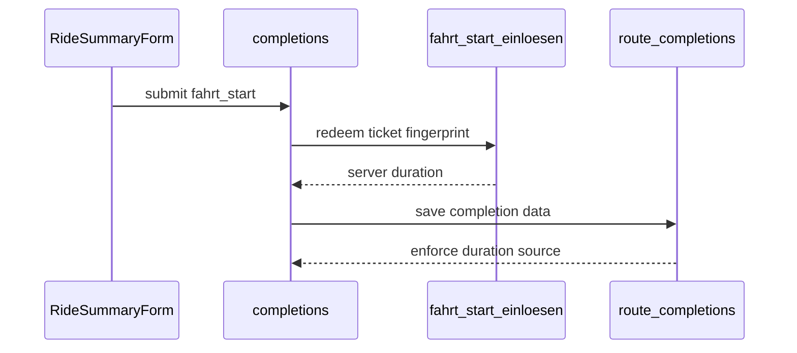
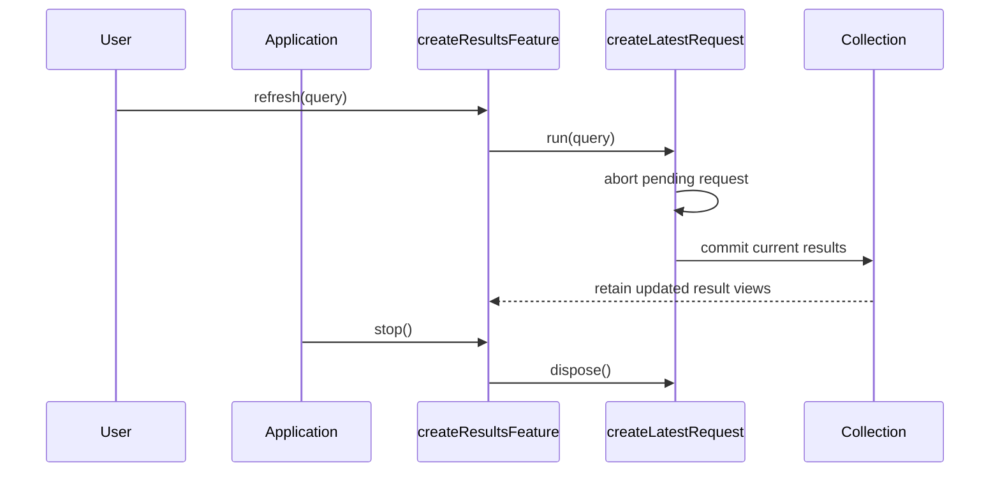
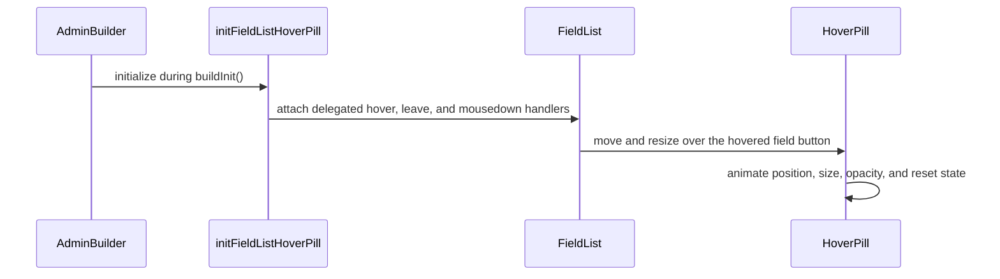
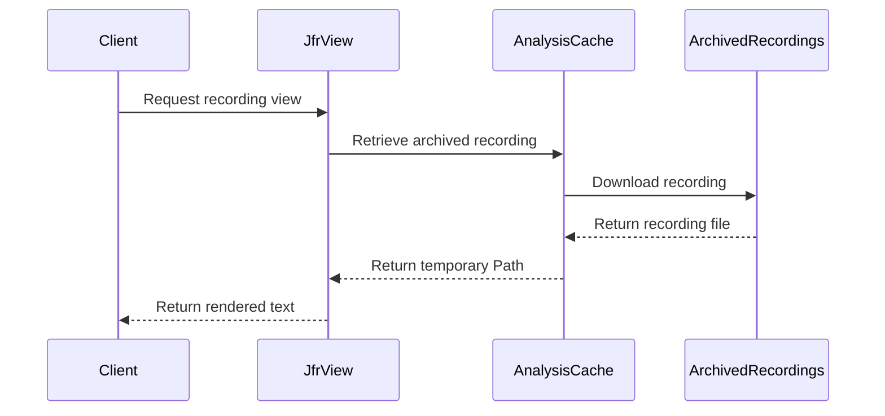
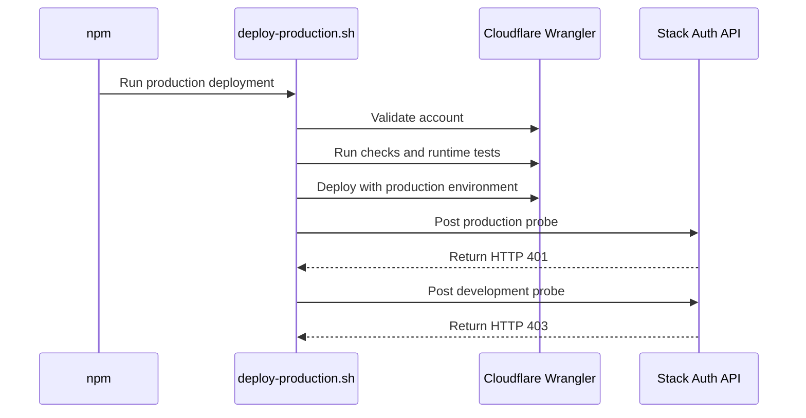
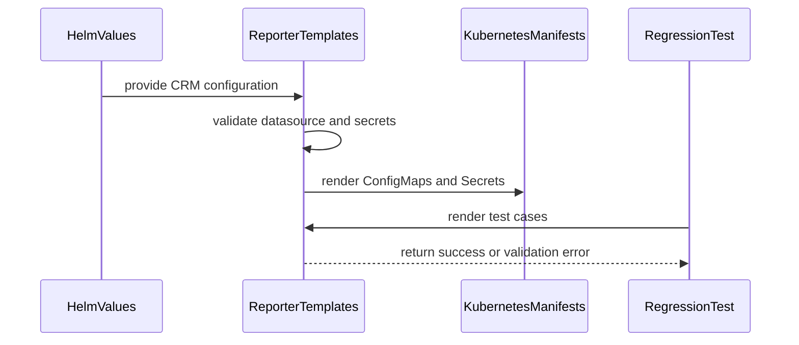
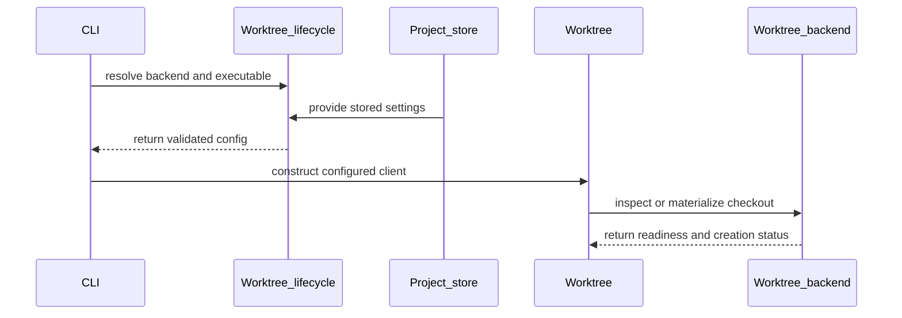

# Walkthroughs

## coderabbitai[bot] · walkthrough · issue · 2026-09-15T18:15:18Z

- Source: https://github.com/janlampert08-dev/strado/pull/249#issuecomment-5685603014
- Location: —

````markdown
<!-- This is an auto-generated comment: summarize by coderabbit.ai -->
<!-- review_stack_entry_start -->

<a href="https://app.coderabbit.ai/change-stack/janlampert08-dev/strado/pull/249#gh-light-mode-only"></a><a href="https://app.coderabbit.ai/change-stack/janlampert08-dev/strado/pull/249#gh-dark-mode-only"></a>

<!-- review_stack_entry_end -->
<!-- This is an auto-generated comment: review in progress by coderabbit.ai -->

> [!NOTE]
> Currently processing new changes in this PR. This may take a few minutes, please wait...
> 
> <details>
> <summary>⚙️ Run configuration</summary>
> 
> **Configuration used**: Path: .coderabbit.yaml
> 
> **Review profile**: CHILL
> 
> **Plan**: Advanced
> 
> **Run ID**: `3b10c465-ce62-406f-89ec-5b018469e4a9`
> 
> </details>
> 
> <details>
> <summary>📥 Commits</summary>
> 
> Reviewing files that changed from the base of the PR and between 50f8b2e45b4d38b42ff0868c82e7a293977c7b62 and 917641d41da96238a3a8ca28d4eaace635bd629b.
> 
> </details>
> 
> <details>
> <summary>📒 Files selected for processing (4)</summary>
> 
> * `AGENTS.md`
> * `components/useRideRecorder.ts`
> * `docs/audit/README.md`
> * `supabase/migrations/0096_fahrtstart_serverseitig.sql`
> 
> </details>
> 
> ```ascii
>  ___________________________________________________________________________________________________________________________________________________________
> < Don't be a slave to formal methods. Don't blindly adopt any technique without putting it into the context of your development practices and capabilities. >
>  -----------------------------------------------------------------------------------------------------------------------------------------------------------
>   \
>    \   (\__/)
>        (•ㅅ•)
>        / 　 づ
> ```

<!-- end of auto-generated comment: review in progress by coderabbit.ai -->

<!-- walkthrough_start -->

<details>
<summary>📝 Walkthrough</summary>

## Walkthrough

The PR adds server-recorded ride-start tickets, persists them through tracking and completion flows, and separates server-derived durations from trail-derived durations. Migration `0096` adds the database functions, trigger, fields, and leaderboard filter.

### Changes

**Server-recorded ride timing**

|Layer / File(s)|Summary|
|---|---|
|**Ticket contracts and creation** <br> `lib/fahrtstart.ts`, `lib/actions/fahrtstart.ts`, `lib/fahrtstart.test.ts`|Adds ticket generation, hashing, validation, parsing, rate-limited creation, and helper tests.|
|**Database duration enforcement** <br> `supabase/migrations/0096_fahrtstart_serverseitig.sql`, `types/database.ts`, `supabase/migrations/README.md`, `AGENTS.md`, `docs/audit/README.md`|Adds ticket storage and redemption, trigger-controlled duration provenance, server-only leaderboard rows, related types, and deployment documentation.|
|**Recorder ticket lifecycle** <br> `components/useRideRecorder.ts`, `lib/trackingStorage.ts`, `components/RideSummaryForm.tsx`, `components/FreeRideForm.tsx`, `components/LiveTrackingForm.tsx`|Creates tickets when tracking starts, persists and restores them, and submits them with completed rides.|
|**Completion redemption and persistence** <br> `lib/actions/completions.ts`|Redeems submitted tickets and stores server or trail duration, trail duration, and the redeemed ticket ID for tracked and free rides.|

<!-- change_assessment_start -->
**Priority:** ➖ Normal


**Estimated code review effort:** 4 (Complex) | ~45 minutes

<!-- change_assessment_commit:"50f8b2e45b4d38b42ff0868c82e7a293977c7b62" -->
**Change:** Bug fix
<!-- change_assessment_end -->

### Sequence Diagram(s)



**Suggested reviewers:** `claude`

</details>

<!-- walkthrough_end -->
<!-- final_review_risk_start -->
**Merge Risk:** _🟠 High_ · up to `50f8b`
<!-- final_review_risk_coverage:{"sourceCommitId":"50f8b2e45b4d38b42ff0868c82e7a293977c7b62","coveredCommitId":"50f8b2e45b4d38b42ff0868c82e7a293977c7b62","kind":"reviewed"} -->

The change can still admit forged leaderboard rides, expose unbounded ticket writes, and strip legitimate rides of leaderboard eligibility after save failures or reloads. These issues should be fixed before merge.
<!-- final_review_risk_end -->
<!-- pre_merge_checks_walkthrough_start -->

<details>
<summary>🚥 Pre-merge checks | ✅ 4 | ❌ 1</summary>

### ❌ Failed checks (1 warning)

|     Check name     | Status     | Explanation                                                                                                                                                                                               | Resolution                                                                         |
| :----------------: | :--------- | :-------------------------------------------------------------------------------------------------------------------------------------------------------------------------------------------------------- | :--------------------------------------------------------------------------------- |
| Docstring Coverage | ⚠️ Warning | Docstring coverage is 73.33% which is insufficient. The required threshold is 80.00%. Docstring coverage is scoped to functions touched by this diff. Analyzed 15 functions across 10 files. (4 skipped:… | Write docstrings for the functions missing them to satisfy the coverage threshold. |

<details>
<summary>✅ Passed checks (4 passed)</summary>

|         Check name         | Status   | Explanation                                                                                       |
| :------------------------: | :------- | :------------------------------------------------------------------------------------------------ |
|      Description Check     | ✅ Passed | Check skipped - CodeRabbit’s high-level summary is enabled.                                       |
|         Title check        | ✅ Passed | The title clearly identifies the main change: server-side ride-duration tracking for A1 “Bein 2”. |
|     Linked Issues check    | ✅ Passed | Check skipped because no linked issues were found for this pull request.                          |
| Out of Scope Changes check | ✅ Passed | Check skipped because no linked issues were found for this pull request.                          |

</details>

<details>
<summary>Full details: Docstring Coverage</summary>

**Explanation**

Docstring coverage is 73.33% which is insufficient. The required threshold is 80.00%. Docstring coverage is scoped to functions touched by this diff. Analyzed 15 functions across 10 files. (4 skipped: 4 unsupported.)

</details>

</details>

<!-- pre_merge_checks_walkthrough_end -->

- [ ] <!-- {"checkboxId":"585bb3f6-faf5-4dbf-96d2-74e382adf19a"} --> Fix all pre-merge checks with AI
<!-- finishing_touch_checkbox_start -->

<details>
<summary>✨ Finishing Touches</summary>

<details>
<summary>📝 Generate docstrings</summary>

- [ ] <!-- {"checkboxId":"7962f53c-55bc-4827-bfbf-6a18da830691"} --> Create stacked PR
- [ ] <!-- {"checkboxId":"3e1879ae-f29b-4d0d-8e06-d12b7ba33d98"} --> Commit on current branch

</details>
<details>
<summary>🧪 Generate unit tests (beta)</summary>

- [ ] <!-- {"checkboxId": "f47ac10b-58cc-4372-a567-0e02b2c3d479", "radioGroupId": "utg-output-choice-group-unknown_comment_id"} -->   Create PR with unit tests
- [ ] <!-- {"checkboxId": "6ba7b810-9dad-11d1-80b4-00c04fd430c8", "radioGroupId": "utg-output-choice-group-unknown_comment_id"} -->   Commit unit tests in branch `claude/app-advertisement-renders-0c01um`

</details>

</details>

<!-- finishing_touch_checkbox_end -->
<!-- tips_start -->

---


<sub>Comment `@coderabbitai help` to get the list of available commands.</sub>

<!-- tips_end -->
````

---

## coderabbitai[bot] · walkthrough · issue · 2026-09-15T17:58:02Z

- Source: https://github.com/marionettejs/marionette/pull/525#issuecomment-5685337819
- Location: —

````markdown
<!-- This is an auto-generated comment: summarize by coderabbit.ai -->
<!-- review_stack_entry_start -->

<a href="https://app.coderabbit.ai/change-stack/marionettejs/marionette/pull/525#gh-light-mode-only"></a><a href="https://app.coderabbit.ai/change-stack/marionettejs/marionette/pull/525#gh-dark-mode-only"></a>

<!-- review_stack_entry_end -->
<!-- recent_review_start -->

No actionable comments were generated in the recent review. 🎉

<details>
<summary>ℹ️ Recent review info</summary>

<details>
<summary>⚙️ Run configuration</summary>

**Configuration used**: defaults

**Review profile**: CHILL

**Plan**: Advanced

**Run ID**: `bcd3fdc8-353b-41cc-84d6-a44603841245`

</details>

<details>
<summary>📥 Commits</summary>

Reviewing files that changed from the base of the PR and between b68478a8c625ee90603384271dd64930760eec0e and 70cca269feda251f993b03e3cf869fb88bb9e910.

</details>

<details>
<summary>📒 Files selected for processing (11)</summary>

* `config/release-validation.json`
* `docs-site/navigation.json`
* `docs/application-effects.md`
* `docs/application-refresh.md`
* `docs/readme.md`
* `docs/routing.md`
* `test/browser/application-refresh.spec.mjs`
* `test/browser/docs-routing.test.mjs`
* `test/fixtures/docs-routing/refresh.mjs`
* `test/fixtures/docs-routing/validate.mjs`
* `test/fixtures/run.mjs`

</details>

**Included review availability:** Your plan provides up to 1 included review per hour; 0 remain after this review.

</details>

---


<!-- recent_review_end -->
<!-- walkthrough_start -->

<details>
<summary>📝 Walkthrough</summary>

## Walkthrough

### Changes

**Application refresh**

|Layer / File(s)|Summary|
|---|---|
|**Refresh controllers and feature examples** <br> `docs/application-refresh.md`, `docs/routing.md`|Documents latest-request cancellation, result commits, collection updates, and application lifecycle handling.|
|**Fixture extraction and lifecycle validation** <br> `test/fixtures/docs-routing/*`, `test/fixtures/run.mjs`|Extracts the documented modules and validates refresh behavior, stop permission, cancellation, retries, cleanup, and commit failures.|
|**Browser refresh behavior coverage** <br> `test/browser/application-refresh.spec.mjs`, `test/browser/docs-routing.test.mjs`, `config/release-validation.json`|Adds browser checks for latest-result commits, retained editor state, failures, retries, denied stops, and teardown.|
|**Documentation navigation and references** <br> `docs-site/navigation.json`, `docs/application-effects.md`, `docs/readme.md`|Adds the refresh page to navigation and links it from existing documentation.|

<!-- change_assessment_start -->
**Priority:** ⬇️ Low


**Estimated code review effort:** 3 (Moderate) | ~25 minutes

<!-- change_assessment_commit:"70cca269feda251f993b03e3cf869fb88bb9e910" -->
**Change:** Other
<!-- change_assessment_end -->

### Sequence Diagram(s)



**Suggested reviewers:** `ahumphreys87`

</details>

<!-- walkthrough_end -->
<!-- final_review_risk_start -->
**Merge Risk:** _⚪ Minimal_ · up to `70cca`
<!-- final_review_risk_coverage:{"sourceCommitId":"70cca269feda251f993b03e3cf869fb88bb9e910","coveredCommitId":"70cca269feda251f993b03e3cf869fb88bb9e910","kind":"reviewed"} -->

No actionable merge-blocking risk remains from the documented refresh and validation changes.
<!-- final_review_risk_end -->
<!-- pre_merge_checks_walkthrough_start -->

<details>
<summary>🚥 Pre-merge checks | ✅ 4 | ❌ 1</summary>

### ❌ Failed checks (1 warning)

|     Check name     | Status     | Explanation                                                                                                                                                                                               | Resolution                                                                         |
| :----------------: | :--------- | :-------------------------------------------------------------------------------------------------------------------------------------------------------------------------------------------------------- | :--------------------------------------------------------------------------------- |
| Docstring Coverage | ⚠️ Warning | Docstring coverage is 0.00% which is insufficient. The required threshold is 80.00%. Docstring coverage is scoped to functions touched by this diff. Analyzed 2 functions across 5 files. (6 skipped: 6 … | Write docstrings for the functions missing them to satisfy the coverage threshold. |

<details>
<summary>✅ Passed checks (4 passed)</summary>

|         Check name         | Status   | Explanation                                                                                                                                                                                               |
| :------------------------: | :------- | :-------------------------------------------------------------------------------------------------------------------------------------------------------------------------------------------------------- |
|     Linked Issues check    | ✅ Passed | Check skipped because no linked issues were found for this pull request.                                                                                                                                  |
| Out of Scope Changes check | ✅ Passed | Check skipped because no linked issues were found for this pull request.                                                                                                                                  |
|         Title check        | ✅ Passed | The title clearly identifies the primary change: documenting application data refresh without restarting features.                                                                                        |
|      Description check     | ✅ Passed | The description explains what changed, why it changed, scope, deployment impact, and detailed validation results. It does not include explicit Linked issue or Breaking changes headings, but it states … |

</details>

<details>
<summary>Full details: Docstring Coverage</summary>

**Explanation**

Docstring coverage is 0.00% which is insufficient. The required threshold is 80.00%. Docstring coverage is scoped to functions touched by this diff. Analyzed 2 functions across 5 files. (6 skipped: 6 unsupported.)

</details>

</details>

<!-- pre_merge_checks_walkthrough_end -->

- [ ] <!-- {"checkboxId":"585bb3f6-faf5-4dbf-96d2-74e382adf19a"} --> Fix all pre-merge checks with AI
<!-- finishing_touch_checkbox_start -->

<details>
<summary>✨ Finishing Touches 💡 1</summary>

<!-- finishing_touch_suggestion:docstrings -->
<details>
<summary>📝 Generate docstrings 💡</summary>

- [ ] <!-- {"checkboxId":"7962f53c-55bc-4827-bfbf-6a18da830691"} --> Create stacked PR
- [ ] <!-- {"checkboxId":"3e1879ae-f29b-4d0d-8e06-d12b7ba33d98"} --> Commit on current branch

</details>
<details>
<summary>🧪 Generate unit tests (beta)</summary>

- [ ] <!-- {"checkboxId": "f47ac10b-58cc-4372-a567-0e02b2c3d479", "radioGroupId": "utg-output-choice-group-unknown_comment_id"} -->   Create PR with unit tests
- [ ] <!-- {"checkboxId": "6ba7b810-9dad-11d1-80b4-00c04fd430c8", "radioGroupId": "utg-output-choice-group-unknown_comment_id"} -->   Commit unit tests in branch `docs/application-refresh`

</details>

</details>

<!-- finishing_touch_checkbox_end -->
<!-- tips_start -->

---

Thanks for using [CodeRabbit](https://coderabbit.ai?utm_source=oss&utm_medium=github&utm_campaign=marionettejs/marionette&utm_content=525)! It's free for OSS, and your support helps us grow. If you like it, consider giving us a shout-out.

<details>
<summary>❤️ Share</summary>

- [X](https://twitter.com/intent/tweet?text=I%20just%20used%20%40coderabbitai%20for%20my%20code%20review%2C%20and%20it%27s%20fantastic%21%20It%27s%20free%20for%20OSS%20and%20offers%20a%20free%20trial%20for%20the%20proprietary%20code.%20Check%20it%20out%3A&url=https%3A//coderabbit.ai)
- [Mastodon](https://mastodon.social/share?text=I%20just%20used%20%40coderabbitai%20for%20my%20code%20review%2C%20and%20it%27s%20fantastic%21%20It%27s%20free%20for%20OSS%20and%20offers%20a%20free%20trial%20for%20the%20proprietary%20code.%20Check%20it%20out%3A%20https%3A%2F%2Fcoderabbit.ai)
- [Reddit](https://www.reddit.com/submit?title=Great%20tool%20for%20code%20review%20-%20CodeRabbit&text=I%20just%20used%20CodeRabbit%20for%20my%20code%20review%2C%20and%20it%27s%20fantastic%21%20It%27s%20free%20for%20OSS%20and%20offers%20a%20free%20trial%20for%20proprietary%20code.%20Check%20it%20out%3A%20https%3A//coderabbit.ai)
- [LinkedIn](https://www.linkedin.com/sharing/share-offsite/?url=https%3A%2F%2Fcoderabbit.ai&mini=true&title=Great%20tool%20for%20code%20review%20-%20CodeRabbit&summary=I%20just%20used%20CodeRabbit%20for%20my%20code%20review%2C%20and%20it%27s%20fantastic%21%20It%27s%20free%20for%20OSS%20and%20offers%20a%20free%20trial%20for%20proprietary%20code)

</details>


<sub>Comment `@coderabbitai help` to get the list of available commands.</sub>

<!-- tips_end -->
````

---

## coderabbitai[bot] · walkthrough · issue · 2026-08-17T20:46:09Z

- Source: https://github.com/Strategy11/formidable-forms/pull/3246#issuecomment-5320049974
- Location: —

````markdown
<!-- This is an auto-generated comment: summarize by coderabbit.ai -->
<!-- review_stack_entry_start -->

<a href="https://app.coderabbit.ai/change-stack/Strategy11/formidable-forms/pull/3246#gh-light-mode-only"></a><a href="https://app.coderabbit.ai/change-stack/Strategy11/formidable-forms/pull/3246#gh-dark-mode-only"></a>

<!-- review_stack_entry_end -->
<!-- This is an auto-generated comment: rate limited by coderabbit.ai -->

> [!WARNING]
> ## Review limit reached
> 
> **Next included review available in 22 minutes.**
> 
> [Check out review usage here](https://app.coderabbit.ai/dashboard/review-capacity?orgId=63d7dbef-61d8-4a81-9998-b68eca5f0c09).
> 
> <details>
> <summary>View limit details</summary>
> 
> **Limit details:** You’ve used the included review currently available.
> 
> You've used all free OSS reviews for now. Wait for the free limit to reset to keep reviewing this public repository.
> 
> [Learn how review limits work](https://docs.coderabbit.ai/management/plans#rate-limits).
> 
> **Review configuration:**
> 
> <details>
> <summary>⚙️ Run configuration</summary>
> 
> **Configuration used**: Path: .coderabbit.yaml
> 
> **Review profile**: CHILL
> 
> **Plan**: Advanced
> 
> **Run ID**: `716eb6a8-2e34-46eb-b570-0b1f97214408`
> 
> </details>
> 
> <details>
> <summary>📥 Commits</summary>
> 
> Reviewing files that changed from the base of the PR and between dc165d75183ca1d68a15687e167a60ab1608f3b1 and a2a8591b780ac682a4abf0327518113f0828677c.
> 
> </details>
> 
> <details>
> <summary>📒 Files selected for processing (5)</summary>
> 
> * `css/frm_admin.css`
> * `js/formidable_admin.js`
> * `js/src/admin/admin.js`
> * `js/src/admin/fieldListHoverPill.js`
> * `resources/scss/admin/components/builder/_insert-fields.scss`
> 
> </details>
> 
> </details>

<!-- end of auto-generated comment: rate limited by coderabbit.ai -->

<!-- walkthrough_start -->

<details>
<summary>📝 Walkthrough</summary>

## Walkthrough

The admin builder initializes a shared hover pill for field-list buttons. The module handles hover, leave, and drag interactions. SCSS styles the pill, button layering, animation, and reduced-motion behavior.

### Changes

**Field list hover pill**

|Layer / File(s)|Summary|
|---|---|
|**Initialize and animate the field-list hover pill** <br> `js/src/admin/admin.js`, `js/src/admin/fieldListHoverPill.js`, `resources/scss/admin/components/builder/_insert-fields.scss`|The admin builder initializes `initFieldListHoverPill()`. The module tracks hovered field buttons, moves and resizes the shared pill, handles reset conditions, and supports dynamically added buttons. Styles define layering, transitions, opacity, hover suppression, and reduced-motion behavior.|

<!-- change_assessment_start -->
**Priority:** ⬇️ Low


**Estimated code review effort:** 3 (Moderate) | ~20 minutes

<!-- change_assessment_commit:"dc165d75183ca1d68a15687e167a60ab1608f3b1" -->

<!-- change_assessment_end -->

### Sequence Diagram(s)



</details>

<!-- walkthrough_end -->
<!-- final_review_risk_start -->
**Merge Risk:** _🟡 Moderate_ · up to `dc165`
<!-- final_review_risk_coverage:{"sourceCommitId":"dc165d75183ca1d68a15687e167a60ab1608f3b1","coveredCommitId":"dc165d75183ca1d68a15687e167a60ab1608f3b1","kind":"reviewed"} -->

The Add Fields hover animation can retain the old button highlight instead of the shared pill, and longer pill movements can stop dimming prematurely while moving within a button. These visible interaction regressions should be corrected before merge.
<!-- final_review_risk_end -->
<!-- pre_merge_checks_walkthrough_start -->

<details>
<summary>🚥 Pre-merge checks | ✅ 5</summary>

<details>
<summary>✅ Passed checks (5 passed)</summary>

|         Check name         | Status   | Explanation                                                                                                                                                                               |
| :------------------------: | :------- | :---------------------------------------------------------------------------------------------------------------------------------------------------------------------------------------- |
|      Description Check     | ✅ Passed | Check skipped - CodeRabbit’s high-level summary is enabled.                                                                                                                               |
|         Title check        | ✅ Passed | The title clearly and concisely describes the main change: a shared highlight moves between Add Fields buttons during hover.                                                              |
|     Docstring Coverage     | ✅ Passed | Docstring coverage is 100.00% which is sufficient. The required threshold is 80.00%. Docstring coverage is scoped to functions touched by this diff. Analyzed 2 functions across 2 files. |
|     Linked Issues check    | ✅ Passed | Check skipped because no linked issues were found for this pull request.                                                                                                                  |
| Out of Scope Changes check | ✅ Passed | Check skipped because no linked issues were found for this pull request.                                                                                                                  |

</details>

</details>

<!-- pre_merge_checks_walkthrough_end -->
<!-- finishing_touch_checkbox_start -->

<details>
<summary>✨ Finishing Touches</summary>

<details>
<summary>📝 Generate docstrings</summary>

- [ ] <!-- {"checkboxId": "7962f53c-55bc-4827-bfbf-6a18da830691"} --> Create stacked PR
- [ ] <!-- {"checkboxId": "3e1879ae-f29b-4d0d-8e06-d12b7ba33d98"} --> Commit on current branch

</details>
<details>
<summary>🧪 Generate unit tests (beta)</summary>

- [ ] <!-- {"checkboxId": "f47ac10b-58cc-4372-a567-0e02b2c3d479", "radioGroupId": "utg-output-choice-group-unknown_comment_id"} -->   Create PR with unit tests
- [ ] <!-- {"checkboxId": "6ba7b810-9dad-11d1-80b4-00c04fd430c8", "radioGroupId": "utg-output-choice-group-unknown_comment_id"} -->   Commit unit tests in branch `enhancement/field-list-hover-pill`

</details>

</details>

<!-- finishing_touch_checkbox_end -->
<!-- tips_start -->

---

Thanks for using [CodeRabbit](https://coderabbit.ai?utm_source=oss&utm_medium=github&utm_campaign=Strategy11/formidable-forms&utm_content=3246)! It's free for OSS, and your support helps us grow. If you like it, consider giving us a shout-out.

<details>
<summary>❤️ Share</summary>

- [X](https://twitter.com/intent/tweet?text=I%20just%20used%20%40coderabbitai%20for%20my%20code%20review%2C%20and%20it%27s%20fantastic%21%20It%27s%20free%20for%20OSS%20and%20offers%20a%20free%20trial%20for%20the%20proprietary%20code.%20Check%20it%20out%3A&url=https%3A//coderabbit.ai)
- [Mastodon](https://mastodon.social/share?text=I%20just%20used%20%40coderabbitai%20for%20my%20code%20review%2C%20and%20it%27s%20fantastic%21%20It%27s%20free%20for%20OSS%20and%20offers%20a%20free%20trial%20for%20the%20proprietary%20code.%20Check%20it%20out%3A%20https%3A%2F%2Fcoderabbit.ai)
- [Reddit](https://www.reddit.com/submit?title=Great%20tool%20for%20code%20review%20-%20CodeRabbit&text=I%20just%20used%20CodeRabbit%20for%20my%20code%20review%2C%20and%20it%27s%20fantastic%21%20It%27s%20free%20for%20OSS%20and%20offers%20a%20free%20trial%20for%20proprietary%20code.%20Check%20it%20out%3A%20https%3A//coderabbit.ai)
- [LinkedIn](https://www.linkedin.com/sharing/share-offsite/?url=https%3A%2F%2Fcoderabbit.ai&mini=true&title=Great%20tool%20for%20code%20review%20-%20CodeRabbit&summary=I%20just%20used%20CodeRabbit%20for%20my%20code%20review%2C%20and%20it%27s%20fantastic%21%20It%27s%20free%20for%20OSS%20and%20offers%20a%20free%20trial%20for%20proprietary%20code)

</details>


<sub>Comment `@coderabbitai help` to get the list of available commands.</sub>

<!-- tips_end -->
````

---

## coderabbitai[bot] · walkthrough · issue · 2026-08-30T09:54:11Z

- Source: https://github.com/sumx21t-3310/FloatSoda/pull/228#issuecomment-5467994747
- Location: —

```markdown
<!-- This is an auto-generated comment: summarize by coderabbit.ai -->
<!-- review_stack_entry_start -->

[](https://app.coderabbit.ai/change-stack/sumx21t-3310/FloatSoda/pull/228)

<!-- review_stack_entry_end -->
<!-- This is an auto-generated comment: rate limited by coderabbit.ai -->

> [!WARNING]
> ## Review limit reached
> 
> **Next included review available in 41 minutes.**
> 
> [Check out review usage here](https://app.coderabbit.ai/dashboard/review-capacity?orgId=3cf446b6-41fc-4b68-a884-4096a1dbd190).
> 
> <details>
> <summary>View limit details</summary>
> 
> **Limit details:** You’ve used the included review currently available.
> 
> You've used all free OSS reviews for now. Wait for the free limit to reset to keep reviewing this public repository.
> 
> [Learn how review limits work](https://docs.coderabbit.ai/management/plans#rate-limits).
> 
> **Review configuration:**
> 
> <details>
> <summary>⚙️ Run configuration</summary>
> 
> **Configuration used**: Path: .coderabbit.yaml
> 
> **Review profile**: CHILL
> 
> **Plan**: Advanced
> 
> **Run ID**: `e5a1963a-6573-4436-aec2-f5bfdbfb6617`
> 
> </details>
> 
> <details>
> <summary>📥 Commits</summary>
> 
> Reviewing files that changed from the base of the PR and between c513a8a7a2e68999099c00d750ce6644289f9932 and 90d448625f2d24215f0559dd64a7ebefedab26f5.
> 
> </details>
> 
> <details>
> <summary>📒 Files selected for processing (1)</summary>
> 
> * `FloatSoda.slnx`
> 
> </details>
> 
> </details>

<!-- end of auto-generated comment: rate limited by coderabbit.ai -->

<!-- recent_review_start -->

No actionable comments were generated in the recent review. 🎉

<details>
<summary>ℹ️ Recent review info</summary>

<details>
<summary>⚙️ Run configuration</summary>

**Configuration used**: Path: .coderabbit.yaml

**Review profile**: CHILL

**Plan**: Pro Plus

**Run ID**: `f429115e-9c21-410a-93c3-744b6a1965a2`

</details>

<details>
<summary>📥 Commits</summary>

Reviewing files that changed from the base of the PR and between 664e690e7f6f3269d14df73e3ad9b60e4a7b5eee and 5b2ba6183bfac542390a97e8119963ce0c20c6ca.

</details>

<details>
<summary>📒 Files selected for processing (6)</summary>

* `samples/FloatSoda.Samples.GestureDetector/GestureDetectorDemo.cs`
* `samples/FloatSoda.Samples.GestureDetector/README.md`
* `samples/FloatSoda.Samples.GestureDetector/checklist.md`
* `samples/FloatSoda.Samples.Listener/README.md`
* `samples/FloatSoda.Samples.PointerRegion/README.md`
* `samples/FloatSoda.Samples.PointerRegion/checklist.md`

</details>

<details>
<summary>🚧 Files skipped from review as they are similar to previous changes (3)</summary>

* samples/FloatSoda.Samples.GestureDetector/checklist.md
* samples/FloatSoda.Samples.Listener/README.md
* samples/FloatSoda.Samples.PointerRegion/checklist.md

</details>

**Included review availability:** Your plan provides up to 10 included reviews per hour; 9 remain after this review.

</details>

---


<!-- recent_review_end -->
<!-- walkthrough_start -->

<details>
<summary>📝 Walkthrough</summary>

## Walkthrough

GestureDetector と Listener の実行可能なサンプルを追加しました。PointerRegion サンプルの名前空間、起動処理、表示構成、ドキュメントも更新しました。

### Changes

**入力イベントサンプル**

|Layer / File(s)|Summary|
|---|---|
|**GestureDetector サンプル** <br> `FloatSoda.slnx`, `samples/FloatSoda.Samples.GestureDetector/*`|タップ回数、箱のタップ回数、パン操作、移動量の累積、フィールド境界内の位置制限を追加しました。デスクトップと SteamVR ダッシュボードの起動処理、README、確認手順も追加しました。|
|**Listener サンプル** <br> `samples/FloatSoda.Samples.Listener/*`|`DeferToChild` と `Opaque` の反応範囲を比較するサンプルを追加しました。PointerDown/Up の回数、フェーズ、座標を表示します。起動処理、README、確認手順も追加しました。|
|**PointerRegion サンプルの統合** <br> `samples/FloatSoda.Samples.PointerRegion/*`|名前空間と型エイリアスを更新しました。ターゲット構築を `BuildTarget` に分離しました。デスクトップ起動を追加し、入力イベントと `Cancel` の発生条件を文書化しました。|

**Estimated code review effort:** 3 (Moderate) | ~25 minutes

</details>

<!-- walkthrough_end -->
<!-- final_review_risk_start -->
**Merge Risk:** _⚪ Minimal_ · up to `c513a`
<!-- final_review_risk_coverage:{"sourceCommitId":"5b2ba6183bfac542390a97e8119963ce0c20c6ca","coveredCommitId":"c513a8a7a2e68999099c00d750ce6644289f9932","kind":"target_branch_merge_carry_forward"} -->

This change adds input samples, documentation, and a sample namespace cleanup without modifying the public library API; no actionable merge-blocking risk remains after normal checks and review.
<!-- final_review_risk_end -->
<!-- pre_merge_checks_walkthrough_start -->

<details>
<summary>🚥 Pre-merge checks | ✅ 4 | ❌ 1</summary>

### ❌ Failed checks (1 warning)

|     Check name     | Status     | Explanation                                                                                                                                                                                               | Resolution                                                                         |
| :----------------: | :--------- | :-------------------------------------------------------------------------------------------------------------------------------------------------------------------------------------------------------- | :--------------------------------------------------------------------------------- |
| Docstring Coverage | ⚠️ Warning | Docstring coverage is 37.50% which is insufficient. The required threshold is 80.00%. Docstring coverage is scoped to functions touched by this diff. Analyzed 16 functions across 6 files. (5 skipped: … | Write docstrings for the functions missing them to satisfy the coverage threshold. |

<details>
<summary>✅ Passed checks (4 passed)</summary>

|         Check name         | Status   | Explanation                                                                               |
| :------------------------: | :------- | :---------------------------------------------------------------------------------------- |
|     Linked Issues check    | ✅ Passed | Check skipped because no linked issues were found for this pull request.                  |
| Out of Scope Changes check | ✅ Passed | Check skipped because no linked issues were found for this pull request.                  |
|      Description Check     | ✅ Passed | Check skipped - CodeRabbit’s high-level summary is enabled.                               |
|         Title check        | ✅ Passed | タイトルは、入力系のWidgetカタログ型サンプルを3本整備するというPRの主目的を明確に示しています。実装、README、checklistの追加を含む変更内容とも整合します。 |

</details>

<details>
<summary>Full details: Docstring Coverage</summary>

**Explanation**

Docstring coverage is 37.50% which is insufficient. The required threshold is 80.00%. Docstring coverage is scoped to functions touched by this diff. Analyzed 16 functions across 6 files. (5 skipped: 5 unsupported.)

</details>

</details>

<!-- pre_merge_checks_walkthrough_end -->
<!-- finishing_touch_checkbox_start -->

<details>
<summary>✨ Finishing Touches 💡 1</summary>

<!-- finishing_touch_suggestion:docstrings -->
<details>
<summary>📝 Generate docstrings 💡</summary>

- [ ] <!-- {"checkboxId":"7962f53c-55bc-4827-bfbf-6a18da830691"} --> Create stacked PR
- [ ] <!-- {"checkboxId":"3e1879ae-f29b-4d0d-8e06-d12b7ba33d98"} --> Commit on current branch

</details>
<details>
<summary>🧪 Generate unit tests (beta)</summary>

- [ ] <!-- {"checkboxId": "f47ac10b-58cc-4372-a567-0e02b2c3d479", "radioGroupId": "utg-output-choice-group-unknown_comment_id"} -->   Create PR with unit tests
- [ ] <!-- {"checkboxId": "6ba7b810-9dad-11d1-80b4-00c04fd430c8", "radioGroupId": "utg-output-choice-group-unknown_comment_id"} -->   Commit unit tests in branch `docs/188-input-samples`

</details>

</details>

<!-- finishing_touch_checkbox_end -->
<!-- tips_start -->

---

Thanks for using [CodeRabbit](https://coderabbit.ai?utm_source=oss&utm_medium=github&utm_campaign=sumx21t-3310/FloatSoda&utm_content=228)! It's free for OSS, and your support helps us grow. If you like it, consider giving us a shout-out.

<details>
<summary>❤️ Share</summary>

- [X](https://twitter.com/intent/tweet?text=I%20just%20used%20%40coderabbitai%20for%20my%20code%20review%2C%20and%20it%27s%20fantastic%21%20It%27s%20free%20for%20OSS%20and%20offers%20a%20free%20trial%20for%20the%20proprietary%20code.%20Check%20it%20out%3A&url=https%3A//coderabbit.ai)
- [Mastodon](https://mastodon.social/share?text=I%20just%20used%20%40coderabbitai%20for%20my%20code%20review%2C%20and%20it%27s%20fantastic%21%20It%27s%20free%20for%20OSS%20and%20offers%20a%20free%20trial%20for%20the%20proprietary%20code.%20Check%20it%20out%3A%20https%3A%2F%2Fcoderabbit.ai)
- [Reddit](https://www.reddit.com/submit?title=Great%20tool%20for%20code%20review%20-%20CodeRabbit&text=I%20just%20used%20CodeRabbit%20for%20my%20code%20review%2C%20and%20it%27s%20fantastic%21%20It%27s%20free%20for%20OSS%20and%20offers%20a%20free%20trial%20for%20proprietary%20code.%20Check%20it%20out%3A%20https%3A//coderabbit.ai)
- [LinkedIn](https://www.linkedin.com/sharing/share-offsite/?url=https%3A%2F%2Fcoderabbit.ai&mini=true&title=Great%20tool%20for%20code%20review%20-%20CodeRabbit&summary=I%20just%20used%20CodeRabbit%20for%20my%20code%20review%2C%20and%20it%27s%20fantastic%21%20It%27s%20free%20for%20OSS%20and%20offers%20a%20free%20trial%20for%20proprietary%20code)

</details>


<sub>Comment `@coderabbitai help` to get the list of available commands.</sub>

<!-- tips_end -->
```

---

## coderabbitai[bot] · walkthrough · issue · 2026-09-01T19:11:00Z

- Source: https://github.com/cryostatio/cryostat/pull/1764#issuecomment-5499049020
- Location: —

````markdown
<!-- This is an auto-generated comment: summarize by coderabbit.ai -->
<!-- This is an auto-generated comment: review paused by coderabbit.ai -->

> [!NOTE]
> ## Reviews paused
> 
> It looks like this branch is under active development. To avoid overwhelming you with review comments due to an influx of new commits, CodeRabbit has automatically paused this review. You can configure this behavior by changing the `reviews.auto_review.auto_pause_after_reviewed_commits` setting.
> 
> Use the following commands to manage reviews:
> - `@coderabbitai resume` to resume automatic reviews.
> - `@coderabbitai review` to trigger a single review.
> 
> Use the checkboxes below for quick actions:
> - [ ] <!-- {"checkboxId":"7f6cc2e2-2e4e-497a-8c31-c9e4573e93d1"} --> ▶️ Resume reviews
> - [ ] <!-- {"checkboxId":"e9bb8d72-00e8-4f67-9cb2-caf3b22574fe"} --> 🔍 Trigger review

<!-- end of auto-generated comment: review paused by coderabbit.ai -->
<!-- walkthrough_start -->

<details>
<summary>📝 Summary</summary>

<!-- This is an auto-generated comment: release notes by coderabbit.ai -->

## Summary by CodeRabbit

* **New Features**
  * Added recording view APIs to render JFR views and list available views.
  * Added recording synthesis and synchronization API operations.
  * Added fine-grained permissions for archived recordings, event templates, and JMC agent templates.
  * Added proxy mTLS trusted-host configuration.

* **Bug Fixes**
  * Improved recording analysis caching and cleanup.
  * Improved reliability of recording uploads, snapshots, diagnostics, and temporary-file cleanup.
  * Improved authorization responses and upload validation.

<!-- end of auto-generated comment: release notes by coderabbit.ai -->
## Walkthrough

### Changes

**JFR analysis and views**

|Layer / File(s)|Summary|
|---|---|
|**Shared analysis cache** <br> `src/main/java/io/cryostat/recordings/analysis/AnalysisCache.java`, `src/main/java/io/cryostat/recordings/analysis/JfrAnalytics.java`, `src/main/java/io/cryostat/ConfigProperties.java`, `src/main/resources/application.properties`|Adds shared asynchronous caching for archived JFR recordings and updates JFR analysis configuration.|
|**JFR view endpoints** <br> `src/main/java/io/cryostat/recordings/analysis/JfrView.java`, `schema/openapi.yaml`|Adds secured recording rendering and categorized view-list endpoints with parameter validation and error handling.|
|**JFR view validation** <br> `src/test/java/io/cryostat/recordings/analysis/*`|Adds unit and integration coverage for rendering, validation, missing recordings, and view categories.|
|**JFR runtime support** <br> `pom.xml`, `src/main/docker/include/entrypoint.bash`, `src/main/resources/application-test.properties`|Adds JFR module exports, security test dependencies, compiler updates, and test JVM configuration. |

**Authorization and recording handling**

|Layer / File(s)|Summary|
|---|---|
|**Permission-based endpoint authorization** <br> `src/main/java/io/cryostat/events/EventTemplates.java`, `src/main/java/io/cryostat/jmcagent/JMCAgentTemplates.java`, `src/main/java/io/cryostat/recordings/ArchivedRecordings.java`, `src/main/resources/application.properties`|Replaces role checks with explicit permissions and adds RBAC configuration.|
|**Upload and temporary-file cleanup** <br> `src/main/java/io/cryostat/events/EventTemplates.java`, `src/main/java/io/cryostat/jmcagent/JMCAgentTemplates.java`, `src/main/java/io/cryostat/recordings/ArchivedRecordings.java`, `src/main/java/io/cryostat/recordings/RecordingHelper.java`, `src/main/java/io/cryostat/diagnostic/DiagnosticsHelper.java`|Moves cleanup into protected completion paths and logs cleanup failures without replacing processing failures.|
|**Recording transactions and synthesis** <br> `src/main/java/io/cryostat/recordings/RecordingHelper.java`|Adds transactional snapshot handling and synthesized-recording upload and persistence. |

**Storage test infrastructure**

|Layer / File(s)|Summary|
|---|---|
|**S3 resource readiness** <br> `src/test/java/io/cryostat/resources/S3StorageResource.java`|Centralizes storage settings and waits for configured buckets before tests run.|
|**S3 integration addressing** <br> `src/test/java/itest/resources/S3StorageITResource.java`|Uses the storage container hostname and internal port for integration tests.|

<!-- change_assessment_start -->
**Priority:** ⬇️ Low


**Estimated code review effort:** 4 (Complex) | ~60 minutes

<!-- change_assessment_commit:"c567cc5e9e221dd6f84fbf51a9beae0691a12eb5" -->
**Change:** Feature
<!-- change_assessment_end -->

### Sequence Diagram(s)



**Suggested reviewers:** `josh-matsuoka`, `ebaron`

</details>

<!-- walkthrough_end -->
<!-- final_review_risk_start -->
**Merge Risk:** _🟠 High_ · up to `c567c`
<!-- final_review_risk_coverage:{"sourceCommitId":"c567cc5e9e221dd6f84fbf51a9beae0691a12eb5","coveredCommitId":"c567cc5e9e221dd6f84fbf51a9beae0691a12eb5","kind":"reviewed"} -->

Unauthorized access may be possible without an upstream proxy, and failed recording operations can leak storage resources. These issues should be fixed before merge.
<!-- final_review_risk_end -->
<!-- pre_merge_checks_walkthrough_start -->

<details>
<summary>🚥 Pre-merge checks | ✅ 4 | ❌ 1</summary>

### ❌ Failed checks (1 warning)

|     Check name     | Status     | Explanation                                                                                                                                                                                               | Resolution                                                                         |
| :----------------: | :--------- | :-------------------------------------------------------------------------------------------------------------------------------------------------------------------------------------------------------- | :--------------------------------------------------------------------------------- |
| Docstring Coverage | ⚠️ Warning | Docstring coverage is 13.95% which is insufficient. The required threshold is 80.00%. Docstring coverage is scoped to functions touched by this diff. Analyzed 43 functions across 15 files. (4 skipped:… | Write docstrings for the functions missing them to satisfy the coverage threshold. |

<details>
<summary>✅ Passed checks (4 passed)</summary>

|         Check name         | Status   | Explanation                                                                                                                                                                                               |
| :------------------------: | :------- | :-------------------------------------------------------------------------------------------------------------------------------------------------------------------------------------------------------- |
|         Title check        | ✅ Passed | The title clearly identifies the primary change: a beta endpoint for the JDK `jfr view` functionality.                                                                                                    |
|      Description check     | ✅ Passed | The description includes the required contribution checklist, issue reference, change description, motivation, and detailed manual test steps. It also clearly notes that documentation updates remain p… |
|     Linked Issues check    | ✅ Passed | Check skipped because no linked issues were found for this pull request.                                                                                                                                  |
| Out of Scope Changes check | ✅ Passed | Check skipped because no linked issues were found for this pull request.                                                                                                                                  |

</details>

<details>
<summary>Full details: Docstring Coverage</summary>

**Explanation**

Docstring coverage is 13.95% which is insufficient. The required threshold is 80.00%. Docstring coverage is scoped to functions touched by this diff. Analyzed 43 functions across 15 files. (4 skipped: 4 unsupported.)

</details>

</details>

<!-- pre_merge_checks_walkthrough_end -->
<!-- finishing_touch_checkbox_start -->

<details>
<summary>✨ Finishing Touches</summary>

<details>
<summary>🧪 Generate unit tests (beta)</summary>

- [ ] <!-- {"checkboxId": "f47ac10b-58cc-4372-a567-0e02b2c3d479", "radioGroupId": "utg-output-choice-group-unknown_comment_id"} -->   Create PR with unit tests

</details>

</details>

<!-- finishing_touch_checkbox_end -->
<!-- internal state start -->


<!-- N4IgzgxgFgpgtgQwGowE5gJYHsB2IBcAjADTgAuqArhGZajACYDKZCZMBoYF1t9K6bHiKkADqgDyAIwBWMGhgBuMMARABidQAIACgCUtYSnESoAngB0cVgIIMGYLVJistAAxkAzVFsUYYAO5uWjY6AJJaMDgMolgYOGRg+FZWALTuAOIAogAqWgD0CKIY+c6s+ayoAOYuYPnAMopwYQwAvvn0EFioDPFVdcCeGAA2UQhwMO1+gWDB9Hw4jgiKCCMIUqO+/gGOVahYlKKMTmZaEGwwVd1mAHRpmbkFRSVlCBUI1bX1jc1tHfLdXo4fr1IajHDjSb5aZBLT0aJoJaGGCjGjHGFaBCOUTDVYJGAADzIxC0AQwZCgWiwojIQkcnm6pIwDApJOUqCkWEwZDMJJ4OHOtNwJIQ0TOKOGWlgGCqUDINy0OVgWgYME8CEowzIW0CWgwjjcnUBfTcd2sOCVMD1cBx8CirCFOC0lDAKi0ACkACIAaXcMgYAGsbl5UMF4uxUBDhksxfQAI6UDD0Jb2clCBCStypVIIeypQmxVCJYLupAAWSpNLpCstWk8MDYdCt+q04iwflVDGdCJ8bkKxVKLgQwWc5xdVopKmb+MjGZjXYZqEQZHYXYOZFElG1iFOK3MmIg+zAji9vvZmFwYDNVlruFSvTAAbOCGgVu8WDgfu8OajZlpEFmPVHEJCgX1XPUEiwQwoA+Y54m8LEeBoJs60ZehxxOD0ADEDAxeNKBURIRUUOIgSqOEYCOC4u24boEBqFUsACHBhiwXMr0VZVVXVTVtSNHo+h1AIIIgYZKFVYDlASM4DgSPkMAmbhxlEMASX4zt8yk7VwSqVlMTFBhjFECisVwBUdA+TBgX0rtcWcYZBPUwTDNQNghBVOhBL6Qj3JbHFRRwY5F0xVDhlYgJUkOM4YOBGAFU9LAIGMe03NwZ1RAYC4lnoCiEyTRgbhAUhXICJhjFMMwyyKTgQFiOAbgJOBhjUTQQjCVIakC1zwKMEwPlOLBPGi0UajAFIcAAVQy6itCqqSbNbMSqniXxETpElDj2XNjjbMgsCkShPBFMVc07LQAEVKA+AMXWRJLUHJU4cVu9huFSV17sehabFQaAJpwcktFe7VVSOBEBX8DiAGEP2KUYfC6HAhiqOhUqdHAmJVfV1lGRxJwo0YsTfXFyNFLsC26RJsIMcM0CjLQEzQU4yedWkHJ5VsXwDei3T27sIQmLs4CwQzcYVMr6CGHLgY9ctMWqZKEkcDHhPiUTxInZUwEhanIgJQtEmvHBWpsLU0DRvGoPx1VRI+C2qSGimi2ORlNw2DAIEiBI0xUcaADlcBgcaABl4jdaARsYfAtAAagANnyVJCHGrJuAUmaulVCiMTVRcyGj4OmKK8BX0QfJqTGYobjMcZmvwDRtBsdrOvNnryv6h3htisbzTsM78bcJBtlD7hgkgWBECZCl3CKUQ3BJNwokUeeFrcJox4oPoc1QVynv2I4i0hhU++OJzrIxFmYVSBzuC9mI4iVkUKK6ATrLAMwElgTBgOiWJw2OrsCBn7Gjfh/aA+wAYAC80Z3z/gkY+9hjhuAACwAAZCB9hQaggAzHMFQsRFhuhZh9TyHN8L5QmErA8R5HChAiBXbq1ZxomzNowy8QMrZcXkLiNhixO5O3Aq7Sg7tPb2h9j3e4TBS5ANOlHdwQ9AgjzIGGJ0bhx7wDeBXCEVca5NRXojVg8RBJuFnivReOBl4APcOvQwm9gTb13q2feaBaQqDNOkCQB8YGyIYNHNw2Q8j9heEOd4nxEjfCaC0doZ8QSDBGGMCYUxtgrzJNPRcy5aTWUZvuUQdsJgRnnCFNw7AiT5H8vEPBYACGuncVoTxrd3I+L8QEp4A5XihJqOEhokS/gxIGGCBJUIYSzDUi4OgANrKD2HvqZRtT6m8MxIg3x7gdASCYIE54g5ygxIAPrv0/iofUETfitBXuQh6kz3xwByApQiylggs2KVgG5ilWA2mCNkp6eSXCIgWtSR0GZhjMwgBASimTyLFPoqae48zvFLL8as9ZrSSiKGQTcbBHSvjAEqJ0qJ/wX5kTAHssB0LzSh0Co4COsVlkxwABwAHZE6oJTmnZcxxM5WnoDnTwedo5lkYBgYwxcwC/XyIgeI+QGCJQDGgfIasxKqnyPacwcD5RSCxFAFqjdm5RFbscXqFVO5UtGuNWsyqzCqq0CrCCaYMwYEgW6NwWFg42AyEwYIqTKTumWEA4WosrQCMrI6ekjJ3Q4QghGemnyFpbhGF9XJEBuajQgtwBsa4hqikiDaDmHxd41i/laf5dJ5ZWi6HAKQYcuyepVB/cYHtAXMyWYqYOTBUj0FxOBUsFZPAk0cM4RcAaCTyFjWZZhjdWH2z5tbbhdtg38P1pTF2Pg3YOVEd7VxEicAB0CiHMOlKYo1BpcgxOydzSp1pGyrsHLs7bEiDyymBci6kBFRAMVeJ8gyB9XKrA+RDxmC5A6fIMMkYyh0M4w+bjP0rC1W1Dqurur6vbvuQaXcTXmj0IMrs+Mw0GHOK+GSixWBUKue4HDOybB+xsMHAAmjkMIUMmA7IAFTBD5m4MjFGqPUaYGERjLGFrGuOJOJMWgZVmHpPsT8bg/0AbYMGb8ooMx/g9lefjbGZNKXlCGH8Snv43BYwg/uyoV0e3cK6rIfscg7P0BIAAGtRnZZYcgtp2TkPQE11lZE9DsgAEmsnI7qCNKWksFaT5hZPyjlBuG4bYCS3DgGQaMNweCpoYKkKAAHZhGxYRGSdnCrQ2x4fbFDAil2tmEaur2tIN3jXSDoCrpnEbBapvCSEgCxSHEyuBFabhgPIzAwwjdwYfVuGSE6LQ6R2M4XI5RmjdGGM7KhjYKGPmsiOZsLZnZAB1LIYQMg+ZyMEQASYSkem5xmjPHGNLZW2tssG3tu7f24dqwWgJunb0DNrj82rvLdW655zx33ufYu7xxbv21s5AB/cerIigtEe1E0sz2RLPWb0HZhzTmXNuY8zkLzvn/NMC0AAXi0BYEAGmHQ3Ci6IGL+w4s3AS0llLq50uZbJ24XdFLUNyJjhi1I2CWUXoziLTlMBuW8q0IXAIwrRXipwB+r92Bf3hc0/ikBIJFNAu/vkGwv5v5QxfLAYb0H64mx1V1GaBqO4ocE5uk+XY3C690/qA3r4V6ZtnqutG70uhHEAfs8BuADiUsN2+RkUrmKsW2l2HDwDX79AVGEbSbEHBx8JRGq28BCwdwGapUkMAZRQB/pvN0UhTgDMMPamAJICz5WLw9IhngIwHlBceKxWIwFQAgcHoFKoUQ/Mkh7cCuep6UnmA3jiGGCWCTE44c5VoMY4A2KKJ8XatBhE9IUgZAs3FaASpHlPAnCY4CiuqEYTZspWlYlUQ9C02y5KqDNWe+8HoXCBdl8duW51Tq4bbXhjgSsF1nY1xl0Gs11qtIZatdAwCzhcRjxFlOw/EnctcXdQ8VF3AX030JUoM3glcKc2A1d486hNdxMjlkDSCwBXcjccCOccA6sYD8kMtAF4V3AYYbRRhWANgYAsItwmwAAeCyCkAAPi0E6QAAoWALlyIfgWgSRJDBJt9IQABKdAx3PXVAt3aHBglwJghAuRXrWGDgnGbg3g+gAQtgKAEQ8QqfdXb0GAU4MTFQiCMzdQygtAzncOA9HnAAJkIEZVSGZTPVZWFyzi5VvVzgfS0B80Lxl1fTlwVxWG/WV3/VVz6UKFcPyHdG8HIP/CvBwJgybjgwtzbj6mQyGlt3GnY2yN/FyOCGtXHBjAgjkDRAd3IP1zQNQh8Fjwr3H38BWElHiFTVzE7jl0MQmXInJAAOYkxADy7yD1ujw1gD5CzzonMFSAryj1VFQBrz8AUDSgCAL1lHBRJFEgbBP2Ml6JUBJCUiLCiiMVpDtWgUdCsRiXej2lcgYlBiiFVAFFuAugIn3EJGHUdAohL2UHpHiUcBdGMTEJkIYBJEUImCcN6E6ES3L0kyBi1hgnoCvVD3zQDV/gfgRy3AyweiePckEwXAxIHnoFzDmCwE2B/2nHVkwGUBnl+igCUEYD6XwFpIYGCAPjgH1AvBwA/xCAnW/3yz7z/2K0diAMEVANhzERq3NG3SDjJT3W5xpT5z8NPSsHPXTnAmvTCN1AiKLGjmiNlFiKwPlxwKSPwLIEIMJXSOdzqCyNQAUQCGNwQAKPNz1RoiQwGnKK8LtybSqI9OSSfhIRxK0D0CyCRWTAOF+kHViCsnIlPC/B8BhGCE8EoAFABXZnL0ZA+GgC5K7D6UT21H6OZCyiZBZEpBZlBTCilEOLlBmNbC5DTDZP6IIjz1yXQFL1xBwCfEZHOFdFSEGKiG5C5PcGcGWhwHGMwW+NYyoAFBgT9SuIoh7DnwBCIIglSDbFbzz0QBUl1n2VYAJElTYCATQH2HQA4ScFzDbRgEZlvmTGqU3JZlXJ/nvnDAAKdCAQ2GlUEiBKSneMrMxGjCgmrK6zdBiT1hmSiFBRJH7NdBD3YCuDJOOB9TWC4NSAxHyVzGvJeLGUjEcAUjgC3GMKEi0BvkNjHXFK/2LSZOlKKznUAINjKxM3APESgKhjgJTEQPcG4tgKxBPG8E9NUOwBuAdJuArJIO/loPSCyEJPDD0OWTXm2AkLsWkJ6TkJ0rrHiR330qkKEhJDUrJHrJJE5AZLONWg5C5Gry0HkOsn5EFCcs8QLL4LCHxBqFQBEKbOGB81bLICcPmHGWMX+gwD4JcqqCEKUq0BUt/OkkR00pmG0tMrhJMoUKMuULwQWGMU9KUQSpsJ6HUr8REvUi0CKpmTEKURip0pEKaBJHqtipEKXhapmQaqkJENnhUI8P3UjhpV8L50CP1OCKNJFxvVNPvXNKiJiOfVl3fUTLoFb37BxHrUdFSGBlp0G0hl9KKP9MMEDKNRDNNUIllgrCLXYWtUDVj1plnElGjRZljULM5kTR5ktn5jay0D9U1F329GETpgH1gP8Gkk9DF2crQF2KIRygLFXXJF7wfGMK7BWnxhljbAGTFNNiYvYRYsK1nWLQ4sXRAPKyVPXUgNVMDgGq1OjhjkIBPUF0NPZSmpNOEjNPzklyfXACWolRWuTOINEA2sFCEF2oPg3QOpbgQwDNKKDO503Qwx3xj3DQUpbEWKtFn1JE5M2HECnFQD8GsgOML21DcEIFQW8OQQeTFEh2DncDNrgFNBCCbUzSzw5mZ0YFZ24EcFdBXAUNdjp1OGuRbQWjGC4K7DbDAhnIOxyB0ExBJLERFrMidrOiGECg6lckrVjIACFlsCNkZUYQTq1BThSZyNySRAbnBIwQbRIwaEcDJ5B9QhBUh1baKFJJiUK0AhTjx3JEyxIQTuINQtQ88WYeYEgDyA7WxO6S7LxsaJTmKpSCb/951OLSaRLlTKarA1SabKS6bvDE5vCmbL0ZJQixdwjZrOapdrTgYEjcCf0HSnS+hiCMibApBuBXIaB3TPSchCJvTJb4NLcTqbczre4wyX636wJP7thv7R5joI1LheFtqLr1VXRRL4CKQ2B0pNjCl6BhZwSQptZ2CrRY94KPhZJyZDcgYf718qy0AMAhg3QB7eIFolaaL4Qti+gSRLLp5L40BORuRThnAYI/BugRQQUwVsKxR4gYKGYASvlXJ8lEQNphyVYnRhkSQu60y09H6TiLhMKq8uwMQ6LtGFp3zLwrRNMXRf1cB2BpIeQjgrwGKcaGk8aF6Z0l7ibgCqRFTKt17fZzR6DYdbZ4DUqRL1hwGaBUHaFX7QIP6JKoHCJVDMDr67S8CVdAM0jVa6gwGYmyBIHAhoGtMRtt6vDtTkEABWJlQ+kI0XcXSI/lXoIVRa19ZJxXO+tJggjJjIvJgIMIHIX+03bVQ66W462W06yOUMs6cMz03p93f466W6WmLaLamWAIVyIWtAToszaJ9+3JuJ/JhJ50TRgeJgbBFgOiGoXpjDMAJM0FVjC6/m0FWe3GvhfGtx2UvWFerxsmnximvxrQwJgS8q0jPZnpvIECb4qJ8J3ZiM/Z0eZwtRUVFpxI1JlI9J3c50zJzIkF3p702gqwclTwoa3e49AIqpyak+2puay+ppioQiG++09px0zp10rFmFgIAp/phuWDKWgB0ZoB8Z8ae3YFtlgp2Zy6eZvGC6oJvGGCbUUO3GTEq0NwE5s5j4mAK5m5mAO5t8lQTVzZ/GAKLAB0dlQFlmeIWAB6KmGWQR5YbAHwEjR3bZiBkF0Vp55xl51xmU9iuUz5oRcmiAv5ug6AgFsSoFqZ+J2+cF6ISFnJ7p0V+FpJullJtp1Fjp9Fx+l0lAt0l1n+mg4pol2Obwip0loIoXclmps+iXalnm5ppN1p5IiLf4a51alQfIFV94nmDVltzls3IZ3lw1fl7uSo9t859V3Vlt4IUFBIVyByB1b2yoWgYyRGfOhZcMKCXaeQSawjUUKmYKC9GAdcE4nEsROcKxA6RNFwK1SEPPdCNCxVz8NG5UJeJMXAShbcIoEi/yVvDsosVIXAXvPkvdRwatZV7BLO6gGVRILbVYMgSQ3RswYIaE6yIBMgAILAVIIUk/dgIGW5dcBUNwTpAbcWyGYIVUUYR/V6Zy7BLQCaPQW2prJCEEvmdsW8msrgmeBgGQF0WD7BCaVAYYFJDLFBxhrUICdwanfAfIfIPgoTsgIQ/APgg2eKt1pe15r1omn1kmr5te35zdOrfYdgFouHHdwSuCVREdtVrt5M0bdwdZGwPQHICaHQVzMIMsLICQCaQ7BeZbKGeMxjb0LIajMxJgLIKGOMqzALoLqxNwLOiaKGALgLUlfTo1zd44RgkWMN2KxZLj7gE5vj4YDKwSWT8y6SA2JwnrCzzt8d6zo2Alwa6lOmwgPepOMllmilytupgVRpmt2l7gel8kOlh51tyri5tzarx5/IgZ7l/+kogd4MgVkByZkbmAS58brV2BxZhBmWIbvWGxsiWz05jtmoKz25ysxwWj223MHLsgN9w53mLWI70taxvENAQATAI588z92pQAMd8FoHr6ZesJBLMm4/YsgPtVkHOV55XBIXwjy6wMSPchavcQTVzxjnCgFXR+yLgCMxi0AVO8tFXWLCb2EPGFTvnTNfG9OtB+LQ2QmYDpWqPVWeZVvm3kzduIXGfHuTutWE3EW63kXr6hu6hluWfNXcX7h+UKQMuQmDPUuuwsurvuO8v+PCvrJiuI0f3QrVCRexvWfbn82GvY5sESWxqcADSj7jTT6ZqJd6nBU4BrT4jk2G3Vdeh6IMY05X1PQMA3eAMVNgrhgD4e3BmeXZvrd5uh3zQTF7BgqihPQjI6jMZ1IZXzG9XMAHUnA1RugrRDhNiYf676x7z2AbRVizB1j4k+8OD3JPuRhCec/D9aTXwkQIxMOMxbFse/AZEZJCGQTzgwp1VE0FQsJISS0K+flUaTABU39TgetU6G1gh/3TgAhYAnQ6/hibjF26xVgktqfj87jKVlVHizP3AyOflLp/A0TBOPZKRr9HAT+QTbzuhgPyQMstwKIv3BJ8ZugZR4hW+z8xJ6B8ekpQnovXealZV6MBSnv7GpoakucO9WOLSlpSJw44pvc3tU2mrs1z6FpBaj10d71t76Yue0HUCyBaRv67BLKEH2m7FFEMfLcPmhisBuBiB9oUgf5Feh4Iv2cFWyqkGQbYUSSX/ckvsWf6T0lw09OgtwKvSwBE0SQEyOTFUpUJ587gAgQkCL4sCVAvJNNCvFX6p55Bi8LSMoI7SqDVmA3d3PXUr5pR58BoRQSuCzz6Ckgd/dbpBQGICgxIrJFEH8TcCpkyAzAmwcEBgq1l8YmgzmNPH7RZ9KwUQD/g91pKfhL4dqWCsn1+q8QMA/ZbUPQ2GBdhfugxZkJrHMYUAGwn4ICgP0VArFXIaxCvHf3cjWpBQjfBaDf3cBhAJAWQAkKCirC4AV4utV0PrRAofAHIGzfCIRHHqJQVAmjP/hfkAHz1gBbzb1h8y05+sfmAbTdFvRgGEtDe9NBmvzla5XpWaVvDATby6728aWuA5Fim0bYyA4A5wTqI6XdBlgls5wrweQMm5ctCiIfagXN3lqCtmybYZwIgzIHYdviqqZWInxfKJg4a+sBGtqGLrd1LwfiE4WcPtBqC6SmzPknng8CnDR6+cOwTmXDz95niq8aEaiPwCGD2AGInwJoI4huBNBA2ZwLcMJG+AYhfg5UJoKCjl9ghcNGcIJEPKDCOGNIhyLEMJ7pDFgmQkKKcVFCHB+hhncCPkIDBWI7BcQ5QSX0wb19LgHwBgLjAAJDQ9BFwfoUeUEhoR8EZjZupeEY7uQjAYjY8IP3L5lC0oww5MBRDly0UsAN+AqI4znouNxh6nEnpp08YzCKeunKATukWH1dD0jXRAUnD1Jm8JqbXCttb064NM9hOA99E73vppEfopZZQAwFKqEoKBjwmbs8LD6vD0MlEXEKCnLKcCxBcdKXmSRgRF0p6EI0QUTHEHyAAwSwQ8FyGygpiPa8FX4USQ4hKI8+XYCPCxEPwMJ7Y1qeQXySEEaM6QAAbnlHsRcoQIq0ASKtDgiRSYAacTihcA5hjwiUb3oIi8Rzp5BnIaeOuLIDPlhiLMfGO2jFw7t5YbY8cSIOnEWinQ5g0fth2XGi0Z45w+rGACgAPJUwBZADoCLrw3jOSyge8FiKtAahyx9qSscv3cCIACQQ/BViIVQSO0MgrkdUBCBnFpCAReUa0SWRAkwBTx4dasSKQWgPhckZAKoZMUiBaRMS+wSgLKHcBXMPyXvKpGwGgA3BcAbBW0ISIVAYZcGQmekSfldAO5EJKgMMMXyLBkT+8FHY4JoLL6bAhR5xErurH25WirQMUZUZyLYyaDkxBEtMem2BCkorAOWd1l9WnRui+EpPLihAJ9FU0/R+LTUnAJjjNd6U6w4+pGO2GRFq2mBA4bfWd5otp8wIOoOmL6D+9A+9w3tk8JlovCKikfQ8A2HYBMBtE34o1gn2Ejfl0eVqXUKBEWCR0BB3DSet3S7r/ggYHwTpHaMTQnFj8UJYyBePgApctG1kNKGABSkZYTxr4RNJv3PzJgO6ggL2oT1alFBUp2oWYt3hdBAorEGMJcIf3pBb8L8D5ZVm1KNZQxaSjoBoU0MdAeptaS45MNDWMQ+YVwogDaWCiEAqJgsrefDslOGntTVpiUoQCdOaE4Aww/w4SHmU6kyp2sgCMRjSCRBjgaklRXSRyTLKhSjJVqTGNKMJ6yjihpwAIRXhn4/8woCHFSQqm1FOh1JHEWsIFGEhkicQKeJgB/EnBp9GAoMqoIhzxmziMehwDakgkEI/jri7xN0LF3i6PBCKXWGRE3g2aaC+p38KmPhJnLwRugy4dyJ6nXD6QDwtIUCfBQ3yftKYcQvXm+HL7EzRhLoiyWxQ05TDPR3jb0XMKgKS9dCqVTQQTIOTEyDJQUqoKr10q/ASQdMwwJq2yrWRESTlSXkRVcBszry5XVRL5PjF4DGWD9YKfkFJnhS8eebINjT3gJGAD4DPTrNRD8TXSVIt0taQ9MaGnSWhWpeHh+HZ7RBjEj0raQ+Sjb7c3AegavhMFzlnT7gwGN+rwGLIsElpN0laUnNwBlzcAYhJUPsACDUV/pMAT2UxMMlVBg5oYA3oGPgGrD6UyCdyZb0pac1beQqVoKQFVCGJRgDAGGKqCzqsRE0ZUWWnoHGYEAAA2qAFcixQWgagQ+TUB2SoIIAccbBFIHpSEAmuCAhgMXAomap643siVFKgvaoA5UTgjWEqmnYWoiSNwZBpqmfQLsCWBAMpqQG+LgL8AtKZ9IGTUBOoXUbqdKSJAVSOpswp0fMPKUAjXU+EFMI5sqHuozgo0sjGNGzHjRcxPqD5PMiwz+q4xpxgMFsBjDtGxQfA9xb3rO2OCu1bgxcDlGvOlTcTRgBIR6GoHCggA55B8yOMfPrinyYAOyTwN4Tjhxx6w2CMpnHFpQaKn5FhNQG/NtK+zU2TLPuU/RZZtENC1BH1MKjAVhwCAJAEANApsX4BkEcceBbLTUBCsDWSPTak3UgAVxWirhKgjz2lbmUqYy7GUAXXchfFwYEASGDo1fDPl9B4/A2MPTFCgUtwjIH2ocEKikB+F68gMEIsJCiL64gsO3hIuIBSKj5j82RZHB2TeFUE9KbBMgMvnqhPAqCbRRSF0W819FhwgKWm3NkmKs2OuAJXiXyKgKPgZAGBcgjgX2LogMCsea4oqjuKm0LdMJSjAWTEIF2dxAGA8VnYwIkOpMMafMUcC59gQbIJMLQAzDbUu8aaPWMCSECcMQq7KIoC+EeiiMjyXAusR8yTBoxri4mIvoYFfCixORX5Bqf0WfB98uYV4PhSLgEWJoClIinkGoBKWzzylIAORTIrRU1KpAyCHFVIFQQwA1QUgWlN4XaUvy4x2BAxY22ZaDKzFbhV8L/TGVFg5lLimZQwBgUICFl/UJZWdHVrPlcGrfTSQ5GQ5igRKrELADdGMjpdU8wUNfBvnyBOzOYSYAAr2FJl2EEOKaIjJdOhWry8l8KopSAGRX29JFmKypSfJqW+EGAyCAAJz1h6UccM2sglJWdK4iPsnpYmOMWZsKCQy10oEoZXkBxlMCq1agigWzLHFTXbBJyvMDcrsKhyjGC9CKH9QFJBWLESLMEFRQf89AFMoHG9iXL++AYQaENEuJ54HqVAJ6VKDJhCqqgViB/j4GvzzlSYnMnwOPlOCEgYI3HUWtqpgCwr8lhhQpYiuKW7CylFSi5lUpNVnyLaCAK1VasIBlMcVngbBNgidWvyul/XI4akQ9WYtaVvq0Zf6qZVhqi2IatlWGuN6RqzA0arDMqCLl9y1VeCAlKPi5E1kUeMAZouCicBDlV8csDfFvlyqKRsl5OGFbqt7UIqz19ccRcavRWjq5FOycpgwE8DIIGAF8qQHUraViAdFy6l1RSrdV+zqVXqrdSMssWMqJlx6llQ4sCi2KrV3hU9eesJ4d4BQcxONSeHDSbE0AnDTktABkjFBYabY8ssYozyUNJJOeSEiSBqHq0Fw5oocCMDzxKTapnMQ+A2jOBrTGRCrNKGEHyASBup//Jyo2V7WUdCQm09MEjK1pRBGIB+XMAoS35QqclAGwRUBv1WckrS4G6RZBpqXG9UEtKVBKggo2oIXwJK1DR0vQ02lV1vSoxf0s9Xa48N9KndevxgWEArVkC1lTAt8L0oqN9cIVkAhbpG1ZQGzdBiDFoZ4NzU+eY2hnM/Do0E1+4AZO90rzp8VoEwR/GXlejVTlIcQ5MEwz5gYNCYt8QOAtAwbCxb4bgHyhhTx53ZNsSAKjBNCyDGCFwgKPtFzAfKZa2yXWpfsZrT7mbJNf63JTZsIbAakVg6xzaauqWxQdkZTBAGUxgA3y443hK1XHAgCEAl1PXJFv5PdWhbN1TrWJiK1zYEbd1RGsjSIAS2OKym8Wq3FGtS1NoDWr27ULHgxAywhgRIJsCcQNEmcERfchaDnFkFEQFomS0QL+l37GQHI9YCAGYFOK/UdCIsGVhgwCEsw7Bg05SJsBiTrbrNcK2zf2oNW7bUVEGs1YdtpR4rjtZTepTAHg2Lq/NZKxNn1wTHYaN1z9cHXGw+3QZCNMCspslr+0/aHVKWkAB4sIiUpcAUsTDuRBE5100hP1eCsMlBLjJjqJosALmUlAlI+IuowhJroSB4gQK+sOXluXYbWQDE9oenTqs222httoGouHtpHUc6z52CBAPSnD2oI0EccfnY6qF3OreujpMXYYv9ka5JdULaXdwD9XRaw1qCEjaGuV1xwrVqu9XQNOChcMoA+owjBnUCg8aewvY+ynw0LRbhNwxIeynQzMCCQhVV+KILpCLwLQctDexylSGb2v89NBK1POUidDrgW9XurtYBq236rDVQ6sdSt2c2HbsVXOsphAHsAqKGAtKO7SLsT2Ur11z2tPbGxzaZ6ot1i5XbfMPWJbsE0yoHSBrV3LKWOarTZrD3EZdg5y8QNHm5W8RihAq6WEKrJshAFIUKzgx8mll6E6sqkZjENOwosQxCgYq5ROgBUAMShgDRWnsm4k7Xdq9VzOpfYHtX3B75FCAS7bSjvnWrkBqCKQAfr56i7j9gU9XAMtw1S6L9hTWXV9sS1oI79ji7wrSkB0IKQdZ0dVNAcBFSs39PMTZnmQDAqMhIhSKRsgfL0pLsJJ4hkHmQ2HshpDwURfIUtTTSQKyeB+fb7v1Vga2dTm0g+fLHkQBsEV2kFHHGQS3a49AWh7Qy2T04bwt7B97Zfs+3Z6ftAhxXaRo4D4BsEl24vU2l8FMdZWhPY3Z2LUrhUyKz4DCnwMYAkg9D2aXkFjDAAyAiS1VMsDXgsQvscAb7dvF4rQM0U6K9usYo5Eoh7SHdksq0BiB3yWb/13uxnQvsIOs7h1JBg7WfJ5QaK44AO5BMbwZT0Ha2jBrDR4Yl2mLvDX9GXT6Tl2OKF1di4IwQGN5CG3FIh7CuDPUNkNKGt8YKDAdfXuU9GDqAxtsAkyZygEehkRQYZt3mzZ9+Bpnc/vMM9GMVUG1BLOsENub3NQaspuMYT1BantLBsLUcm6Y4sr9AasNXwYCPIIIjRmJVhCcOxwMlmTdGWMErQXiRBI4rVADdHIq+UtuF1FmCc1sSjsKICs/SBjAdBTi9Q2oc1rQz5nNlrWMAIRna2K1bN09HB00MYZ93CKzDAeiw/tpX07J7VVq+lPOqkBSmIARbQE24ZRZUqZjgyjPZwcWPcGYTSukIwevADCGX9iJ4VvMbhYYnAW1aGwAmmVCropyVod2awBJC4n8TBxuutSYthyFqOtEd/Tt3oDLRwG2Is1jgAtbkhRQoKDk46y5M+HZkvJjo6YeZ1vGV9HxmpVaoYDYIGANqu+eHqmWAm/J7hxtq7yqDu9/w+QL3j7w95gAB5We6/Vqco2amCA3hKs0/u5VxC3AdMiSQbDu7f7Tg+MKdqBC4VXocdLZAPnj0jM9rOjrxwU+8bX1nz1FqCS1QgHrBfG1QmZ11Y9r9m5n8zHsQs97zzO+8AIZZqE3up+1DGI11Z/AGPJZX1n64UfBgDH1EBx93k4M4SOcBpALSK8xMjPgOiwl8h36jYozZOGJEUyaIC7NI9JI4L3cU+LbQypsFnPN4AhZaHib5EIw3KUM703AL0H/HT9VEs/JGe7hIjMhnIKatKC5Dz77ke0RW3KRbrx7VVaRIJDJZsuMgYzbEIwK3Q9AdHsKJ+rvbDkpMOBWJOLxkGtZfjtEOiq0z/MWfQHf6uVlQX/ecq3zH1PTDMcQ8QEoGx5uA7BZ/FwECmCCwABzqAJ4yYf5PM77NmqYg/Gc50QAkNXOzwAwAgCaL6Ud2uqA1CahWLoTARovceaGOq6posFDYTaHiTbEnERrfaIdDtNXQ8TLoayomFSHAGtLNeIdBADkKxAyA4HfoHFaNYqi5CTYKWFprFBYQLNs5po2tDSj34XER8IcwQdHPS4jLE5+RRotrP1LCACANRTAGcO1Q0NtUD8PZeahLGft2CelPFrWNOK6lCJpBAmAlbvRh0lrZGY6Z9x+L3Aw1kK2AEQZvRoyj0SbZNd8V+52S0APMuSFSBcdtlZTUjpRG+JIVirVm9o8OejPP6iDQpoPX0fkUP7Q9d87Fcbyu22W2rjUDq+qZ+04qgj+ekI+UyPPnmQArElGrNGWBRBKtl4omHWBJh2y7ZLbTFKNJcDgp+L44eEt1tf3eX4Yms3doyA8CBh5M2l/7hmBuCfIraDuf0EGBDA3AibwwG4K9TcDTjdawjCaQNBYinAswWPBRugA9RYhOYx4AqCVZeM7aYxy+9nbddqWeAymtZgQ4QDCPlNXr9Ud645f3MhGymVq6ZX1bVuP7dTEsNUPlHvOYh1m0bJwEay9ThoabB5KhQxAERfUGTlrY4GvnKmKxDYgtkc8LdKUVWrD057FfaqsswBjtHAFwyXAniaIwYzwauLXGVvfaQjd8qW7CZjuEBlFg1i9UqxqpwtTGhCAFSHfvWY9Z02QqQg4gQCnAqjH+8oz8q9h+AIEpRhaHLGGQ6W+Tfasq6LcsPi3LtEpuOLmHpTnAEAccA/dInLhh2dEkdzq1qacN56j1cJxw8nZCivFUdyVBHD9NfUeAekZN9wE7IFKQG8FrfQKi2WNqfn3p5d9kHw1eVmUFo5e0A1zZvakU0ek+yhkSHrtRm9Ll17o3Gcqs7IGl18vfbztg0QAUNzV/zcHY0QD3K4GACOw5ZHs1nnFvV365A4ZTT2XaaO1umnGQ4rBcKtO5HcbpBUFVxLqd6ZHC3USTxeb7oJgEDwfvnWn7Yisc6/asPq3E73hW+XHC7t1LFzmG5c8nr6ygZwMQ2Pc9HdsVub47tis2qrsVo/V8YIlWPCsoR3EYMSU2D7Odloz0Y+MrGKCLI+BzcZQc/GF6tNHAjCYEYWu8JQgzExOI9bQ6JsebPfyu2LrlD8q9dd6Minp1ZTFM74Xc2TqbLQdvRcCb9mWCiBJA6wXcL8MVmCAt+487Lc2OLL64LSeI1QnqIoN5U0JNkjoPtDqjXocI/kneJrHRQGxBJoYumkJ6Gh1BcIWymQ9Kvu2UV45qw5OvKb0oH5W+zwL3fccrqk9jbbx/kEYEJAqRkGAJ05ZjvdWBHRAZxartrABCon2oEcYBOtFxOXBCg3QX45SeLiBSJE+Czk87gDx5nhT0YMU6FsDqRbnt8WzaqDWqhJ1DKRwyw+6VsPmnWkHx0wNmedOuD/hmO8gh+sT2Y7ZTAG7qamibErUmoYYGUgsIPqusPdDRIMTfMhC36uQhTfdOFBa1y+A8MnMk6DggAcy/gCK79w+lUgQUdAJYI2tCF/6IhuQzZ27e2ce3bHxls+ecGcW0o8M4e6Pac88fJ6WnbTzwTc7yJdOVbtii7X08Tva2tjIAZgSXyTWwEziUUCoexK/gvj3I9FlmDUMnAPsELwxFDICiYiCQeLesfTS6NEuFiA0XQ/wE2okNvR2R3dayHxYJdWOiXZT6h+LYYBlN1Q6CF8I8+QG0umnquBl74++G3O1T9z2xfSirN9W/CiuwG7WCp0jODbz4yZzOUSdKDmX+AdEek9ImDF2A8rtUZerWf7ANnljih2a6NUku37tKMI7Q/52h6ZTjrpgwQVxHnDMiVwmwDcOZflnunECo85rbec8vaw8L6+DMhAqIOxnuEt0GG4SdlvYRfJBZ8IJrEmuM3LOnZ9m5oe0pLLMpiU94SkAQBY9/94XY05LeJ6UR5by4dcOuduuWXdzwJ/gCnuuX4TOp5t8qHiC9AOwV0YYF8JUGgkG8YK4N12/nEEmWS4b/twkFSdDuJxZkdN43dKdZvyn4twgAykaWh6F1yigEw04w1nPszquD9xcMrfVvd3tbtlyeegfPOgnYTrlfXBbc3OwJpgp0E+5wkvusTUz5ETCM/cxu3xv7063Pobt+7x3xLoDyKbsNS2KNyAuOPYDoPQfAtTrwDAh4rfbv2nNbnh+ypPd9XaUJ7gN8qFbfDPO3JHoCb26VYIf8R9t79yINHf/vM3zd4U1BrqvyATtSipM+gmLdTHjhG7+0EJ6rc7uVBe7j1we7No+uYHRAC2u5f/MCuojgLuXHEI4Wt8UYSo1jeX1+5ee0o54m5xC5gS3UYrW4acJgCzhAJik5geVYjPUs1gytpfUofhan0Yv7yS238/8/LsGu0yJIHUXAczsMcqAexJ0MaNBSMBlVGmvPNWkfGRAd4j/AS4ekZthEe8WRkL1Rfci60ixSmpo/17C8mCXA7kRKPdBjIL9MQ2L2r4MMt38a73CUtGFp8Y9XWWPUGhAJ5pBQ4JkEMACU/vt49ZmFTJ+0E3pJBnGLUPvD/AL4T6f3fT34TkAPxJY4p3uwqN9wGJMAgKQDY63gUzY6281K7VO+wgAwAXdlMxjJ3pc3B+YNEEdcwM1MaTPs9R3A1Enlz3fODVPecPL3gsS+FPgljPlY4yCaSWgnUWAKiPq/O2+FVdh5P89p/tPHhoexAY/MtknyXyCLjY31YP9xt5fti2RToKJw2D/FNWr4Ngd5d/HtO9rq4fzpS70j+u9ifj1TzmLW5ex/A6QAUMEpmVLCSbjrmMSmaBTt4EVimOUEA8abe1+dIiJ3Wyn6kE580fFg04pbaongnfetAyEsxKiK/E/iDbc4aCrQ3oatiCJBHn5GWNJ/8CnQzI0XDYx7447/vXRid0D8O1Nc1QlBnlN4VGNmfzn53+H3L5JkK/WXt3oti5b6uXa7FgNjDOwOLGjAPlIk0P3wJgR7typl7eCkYxp/iuCplIJnzEu1BloK0EISYceKt8j1Kf0gyVOBK58z0efi+vny3ZFOEAZTKx5BAIcYeeBM/sPvpRd8p9myWDN3mBWEfHt7/sEWP8v6CuOAolN2EF5NYR7PsfA0edahQjI6lQfOU8DN9wEDO42kzUFTEPhCq7SiHjKQC3sExig6knH7P2Cfha4imjAIoqnaPKIQDlMq/tD6sO6/iFqb+H/vn77udbqEYP6fTqMaq6mvkNTASM5C14swewAcDrWrPoRKt+5ECM5XGn4Km6loEgt+Z8wXfiz4j+dgv8DDE9vsWo/y+3IP5ji8+G+wIGFvhuJrWBPrF6tGG2o/baeTHua78+UGlOZWWPKAwBNcEAAgES+AWlL7BaKelkxb+yPrv6OKOKhh6TKGingFa+aErOaKYhAWySG+UEuH4cmi4m2i2ULeIMIPkFAVb72+JjHj5FihPBnYoM3xOlgVqGzL3zDAeavepXq5Xq6CsSFEhxJcSOmjzyR+5PN+LhC2fP+ZziP9FP7x+zHhAFQa3VoQDyAsWtio3aTVs/KS+MPmd4y+GbLn7b+RBPoFfWPVn06PO2Hur74B1KFYHtiyOv2KfOJPvX4gkJGPQE1+p8Dcqf6aDFKQsBCODb5ji9vqAHWOunjdYimvhN4S2GSGnUqTqxQS1YeO/Hhv7w+QciiARSBfjAqHmfTg0rH+upmFiJSMAPHIjSqCmkqUcFIPRKMSNxjlKHy2sNV534HIiVKmYx4pVKSiQgukje0neONLe0y0lWSje6BsRL9SNjMhSwEjlM1oNS2HPBRO+hXr0EWaViCeRzSPUrzAqOlwYnKQuZvCnJPSwQDJZysdxkvaHSG4M3LPSGmiMIZBz+gZazBdjlBqWW4ponbWux2tO5r+5QVsHOkOwVpa1BDzonacu1qty7PeuMpsRVBn/qCR4g5FFTDcyxOqwDsyPMohQCgmVmoZ0M3ipaLhQTgK/wCS0oXxpJeCHGuIZeAri14jieZLQFr2qXhNZxO+3IiGheU+suj7AWoo7Ioh0LpsAtefFjaJ4gHXgLZ0ezxoS4yBgHtkE1K6irFq5uCAD3aOGvmuoHkqsHpyEoB2wX3K7m+wWGq86qxhj4hh09qKH4yhMl/D6Mn/kF7saJIvgzUy3QjRB6sz8keznBjgMzIJccoa7JAIs3lBYbMVMubpLesoQfC8ygfgLJIwQspWKCCLCpHRSyyOjLJ94D0HgyvmJGPjCUmAyFYgmY34qBZtBuxmqFoG0wTp67O8wdx7oIeQRdqzqHIdL5chGbDyF7BGAWh5+E9qpy7h6woTj51yCcg3K4hFIS9IG270owESMXYI/jAu6WhqDjkpYpV7Vy2ljSEAe9IaS7yKTXOsDEqXximY9We4VoGeG4JtURKYuRHyHkafTq87COXgccDry29qHh50BjuXZ468gITqjAwminicip9NV4kU5sm8TkmUSj8QxKboNWiZo8QC+pIIEWrACr2daoOa+hultIGbeQYYdqXyM6oUHb6rShADQRIJvD6Ys7pDkQqYSEfgAA6fTow6mBBAcG7dBxvhK7Ukl6oO7rOE4FKTKeG1vpI8kWkfb7cWWvsQwuAD7q3x8wwQYNLYkTyvhggccJKvZuA69hqqIW5RAaJVer6kAiYRkoC3RiYq4SAB0h64VBrKKtKDt52G3hHU5SAawQA4bBa7toFgm2bKgDSRAELJG+ERgcsZ2GaEQJK2QiUFhH4YZETH5CuogKMgUApwIKraSGXtTDGh3/lgwIk8SO9BV4hWrKDAqYoAPCqq9hGYjukYkoXDbQoYNFxiSTAFXhbYrZGgAtmowG+wWwAUUFGTu4tpD7VO4EdOZf2YkeLqn6LLN0yyRaYZh6HuZfrqYeKWsGNZII3TMEBxkCZGtwhKBJsxE8a5ssiAdCreGpDrgT3CBhrK5drHg0Rx1p+SpKiDoaw0mk/lxEMe0/uAFyBNSgwB1Kdqp4BhRtBoXorR0xmtHKmILLJFXynLvw5q+z+vtFWgEosYjZksCESQoy2JtZCpkXZIRI4GSIfcp94PEKJxsMtDM1JPSeeP/ogkjZJgbSgRxDhEvRvplv7PkN0ScpVqd+LiDxAiDESCu61MVUDTRMRMFE1KDYB3ZRRS/s4BQe0YXFHme2fhixdMCMYr7K6QjiE5KK09vTEDelkOEIYMMoNNJugJ+M2SMgy+MOQQQLem8pgoIeOOSTk/Io0azklwL/omgq8MuQkUL6gAQFeOBgz4NkUBs+SvkNuhEFxQAEf7qA+fEf0YQA06gd7m0VqjABfGMMYqZwxXqhtFqxMdgIaCh0nntGg6yoJjFvwh0Q7jDIhIWjoFhlIFEZca+kpzHq4CFAYbBmWDuMjoUlwKkaAIqDnZCbAmDieAkOfsAFG8RwMYdr0ok6vQ5wBngAu70of9iUEaBZQfuHxhysetGqxyYcroDOITknaox1GvzHFeusFTGmU1aAdA8oaAMcCecWEKkC0ow+huBbgCoLHjjgqAPeDXkGOoTIIABIFSHWio4B+AYxT5McYUmH5E147S6+GppPxpeACATAcICXKDoarosCixDmrNEimqCIopWqjSl3YwAccVGETxMYXS5JxoJpJHzxJ4bd5cuD3pHrT2qFNqLlEujNcDAG0eEF6vQCaIRKrMs8A7bhohjNT79AfGl2iFGldq+z2gZRsLRReOsFUY9xM/np41KtKDADwJMAFx5Wq0UaJGIBsYdPEJRmCWyxpRueg96y22scZgwEUyIogzIt6oCD3q3EFOQzkvuJDAxoJRiLBqhnciQn7gvCaHEBhQEW/biJjjs4A929KKL5qBKCR45C861MjzomP9IVYQYqgBA6hGOAaroNCe3EJgXUa+Hgq+x7gJgp5gNtkSJ+g+NlTY02JNrIxORFNgTbU2JCsTb02i0lRjBwqQBNB+wlGG5yegPJv9FSBjHrGZ9xZ8oIaSx1lmEZnatLu4me46oXQQ7UPiRLT+J2piX5NBaMWGSzW+JjcA3QldIFCvQzdN0LwIqoIoDtCMNFeDysjAETjqg0YDzx8wyNOxwV0wNJRw109oHviQ0TAPtLfsaNBroBRlSbP5QathgwDR6YRggDIIPKHLGuJK6k0ll2joGLRFWKgKj5hq3rheFNuz3iI6CwhPBI7YRLRlQkhmslNpgkEtRItKgpCmK4Sv+8EgpDGAzUW2Q4MUoXbTm0ltAtA20nocC6m0qCA7THJVDlUnyKeKvaoIaH9rm4xRK7jB5NsmrILRcJzye0n7U/iSB4H+YapooqJAaJkbuAslNTi7U9OIzhXg7tGliycgEKsoRKtHm0b0e5SQD42JXturazmS/g2AOOjSWty0pniWZAMpbyZ0lwBSiVnE8uLQbfhuA/SS6BU4R0jcAk+u1IOE88DrIsmugyju4A8AWrPinhxhKQoqJ2Z2rzrqgeQcd7yxDySqkeJLSS8m+J7yV1aKJx5o0onBPLkKx6AOdFDDIgvtMFLRwb4myRl0QgpFDtCWgOslV0myeMk9+huIJAMR7gGUwO0eoMqJWgmKSzBwplFJ+CvmOKR5orwNsI3RpQixPmmCCiXoQDFpnPuWliglaQik1pZtB5ooSJIHroT+ToCeTFAwUkjq5gHPvbZj+IFgJiiuOYM2S90I6DgBWIBrGFBMQO0Is7sIwUCT4J0M0KtKGKIQOcJ+WcWGkFe0ECYZZQJUGsInea9VrShWq2+qHpym/PFn5osCssLyHco7NzyyRjSihERpz3kKwbsRnOvzpquHFuCVhPxDspnsEHBuJ0UxnMRgZKtkQBbkmoqbwhOpMqeLZOGSZp4BwBMCSorep9yRMZH6ise+k0pbbF+mWca3LJHyRrlmea6mZqEUZV22ySeQhuaoPvHKh8sshkQuUGZwoLQ57JBwIZVMPG5uRHkHSnJBImD7H8ZsGSeLwZv4dV4YZ4sZzpSAatqZYpmstrLYvpkxm+lpsH6RRlM8x3NRlpxWHkcE9JiCoRxcOJHAbb7QYxHEKkmF3HRIHAjElHzXcyvAVxk4PkbJxk4JILJw6AlMGFQWE2WjFBw4nkV5D0mLEGHB8JQMack1KPdqB7KKUgHAmPpWmSRk6ZRinpnLcP6cZn4AovsjG6pgGU2jAZ4EC5lK8vHPxyX87GnrpfUmaNHSx0DmfsqDSJYf4BdgsnHfiUw86RH6Fo7IA9CII6MqOTPcYcNfEjJaHHiYIEyYGmRRZWQS6kLul2hcm0GUtlfIpZaCeuoZZlGVVwKym0QKGax3yTj7AYuPLq5maFKAGJBQGJB3JpgzUmzYf6SDjYxsi7WWxgnM4HBexQcMHHBwYUE1kvxX8pIDBxCBnZvo5rKxwAJm1AhzMkHQQsEFejHsOatGDdaQMGhwYc8QLF5t8txHVLgZ8oFYkzRifmfLiJM6kInXJUyqZ68e8poLx+pOvFlkLxMdjgH5ZOPujEHcBmSty68mrCogYURJrAZ6sZrFTAlZuXGVkCcVIN1mZCpcXqBbm1olOFNZxwK1kswrZpToySfglKT9k2yb94TRKUCCQNZU4Y9w48L3KgAQ2ICd9zcAv3H6aRorfIDzA8YQKDzg8EgJDyTZs8gAC6xUFsKMAbBEKRkALQKoD4Au8iAA7ex2rhn0oCGrhlj27mosEA6IKOqDh6iZpFEwAl2p4Deu4ifIB8K9gNgiHeM6od5wJ3hPYDTmuGerazqC6uGHII4YbmCPp6fmUyEAN8sXCS2Ahguqzq/aWHkCGtDt4Rh6iCePo3yPKFJ5Bq1TnXluOIANO51KV2owDhpiWWrb0O86ggCIJiZoorh5DStvq2GlBkWxqBEAOopd2M+XXm1mYPhckQxNyVICS2dVlHmD5uetOoIAyfipkgA1ubVD0A/KJ8Ca+WTjVD6gEgLzm9ZBADanV4IAPqD6A3anbkfgb7H5mpYt+XOD35qUpqAMA3avoCf5SyfPLMgxcjgAJQEALFSUEjAQQAOpwBWmJ5kNyIlgwAZ+YmgwFVAPfkco28lKbkgW2LLxgYiBaMCAFroHAWgFENJAAPQT0igUBgaBQRCkAQqp9JhAx4L2SSEagMXBwEZAFQVXMvEM7n7y5OIwF+wkIGoAEFDAQ2KOWtAM7mwF9iiCKKYjoEIWyeiNKWiEw/HNPy8ZAfoTwKWhqIJjRwgFEOA4xalHuxEKPoJmRCQOZO9IFkj0H+rLpshfgAmxwwKQAbkagB3KRgfQMXBGgz0U2BEF9+ZJaIyVBQIUTAagNViEFxqh9J+FIRkDYqAh4IkI980BWMriFNBffnw0MhUIByFyauQVRF8FqpILh8+BsLTsGAAdDRFDYnRTmUTBaLgF8SFE5SCYfeGkVPS6jEayKWvpvXSLyaXMKKWRF1KmgqQEFL76CuXQqcDUm93BgwfyztnsraOcFEC5OgYMGRCWFurH3TJFNhd872FIuI4W3+LhTbloZIRnfmkA3hVGC+FghfXASQkRU9LL6IRbsVA2iUG/SCQMMNoY1AYhS6CeFUCtIX9+sxacUAQBlF0BXFzYI4Cy2NwHFoAApNC7saLYIMSHQQwHRHwInEKLjduF6smAZYqQmJzuaNwB5o/F8UGcWvFUhgxAtgogVhhQQuZPmTz01ALADtmmJC2C9APKMfC/g5xloAjGdYGYXFoL4DQhaAM6pf4cQYhMgiGAAYIkJ+40cKyVmh1MiTQ3AShK4XTFK6WoC4FA3IxAvFUhD9nKgOJdV6OAE4jg4laUENrC0gFuh2bKgbxebAMQdwSoAwlDAH+oOF9cE4XjExcFsUZgOxf4V7FKJZKVHF/BScXkon0uvglF+6KIWxFtxfgCSFiRY8W4AagFQVslHJQDmGeGECwr0FcEE6X54OUBobABjIBSB+Q3zuemo5CxaqBLFzhcCAmlzFj4W2lFpSAAhlDAIwVGAKgDYD82x4G+w2lDYqEVqAEgK/woYUiBXDU8IZJk6oFrpRIXoF9xf5BelwgBr6MBfpeszf6gZSgzBl8QA6XCkvZOGVh4mhvqyck2IHGXHG+pYsWGlyxamWbF6ZdsWZlYReuASAngDWVHA+qQWVFlYACWWtAh+ewX6AwhWoD1gbAGIQwgShNHAAA5CGBCQN5V3yIAX0fPZsFiEPoBkFBxdYUaAWgCNHDAZaDpHU8jLAACEWgIAC8G4ADSOxYCoAJktoBZ0mfDlAGID0PkWciiADKjHUOUP+iUA5asoDJAMFTgBMYWgLvIEglubGQ3K+MLvJIVeRbGjWQKMJkJd6YAJbliE1OEkBScy0BSDCIMlB+DBacYaUCsQUgIFpQwQPG5hhAsXHRh+wGQAzgMAShNBVWAhFcRWkV9pTsaXiKwNJDDlC4mxqUgMZY4D6AFJgyTgkslQRVEVJFZLiDlEjANAFeKldeLqVeePoA3leeOHiJQQxdiJ0M+kJYD4V8lSZUaswwKmIOCedKujo6rlaKDuVclcZWkVGGKWJYVPgFICHy7GrpVpQe0MZAoY+MDYLaghwGC7jAcEniAjgsVVACGVnlaRU2AK4KHiAI2kA2CdagUCs7SlDJOFCd66wCiDmSyoPoB+IlFaSQVFGAEOlnFCJIlL1RBIMsTcAluRzgeVYVURVDReZthTNkZaA7lQkmjEAgZAOgBkCV4eZo2D0ATFSxWSckqGcU3A7FVACcVZaH/KFA8dN7BoGb6BCD1q+oiYDbWmAMtV8AxMf74tJhQJyBbgF1Q7mNRN1U2D4U91WgbqAVQKIBVAL1VdWGxK1XdUPQIJWjAyV+FflVMYOQKb7yAimk+XUS1aPNWLV11f35NgTGIRUEcgMPWCUSlIOlU5CmVQABkhNaISAw9ANwITY6xN0DBm2YL9X/VqNelAZVcADaRDVVgDsjs1HNZzVc13NTzW81fNezWGVhlRhiJKD5OoAzq6foZV7JVoGLVR6V2QpYZKbdDwh1giUihAfZ7GtajfisEN7SvxcDI9QQQCEFXLIQOUGITNppysiAYxKIExAQ1KQB5V+w4+rfxOVk0Y6BMYeFVYCEACoOeW3VhzNIYfyY0PhXeECoKsqiY9hNzjRw61WxXP8e1dxUOkvFZuBhQ+QGeHII6gA+BJQNYjsioAdhjOq56O4QfSQ1+Fa1CflFBdRZJuDAZHCu1OAH3BIguSCJgoY2MnoVUICAOyVOgLFB4DeAJhdTzBwEQFNVkw5de7UPAGyG0ghIx4gMBwk0SB6pxI4IJCBJIMwPlQNxIUMQ5A8VILIAX+DkOhVuAwAIbaiA0cLvJk4irmgZcCpfNKxk41uRXbb1u9QoBDh/SsfUkgPwGfUgAEoh7Rl470H8rwAHUBADH1WgKciYkBsTNq1+CVcqCkBhwEQmYgrcdRTG6dFEfyt1PgJpbGQ2ZPiR+gK9qvAuRz8hfY/I95LBC7GEste694n3haxOU+RYTzBuGJYxxNgF6i2AdyHZlBDOAleEKRK1IKiLUsUXWvZBMQ5ddgj4cLSEEhbIbwMPXHIeKGkQT1gyNPUBAAAPwwgROJalVxRBITXl6ROE1yoIhNUfaOUCyV/mE19MTABE43xITWBUwVMbSyNg6UZo5Qy9r8BORLkRg2fefMJkLewngMzAU+3Gk1LkQFeOeKXq2MdGic2aDWJzBVV7H8kYgk4cqDrALHP3UKGlSB+RaAYhKLKv8nZuYkOE9hEoT4c2MS2BAI2Rag3N4BDVVmLSMSBVmUgbYIZDfsvgW6Cr1MAOXVuAxTULXDhPYTNKOghldmDVNNTbU11NqQILX4VjLtTyyQnNJ8m1mAuHnVWAQ/OgDag6YscCMu0cPUp3eVqvgD1KjTfiyIQZFQSgDNWkEM30oWAXJHjyXTTgDBwPetPAoY/TV2CMuUgqyWfgzioYATNYBUZBkVpkDgDRwfsDriGVxTazXWA+FbWBuAazcCAbNQ0Fs2JUlzo+EPUPkNZCPsyahTEm0GTTRRjkEErGAogdIi2Ce1KEHzBi1UttRzpA2lU4CAwKGILIVNvkM6VFAD5KhRN62oMlXSl5fI2SZo1DVKiVViISPgYN3kKliYQh6RFgguOUM4CCQDIliVkmarNcScIGDL6ghCDqThyKQuSE6BiEroNLV+EuekoTPgnWX3jN8mdC9S1+RxsjrnkuYSHjZymUATrtkBxM2S825EriBmAR/PjATQYQPmh+QlkIRJ3gFLfrq0U9VZWq2IlEEyDNkRLV1orQGPJRB52oUOFCRQxkPoB3AKzUqAtgwbg0R2yQCbi1EMPoPZXxJlNt4DBA9CtOD65UOQPqwQOADeXhZISUy3UNIlHQjmUWQrrVRgqonk73l2Md3XRA+reRTJ8ksCELtobkMoC94CEMtCQWvnpklQ5O4NzgZ8qHASpOgGZOeDrQq8NElpYNtloBpJIYB+gJJ3gBklRtySUzBE4uSfkmFJNgMUmU1WCt229t3gP22hthNrW102bMGO3BweSQUlFJXmHUTj6QmFQ0QSoOlBBaImJEPo02v1CLD/UQgdS2aYNCjUjglHCAySnxLeh41QUUoMYCigREtRTpIbAOBCT61ugtD1t1JjhUQSbfOxyiW9Rr9GdZTbcZqtt+VosCstRJfSAq1OUC2CCMF7u4CcNrwKvb1t1DdwAQcirHDRRt7+Ec1moJIWjL3g+oE+At08uXaD4gC4NGWXqYKTUQqYOZCh0aSvNs4DGaIEDsyvhYnBrXcZ1aAi111UDfhTJIytcDUqtEoNcRqwGMeb7yC3kXlGGaomu4AE2SLpsAEWVHaE0sK/WjgAt6khLkLFxZUaqixNnEH5BcohAkBVHpJGIFACorlFBBoVouFRDgQpJu6Y+1tUSnjkUJdXdw+AjnSGgbpEUFFDHGQgSSVlF0kMboBthgDrDsyl/h6021sFbNB1FKwL0GMdpdbFBFNObeJ0wQjgHlDYcQCPWDCQbQpezG6A+je0OgPnXKVF2hlJIwzg3zaTBigZIN+IPk1DdRR8wGEOE0gwHnYdmkwW/vY3HKSnb3iMgbJjg6Zkk7K/kj0oDexw+R7+CEBylYiIHCAInIMoB8gFpsbTzaYInrH2d4rVPSVVKVes2UgKGOpDcKlzqPj2t9jZf6vt1zLrV1dmzKbZcyKDMC154V3Qi26VXRZq0AEETTEaRlALqOgrNrUD5iYwfMM+XYNHZoRC91CoL6ViyLMAdAjAXYPoCGVAdap35A+5eKoD4aqBqgTYEgLc1oov5TByTpDACFU4AZTOLALs1vreKJNfcuoyN1C+I1KRdXwUY0tAq9vVI3RTsoZVxwCoBNAoMNWZDix0WybYxKl3xPGVJARzTc3AKhlQAAkUoEdKOA+FIoAztJJEThXx+ALkjwEsCjioYomyKijaBhlRw2a9x6H0hREPPQnU3AycPhU2Ai9tHBMY+QExiGV5vZtKpAKlJnB9A0cFUCQIiQkOlqg+giSCQI3AAwC29RvmT5CA0cFnRYgpmAwC2YfsP+UyAogAEDUYEfZAiGVwGIFDVe0cDKiUQi6VySGVAPdwDRwnmQBhq9IxoZWc9aAKkA2en7ob0x0/gPkBsNAdcs3xddzfX21ZxvYQBaAyGnUjegifaHipAe2am7RwGMM3Sh4ifdYz2gDvQKAmJwIC71u9ogEP34gY9E8296XJeHoz90fqkA5AFqIU2b1aqbaTXMOAJOIRwA5GQBE4h8cfGGVnoBcDRwOQLQVaA6CFDTGQdSkooMlozV8ZOK1HBkBOYOvUUCl9JJNHBXxRzTvX4Vr2K9jAAhlYAOgDpOG7lb+LyAi7RwfhAgJV5rziQAgDYA69hk4nQSnj5cZONHBk4nDVr1oDU6dRjYIAAFregSAGYCEApYHAB6AMgEgATQZAJ5wBg+sJDhhAhAH7A4ASAHoBIASAO6BQwkfQ5w5AcAFareg50DIB+w1GEgABgnJHoDeEwwAGB+wPmFnQ6AhA5AioIigMHBbYegP+UZABIMoBbYhACEE4AegJAjBwtmFhCEAcfe6A9AtmGWCUSbA5QBqDogFACiQVqooBSAW6KgjmDqCLZiQIYQAEBlgMgNRgBAEgDkA2ABIEgCegWQGUxlgnoBNCQIZYFhAHA4wIQOWARUEgPIDZOHCSYD4AxACKA7oFtipAYQEgCWWE0N6A5AfsKHBlgRbHHCUA50LRxZ0ccAFgBw7oFnTYItmEgA+YUgBkDMgyCKIASAVQETjeZqQ2ANk4NpggCZDwAwAPIDQw9mXmtY0AQBEVgw5MNgD4wy9iLDqwygMgAYmJkOoDYqdYApDEw2sOLDZODgZbDIAE4ZTqtKGTgLDBw3PJXDaw8sPjYBw5MNk4mw3MNk4iMMn10D/HAMP7Djw1MPHDrw+AD7JhTScIEgvJEKQbVH6NnIdA4I1JwOkOWZ5oM0II8IKXDPw48M3DqIwcP3Dvw08MbD9hCcMZDewysPYjoA0cMZgBECcPZDuQ/kOFDEAMUOlD5Q5UPVDtQ/UNMAjQ80OtD7Q50OWqPQ30MojRI78Poj/I48NYjxIySO4jyQ1gNu56SiQQOo3w0KPEjpI2JDQD4Aw6l8jDwwKPEAtw6sMijoo+sMvDko5amkyLQHKPqjoo4qPkjAIwfQgAWo4sOCjpo5iM2jBw88N4jAI+vxQDJo7qOAD5o8qNk4sA8SoPpUyg+lxaao6KOtAjo69iW5Wo3aOHDIADvgnDYEnjJmAggakBGp81quQ7WHwDsgI6RYLUrm0yAkGqEAOQLFpfGR/oQME2HoziOiWlMBgMAjOA/r2UQcsvkAEDxA6QPkDSAJQPUDtA/QOMDdGCwNsDHA1wM8DwwHwMCDQgyINiDEgxgBSDMg3IMKDSgyoNqDGgxABaDOg3oOuDhg8YOmD5g5YPWDEALYP2Djg8MDODrg37DuDtmO6CeD3g74P+DgQ8EOhD4Q5EPRDsQ/ENXQcAEkMVjaQ+ABV4mQ04a3ybmlaqDDYY/hWRjKzYZVZAuICpBCYtyEM0IlMtuoqNKftfX0S9UvRuAy9igHL2YKCvUr0q9jgAX0a9g9eUA8NlI3kMFDRQyUNlDGABUPqKTI9GksjbIy0NtDHQ10M8jROAlEJjrEEmOECKY8Fb4mbaHmQZjqAFmPbsOY/f35j6CEWP/GpYwTbQglxjr2PAWHUPVN+4SMRPUjZE/SOUTjIzUO0TDQ1gBNDDE5yPMTvQ6xNpE7E1gCcTSsNxMjW6Y5+iCT2Y2QC5jSip5riTxY686oIZY323G6Tfe7Wm9tgBb1aAVvTb1m9i9qP1O9E/aIRT9HvT2gXA3vb73+9tgWjDB9ofZ7Dh9kfRADR9sffH0z9Hw0H3B16fXajKAWffn2VSGYLJx4TRfe0Kl95whaQ89VfTX03AdfQ32NTWfUb3eTrfR5rt9nffEo99DJH33oc6tMv0j9jveP1VAk/YkIDTc/ft3Rw+Y+NMnia/UcDaFTyUIAfoO/Xv3YkPtEf05AR8RcP4VZ/ewAX9V/Tf17Jd/XmOP9YzXHBjN9KFoBv9OQB/2iAX/RSA/97Qkc06j4A7PCZD//fKPrDe9d7hP1R9YSP2j6w0SFN0T9dyAIumoxiPrDUqttRt0wIB+NTD301tQgzA3HDNijQM3eBP1djGDNajww5e24wKM16Nu5G6fvUYz1yrmD4zgM/iFbUXQJ9zkz4A8LDbK3QBORIwHaEIC0zbwwJTXwKeIiBszIAAMhES81k/XPyPM48WgSUqrMPgzn01kPD93sOjOl8p0ONk8zfM4uICzpfELP/TMY/tAvqbxG5AlmPMx7oyzogofUCUis4jJV46ADzPjpNelcqIies9LOIzpfKDM8z7Uhhwk6DgDzN6+kHPzMH1ntGQC2zs/fbPWzaaDzP6CEMCoDezmM+7PSoG4srPezXmerM4jEAJuDQzEwKzgniYs8HO4Ao0B1Icz3MTzPalT5AjOsz8c5+OJzlAMnOESmmO24AQPMxMDCwaxITCNi3s39MSzAMyqOkzaWNTMJAPM6DCdA1EC7NS8DgFTXXxODO2AZgNcw1L1zDYI3NIz7AHnPtzzdEnObEPM2jOGzLs8eA8w48wPMD9YUOLPYzIAPnNpY6/CGOAD1uYMNk4S8O9N7zEjX0h6zi8ynjCzZbZQF5FMMusTzSyYDzMSNPtMja3zZc5sTvQNOr7DFzUw8NndAAYJFAUK4fn7P7ZleiuxowP89tSQAPMzEhQL6uQvNlzdwUayJYfQMvNMZ7CWPR7g3vFwS7zEM+APvwqaHABMzP7ZU1ALYowYioLpc2mkbzNCwTPeOTc603uzL9RQvFegCy3MxjdC4NkTk6HC6BMLvCziOsLT9XGPML6w2QtF8/QsRw8Le8/wtdQLs3XOl8wizUA8zPwOsS9ox8xGOiL6w00CXzJC2TgP1aWCDOcLb9TzNVAEAJXrTeI/Q4NEwxC5LPpDTQJQu9h1C/otTD0rBhwmJYNcGhWLNi2hlwLUi+AOsQ3cB1KwwawP4shLbw5EvwwMC7hEeLe89YtoL5cw/ONGKi6QlTV5IKuC2zmNiX0OLaFAEuW2M7KMA3uhSwovGLsY4/OZLaxHtL60jAHktwwJfZXO6zMSyAApLuSOOAHk2XZUvOL4ALlZ/C3cwexVgQpOH4qzp4jv3FLXS0UvtLiWGEzDLRaGMsWw3s47PtLKS5LAcZreDzOuLQ4tEueLYo9YtOzDYHdNBL1C4MMgTVgEBNITTTRBO1++7DBPm0ait67L+iE01P4VkvSxUTY6E/L0Ugive0LK9obHhMKThE0pN1AKk6RO0j5EwyPUTWk3UM6TekxyNMT3I0ZNsToMBxPJjqY3xN0ENk0JPr8Dk2JOFjLk1JMeT2wKI3bAROJrObs2syqW5EFgBYAKNvDEo2qj+Fbr0ET3DWCu/oOQyRM0jdIxRNUTVQ3Ct0Tuk+yOMTXI90OorJk+itmTmKzxMug2KwJN4rC7AStOTRK5JNuT0kzCDkrgQJSvL1NADStVzYAIysOUroEThctXkyb229fkwFNWr9vUNNkQo0yVHkxXvVoA+9ZAH71m9AfeH6JTmAMlMR9UfTH1x9fsAn34VSfZuw5TafXdP5TQcPhXZ9nNHn059UnoX34VxfdfFl9nNLVm1TNwLX1HNRzRast9bfRIAd9oa133dTwwL1MD9r4DNMhTw046vVr8/Q9MMlya1YB7ZI/XNMb91umUh8xu/fv3rTx/dtNWAu0xv2X9TlIdNWtok6dO56oRnHBXT7/ayuf9NgN/0+dRzQHA0Slnd92bMN5dICexdSBi6iAHetZBlgnLcFmEAPxTeVxdjUw0J3KuANHCfI+FKCFE4bDTgi/Uw9DfhemaMLI30OL6wiTuL4KETioI9U9U4vrua7cvDSUExMAwTXLkv5+Eatm8tHNny9L3fLGEzmBYTAKzhNaAwK5sjtIRE9yuqTUK+pMCrNE/CusjIq/pPIrEq30NorBYjKtcTWK9ZOZjdkyqsFjEkyWMarpK4EDarAQETi7Le4nSD0rxq43pmr6BXJMD1wSKCthI4K7huQrfKzCuCrzIwiuirBkyiuUbUq9RvmTiQJZNzWCq7iuMbok6qssbrk+5MLtWq2I08bZkgJvMr6BRX06Azfbatgolvdb12bNIDWsOr4U+73Or0U66uxTnq/FOOgPq2H3+raU4GuZToa7gDZTN67lNRrDkAVOxrRUwmv5wSa501WAqa5VOwi1m1ms5roEys35rbU6ggdTJa11PWMvfeDKVrsANWv2rzvW5vT9oW/7OpADa1ADRwxvHHDVr7a9HCdrk+qtOGth/f2un95/YqAHTLfUdNtTD/bFpnTckS33XTt0/dMNby6ys2ej826KNywsKP4srNS27xtpQC25ttgDNgO8V74Ow1zThLe2wsjIDMMJ9yKgRrK3xx8vCIZViEey0IAitW249uLDYhC5Dg1kwy9s7DIrfy0LsUAw9uADH27wjW1dBPU0g7oO2Dvg7EO5TUQ72YFDvQ7sO/U3w7oO4ZUWQpSyiAwwYUJuzxDyUUTMwIT28SOxa6KC+trDD+tmtE7qw2bTk7cCcBuhbGOzQBY7LsuzKmwmESCR472I1MoIlZO+TvPrcAI4BrDrJYsOxa3hNTv19QlcHATQZYH7BaAN5WtvusN5SSA3lO25qVWgV22jBy7Uu4XCHbKu46Bq7N5adsJAOuzDWsAkoFrtCAj5SFzBwoXHkB3bwoLb1IAYPOZgA74NSSDDarnOLuO7joEoQkgQlQUk5AYhExie7zlG7uvbHu1oA4QEgBWBpJV62BQwA5YMtvuQGQGjhOcWgFnTUYoQtdsrNUeyum3rsjPevciH6wBv1KAOt+uYgb64qKOgROPCVC7POz+sVNf6+7WvOwu+8v6kdy+Bsb9Be+KYaKlBt1ZwbKzQhuoTSG78tQA/y2gCArqvYlsgrHKxJtcrVI9JvQrGk7CvybJG4itirhkypseqpk+pvzWdG/xM6bwk/ZN6bzG8Stsbxm9sAibyKFw0I2kmzPu8rc+4RtCrCm2RvirLE1RuJjsq1ZM77DG3vtMbzk+qtGbX8hiD5rTm5zQ2rQU3atj9rm673ub3EC6turHq7YBerCU8ntJTKoIFvpTQayGstrYW+GsRbkaxn0xbVgHGu59SnaVOJb5UyX3pr1U5X0wA1fdmv1TIG430tTJvblv5bLa6WtFbPUyVv9TNWyv0VbYU5AfVbmB7Vv1bMA+Uwtb6/W1sgQXa3iCdbB/RtNbTvW3tP9bo64NvjrJ06NtuaYza/1zrVgBkALrS67/0rNpMuvjlNwsrgBVN0O/U1HNzTXruc0AoXQ5HNPTbfBvNgzZOvIITigBMrNwcFM3OHczZOtlMoRsyieH+3Z3A+HhAlyXu1Vqoc0rNt5sZAYYZzRc1XNWW83tgbWGNBPX92a+bRS29St4RvLNzcXC+1OlJcVK7A2nTAZgLABcA1QHjh/IyoX8taHUH5qKqhAKGqDVB7QRuzwS4ll4AQBY+MpcGhbYz/OAXnFwUl0dzyqCZsEzxGbJurDKkWpYr4AoAK0cZg7R7KUEA0yj0d0gfRxSADHOlM7moIIx4frLZFQQHIvaYZoaaqmLRxdvDAix8Gi2K8WqseXg6x1ACbH1pWM27HDBqlnIBsiSrFsskJjMdzH5x5cd0gXR6QC3HiwPcePHj9MMc0s8pjImwRSUScf9Mvx20c0lnR2M1AnSJyCf9HVpeCfPH+wlPFaBq5tuYbmxZrkRJhJuAicLHaJ87knuwJ2ACgnmJ0MfYnox/FEcOVQERyvJKPrMf7zfxxSeAnvMxSe0nEpVic7HOJ0gG8VLrrZ42C8J5yeInHR4sC2KqJzKc0nGJwKf0nQp4yekZpbpZ4JA1nsh52ekp/McXH3J79rUn/J4Mf9AEJ2qdpZCUeKHoBPpByf6n/x8id2Kxp0qemn2xy8dUpYxwlFHhIcj8dSn5Jwqc1m8p7KUmnWx+acKxlpzCessKUeydknBpwGd3eQZ70cunoZwyfhn7x5Gepxvp/aeGnNx3yfJnTx2UzunQJp6fuJmWUZlZnXJ/GdHmzpxsd0nZp0QBFnhOYNzE5a2aNyk5pJ36dxnSx0ad5ntZ8qf1nOx60AjHkElgAWQ44OUfsANUMeVfhjAEVUYYMIC/mXVHBa00QKIx9xQWwe8qACwAuYEwAwQagDPmMOIKKdpIJFqsvlSeI8evmTqDifHGF6dVnvlyx3/mgCgFGKghoMo1yd67rEU6qgipAUyod7HxEpsghcC6irOb0OB3qZZNW6/LOdkAagKJMBEVqknBlMRY7Sh3e3hHJFWqCJVfKEDT8g1jzhDAEVUwXeY3BcIXSFyM3Tr2aw0pYXsRWEVzhBJcvrbnzAHuf1wHeZ5rR6SZsgK95FGhKah6Q+bBq1mNqmPmWWD+k1zWuJpcxBPneZBipjx6CDKaxan59a4/niWWlj8XNi4XpWWBeVfJqgYRlHZQXBF0opEXOCEWP+HFtE4rE9GeZRe1QOFwSX4X9cLBeeaARNgiGXd3m4ezqNwFJ5lM5l5pjUXll4wB0XaaLue2nvM1La5uaik4YealeQ+mT5teXHGMADeSvnN5QiXHFt5j56gDPno6ogmRRR/mbQBEdTvSg/niZrShcCal/eDXyngDdqgxjhpS7aXeF9Bc2XhF3ZcGXcAXJHIXXxq5d2G5lzRc6XtV3pf1XDlzOpjNhAEQDoXdqt4QeXxrGoAdXj8sar0X/l/uex58eadpOJYRinmwaoYRnmh61yTnkpmC/gXlF5mxWJcpXEl6OqXaoiV7l2GzdHvrfnaCGPJcC06jYuzqyeWUxIaJ2sgggoVV9ZcgAtl/Bfm0RY24eXackfSgm9miu1feX1V7pdxw+l94Q/XAR2M0AbcWlaqjXFR/XATXvlzueMXbuV8azmfhN7lwBXLubQz5W+qoFh6TiaDH1go+Zdqjgol11CpXagMmZq2NyRAC5XoF2lhTKvhDmCRRgF/7lXavhOsDqggul9qdXH13VdfXkN41eNXThjcBOJbk9hfuwuF+9efXARCLduHidk1c3ACuvDdiFXlzLe0Xh5TbkwgXh/ZASA+10kGiANUA2kikF+Xp1bgQ/GwoKWCQGoAgeYUSB5qXi7rOaPpziqInJ5cCYXrKBthun7kGoMegjnDghmvk+2x2gzcA6QiVIDXaSismZWqaptNdo3B53PnHnleUvkEZq+Zeeb5N5zvn3nT8vvBcgGYDVCCY7a4WVoU+5faAtH6/WeXsd0KiBi0RIRrDcuWtJDv0pFTiOnDIYeq47EtgzAfrAsw+0NMlmJuSBWjswhiWXgIEgkHXWvA9dVawxG8GSCo9gusMbq7pvXUYa7HDoG6UgADaZ2CClZzWoCrrK8uqzrAFaCeKPntkDMMj8axV9LgyZrfZD8WOFG3GAVp0AqANCjCezx61dkA1XmUQ0EV1yQI/EV0NLepQ+1L8TgbpVCiyhQgTKwuoFPeQ6t6HQjT3hSJrUxkmTM+ClkwIH+rW7spy7mW5Q53tc16+tw1V7yh+ZHJtCIkvg/RghDyMds0859sBoAeyaiDWFoAGbezFoAPEAt61t35S23NVyAB1WY8fBrh6oKJfLeuXHmFEB3nqWvlua9VkSrL5oiUmY15w1+ooHe8gAWNh5QiXvoUaL4HLEJ3AV0ndHnC+aefp3F5wXlXnDYNnd3n3hO6mClC5+gB7yIALkbfiGHGwBGA4qmqZnapDHgCH5zd96W4eTVQYCnQcQtA/0JsD+EAY63Ga8TIP6tEF6QWb7caiCQ9SBXXhAyPWNbxo26Qh1tBKekIK8y5RUfjFR/VeFkG1JDfQBWIa+LiDPhYqLjOESgaGcvvi28hbFSDhlL00Z8Xcs/Aj9VFfkWMgp9PXcyQ54FoCRHlJIEJ965/jQC94UjPpXatfjYtO4AOuME8jZT4Py3SI8Os9F9SP7k6C24JINaf9KJIN6e+W4XrfAapYAAHvLQBtORD4wMVVzM6sowKpU9+aJXFBkVYxLGQt9wUA+CZIETDD2pCVjA7qDZwCd7BAJGpWqzRwQleEMSAW2CbmE4Ywb3hiUhsZV3hg6uUIF2W71hjorq1R7KjWU5vn08GFRDOba1tlth9TW2OChjq0W0NvRAcQq6/LUIwZMI+rmMDElnPFoBxDlBHdDANOKHih1eWJPllnVKiYNGrvj7oCQQdc+FQw5+koYYgcUVXKCiQIQ+bFr9NDR5+gcXn5WPPBWiq251j/YV4g+2aoBEP1MuNkyvND9Y9YPlD6fTm3HJ4uIYqtrt5pDGBV4XqD5qQA0qIJx8SpneEqQOKYLq31iB6i+VqhIpDnQAA=== -->

<!-- internal state end -->
<!-- tips_start -->

---


<sub>Comment `@coderabbitai help` to get the list of available commands.</sub>

<!-- tips_end -->
````

---

## coderabbitai[bot] · walkthrough · issue · 2026-09-09T12:31:28Z

- Source: https://github.com/hypercerts-org/hypercerts-relay/pull/22#issuecomment-5601867075
- Location: —

````markdown
<!-- This is an auto-generated comment: summarize by coderabbit.ai -->
<!-- review_stack_entry_start -->

<a href="https://app.coderabbit.ai/change-stack/hypercerts-org/hypercerts-relay/pull/22#gh-light-mode-only"></a><a href="https://app.coderabbit.ai/change-stack/hypercerts-org/hypercerts-relay/pull/22#gh-dark-mode-only"></a>

<!-- review_stack_entry_end -->
<!-- This is an auto-generated comment: review in progress by coderabbit.ai -->

> [!NOTE]
> Currently processing new changes in this PR. This may take a few minutes, please wait...
> 
> <details>
> <summary>⚙️ Run configuration</summary>
> 
> **Configuration used**: defaults
> 
> **Review profile**: CHILL
> 
> **Plan**: Advanced
> 
> **Run ID**: `90c879b8-061a-4910-962a-d05cb85152c7`
> 
> </details>
> 
> <details>
> <summary>📥 Commits</summary>
> 
> Reviewing files that changed from the base of the PR and between 9790ebab2daf5b3a6357524d5a8000fe5f3552ba and 618aae439b5f7a39a64d4ed5b732e9df4b5dd61e.
> 
> </details>
> 
> <details>
> <summary>📒 Files selected for processing (15)</summary>
> 
> * `.agents/skills/hypercerts-relay/SKILL.md`
> * `administration/server/store.ts`
> * `administration/src/App.svelte`
> * `administration/tests/browser-server.ts`
> * `administration/tests/review.test.ts`
> * `docker-compose.acceptance.yml`
> * `docs/railway.md`
> * `jetstream/internal/hypercerts/control/handler.go`
> * `jetstream/internal/hypercerts/control/handler_test.go`
> * `jetstream/internal/hypercerts/jobs/jobs.go`
> * `jetstream/internal/hypercerts/jobs/jobs_test.go`
> * `jetstream/internal/hypercerts/jobs/pds.go`
> * `jetstream/internal/hypercerts/jobs/pds_test.go`
> * `tests/acceptance/Dockerfile.relay`
> * `tests/acceptance/README.md`
> 
> </details>
> 
> ```ascii
>  ____________________________________________________________________________________________________________________________________
> < Contrary to popular belief, Unix is user friendly. It just happens to be very selective about who it decides to make friends with. >
>  ------------------------------------------------------------------------------------------------------------------------------------
>   \
>    \   (\__/)
>        (•ㅅ•)
>        / 　 づ
> ```

<!-- end of auto-generated comment: review in progress by coderabbit.ai -->

<!-- walkthrough_start -->

<details>
<summary>📝 Walkthrough</summary>

## Walkthrough

The PR adds a Relay administration application, private Relay control APIs, persistent rate policies, Jetstream coverage and idempotency support, Railway container bootstrap support, acceptance fixtures, and related UI, tests, workflows, and documentation.

### Changes

**Administration control plane**

|Layer / File(s)|Summary|
|---|---|
|**Administration server and durable operations** <br> `administration/server/*`, `administration/tests/*`|Adds OAuth authentication, administrator management, profile persistence, validated APIs, durable operations, worker recovery, service orchestration, startup seeding, pagination, audit attribution, and security controls.|
|**Operator interface and validation** <br> `administration/src/*`, `administration/tests/browser/*`, `administration/tests/screens.component.ts`, `administration/package.json`, `administration/*config.ts`, `.github/workflows/administration.yml`|Adds screens for sources, quotas, collections, jobs, coverage, limits, audit history, and administrators. The UI uses Hypercerts branding and manual refresh behavior.|

**Relay and Jetstream controls**

|Layer / File(s)|Summary|
|---|---|
|**Relay control, rate policy, and quota flow** <br> `cmd/relay/control.go`, `cmd/relay/main.go`, `cmd/relay/relay/*`|Adds authenticated control endpoints, source inspection, quota updates, persistent global and per-PDS rate policies, scheduler backpressure, account reactivation, and subscription retry handling.|
|**Jetstream coverage, receipts, and collection seed** <br> `jetstream/internal/hypercerts/*`, `jetstream/cmd/jetstream/*`, `scripts/update-collection-seed.py`, `jetstream/README.md`|Adds PDS-filtered coverage, repository totals, durable job receipts, bundled collection defaults, explicit seed controls, and related tests and documentation.|

**Railway container packaging and acceptance**

|Layer / File(s)|Summary|
|---|---|
|**Runtime bootstrap and image integration** <br> `jetstream/cmd/container-entrypoint/*`, `cmd/*/Dockerfile`, `administration/Dockerfile`, `jetstream/Dockerfile`|Adds the shared runtime-secret bootstrap and routes service images through it.|
|**Acceptance topology and verification** <br> `docker-compose.acceptance.yml`, `tests/acceptance/*`, `.github/workflows/railway.yml`, `.github/workflows/administration.yml`|Adds the disposable two-PDS acceptance topology, archive/live assertions, container checks, administration checks, and workflow coverage.|
|**Packaging verification and deployment contract** <br> `.dockerignore`, `.gitignore`, `docs/railway.md`, `docs/deployment.md`, `AGENTS.md`, `.agents/skills/*`, `.changeset/*`, `PRODUCT.md`, `DESIGN.md`|Adds repository-boundary rules, Railway runtime documentation, build guidance, product and design specifications, release notes, and generated-artifact exclusions.|

<!-- change_assessment_start -->
**Priority:** ➖ Normal


**Estimated code review effort:** 5 (Critical) | ~120 minutes

<!-- change_assessment_commit:"9790ebab2daf5b3a6357524d5a8000fe5f3552ba" -->

<!-- change_assessment_end -->

</details>

<!-- walkthrough_end -->
<!-- final_review_risk_start -->
**Merge Risk:** _🟡 Moderate_ · up to `9790e`
<!-- final_review_risk_coverage:{"sourceCommitId":"9790ebab2daf5b3a6357524d5a8000fe5f3552ba","coveredCommitId":"9790ebab2daf5b3a6357524d5a8000fe5f3552ba","kind":"reviewed"} -->

This large PR adds a new administration control plane, Relay/Jetstream policy management, and disposable acceptance-test infrastructure. A previously suspected compile-breaking test bug and earlier concerns about secret handling and API error handling were checked against the current code and found not to apply. What remains open are several small, non-blocking issues (a documentation version mismatch that could trip up local test setup, an acceptance-only container running as root, a UI-visible coverage field that's silently dropped by the server, a same-repo documentation cross-reference flagged for extra scrutiny, and a couple of test/UI edge cases around audit display and job labeling) plus a known but unresolved inefficiency where new backfills scan the repository list twice. None of these threaten production data integrity or availability, but they should be tidied up or consciously accepted before merging.
<!-- final_review_risk_end -->
<!-- pre_merge_checks_walkthrough_start -->

<details>
<summary>🚥 Pre-merge checks | ✅ 4 | ❌ 1</summary>

### ❌ Failed checks (1 warning)

|     Check name     | Status     | Explanation                                                                                                                                                                                               | Resolution                                                                         |
| :----------------: | :--------- | :-------------------------------------------------------------------------------------------------------------------------------------------------------------------------------------------------------- | :--------------------------------------------------------------------------------- |
| Docstring Coverage | ⚠️ Warning | Docstring coverage is 11.38% which is insufficient. The required threshold is 80.00%. Docstring coverage is scoped to functions touched by this diff. Analyzed 123 functions across 67 files. (21 skippe… | Write docstrings for the functions missing them to satisfy the coverage threshold. |

<details>
<summary>✅ Passed checks (4 passed)</summary>

|         Check name         | Status   | Explanation                                                                                                                    |
| :------------------------: | :------- | :----------------------------------------------------------------------------------------------------------------------------- |
|      Description Check     | ✅ Passed | Check skipped - CodeRabbit’s high-level summary is enabled.                                                                    |
|         Title check        | ✅ Passed | The title clearly summarizes the main changes: the administration control plane and operations UI. It is concise and specific. |
|     Linked Issues check    | ✅ Passed | Check skipped because no linked issues were found for this pull request.                                                       |
| Out of Scope Changes check | ✅ Passed | Check skipped because no linked issues were found for this pull request.                                                       |

</details>

<details>
<summary>Full details: Docstring Coverage</summary>

**Explanation**

Docstring coverage is 11.38% which is insufficient. The required threshold is 80.00%. Docstring coverage is scoped to functions touched by this diff. Analyzed 123 functions across 67 files. (21 skipped: 21 unsupported.)

</details>

</details>

<!-- pre_merge_checks_walkthrough_end -->

- [ ] <!-- {"checkboxId":"585bb3f6-faf5-4dbf-96d2-74e382adf19a"} --> Fix all pre-merge checks with AI
<!-- finishing_touch_checkbox_start -->

<details>
<summary>✨ Finishing Touches</summary>

<details>
<summary>📝 Generate docstrings</summary>

- [ ] <!-- {"checkboxId":"7962f53c-55bc-4827-bfbf-6a18da830691"} --> Create stacked PR
- [ ] <!-- {"checkboxId":"3e1879ae-f29b-4d0d-8e06-d12b7ba33d98"} --> Commit on current branch

</details>
<details>
<summary>🧪 Generate unit tests (beta)</summary>

- [ ] <!-- {"checkboxId": "f47ac10b-58cc-4372-a567-0e02b2c3d479", "radioGroupId": "utg-output-choice-group-unknown_comment_id"} -->   Create PR with unit tests
- [ ] <!-- {"checkboxId": "6ba7b810-9dad-11d1-80b4-00c04fd430c8", "radioGroupId": "utg-output-choice-group-unknown_comment_id"} -->   Commit unit tests in branch `task/tech-588-administration-control-plane`

</details>

</details>

<!-- finishing_touch_checkbox_end -->
<!-- tips_start -->

---

Thanks for using [CodeRabbit](https://coderabbit.ai?utm_source=oss&utm_medium=github&utm_campaign=hypercerts-org/hypercerts-relay&utm_content=22)! It's free for OSS, and your support helps us grow. If you like it, consider giving us a shout-out.

<details>
<summary>❤️ Share</summary>

- [X](https://twitter.com/intent/tweet?text=I%20just%20used%20%40coderabbitai%20for%20my%20code%20review%2C%20and%20it%27s%20fantastic%21%20It%27s%20free%20for%20OSS%20and%20offers%20a%20free%20trial%20for%20the%20proprietary%20code.%20Check%20it%20out%3A&url=https%3A//coderabbit.ai)
- [Mastodon](https://mastodon.social/share?text=I%20just%20used%20%40coderabbitai%20for%20my%20code%20review%2C%20and%20it%27s%20fantastic%21%20It%27s%20free%20for%20OSS%20and%20offers%20a%20free%20trial%20for%20the%20proprietary%20code.%20Check%20it%20out%3A%20https%3A%2F%2Fcoderabbit.ai)
- [Reddit](https://www.reddit.com/submit?title=Great%20tool%20for%20code%20review%20-%20CodeRabbit&text=I%20just%20used%20CodeRabbit%20for%20my%20code%20review%2C%20and%20it%27s%20fantastic%21%20It%27s%20free%20for%20OSS%20and%20offers%20a%20free%20trial%20for%20proprietary%20code.%20Check%20it%20out%3A%20https%3A//coderabbit.ai)
- [LinkedIn](https://www.linkedin.com/sharing/share-offsite/?url=https%3A%2F%2Fcoderabbit.ai&mini=true&title=Great%20tool%20for%20code%20review%20-%20CodeRabbit&summary=I%20just%20used%20CodeRabbit%20for%20my%20code%20review%2C%20and%20it%27s%20fantastic%21%20It%27s%20free%20for%20OSS%20and%20offers%20a%20free%20trial%20for%20proprietary%20code)

</details>


<sub>Comment `@coderabbitai help` to get the list of available commands.</sub>

<!-- tips_end -->
````

---

## coderabbitai[bot] · walkthrough · issue · 2026-09-15T02:34:17Z

- Source: https://github.com/hyperpolymath/natsci-studio/pull/90#issuecomment-5673805560
- Location: —

```markdown
<!-- This is an auto-generated comment: summarize by coderabbit.ai -->
<!-- review_stack_entry_start -->

<a href="https://app.coderabbit.ai/change-stack/hyperpolymath/natsci-studio/pull/90#gh-light-mode-only"></a><a href="https://app.coderabbit.ai/change-stack/hyperpolymath/natsci-studio/pull/90#gh-dark-mode-only"></a>

<!-- review_stack_entry_end -->
<!-- walkthrough_start -->

<details>
<summary>📝 Summary</summary>

<!-- This is an auto-generated comment: release notes by coderabbit.ai -->

## Summary by CodeRabbit

* **Bug Fixes**
  * Fallback installation of `just` now uses a fixed version for more predictable setup results.
  * Improved handling when Cargo is unavailable by providing manual installation guidance.
  * Updated package-manager fallback behaviour to use the consistent Cargo-based installation process.

<!-- end of auto-generated comment: release notes by coderabbit.ai -->
## Walkthrough

`setup.sh` now pins Cargo fallback installations of `just` to version `1.58.0`. It adds Cargo availability guidance and routes APT and unknown package-manager fallbacks through the pinned installation function.

### Changes

**Pinned Cargo fallback installation**

|Layer / File(s)|Summary|
|---|---|
|**Cargo installer and version pin** <br> `setup.sh`|The script documents post-clone execution, sets `JUST_VERSION` to `1.58.0`, and adds `install_just_with_cargo`.|
|**Fallback routing** <br> `setup.sh`|APT and unknown package-manager fallbacks use `install_just_with_cargo` instead of the unversioned remote installer.|

<!-- change_assessment_start -->
**Priority:** ⬇️ Low


**Estimated code review effort:** 2 (Simple) | ~10 minutes

<!-- change_assessment_commit:"2f6d8f5f40339d813cd884c1f54d1617c7a0892d" -->
**Change:** Bug fix
<!-- change_assessment_end -->

</details>

<!-- walkthrough_end -->
<!-- final_review_risk_start -->
**Merge Risk:** _🟡 Moderate_ · up to `8d4da`
<!-- final_review_risk_coverage:{"sourceCommitId":"2f6d8f5f40339d813cd884c1f54d1617c7a0892d","coveredCommitId":"8d4da8745cd7df6e81d3c1b3f27b9d19d31ede99","kind":"target_branch_merge_carry_forward"} -->

The updated setup script installs a pinned version of `just` via Cargo as a fallback, but on systems where Cargo's binary output directory isn't already on the PATH, the script can fail to detect the newly installed tool even though installation succeeded, blocking setup for some users. This should be fixed (e.g., by exporting the Cargo install root and prepending it to PATH after installation) before merging.
<!-- final_review_risk_end -->
<!-- pre_merge_checks_walkthrough_start -->

<details>
<summary>🚥 Pre-merge checks | ✅ 3 | ❌ 2</summary>

### ❌ Failed checks (2 warnings)

|     Check name     | Status     | Explanation                                                                                                                                                                                               | Resolution                                                                                                                                                                                                                                 |
| :----------------: | :--------- | :-------------------------------------------------------------------------------------------------------------------------------------------------------------------------------------------------------- | :----------------------------------------------------------------------------------------------------------------------------------------------------------------------------------------------------------------------------------------- |
|  Description check | ⚠️ Warning | The description explains the retargeting history but does not follow the repository template. It omits the required Summary, Changes, RSR Quality Checklist, and Testing sections, and does not describe… | Update the description to include the required template sections. Summarise the Cargo-based fallback and `just` 1.58.0 pin, list the key changes, complete the applicable checklist items, and document the tests or validation performed. |
| Docstring Coverage | ⚠️ Warning | Docstring coverage is 66.67% which is insufficient. The required threshold is 80.00%. Docstring coverage is scoped to functions touched by this diff. Analyzed 3 functions across 1 files.                | Write docstrings for the functions missing them to satisfy the coverage threshold.                                                                                                                                                         |

<details>
<summary>✅ Passed checks (3 passed)</summary>

|         Check name         | Status   | Explanation                                                                                                                                                   |
| :------------------------: | :------- | :------------------------------------------------------------------------------------------------------------------------------------------------------------ |
|         Title check        | ✅ Passed | The title clearly identifies the main change: pinning and securing the `just` installation fallback. The retargeting note is additional but remains relevant. |
|     Linked Issues check    | ✅ Passed | Check skipped because no linked issues were found for this pull request.                                                                                      |
| Out of Scope Changes check | ✅ Passed | Check skipped because no linked issues were found for this pull request.                                                                                      |

</details>

<details>
<summary>Full details: Description check</summary>

**Explanation**

The description explains the retargeting history but does not follow the repository template. It omits the required Summary, Changes, RSR Quality Checklist, and Testing sections, and does not describe the implementation changes in `setup.sh`.

</details>

</details>

<!-- pre_merge_checks_walkthrough_end -->
<!-- finishing_touch_checkbox_start -->

<details>
<summary>✨ Finishing Touches 💡 2</summary>

<!-- finishing_touch_suggestion:docstrings -->
<details>
<summary>📝 Generate docstrings 💡</summary>

- [ ] <!-- {"checkboxId":"7962f53c-55bc-4827-bfbf-6a18da830691"} --> Create stacked PR
- [ ] <!-- {"checkboxId":"3e1879ae-f29b-4d0d-8e06-d12b7ba33d98"} --> Commit on current branch

</details>
<!-- finishing_touch_suggestion:fix_ci -->
<details open>
<summary>🛠️ Fix failing CI checks 💡</summary>

- [ ] <!-- {"checkboxId": "6d21cfe8-ec3f-40e2-9222-b8318b64d3b0", "radioGroupId": "fix-ci-output-choice-group-unknown_comment_id"} -->   Create stacked PR
- [ ] <!-- {"checkboxId": "9f0d24fb-b419-4f01-baf0-8b26b6424f34", "radioGroupId": "fix-ci-output-choice-group-unknown_comment_id"} -->   Commit on current branch

</details>

</details>

<!-- finishing_touch_checkbox_end -->
<!-- tips_start -->

---

Thanks for using [CodeRabbit](https://coderabbit.ai?utm_source=oss&utm_medium=github&utm_campaign=hyperpolymath/natsci-studio&utm_content=90)! It's free for OSS, and your support helps us grow. If you like it, consider giving us a shout-out.

<details>
<summary>❤️ Share</summary>

- [X](https://twitter.com/intent/tweet?text=I%20just%20used%20%40coderabbitai%20for%20my%20code%20review%2C%20and%20it%27s%20fantastic%21%20It%27s%20free%20for%20OSS%20and%20offers%20a%20free%20trial%20for%20the%20proprietary%20code.%20Check%20it%20out%3A&url=https%3A//coderabbit.ai)
- [Mastodon](https://mastodon.social/share?text=I%20just%20used%20%40coderabbitai%20for%20my%20code%20review%2C%20and%20it%27s%20fantastic%21%20It%27s%20free%20for%20OSS%20and%20offers%20a%20free%20trial%20for%20the%20proprietary%20code.%20Check%20it%20out%3A%20https%3A%2F%2Fcoderabbit.ai)
- [Reddit](https://www.reddit.com/submit?title=Great%20tool%20for%20code%20review%20-%20CodeRabbit&text=I%20just%20used%20CodeRabbit%20for%20my%20code%20review%2C%20and%20it%27s%20fantastic%21%20It%27s%20free%20for%20OSS%20and%20offers%20a%20free%20trial%20for%20proprietary%20code.%20Check%20it%20out%3A%20https%3A//coderabbit.ai)
- [LinkedIn](https://www.linkedin.com/sharing/share-offsite/?url=https%3A%2F%2Fcoderabbit.ai&mini=true&title=Great%20tool%20for%20code%20review%20-%20CodeRabbit&summary=I%20just%20used%20CodeRabbit%20for%20my%20code%20review%2C%20and%20it%27s%20fantastic%21%20It%27s%20free%20for%20OSS%20and%20offers%20a%20free%20trial%20for%20proprietary%20code)

</details>


<!-- poem_footer_start -->
<sub>A rabbit checks the version pin  <br>Cargo starts with a quiet spin  <br>The fallback path is clear and bright  <br>Just arrives at the required height  <br>Setup hops onward, neat and right</sub>
<!-- poem_footer_end -->

<sub>Comment `@coderabbitai help` to get the list of available commands.</sub>

<!-- tips_end -->
```

---

## coderabbitai[bot] · walkthrough · issue · 2026-09-15T18:23:27Z

- Source: https://github.com/manaflow-ai/cmux/pull/12686#issuecomment-5685730267
- Location: —

````markdown
<!-- This is an auto-generated comment: summarize by coderabbit.ai -->
<!-- review_stack_entry_start -->

<a href="https://app.coderabbit.ai/change-stack/manaflow-ai/cmux/pull/12686#gh-light-mode-only"></a><a href="https://app.coderabbit.ai/change-stack/manaflow-ai/cmux/pull/12686#gh-dark-mode-only"></a>

<!-- review_stack_entry_end -->
<!-- This is an auto-generated comment: review in progress by coderabbit.ai -->

> [!NOTE]
> Currently processing new changes in this PR. This may take a few minutes, please wait...
> 
> <details>
> <summary>⚙️ Run configuration</summary>
> 
> **Configuration used**: Path: .coderabbit.yaml
> 
> **Review profile**: ASSERTIVE
> 
> **Plan**: Advanced
> 
> **Run ID**: `916eaaa6-f0d7-4871-b426-6ecbd092fe7a`
> 
> </details>
> 
> <details>
> <summary>📥 Commits</summary>
> 
> Reviewing files that changed from the base of the PR and between 397c9b5366afc4a6f722eefdb495273c09465346 and faf3b3e9fd2c263b11b91375183692594940cf3d.
> 
> </details>
> 
> <details>
> <summary>📒 Files selected for processing (1)</summary>
> 
> * `workers/iroh-v2/scripts/deploy-production.sh`
> 
> </details>
> 
> ```ascii
>  _____________________________________________________________________________________________________________________
> < Use a project glossary. Create and maintain a single source of all the specific terms and vocabulary for a project. >
>  ---------------------------------------------------------------------------------------------------------------------
>   \
>    \   (\__/)
>        (•ㅅ•)
>        / 　 づ
> ```

<!-- end of auto-generated comment: review in progress by coderabbit.ai -->

<!-- walkthrough_start -->

<details>
<summary>📝 Walkthrough</summary>

## Walkthrough

The production deployment command now delegates to a Bash script. The script validates the Cloudflare account, runs checks and runtime tests, deploys to production, and verifies Stack Auth scope responses.

### Changes

**Production deployment flow**

|Layer / File(s)|Summary|
|---|---|
|**Deployment entrypoint and account validation** <br> `workers/iroh-v2/package.json`, `workers/iroh-v2/scripts/deploy-production.sh`|The npm script now runs the deployment script. The script validates the Cloudflare account, runs checks and runtime tests, and deploys with the production environment.|
|**Stack Auth scope probes** <br> `workers/iroh-v2/scripts/deploy-production.sh`|The script creates temporary production and development probe payloads. It requires HTTP 401 for the production probe and HTTP 403 for the development probe. Failure or request errors stop the flow.|

<!-- change_assessment_start -->
**Priority:** ⬇️ Low


**Estimated code review effort:** 3 (Moderate) | ~20 minutes

<!-- change_assessment_commit:"397c9b5366afc4a6f722eefdb495273c09465346" -->
**Change:** Bug fix
<!-- change_assessment_end -->

### Sequence Diagram(s)



</details>

<!-- walkthrough_end -->
<!-- final_review_risk_start -->
**Merge Risk:** _🟠 High_ · up to `397c9`
<!-- final_review_risk_coverage:{"sourceCommitId":"397c9b5366afc4a6f722eefdb495273c09465346","coveredCommitId":"397c9b5366afc4a6f722eefdb495273c09465346","kind":"reviewed"} -->

The new production deployment command reports failure even when the deployment and its authentication checks succeed, because the expected "unauthorized"/"environment mismatch" responses are treated as request errors. Operators would see a failed deploy after the Worker has already been updated, making the new drift guard unusable until the probe handling is fixed; the probe also has no request timeout, so it can hang if the Worker is unresponsive.
<!-- final_review_risk_end -->
<!-- pre_merge_checks_walkthrough_start -->

---

<!-- pre_merge_checks_override_start -->
> [!IMPORTANT]
> ## Pre-merge checks failed
> 
> Please resolve all errors before merging. Addressing warnings is optional.
<!-- pre_merge_checks_override_end -->

### ❌ Failed checks (1 error, 1 warning)

|           Check name           | Status     | Explanation                                                                                                                                                                                               | Resolution                                                                                                                                                                                                                                        |
| :----------------------------: | :--------- | :-------------------------------------------------------------------------------------------------------------------------------------------------------------------------------------------------------- | :------------------------------------------------------------------------------------------------------------------------------------------------------------------------------------------------------------------------------------------------ |
| Cmux User-Facing Error Privacy | ❌ Error    | The new production deployment command emits prohibited implementation details. Its account guard prints the `CLOUDFLARE_ACCOUNT_ID` environment variable and the `Manaflow` name. Its success output pri… | Keep deployment output generic. Do not print vendor or provider names, environment variable names, or raw response bodies. Report only a sanitized failure such as a production-account or authentication-scope check failure with the HTTP stat… |
|       Docstring Coverage       | ⚠️ Warning | Docstring coverage is 0.00% which is insufficient. The required threshold is 80.00%. Docstring coverage is scoped to functions touched by this diff. Analyzed 1 functions across 1 files. (1 skipped: 1 … | Write docstrings for the functions missing them to satisfy the coverage threshold.                                                                                                                                                                |

<details>
<summary>✅ Passed checks (23 passed)</summary>

|                    Check name                   | Status   | Explanation                                                                                                                                                                                               |
| :---------------------------------------------: | :------- | :-------------------------------------------------------------------------------------------------------------------------------------------------------------------------------------------------------- |
|                   Title check                   | ✅ Passed | The title clearly identifies the main change: guarding production IROH v2 deployment against Stack Auth configuration drift.                                                                              |
|                Description check                | ✅ Passed | The description explains what changed, why it changed, and how it was tested. It omits the template checklist, review trigger, and demo video section, but the core required summary and testing informa… |
|               Linked Issues check               | ✅ Passed | Check skipped because no linked issues were found for this pull request.                                                                                                                                  |
|            Out of Scope Changes check           | ✅ Passed | Check skipped because no linked issues were found for this pull request.                                                                                                                                  |
|            Cmux Swift Actor Isolation           | ✅ Passed | PASS: The authoritative pull-request diff changes only `workers/iroh-v2/package.json` and adds `workers/iroh-v2/scripts/deploy-production.sh`. It contains no Swift changes, so it cannot introduce or w… |
|           Cmux Swift Blocking Runtime           | ✅ Passed | PASS. The pull request changes only `workers/iroh-v2/package.json` and the Bash script `workers/iroh-v2/scripts/deploy-production.sh`. The authoritative diff contains no Swift files or Swift code, so … |
|         Cmux Browser Automation Off-Main        | ✅ Passed | PASS. The pull request changes only `workers/iroh-v2/package.json` and adds `workers/iroh-v2/scripts/deploy-production.sh`. The diff contains no `browser.*` socket commands, WebKit/AppKit access, brow… |
|         Cmux Expensive Synchronous Load         | ✅ Passed | PASS: The pull request changes only `workers/iroh-v2/package.json` and a Bash deployment script. The authoritative diff contains no Swift files, SwiftUI paths, `@MainActor` code, agent-history loaders… |
|       Cmux Cache Substitution Correctness       | ✅ Passed | PASS. The authoritative PR diff changes only `workers/iroh-v2/package.json` and adds `scripts/deploy-production.sh`. The changes replace a production deploy command with validation, deployment, and HT… |
|               Cmux No Hacky Sleeps              | ✅ Passed | PASS. The authoritative diff changes the production npm entrypoint and adds a deployment shell script, but it introduces no `sleep`, timer, fixed delay, polling loop, retry/backoff, or wall-clock read… |
|           Cmux Algorithmic Complexity           | ✅ Passed | The changed production code does not introduce a scalable collection scan or a repeated per-target rescan. `deploy-production.sh` creates two fixed probe payloads and calls `check_scope` exactly twice… |
|              Cmux Swift Concurrency             | ✅ Passed | The check is not applicable. The authoritative pull-request diff changes only workers/iroh-v2/package.json and workers/iroh-v2/scripts/deploy-production.sh. It changes no Swift files and introduces no… |
|              Cmux Swift `@Concurrent`             | ✅ Passed | PASS: The authoritative pull-request diff changes only `workers/iroh-v2/package.json` and `workers/iroh-v2/scripts/deploy-production.sh`. It contains no Swift changes, so the Swift `@concurrent` rules… |
|          Cmux Swift Package Boundaries          | ✅ Passed | PASS: The review-scoped diff changes only workers/iroh-v2/package.json and adds workers/iroh-v2/scripts/deploy-production.sh. It contains no Swift, SwiftPM, or app-target changes. The Swift package bo… |
|              Cmux Swiftpm Lockfiles             | ✅ Passed | PASS. The authoritative PR diff changes only `workers/iroh-v2/package.json` and adds `workers/iroh-v2/scripts/deploy-production.sh`. The `package.json` change modifies only the `deploy:production` scr… |
|                Cmux Swift Logging               | ✅ Passed | PASS — The pull request changes only `workers/iroh-v2/package.json` and a Bash deployment script. It adds no Swift files or Swift logging. The script's `echo` and `cat` messages are CLI deployment out… |
|          Cmux Full Internationalization         | ✅ Passed | The PR changes only the IROH v2 deployment package script and adds a deployment-time Bash probe. Its strings are operator-facing deployment diagnostics, while the JSON values and request headers are p… |
|            Cmux Swiftui State Layout            | ✅ Passed | PASS: The authoritative pull-request diff changes only `workers/iroh-v2/package.json` and `workers/iroh-v2/scripts/deploy-production.sh`. It introduces no SwiftUI files, views, state, `GeometryReader`… |
|            Cmux Architecture Rethink            | ✅ Passed | PASS. The pull request changes only `workers/iroh-v2/package.json` and a Bash deployment script. The authoritative diff contains no Swift files or SwiftUI/AppKit code. Therefore the Swift-specific arc… |
|   Cmux Swift Auxiliary Window Close Shortcuts   | ✅ Passed | PASS. The pull request changes only workers/iroh-v2/package.json and workers/iroh-v2/scripts/deploy-production.sh. The authoritative diff contains no Swift files or NSWindow, NSPanel, NSWindowControll… |
|              Cmux Source Artifacts              | ✅ Passed | The diff changes only `workers/iroh-v2/package.json` and adds the executable hand-written deployment script `workers/iroh-v2/scripts/deploy-production.sh`. These are intentional product/release source… |
| Cmux No Test Or Debug Seam In Production Source | ✅ Passed | The custom check applies only to changed Swift files under production `Sources/` paths. The pull request changes only `workers/iroh-v2/package.json` and the Bash script `workers/iroh-v2/scripts/deploy… |
|           Cmux No Ambient Global State          | ✅ Passed | PASS: The authoritative pull-request diff changes only `workers/iroh-v2/package.json` and a Bash script. It changes no Swift file and introduces no Swift top-level function, mutable variable, namespac… |

</details>

<details>
<summary>Full details: Docstring Coverage</summary>

**Explanation**

Docstring coverage is 0.00% which is insufficient. The required threshold is 80.00%. Docstring coverage is scoped to functions touched by this diff. Analyzed 1 functions across 1 files. (1 skipped: 1 unsupported.)

</details>

<details>
<summary>Full details: Cmux User-Facing Error Privacy</summary>

**Explanation**

The new production deployment command emits prohibited implementation details. Its account guard prints the `CLOUDFLARE_ACCOUNT_ID` environment variable and the `Manaflow` name. Its success output prints `Stack Auth`. On scope mismatch, it prints the raw response body with `cat`, which is an unredacted API payload dump. These are command outputs from the changed `deploy:production` entrypoint, not comments, tests, or documentation.

**Resolution**

Keep deployment output generic. Do not print vendor or provider names, environment variable names, or raw response bodies. Report only a sanitized failure such as a production-account or authentication-scope check failure with the HTTP status and expected status. Send any needed implementation details to sanitized internal logs or telemetry.

</details>

<!-- pre_merge_checks_walkthrough_end -->

- [ ] <!-- {"checkboxId":"585bb3f6-faf5-4dbf-96d2-74e382adf19a"} --> Fix all pre-merge checks with AI
<!-- finishing_touch_checkbox_start -->

<details>
<summary>✨ Finishing Touches</summary>

<details>
<summary>📝 Generate docstrings</summary>

- [ ] <!-- {"checkboxId":"7962f53c-55bc-4827-bfbf-6a18da830691"} --> Create stacked PR
- [ ] <!-- {"checkboxId":"3e1879ae-f29b-4d0d-8e06-d12b7ba33d98"} --> Commit on current branch

</details>
<details>
<summary>🧪 Generate unit tests (beta)</summary>

- [ ] <!-- {"checkboxId": "f47ac10b-58cc-4372-a567-0e02b2c3d479", "radioGroupId": "utg-output-choice-group-unknown_comment_id"} -->   Create PR with unit tests
- [ ] <!-- {"checkboxId": "6ba7b810-9dad-11d1-80b4-00c04fd430c8", "radioGroupId": "utg-output-choice-group-unknown_comment_id"} -->   Commit unit tests in branch `fix/iroh-v2-production-auth-guard`

</details>

</details>

<!-- finishing_touch_checkbox_end -->
<!-- tips_start -->

---

Thanks for using [CodeRabbit](https://coderabbit.ai?utm_source=oss&utm_medium=github&utm_campaign=manaflow-ai/cmux&utm_content=12686)! It's free for OSS, and your support helps us grow. If you like it, consider giving us a shout-out.

<details>
<summary>❤️ Share</summary>

- [X](https://twitter.com/intent/tweet?text=I%20just%20used%20%40coderabbitai%20for%20my%20code%20review%2C%20and%20it%27s%20fantastic%21%20It%27s%20free%20for%20OSS%20and%20offers%20a%20free%20trial%20for%20the%20proprietary%20code.%20Check%20it%20out%3A&url=https%3A//coderabbit.ai)
- [Mastodon](https://mastodon.social/share?text=I%20just%20used%20%40coderabbitai%20for%20my%20code%20review%2C%20and%20it%27s%20fantastic%21%20It%27s%20free%20for%20OSS%20and%20offers%20a%20free%20trial%20for%20the%20proprietary%20code.%20Check%20it%20out%3A%20https%3A%2F%2Fcoderabbit.ai)
- [Reddit](https://www.reddit.com/submit?title=Great%20tool%20for%20code%20review%20-%20CodeRabbit&text=I%20just%20used%20CodeRabbit%20for%20my%20code%20review%2C%20and%20it%27s%20fantastic%21%20It%27s%20free%20for%20OSS%20and%20offers%20a%20free%20trial%20for%20proprietary%20code.%20Check%20it%20out%3A%20https%3A//coderabbit.ai)
- [LinkedIn](https://www.linkedin.com/sharing/share-offsite/?url=https%3A%2F%2Fcoderabbit.ai&mini=true&title=Great%20tool%20for%20code%20review%20-%20CodeRabbit&summary=I%20just%20used%20CodeRabbit%20for%20my%20code%20review%2C%20and%20it%27s%20fantastic%21%20It%27s%20free%20for%20OSS%20and%20offers%20a%20free%20trial%20for%20proprietary%20code)

</details>


<sub>Comment `@coderabbitai help` to get the list of available commands.</sub>

<!-- tips_end -->
````

---

## coderabbitai[bot] · walkthrough · issue · 2026-09-15T18:09:24Z

- Source: https://github.com/LerianStudio/helm/pull/2124#issuecomment-5685512344
- Location: —

````markdown
<!-- This is an auto-generated comment: summarize by coderabbit.ai -->
<!-- review_stack_entry_start -->

<a href="https://app.coderabbit.ai/change-stack/LerianStudio/helm/pull/2124#gh-light-mode-only"></a><a href="https://app.coderabbit.ai/change-stack/LerianStudio/helm/pull/2124#gh-dark-mode-only"></a>

<!-- review_stack_entry_end -->
<!-- walkthrough_start -->

<details>
<summary>📝 Walkthrough</summary>

## Walkthrough

The Reporter chart now supports an optional reserved CRM datasource. It validates CRM configuration and chart-managed secrets, supports externally managed Secrets, documents the required values, and adds Helm rendering regression tests.

### Changes

**Reporter CRM datasource**

|Layer / File(s)|Summary|
|---|---|
|**CRM configuration contract and validation** <br> `charts/reporter/templates/_helpers.tpl`, `charts/reporter/values.yaml`, `charts/reporter/values-template.yaml`, `charts/reporter/README.md`|The chart detects CRM declarations, validates required datasource fields and reserved values, rejects sensitive ConfigMap entries, and documents the configuration and secret requirements.|
|**CRM secret validation in components** <br> `charts/reporter/templates/manager/secrets.yaml`, `charts/reporter/templates/worker/secrets.yaml`, `charts/reporter/templates/_helpers.tpl`|Manager and worker Secret rendering validates required chart-managed CRM secrets while leaving externally managed Secret configurations outside that validation.|
|**CRM rendering regression coverage** <br> `charts/reporter/tests/test_crm_config.py`|Tests cover absent, incomplete, misplaced-secret, chart-managed Secret, and externally managed Secret configurations, including rendered manifest contents and references.|

### Sequence Diagram(s)



</details>

<!-- walkthrough_end -->
<!-- change_assessment_start -->
**Priority:** ⬇️ Low

<!-- change_assessment_commit:"e7ae3b952cf66b0de35b6625bee7849cf7da9c1c" -->

<!-- change_assessment_end -->
<!-- final_review_risk_start -->
**Merge Risk:** _🔵 Low_ · up to `e7ae3`
<!-- final_review_risk_coverage:{"sourceCommitId":"e7ae3b952cf66b0de35b6625bee7849cf7da9c1c","coveredCommitId":"e7ae3b952cf66b0de35b6625bee7849cf7da9c1c","kind":"reviewed"} -->

Chart-managed CRM deployments lack regression coverage for missing required Secret values. Add the focused failing render case before merge to protect the new validation contract.
<!-- final_review_risk_end -->
<!-- finishing_touch_checkbox_start -->

<details>
<summary>✨ Finishing Touches</summary>

<details>
<summary>✨ Simplify code</summary>

- [ ] <!-- {"checkboxId": "f120d606-b0e2-4b7d-8316-181794555b43", "radioGroupId": "simplify-output-choice-group-5685845119"} -->   Create PR with simplified code
- [ ] <!-- {"checkboxId": "9a4e3077-58f6-4eba-b7ee-62e936ea00ea", "radioGroupId": "simplify-output-choice-group-5685845119"} -->   Commit simplified code in branch `fix/reporter-crm-config`

</details>

</details>

<!-- finishing_touch_checkbox_end -->
### Usage-based review receipt

- Mode: Continue automatically
- Reviewed files: 7
- Charged: $1.75
- [View usage details](https://app.coderabbit.ai/settings/billing?tab=usage&orgId=2f937319-62d6-41df-a399-defafae944f5)

> [!NOTE]
> This review was completed with usage-based billing: files reviewed beyond your plan's included limits are billed at $0.25/file. [View usage-based billing](https://app.coderabbit.ai/settings/billing?tab=usage&orgId=2f937319-62d6-41df-a399-defafae944f5).
<!-- tips_start -->

---


<sub>Comment `@coderabbitai help` to get the list of available commands.</sub>

<!-- tips_end -->
````

---

## coderabbitai[bot] · walkthrough · issue · 2026-09-09T18:29:13Z

- Source: https://github.com/elanthia-online/lich-5/pull/1575#issuecomment-5606788886
- Location: —

```markdown
<!-- This is an auto-generated comment: summarize by coderabbit.ai -->
<!-- review_stack_entry_start -->

<a href="https://app.coderabbit.ai/change-stack/elanthia-online/lich-5/pull/1575#gh-light-mode-only"></a><a href="https://app.coderabbit.ai/change-stack/elanthia-online/lich-5/pull/1575#gh-dark-mode-only"></a>

<!-- review_stack_entry_end -->
<!-- This is an auto-generated comment: skip review by coderabbit.ai -->

> [!IMPORTANT]
> ## Review skipped
> 
> Auto reviews are disabled on this repository. Please check the settings in the CodeRabbit UI or the `.coderabbit.yaml` file in this repository. To trigger a single review, invoke the `@coderabbitai review` command.
> 
> <details>
> <summary>⚙️ Run configuration</summary>
> 
> **Configuration used**: Repository YAML (base), Organization UI (inherited)
> 
> **Review profile**: CHILL
> 
> **Plan**: Advanced
> 
> **Run ID**: `22fb31ea-f50a-435a-9b63-44ad82bf0fb6`
> 
> </details>
> 
> You can disable this status message by setting the `reviews.review_status` to `false` in the CodeRabbit configuration file.
> 
> Use the checkbox below for a quick retry:
> - [ ] <!-- {"checkboxId":"e9bb8d72-00e8-4f67-9cb2-caf3b22574fe"} --> 🔍 Trigger review

<!-- end of auto-generated comment: skip review by coderabbit.ai -->

<!-- walkthrough_start -->

<details>
<summary>📝 Walkthrough</summary>

## Walkthrough

This change adds cooperative execution guards for scoped and named scripts. Guards cover script starts, input reads, waits, pause checkpoints, and game writes. The change also adds cancellation semantics, cleanup handling, documentation, and comprehensive RSpec coverage.

### Changes

**Execution guard lifecycle**

|Layer / File(s)|Summary|
|---|---|
|**Guard policy and checkpoint API** <br> `lib/common/script_execution_guard.rb`, `lib/common/script.rb`, `spec/lib/common/script_execution_guard_spec.rb`, `spec/lib/common/script_execution_scope_spec.rb`, `spec/lib/common/script_auxiliary_guard_spec.rb`, `docs/script-execution-guard.md`|Adds policy validation, cancellation latching, scoped guards, interruption handling, guarded input reads, and API documentation.|
|**Named-script guard lifecycle** <br> `lib/common/script.rb`, `spec/lib/common/script_lifecycle_spec.rb`, `docs/script-execution-guard.md`|Adds startup guard options, descendant-launch restrictions, startup failure recording, cleanup closure, and lifecycle tests.|
|**Guarded writes and cooperative waits** <br> `lib/games.rb`, `lib/global_defs.rb`, `spec/lib/common/native_wait_execution_guard_spec.rb`, `spec/lib/game_execution_guard_spec.rb`|Adds guard checks around socket writes and native waits. Replaces selected sleeps with `Script.execution_sleep` and preserves thread priority on errors.|

<!-- change_assessment_start -->
**Priority:** ➖ Normal


**Estimated code review effort:** 4 (Complex) | ~60 minutes

<!-- change_assessment_commit:"1c7ae7495a7238df1842a630ba638d1c7579c2c7" -->

<!-- change_assessment_end -->

</details>

<!-- walkthrough_end -->
<!-- final_review_risk_start -->
**Merge Risk:** _🔵 Low_ · up to `1c7ae`
<!-- final_review_risk_coverage:{"sourceCommitId":"1c7ae7495a7238df1842a630ba638d1c7579c2c7","coveredCommitId":"1c7ae7495a7238df1842a630ba638d1c7579c2c7","kind":"reviewed"} -->

The guard feature is broadly mergeable, but a few localized fixes remain to preserve cancellation semantics, avoid duplicate policy observations, and keep the new spec reliable on Ruby 4.
<!-- final_review_risk_end -->
<!-- pre_merge_checks_walkthrough_start -->

<details>
<summary>🚥 Pre-merge checks | ✅ 4 | ❌ 1</summary>

### ❌ Failed checks (1 warning)

|     Check name     | Status     | Explanation                                                                                                                                                                                               | Resolution                                                                         |
| :----------------: | :--------- | :-------------------------------------------------------------------------------------------------------------------------------------------------------------------------------------------------------- | :--------------------------------------------------------------------------------- |
| Docstring Coverage | ⚠️ Warning | Docstring coverage is 51.79% which is insufficient. The required threshold is 60.00%. Docstring coverage is scoped to functions touched by this diff. Analyzed 56 functions across 10 files. (1 skipped:… | Write docstrings for the functions missing them to satisfy the coverage threshold. |

<details>
<summary>✅ Passed checks (4 passed)</summary>

|         Check name         | Status   | Explanation                                                                                               |
| :------------------------: | :------- | :-------------------------------------------------------------------------------------------------------- |
|     Linked Issues check    | ✅ Passed | Check skipped because no linked issues were found for this pull request.                                  |
| Out of Scope Changes check | ✅ Passed | Check skipped because no linked issues were found for this pull request.                                  |
|      Description Check     | ✅ Passed | Check skipped - CodeRabbit’s high-level summary is enabled.                                               |
|         Title check        | ✅ Passed | The title clearly and concisely describes the main change: adding opt-in bounded script execution guards. |

</details>

<details>
<summary>Full details: Docstring Coverage</summary>

**Explanation**

Docstring coverage is 51.79% which is insufficient. The required threshold is 60.00%. Docstring coverage is scoped to functions touched by this diff. Analyzed 56 functions across 10 files. (1 skipped: 1 unsupported.)

</details>

</details>

<!-- pre_merge_checks_walkthrough_end -->
<!-- finishing_touch_checkbox_start -->

<details>
<summary>✨ Finishing Touches</summary>

<details>
<summary>🧪 Generate unit tests (beta)</summary>

- [ ] <!-- {"checkboxId": "f47ac10b-58cc-4372-a567-0e02b2c3d479", "radioGroupId": "utg-output-choice-group-5606788886"} -->   Create PR with unit tests

</details>

</details>

<!-- finishing_touch_checkbox_end -->
<!-- tips_start -->

---

Thanks for using [CodeRabbit](https://coderabbit.ai?utm_source=oss&utm_medium=github&utm_campaign=elanthia-online/lich-5&utm_content=1575)! It's free for OSS, and your support helps us grow. If you like it, consider giving us a shout-out.

<details>
<summary>❤️ Share</summary>

- [X](https://twitter.com/intent/tweet?text=I%20just%20used%20%40coderabbitai%20for%20my%20code%20review%2C%20and%20it%27s%20fantastic%21%20It%27s%20free%20for%20OSS%20and%20offers%20a%20free%20trial%20for%20the%20proprietary%20code.%20Check%20it%20out%3A&url=https%3A//coderabbit.ai)
- [Mastodon](https://mastodon.social/share?text=I%20just%20used%20%40coderabbitai%20for%20my%20code%20review%2C%20and%20it%27s%20fantastic%21%20It%27s%20free%20for%20OSS%20and%20offers%20a%20free%20trial%20for%20the%20proprietary%20code.%20Check%20it%20out%3A%20https%3A%2F%2Fcoderabbit.ai)
- [Reddit](https://www.reddit.com/submit?title=Great%20tool%20for%20code%20review%20-%20CodeRabbit&text=I%20just%20used%20CodeRabbit%20for%20my%20code%20review%2C%20and%20it%27s%20fantastic%21%20It%27s%20free%20for%20OSS%20and%20offers%20a%20free%20trial%20for%20proprietary%20code.%20Check%20it%20out%3A%20https%3A//coderabbit.ai)
- [LinkedIn](https://www.linkedin.com/sharing/share-offsite/?url=https%3A%2F%2Fcoderabbit.ai&mini=true&title=Great%20tool%20for%20code%20review%20-%20CodeRabbit&summary=I%20just%20used%20CodeRabbit%20for%20my%20code%20review%2C%20and%20it%27s%20fantastic%21%20It%27s%20free%20for%20OSS%20and%20offers%20a%20free%20trial%20for%20proprietary%20code)

</details>


<sub>Comment `@coderabbitai help` to get the list of available commands.</sub>

<!-- tips_end -->
```

---

## coderabbitai[bot] · walkthrough · issue · 2026-09-09T20:54:52Z

- Source: https://github.com/NVIDIA/cuopt/pull/1877#issuecomment-5608610755
- Location: —

```markdown
<!-- This is an auto-generated comment: summarize by coderabbit.ai -->
<!-- review_stack_entry_start -->

<a href="https://app.coderabbit.ai/change-stack/NVIDIA/cuopt/pull/1877#gh-light-mode-only"></a><a href="https://app.coderabbit.ai/change-stack/NVIDIA/cuopt/pull/1877#gh-dark-mode-only"></a>

<!-- review_stack_entry_end -->
<!-- recent_review_start -->

No actionable comments were generated in the recent review. 🎉

<details>
<summary>ℹ️ Recent review info</summary>

<details>
<summary>⚙️ Run configuration</summary>

**Configuration used**: Path: .coderabbit.yaml

**Review profile**: CHILL

**Plan**: Enterprise

**Run ID**: `2e70f46c-0fa2-4937-b9c2-813ac84162ff`

</details>

<details>
<summary>📥 Commits</summary>

Reviewing files that changed from the base of the PR and between 5598b256907a8ff771163f222ad75ffa46723593 and f51be334d65289d6c288870b3d843ab28da24ea6.

</details>

<details>
<summary>📒 Files selected for processing (1)</summary>

* `cpp/tests/linear_programming/grpc/grpc_integration_test.cpp`

</details>

<details>
<summary>🚧 Files skipped from review as they are similar to previous changes (1)</summary>

* cpp/tests/linear_programming/grpc/grpc_integration_test.cpp

</details>

**Included review availability:** Your plan provides up to 12 included reviews per hour; 11 remain after this review.

</details>

---


<!-- recent_review_end -->
<!-- walkthrough_start -->

<details>
<summary>📝 Walkthrough</summary>

## Walkthrough

The GRPC integration tests condense comments for existing wait limits. The 90-second probe wait and 120-iteration processing poll remain unchanged.

### Changes

**GRPC integration test stability**

|Layer / File(s)|Summary|
|---|---|
|**Job deletion timeout documentation** <br> `cpp/tests/linear_programming/grpc/grpc_integration_test.cpp`|Comments explain worker respawn, fresh CUDA initialization, and delays on contended CI runners. The existing wait limits remain unchanged.|

<!-- change_assessment_start -->
**Priority:** ⬇️ Low

**Estimated code review effort:** 1 (Trivial) | ~5 minutes

<!-- change_assessment_commit:"f51be334d65289d6c288870b3d843ab28da24ea6" -->
**Change:** Bug fix · **Severity of issue fixed:** Low
<!-- change_assessment_end -->

**Suggested reviewers:** `mlubin`

</details>

<!-- walkthrough_end -->
<!-- final_review_risk_start -->
**Merge Risk:** _⚪ Minimal_ · up to `f51be`
<!-- final_review_risk_coverage:{"sourceCommitId":"f51be334d65289d6c288870b3d843ab28da24ea6","coveredCommitId":"f51be334d65289d6c288870b3d843ab28da24ea6","kind":"reviewed"} -->

The timeout adjustments match the stated CI-stability goal, and no actionable regression was identified.
<!-- final_review_risk_end -->
<!-- pre_merge_checks_walkthrough_start -->

<details>
<summary>🚥 Pre-merge checks | ✅ 4 | ❌ 1</summary>

### ❌ Failed checks (1 warning)

|     Check name     | Status     | Explanation                                                                                                                                                                                | Resolution                                                                         |
| :----------------: | :--------- | :----------------------------------------------------------------------------------------------------------------------------------------------------------------------------------------- | :--------------------------------------------------------------------------------- |
| Docstring Coverage | ⚠️ Warning | Docstring coverage is 50.00% which is insufficient. The required threshold is 80.00%. Docstring coverage is scoped to functions touched by this diff. Analyzed 2 functions across 1 files. | Write docstrings for the functions missing them to satisfy the coverage threshold. |

<details>
<summary>✅ Passed checks (4 passed)</summary>

|         Check name         | Status   | Explanation                                                                                                                                                                                               |
| :------------------------: | :------- | :-------------------------------------------------------------------------------------------------------------------------------------------------------------------------------------------------------- |
|         Title check        | ✅ Passed | The title clearly identifies the two affected tests and the timeout-widening fix.                                                                                                                         |
|      Description check     | ✅ Passed | The description directly explains the flaky test failures, the worker replacement and CUDA initialization cause, and the timeout changes.                                                                 |
|     Linked Issues check    | ✅ Passed | Issue `#1814` targets flaky worker-claim and worker-replacement timing in `DeleteQueuedJobPreventsRun` and `DeleteRunningJobCancelsWorker`. This PR changes the probe wait from 60 to 90 seconds and the `… |
| Out of Scope Changes check | ✅ Passed | The whole-PR diff changes only the two tests named in issue `#1814`. It adds timing rationale comments and widens the two requested polling windows. These changes support the linked issue and do not sho… |

</details>

</details>

<!-- pre_merge_checks_walkthrough_end -->

- [ ] <!-- {"checkboxId":"585bb3f6-faf5-4dbf-96d2-74e382adf19a"} --> Fix all pre-merge checks with AI
<!-- finishing_touch_checkbox_start -->

<details>
<summary>✨ Finishing Touches 💡 1</summary>

<!-- finishing_touch_suggestion:docstrings -->
<details>
<summary>📝 Generate docstrings 💡</summary>

- [ ] <!-- {"checkboxId":"7962f53c-55bc-4827-bfbf-6a18da830691"} --> Create stacked PR
- [ ] <!-- {"checkboxId":"3e1879ae-f29b-4d0d-8e06-d12b7ba33d98"} --> Commit on current branch

</details>
<details>
<summary>🧪 Generate unit tests (beta)</summary>

- [ ] <!-- {"checkboxId": "f47ac10b-58cc-4372-a567-0e02b2c3d479", "radioGroupId": "utg-output-choice-group-unknown_comment_id"} -->   Create PR with unit tests
- [ ] <!-- {"checkboxId": "6ba7b810-9dad-11d1-80b4-00c04fd430c8", "radioGroupId": "utg-output-choice-group-unknown_comment_id"} -->   Commit unit tests in branch `fix-grpc-delete-job-flake`

</details>

</details>

<!-- finishing_touch_checkbox_end -->
<!-- tips_start -->

---


<sub>Comment `@coderabbitai help` to get the list of available commands.</sub>

<!-- tips_end -->
```

---

## coderabbitai[bot] · walkthrough · issue · 2026-08-21T07:15:49Z

- Source: https://github.com/openshift/release/pull/83792#issuecomment-5366468342
- Location: —

```markdown
<!-- This is an auto-generated comment: summarize by coderabbit.ai -->
<!-- walkthrough_start -->

## Walkthrough

The change updates GCP and AWS CI test configurations and extends debug-mode waiting to eight hours.

### Changes

**CI test configuration and wait updates**

|Layer / File(s)|Summary|
|---|---|
|**Update CI test configurations** <br> `ci-operator/config/openshift/cluster-capi-operator/openshift-cluster-capi-operator-release-5.0.yaml`, `ci-operator/config/openshift/operator-framework-olm/openshift-operator-framework-olm-release-5.1__periodics.yaml`|The configurations replace the GCP CAPI TechPreview test, update the GCP OVN TechPreview periodic, and add an AWS IPI OLM regression test.|
|**Extend debug-mode waiting** <br> `ci-operator/step-registry/wait/wait-commands.sh`|Debug-mode waiting now uses an eight-hour timeout before calculating the deadline.|

<!-- change_assessment_start -->
**Priority:** ⬇️ Low

**Estimated code review effort:** 2 (Simple) | ~10 minutes

<!-- change_assessment_commit:"5f32d9caa77abce326f39ab1ed3f50a3e98494f3" -->
**Change:** Other
<!-- change_assessment_end -->

<!-- walkthrough_end -->
<!-- final_review_risk_start -->
**Merge Risk:** _🟡 Moderate_ · up to `5f32d`
<!-- final_review_risk_coverage:{"sourceCommitId":"5f32d9caa77abce326f39ab1ed3f50a3e98494f3","coveredCommitId":"5f32d9caa77abce326f39ab1ed3f50a3e98494f3","kind":"reviewed"} -->

The wait helper can end affected CI workflows two hours earlier than configured, so the timeout handling should be corrected before merging.
<!-- final_review_risk_end -->
<!-- pre_merge_checks_walkthrough_start -->

<details>
<summary>🚥 Pre-merge checks | ✅ 13 | ❌ 2</summary>

### ❌ Failed checks (1 warning, 1 inconclusive)

|     Check name     | Status         | Explanation                                                                                                                                                                                               | Resolution                                                                                                                         |
| :----------------: | :------------- | :-------------------------------------------------------------------------------------------------------------------------------------------------------------------------------------------------------- | :--------------------------------------------------------------------------------------------------------------------------------- |
| Docstring Coverage | ⚠️ Warning     | Docstring coverage is 0.00% which is insufficient. The required threshold is 80.00%. Docstring coverage is scoped to functions touched by this diff. Analyzed 1 functions across 1 files. (1 skipped: 1 … | Write docstrings for the functions missing them to satisfy the coverage threshold.                                                 |
|     Title check    | ❓ Inconclusive | The title "dry run" suggests rehearsal intent, which relates to the objectives, but it does not identify the CI configuration or test changes. The title is too vague to describe the primary change.     | Replace the title with a concise description of the main change, such as "Configure CAPI and OLM rehearsal tests for GCP and AWS". |

<details>
<summary>✅ Passed checks (13 passed)</summary>

|                    Check name                    | Status   | Explanation                                                                                                                                                                                               |
| :----------------------------------------------: | :------- | :-------------------------------------------------------------------------------------------------------------------------------------------------------------------------------------------------------- |
|                 Description Check                | ✅ Passed | Check skipped - CodeRabbit’s high-level summary is enabled.                                                                                                                                               |
|                Linked Issues check               | ✅ Passed | Check skipped because no linked issues were found for this pull request.                                                                                                                                  |
|            Out of Scope Changes check            | ✅ Passed | Check skipped because no linked issues were found for this pull request.                                                                                                                                  |
|        Stable And Deterministic Test Names       | ✅ Passed | PASS. The authoritative PR range changes only CI YAML and the wait shell script. It adds static CI identifiers such as `gcp-test-licencedisk` and `regression-clusterinfra-aws-ipi-olm`, plus release-im… |
|            Test Structure And Quality            | ✅ Passed | PASS: The pull request changes only CI YAML configuration, generated Prow job YAML, and a shell wait helper. The authoritative diff contains no Ginkgo test code or Ginkgo constructs such as It, Before… |
|           Microshift Test Compatibility          | ✅ Passed | PASS — The pull request adds no Ginkgo test source. The authoritative diff changes only YAML job configurations and `wait-commands.sh`; added-line inspection found no `It()`, `Describe()`, `Context()`… |
|  Single Node Openshift (Sno) Test Compatibility  | ✅ Passed | The pull request does not add or modify Ginkgo test source. The authoritative diff changes only YAML CI configuration and `wait-commands.sh`; no Go or other test-source files are changed, and the adde… |
|      Topology-Aware Scheduling Compatibility     | ✅ Passed | PASS: The pull request changes only CI YAML/job wiring and a wait shell script. The diff adds test/workflow references, release-image overrides, generated Prow job configuration, and an 8-hour wait ti… |
|            Ote Binary Stdout Contract            | ✅ Passed | PASS. The authoritative diff changes only YAML job/configuration files and `ci-operator/step-registry/wait/wait-commands.sh`; it adds no OTE binary source or process-level Go code such as `main`, `Tes… |
| Ipv6 And Disconnected Network Test Compatibility | ✅ Passed | PASS. The pull request changes only CI YAML and the existing wait shell script. It adds no Ginkgo test implementation and no IPv4 parsing, address, URL, or external-connectivity code. The new entries … |
|                  No-Weak-Crypto                  | ✅ Passed | The review-scoped diff changes CI YAML job/configuration and adds `TIMEOUT="8 hours"` to `wait-commands.sh`. The added lines contain no MD5, SHA1, DES, 3DES, RC4, Blowfish, or ECB usage, crypto implem… |
|               Container-Privileges               | ✅ Passed | PASS. The pull-request diff adds no `privileged: true`, `hostPID`, `hostNetwork`, `hostIPC`, `SYS_ADMIN`, `allowPrivilegeEscalation: true`, or root security settings. The generated job containers also… |
|             No-Sensitive-Data-In-Logs            | ✅ Passed | The pull request introduces no sensitive-data logging. The only executable change sets `TIMEOUT="8 hours"`; it adds no output statement. The existing wait-step output logs only the pull request number… |

</details>

<details>
<summary>Full details: Docstring Coverage</summary>

**Explanation**

Docstring coverage is 0.00% which is insufficient. The required threshold is 80.00%. Docstring coverage is scoped to functions touched by this diff. Analyzed 1 functions across 1 files. (1 skipped: 1 unsupported.)

</details>

</details>

<!-- pre_merge_checks_walkthrough_end -->

- [ ] <!-- {"checkboxId":"585bb3f6-faf5-4dbf-96d2-74e382adf19a"} --> Fix all pre-merge checks with AI
<!-- finishing_touch_checkbox_start -->

<details>
<summary>✨ Finishing Touches</summary>

<details>
<summary>🧪 Generate unit tests (beta)</summary>

- [ ] <!-- {"checkboxId": "f47ac10b-58cc-4372-a567-0e02b2c3d479", "radioGroupId": "utg-output-choice-group-unknown_comment_id"} -->   Create PR with unit tests

</details>

</details>

<!-- finishing_touch_checkbox_end -->
<!-- internal state start -->


<!-- N4IgzgxgFgpgtgQwGowE5gJYHsB2IBcAjADTgAuqArhGZajACYDKZCZMBoYF1t9K6bHiKkADqgDyAIwBWMGhgBuMMARABidQAIACgCUtYSnESoAngB0cV/VvUAOAMwB2AJwAmYlrIYyAG0YtQBwCBnMtKhxiQFwCLQwwLQQcLSxRGCTRSj8/cJgAR0oVMi0AM1QsOC0AA3ZuCD9KbjQIejYYSu8sKsQMHEqAOi0ASTJ4hhVmjFEfXC0IXFYe+MqAeigsPwZKr0SGWKK4rT8EKRgA3cqGLABaHCwyK7g0AHMYVfXNvqsrTS0AYXLHjgRoZjKZLNZenAMGYEAwEIp2vR8oVAvRYAh0Ag/PFilhUN4oPQYFoZFgpGB8F8cFcqhkslcIBgrik0mAoBhivc6g12KgGQhREyWag2HirvQAggwDArgBWPoABnFMCe9DAmFwDPqjVQPVKCCuCAA7mArpMhX44JUrDTKqldVgGBgIAyhakcGyOfdhaK+frHka8QBrZmW5WS6VyvqEK727BOiCmmDuGVPCCiZmKansaDiGCKDAwI1XMB+LDFmAAD3YODGDCuxXc1uptLQ8edruZ7s9nK7aF9DZFAeDobg4ZgUpl8pjccdzqTKauaYzWCzVxzUDzBaLVyrNbrDabVJ+/xMvi0j3VCBe8SMJgx4KsABVYLMAefL2Br8SDtVClplydMAg0OZ00ggNo+hAUgRSNJhQQfABZAVOBARk+xFMg8WWOYcGKDAnmWFkPXZTkcO1Xl+UFDDfSI7tSK5Ci0Cot1+ywvkJQnSN5QVPoYTgPw1B+ABBQYlzSNjAjvMFkmKWYoESG8qT0GBRCOCDdjIV8AHFfh0P5hJ0QYtCfeQoB0ehtyNbx/yNXwoAJYlKmXddCiuPwwJwDS4iDdoUmmHAsRs7gvCNdloC0BoVASWYeXKHIIx/RAXmSZRUF1MYvC0pyjQQXx2hqIp6GKNBwJgbZa0cqoIGoBoGLND1WCyZi0QndBU3TM1BXaQNUCDYoyyNAZhIYOsqv8oQguEgB1JghiMrQJAAGUQnJVRUDUkkKt88IIug2CELQ7K0rQZrm7kdVjMp8ICI6MF1HAnm2Kpcvy4KikaUQvEuGrAVYALmRwPwzHkxTiRu3keiehJKuy07Zvm4zWoxL9sl6/rBs+CERL8XkDtweIsKqsY6gxfGPVkrQq1EPF2F2PEtAyKQPIgKmgV8QswCpAA5XAYCpJaemi6AwYYfAtAAakIRxliuVwqQAUW4DBEDpt8xhyKyqeKXFUDIcXEMYDBjGgtDWMw7DPuVJ44goMxllesgHbyrkAR2MA+jZITtFE8ScEk3ZpIfSmRcelQqRfYkxikSgniOl2oZKSgvICrRbms6VgUSKmCKge41jobwVZgLBKCKE5deJCAsRqo4fEeqqfEeUuijGWEPP9rHvh93G2KEQnOjhkmjkw/vKep2nAgZpmWbZnwfHDiFef9gWhfiUOXjFyXCFlwhFeV1XAjmDXLMLayYB12nxaW8tTfQn12Jw3B8MI4ieydh+xX9IsR3WOA6NZPVT+fohw/z6qOcck4oyEAAPowNnAmD2/FBL4A0D7MSLx/aYSkghMIWA5Ib0Xs+HSelFpIG5iZMyFl8xn0Zm2OcrN06pTQBlaKcNFhNWyJxScsRkrEmOg5BAhhUiMnwqzX4SMVS2zCCrb8MNdgREJq+SojsCr/mKqVLyP5GoTnpnJUQUpMAN0qE+BWTAnwwOEnobSTB2g7CqKY8xMCmAAFVBimP6MeHueMAoD2JvIEe5N4j4KppWGmesp74hns6OeHMiE4GXvzCEgt/brwUmHLeEsZZXHcPvJurRdjH2JKfIs2tdb6y0DfI0IAAC+pAxgLDOP8MYAAhMsEAgzwXvOYPQYNVD4AANqgBFGHQYDA1AjJeDApwrgABsUgTgQGKAgBU4yxBsCgGoe+9paJW3oDbbg5hna+GOa7e8tYPZe1INwDEZAUkcCICQEAaQGD3IIIQJ5QdzBqDtKgGB0dY4wLgI6GAMDHZQ3aEwqK8Rs4wFzvnUu+Im4lzLiUBmAKngPBBfHDmj0oKkCKW0rAHTTxqSrL4MwahBq1OIMMsGYyJlgxgQqVwAAWBgsznCykcK4blrLTYGK0ls82tFcIvwASRL0ACLYgIQMOcBf8JXvxouxQccqwEhj/pA7i0Y4EIPnHxOVglrmsD1m8/ArKWWkBeea1lhBPDgFwZS1BkctC6X0hIchlDoDUK1vq1msIGAwr+JIxKZo+HMPShgDW9j6BqQQBBeIvhCb/gxE8YwaQs6VSML4Kuz89qjxmAIqqKiXZqO4DkEq9AtH4rQiColJLyhksrBStQjwnQmzqXS0Z4zUGTNBbM+wrLZSzOWY4RwCAEDuAFRs4VKrsJioIkqhi5EeTMWrtRYBy6vRajXXyDdIrVXcJ1bxZBpsblmqFu85wCprW1nNYQZw9hrlOrUCpeNGkqjJg6hmA9rlcwlKNFsWIXl6hOgbsmgyC1v1vnObsexpkfWAZKBOPgxJM712hsW5ynVCruU8t5YCwGwrOgctCmKNVuDxWPUlORq4WHRvKiW1R71K2aIghVTSJD9KDAWsjTEaNgwDXLLWwl7SgykoCC2sgzqQDtuNnAGl3aXgMr7UymAUgICWtZa4RgCoIAKhnUK1B2y2ILvza/eiUqLqUT/Vut+9UbProFIesUNGoynqNee01dyr34HcPYZ9zz71+fcHMl93TZMjTGnDCauAgqVH2WqTau6dR6hFIaE0XULRWlY8Ws6swmJ8nEPgjAt07IPWhj9DNQJyaA2BqDMOJQyuQ0es9Utb1tqfU41VArvHJHogE0dITmM771vE5J8lMm21G07QAXRgjQosjBTxQjIGM/pAyQAIFmbKNwUg3CsrC/MhAjgYD2GKAwD5CznDuGlrKBUj7CCygYM4BgB2GCGdII4KQ7hnDyGHbM0aUg5kThcDAWUMAPnOBcI2YozhZmWqkMUKQ9hZT2FcKbWUxRHDuAYK4auCBnDOGOBBXHo6eXHEIIwRwxQHunZgK4IdbKccgAWyAPMhtUAvF+LADp/TQBxH0A2oMK2ASZp0FgRovblnYnKiAOIEg0oZTGMIWX0p6nEsOVDf4aVvyDCBGgQKfgWCtFQqZmVyw9lSMOfbR2pyGRuwuZ7TZ+BQBYSagAMWTgoAm7zSDFB9746a9kAAiWuKBQ36QqGpdS61jF6Qs3w00yjsAsk+XwAQCDq/l2yUuGwRf6Gz1iDXIAnQMD0MncPEAWCVbALz+QQYCA8Hl+XyvOAM/+BgA3jpzeqCt+je30P4xdRTCED3pv+Ac+kA7qLhggx1QFDALXtQpsjjcAnypIwuNNugGgI37m6q1DD8gKP1OE/vNsAaH3go1qwlHECgFNQE/DBBkmKkXYNJmkwET1IXwgBMAniHZCeCgHcnzFOBBEi1iHiDSGODOFrWBTGDUFylQBwChlNjxAIh6CxAn0P0eDUDGFP0mCfy7TQj5yDDwIeRAE71un317xNSv36Wn2eXv0SHJjUFdXnlugsDLzCAiB4JBCeBvGBH41RhAxrDIFCnCgcglFaD8Vi1kHkB8GUDAC8Bjn2FbiwGiluH2FVx8GKBBjhgkR2hfn2lTgZm2kIQ9hMlfC4J/AHk6EUGvAKA6C0EIImBOCqnEFkTCEIVrTVHWDLiEDfVUnUmJDhjsLuhOiEVwkZGlDcJH2IMOhCThm6CSEIS8CMAiilC0B4P+F2nTXoCg2MnsWWlWlEKCkKhxAZndXkXhiYB4IQJBWQIxDQMelNnoEXUKIeRb1IEwJtmN1wKP1QTsKUzIIP2GJAGr21wbl137BeEv1oCYJL3l2pgf3YNQWmMjwbjmD1xSgOF4gVAVAAFIjppDoCQMjAdZnRCwgQBhXUkRKB7pAgtI1Q1gNgLj7BDiTiBgtjKs3w9j7DDA5gP9XDA8U4x4sJqBYBdgpBDD2RRgORihhpjczAAAvQIQgJOCEgmBIZoKXeILEm6FQAYAACixOAnf0YHFixOTiMFEHCTpj6AAEoOiVBAin9UEU9c03CI8680UkVXxwTfcKYoR1RE5soKgiYvwfAwADCqpdj5jwjCQVB3iGAmikDUEUC2ingMDdQBicDyDKCCC+So8xi6CKDJiUk58hhF9hZyDFjr98BeiWD41H9gjUEX9KSGTAhFkEAoo05OhZ9Ag4gjBoojRSo0Vk5dhdYCQDg6QuE8gl8yANSqDtT0C+j9TsC/Ahj8DUFgz587SwBhJ1QNo/pzSjTJiJBUUQkmAQTiRec+l5JG9HT+kXS1i2DOSQAvS38fTYT5B/T4jbhQIcAbTQyl8jpIzcRoyBS4z4gEychkRuBUyWjUCMyQB+jszcyqCW4JBig6yWRGyw5izSz1RyzSCLTjTUFTdmZiRhJKph9eQoQ0DlZWZTIK1KDVAGClib95dOiLM6AHlmCOz3TcA1AdBhImAmB7jXx/StJMD/olBiRbB+1GsbxkggYQZjCABNYSRCJaOouGR2QwWALIYEs/AYYYBIUaW8RC8RYyRjdmfCNAW8aEhIJYFyPDFmMqICXyOoxLFUZLIQVLVrfUTLU0c0UcYDNSBoBKLiGUWRFKejKNDWJw+oaKexExQYRCBWCQFxJ8AAXh4PsC0ALnQB4P6C0F5jdR6CDCeE6EqGGFJOZOA0qBPw8JgGctcvyPYGrC8q8AZkqGmlgBwC8qLi7wuMDUiTQsYBgqjjMECihBdDLCwDfwgwjQ0WrUTQSCKK6LMMOjUqXy8B0NYzsI9jZLAA5I9JwEyD8FIEQKoJYTxD1KwMGMrLzLQjikUwvPaqoPfKKFr14EAtOkqgAEVKAsRW1vynSXT/yCjALi85c783SNiQAIKoLxZXUFzHj/wrCMKGscK8KCK8rC1IgAIJJsFdgLJywSQyQtBcL8KeshE2RTg0YXZTLTh7Q4qEgy41hdRELlA3CkSdoFgKZhztJbL7LWMilkh8QIbRyobcJDleBWLsj4hhgvAWkL48QYAFYE0oAvBhJOQ0A8boAvAFZlAgQJqsgzAvB8jMBGggRgYAr8QFYwklC4riocaspXwbk1Z4a7LB5/xkaaBAKvA6gJwaqvoi5m4y4nrSy9ZhLPw5FHjni/oYUiiSqBQ1JnQ4CYB/D2T6hOSaqsh6rmitTWj1zNy2qJiOrKMsJuraVxiOkryQBEJnQyh35KEK1SUDo/8PJptpq2z+9FsTqgKVjlr1iuz1q5pAAUAhsOJG2qTNTRosDJsoRqForUqroAgm+rgr+t8AOkBqdB1hiuCUwvuqOtuqkBMILSCX4sdkdzg0uSgEqAAG5qKDwO5tEwARFU5pzKphzHKyB/Kqh3LdQThR7KgfK9xR7Argq0gwqxh8I0DfFvr/ZrJSRyQ2MsriRyVlYG50ZhMTRCLlEWNutDBB4EStB3b8SmAGJToFo5g4BBUMB/aKVmyOkLitaGSWY9aDbKqjbqraqzbNSQB0z2jMzWrDTbaqD7bygKzYG1AmAoZbpeYNYJArNOQtBSSmBbhmTvaihfafB37A7yBGDfzQ6AL6BFrS8QLVqtrarFzkzeTtC7hO7YaLw5x5SBaoautEVc6E6fr4L/qi6o5ga9rcAGsHqCLjCTryYG6XYm7EBnc2R2607tJOgGY7hYAkU3Js7UAIJmsAgNaq50lN4es4Yordhu7155g8okhjCt7lhtpMqyp4hMJdGCRs5h6p7x637PKXKvBp75hZ6gnOGgqQql6AkyY16hGmBuYJALxMgfAbhsVn7X7SGQYLSLjsoubNb2Hta/7byAGqqwL8ATa6q5NzbwHLbIGNysybaXbJj4HHa99eqOCUh1gsAngzArhhIUDiQ6yYTMhE5iG36yspryGfznSQ6QA5rTCaGp8I7XSo6PS1rIKmBNrXwk6lyihJGK7Dr8Llgt67p/j7EhFiKXqyKiCphvqS65JA0U1uAHYRsbq3GtFVC5KoFFLiRlLWEvnMEA5dAyhN67r5GAonqkh7ArgzKcUihkUW5KLNC2GihA1OHECOQQYxg1IsAzA/oLxEgORCgvngF1YmMGZcIKB1gAh0BLGdm2AIoqWHH4hhzEhUmEBrjV7aaOgaYyxenhEWgGAvA40/7irsVpQAgaBsJOWV6KUsp1g+5cBthUA/9eQWbdBQ8WlgSRmO444kaKAHGRhSmgHynKnQG0y6ndSoGDScyOmTMurEHmmOqJB2AtAWlsCwgWBLhUUfKRQaBWzKH5n5BqHw6lrVnOz1mY687fqEKxGgbS6DnpGq7nGIXDpiSYVKpKgLddl2AMx9lpE7cXYHdn6VGg0Xd1Hzwnm06JBTEtA/9AowgDGjHp4yhE1TQAhlBshNHyWQQ0augHHXL+rkIehgMc03XM5KBpaGZ+WBi44egOZJq0TyZvrKgzIsB2hq4sgk0kgOszky2W72gTgywG4iYhFjDrnsgL6takha2FZ63PWQYSt22BhrK1ibiig72tAAApJgCQbmEsMgH1/Z+Yf1ooAsdYBRg4HoalhgagWKiqsp4Qc16psBpq1AFq217crZR1nqpB1BQYUQRQWZEa3YUPOIXCf2GgQIbmGAMgdGQhv4JtP2yZshvmmauZhZgtMNuh1g0C4QDZqC763ZlhpNrC4yGR0+veltA+uOK50iq9iYO5oYNF1O8GyGzO/YF+gIP6BR+xYc3jRQVlRmFGKGbYUaZLLwFxPQJaDVvcI3LER3HAKj5Qj+opde0pTNXUaKD5ox/ezDYbPqY+zNrjHKMtQwPNzIq+quLqz+kCBSVlzoIp3W28koPKeoXK3AJ0AKE1oIs1kB1Dy1tc+p62mB51uB3Dp2y8yY3mK4aaCcEMX4cwKYLAQN2Z2/YNsO2h1Yvjhh18QDEses3YB5sukNSu/C6up+ea06uo6trSnSvSwy4y0yxFLmEAAqByxu0t92CtvO0aQIWxkGhxtOxCUPWULwJgAACWEhIC0FDzMS8EcHu6YC8D0F+FZUxsGnwjZA1YVl+G1YaG/HFua6JhVjJV08hc4elGaDo5cdSrSFgwMV1EqpwFfc6FadmBB56ZFFECgBBlyh3dg/g/VMQ9NeQ4K4arUHQ8w63Ptc6qozaedstI6p8oceYgsiUDKxVBUDa9mpDem54565Wujs2eE9quVD2YTcebU4cu8ILACE3nFhb1crWG4CMlDxV6lzIFo/o+DE1+4F41+FcqYGwqYEsVD0QkGG5lcqxEGg5/l+56Vi3fJiV/72AwZjKHYeh7oA/owyj2+qBcuurqO6FnQASGxE6AUkBqHu9/+rMBnurEstdX88TmzYFGOFY85naC885n4o3Qz4Dvthg5GTo/aCOGPZyobOMkgF1cTkeFYDhFYHFaKBSUoErFmHT9Ic5ly+Nop5qep5tdp/w/p4dqdeZ6oNq6YFZA5mUCuFDzYANANyuBvieC/OmY44664+6O68jsjfKeoJ2aYZ2orWL8dHg8S8MGn+UJlEb6EVnahm+qkZBirHkDLj1pisv+BHm90v0qMpABMrMprdK2qnINGnRbgZAPo/0eAJmm+op9D6SjT6MkDLgQDDgPTcug1jhgid/wNVOACcFQDPR2kQUUwKLiiQbJLGxcG5C/WsKusvGe1dFnI2oZ6dKogfApMH3r6wgF+XgHoNyHAxxw+aMSAtrbh3ruM1CqKS4IGSKD8sTO6oXqEGgVai4PQhNBaKLjMBfMjIgwTIhtEOiDBQ8pLfEK0zQBuEF+PfYBqbUK5U90ozVQfk03H44cGetSdnOvjID6B/GY+ffm8A2Br4pQzgvQDQSoKhAQYEQGlNtjLhYAdAg5GAKbnYCoQnB4QqKAwGEhkAVIVkMXGeDID/Bk4ZAAgDHjECUBmYutXxAQCGQgB0QzABSGoGxy458chOYnKThgDk4ccrgKnDTjpwKgGcTOHTKylZx9EjQWCdvKphADzJRosoI7DKFZRSBCAsyK4Kyh2zOA5YrgVwFIAbAKhcczgOnLKAJwXYBUeQjyC9QSFZDUE7gBUO4CmEsorgz2J8IQAVD4AjiNw1wH0AWGEAAAWosSoLRI9hl+CJPsLUBHCThVwM4RcJZT4BZQ7gC1LxBOHOAXhpBUoffQQBqAfsf2AHCOmByg5Ts/2SHNDlhzuB4ciOBUMjlRzo5McPQvocnAGGEAIA7gY4JynrDFBZkMAMYa4BhyGgHsrKOWDjlRy8oEAw6TTJ8LpiJCfhxw04a4HOGEAnwCoewPgB5TAjZkfQXHLKBeG5D8hew/kYcMFH/DhRHyMURKLtREAZRkwyEa8LUDvCYSDgxbFZGSFnw0AU/KVpyVABwUsAKkPZokPYAv0RgRQ9nPSTzClkK8S2CMugHdF9FyQaAZQD6L2aMALRy2f0YMjLxypLgpsLECoCDA7AygbOepPIDiAelBcOACAZ7ihhoBvCQINQOyhgBdDx0ROewLMlhDuAeUrKGALdnkD1D3AEANlFdggA3pWUrKLTBAApHcoGAEAEEbKATQKhKx8gewBfCOGvYn0jgU2DCPKGoJKheOAnJOlqGaZGxFOJoRMJaH04zsHQlnNOLNGWioxW2OEHADjGkAExwEZMa13ZwtAUeIRUGl4VPilxaK7/SVkoUOj2Iao6UTNMwxJYDA9AWJBLkDU6JFQGxQIEGhPTy5JAaEquIxrGThiEJCkRWFiN83iJptlWZxUjACRYpVQ0iOQQbKjCm6LMFGVhf8e4ByBpEPGydaXHUQJ6MwnxDQBrEYCEIogGAHdYcjBLKgkVywSaYEHALjinUExplHIosnKA/hvxnbdlnt2y6TQ3qvgQbmfjqJlE6EDoBMFTGy6mNDAiAMiriCyDlgrgU7L5vYj0COBAAyAR6BZQ+1EGOi2UpHAGSicKlpBNTicStEGFKqF+EeCFY90KE4klEQLhFBCgcBOIOyAbhCIgI9cGgNhJFApQngAoKCLHgPFFgloxwU4BIF6EsV2QogVCCTAzHlMsxOYvMagALEHDtsEAWnI4GpyjQZhjgGYccMID2AIA9U4oLWNcAKh6RJOK4cOmHTFBCAcISdITkIBNCDMUgRwBWLbFaZTsUgBgGjhnG6JYRFQnHIuJqEk5VxDQynJuIYC05txjOZnKWIFRlAaYqMc3OYxgBPgzAqQEstKDPKZpUIMmVIGoB0ZoAxsu0WCQ8l4iMjFsUoffltV1AyQyQcgBQIDQOASIXG/4PEPvkORMCFEMAAiUFHQlnVuBYGROIGkTge80ALcROFvS+aeNDBWkbOGqHYiJwSscHSKScCj7YB8QDMU/iTORmRRpQfoBNA5M76sczA8UoOgQXTF1g2SX0gTowzIrH99mJ0+IMYW2ixoYZbUMQvDMZjagYoGKK4MRURZy162qKYcnGily+A8QIMcvqcEThUATGnDQNO/21nYhK+tdbouqSEb2dUCQUS4Gk3uCPBucrwNUocBSnZB4yaoYMYEHsQHASqKjb8LsF0b60MCOyQoYMjmwJSNy6U15K7M2weip2Xo6UNHOPaxy48p8TaKhCND/UYAAwx7Csi5H2B3AVwZwAZjmE3pi5csCcEsNmSTDcck6R9IOmcC1JY8QAA== -->

<!-- internal state end -->
<!-- tips_start -->

---


<sub>Comment `@coderabbitai help` to get the list of available commands.</sub>

<!-- tips_end -->
```

---

## coderabbitai[bot] · walkthrough · issue · 2026-09-05T20:04:16Z

- Source: https://github.com/scylladb/scylladb/pull/31495#issuecomment-5554440020
- Location: —

```markdown
<!-- This is an auto-generated comment: summarize by coderabbit.ai -->
<!-- review_stack_entry_start -->

<a href="https://app.coderabbit.ai/change-stack/scylladb/scylladb/pull/31495#gh-light-mode-only"></a><a href="https://app.coderabbit.ai/change-stack/scylladb/scylladb/pull/31495#gh-dark-mode-only"></a>

<!-- review_stack_entry_end -->
<!-- walkthrough_start -->

<details>
<summary>📝 Summary</summary>

<!-- This is an auto-generated comment: release notes by coderabbit.ai -->

## Summary by CodeRabbit

- **New Features**
  - Added Adobe S3Mock support for S3 testing.
  - Added isolated, automatically cleaned-up S3 buckets for integration tests.
  - Expanded S3 coverage across object storage, streaming, compaction, scrubbing, and restore scenarios.

- **Bug Fixes**
  - Improved handling of empty tagging responses and object listings.
  - Corrected missing-bucket error reporting.
  - Test service logs now capture both standard output and error streams.

- **Documentation**
  - Updated testing guidance and S3 test environment terminology.

<!-- end of auto-generated comment: release notes by coderabbit.ai -->
## Walkthrough

The change replaces MinIO test infrastructure with Adobe S3Mock. It adds S3Mock lifecycle management and per-test S3 bucket isolation. S3 proxy configuration and container log capture now use S3-specific behavior. S3 tests, options, fixtures, and documentation use updated names and images. S3 XML parsing now validates response structure and accepts empty tagging responses.

<!-- change_assessment_start -->
**Priority:** ⬇️ Low

**Estimated code review effort:** 4 (Complex) | ~60 minutes

<!-- change_assessment_commit:"5f587a5d8cd77c65850c7b26e70241f65c04d7df" -->

<!-- change_assessment_end -->

</details>

<!-- walkthrough_end -->
<!-- final_review_risk_start -->
**Merge Risk:** _🟡 Moderate_ · up to `5f587`
<!-- final_review_risk_coverage:{"sourceCommitId":"5f587a5d8cd77c65850c7b26e70241f65c04d7df","coveredCommitId":"5f587a5d8cd77c65850c7b26e70241f65c04d7df","kind":"reviewed"} -->

Authenticated externally configured S3 tests can fail because their credentials are not passed to Scylla, and one S3 test fails rather than skips when no S3 server is configured. These test-infrastructure regressions should be fixed before merge.
<!-- final_review_risk_end -->
<!-- pre_merge_checks_walkthrough_start -->

<details>
<summary>🚥 Pre-merge checks | ✅ 4</summary>

<details>
<summary>✅ Passed checks (4 passed)</summary>

|         Check name         | Status   | Explanation                                                                                                                                                            |
| :------------------------: | :------- | :--------------------------------------------------------------------------------------------------------------------------------------------------------------------- |
|      Description check     | ✅ Passed | The description explains the MinIO replacement, gives the technical justification, includes the reference, and states that the change is not intended for backporting. |
|         Title check        | ✅ Passed | The title clearly and concisely describes the primary change: replacing MinIO with S3Mock in tests.                                                                    |
|     Linked Issues check    | ✅ Passed | Check skipped because no linked issues were found for this pull request.                                                                                               |
| Out of Scope Changes check | ✅ Passed | Check skipped because no linked issues were found for this pull request.                                                                                               |

</details>

</details>

<!-- pre_merge_checks_walkthrough_end -->
<!-- tips_start -->

---

Thanks for using [CodeRabbit](https://coderabbit.ai?utm_source=oss&utm_medium=github&utm_campaign=scylladb/scylladb&utm_content=31495)! It's free for OSS, and your support helps us grow. If you like it, consider giving us a shout-out.

<details>
<summary>❤️ Share</summary>

- [X](https://twitter.com/intent/tweet?text=I%20just%20used%20%40coderabbitai%20for%20my%20code%20review%2C%20and%20it%27s%20fantastic%21%20It%27s%20free%20for%20OSS%20and%20offers%20a%20free%20trial%20for%20the%20proprietary%20code.%20Check%20it%20out%3A&url=https%3A//coderabbit.ai)
- [Mastodon](https://mastodon.social/share?text=I%20just%20used%20%40coderabbitai%20for%20my%20code%20review%2C%20and%20it%27s%20fantastic%21%20It%27s%20free%20for%20OSS%20and%20offers%20a%20free%20trial%20for%20the%20proprietary%20code.%20Check%20it%20out%3A%20https%3A%2F%2Fcoderabbit.ai)
- [Reddit](https://www.reddit.com/submit?title=Great%20tool%20for%20code%20review%20-%20CodeRabbit&text=I%20just%20used%20CodeRabbit%20for%20my%20code%20review%2C%20and%20it%27s%20fantastic%21%20It%27s%20free%20for%20OSS%20and%20offers%20a%20free%20trial%20for%20proprietary%20code.%20Check%20it%20out%3A%20https%3A//coderabbit.ai)
- [LinkedIn](https://www.linkedin.com/sharing/share-offsite/?url=https%3A%2F%2Fcoderabbit.ai&mini=true&title=Great%20tool%20for%20code%20review%20-%20CodeRabbit&summary=I%20just%20used%20CodeRabbit%20for%20my%20code%20review%2C%20and%20it%27s%20fantastic%21%20It%27s%20free%20for%20OSS%20and%20offers%20a%20free%20trial%20for%20proprietary%20code)

</details>


<sub>Comment `@coderabbitai help` to get the list of available commands.</sub>

<!-- tips_end -->
```

---

## coderabbitai[bot] · walkthrough · issue · 2026-09-09T13:44:42Z

- Source: https://github.com/flowglad/onton/pull/423#issuecomment-5602894082
- Location: —

````markdown
<!-- This is an auto-generated comment: summarize by coderabbit.ai -->
<!-- review_stack_entry_start -->

<a href="https://app.coderabbit.ai/change-stack/flowglad/onton/pull/423#gh-light-mode-only"></a><a href="https://app.coderabbit.ai/change-stack/flowglad/onton/pull/423#gh-dark-mode-only"></a>

<!-- review_stack_entry_end -->
<!-- This is an auto-generated comment: rate limited by coderabbit.ai -->

> [!WARNING]
> ## Review limit reached
> 
> **Next included review available in 52 minutes.**
> 
> [Check out review usage here](https://app.coderabbit.ai/dashboard/review-capacity?orgId=9286fe0e-5a29-4af4-afff-3e24c7dfa9f7).
> 
> <details>
> <summary>View limit details</summary>
> 
> **Limit details:** You’ve used the included review currently available.
> 
> You've used all free OSS reviews for now. Wait for the free limit to reset to keep reviewing this public repository.
> 
> [Learn how review limits work](https://docs.coderabbit.ai/management/plans#rate-limits).
> 
> **Review configuration:**
> 
> <details>
> <summary>⚙️ Run configuration</summary>
> 
> **Configuration used**: Path: .coderabbit.yaml
> 
> **Review profile**: CHILL
> 
> **Plan**: Advanced
> 
> **Run ID**: `a20603fd-bfcd-48ce-a710-ebdb6f05dd14`
> 
> </details>
> 
> <details>
> <summary>📥 Commits</summary>
> 
> Reviewing files that changed from the base of the PR and between cfd0a1c1e547bb07614ee7977abd67b08bad278f and b79f3bb9ee038e7d33bb581abb1833dff2b8ff94.
> 
> </details>
> 
> <details>
> <summary>📒 Files selected for processing (11)</summary>
> 
> * `README.md`
> * `lib/worktree.mli`
> * `lib/worktree_backend.ml`
> * `lib/worktree_backend.mli`
> * `lib/worktree_setup.ml`
> * `lib/worktree_setup.mli`
> * `lib_core/worktree_lifecycle.ml`
> * `lib_core/worktree_lifecycle.mli`
> * `test/test_worktree_backend_integration.ml`
> * `test/test_worktree_lifecycle_properties.ml`
> * `test/test_worktree_setup_base_fetch_integration.ml`
> 
> </details>
> 
> </details>

<!-- end of auto-generated comment: rate limited by coderabbit.ai -->

<!-- recent_review_start -->

No actionable comments were generated in the recent review. 🎉

<details>
<summary>ℹ️ Recent review info</summary>

<details>
<summary>⚙️ Run configuration</summary>

**Configuration used**: Path: .coderabbit.yaml

**Review profile**: CHILL

**Plan**: Advanced

**Run ID**: `eb738a48-ff41-4c2f-b3b0-b26986f92fe4`

</details>

<details>
<summary>📥 Commits</summary>

Reviewing files that changed from the base of the PR and between 252a0302e1c39a003a4733c371d1809f6f18ebec and cfd0a1c1e547bb07614ee7977abd67b08bad278f.

</details>

<details>
<summary>📒 Files selected for processing (1)</summary>

* `.github/workflows/ci.yml`

</details>

**Included review availability:** Your plan provides up to 1 included review per hour; 0 remain after this review.

</details>

---


<!-- recent_review_end -->
<!-- walkthrough_start -->

<details>
<summary>📝 Walkthrough</summary>

## Walkthrough

The change adds configurable Git and Simgit worktree backends. It resolves and persists settings, routes lifecycle operations through the selected backend, validates readiness, and adds property and integration tests. It also increases Archlint dependency download retries.

### Changes

**Worktree backend lifecycle**

|Layer / File(s)|Summary|
|---|---|
|**Lifecycle configuration and persistence** <br> `lib_core/worktree_lifecycle.*`, `lib_core/repo_config.*`, `lib/project_store.*`, `lib/resolved_config.*`, `test/test_worktree_lifecycle_properties.ml`|Defines Git and Simgit configuration, parsing, precedence, ownership metadata, repository defaults, stored project settings, and resolved configuration fields.|
|**Backend inspection and materialization** <br> `lib/worktree_backend.*`, `test/test_worktree_backend_integration.ml`, `test/dune`|Adds serialized Git/Simgit commands, checkout inspection, materialization, ownership tracking, repair, removal, reconciliation, timeout handling, and integration coverage.|
|**Worktree client and readiness flow** <br> `lib/worktree.*`, `lib/worktree_setup.*`, `lib/startup_reconciler.ml`, `test/*`|Routes creation, readiness, adoption, removal, listing, and recovery through the backend. Tracks newly created checkouts and handles unsafe or incomplete creation.|
|**CLI wiring and backend documentation** <br> `bin/main.ml`, `README.md`|Adds worktree CLI options, configuration resolution and persistence, backend injection, and documentation for Git and Simgit behavior.|

**CI download retry configuration**

|Layer / File(s)|Summary|
|---|---|
|**Archlint dependency retries** <br> `.github/workflows/ci.yml`|Sets `OPAMRETRIES` to `5` for the Archlint job.|

<!-- change_assessment_start -->
**Priority:** ⬇️ Low


**Estimated code review effort:** 5 (Critical) | ~90 minutes

<!-- change_assessment_commit:"cfd0a1c1e547bb07614ee7977abd67b08bad278f" -->
**Change:** Feature
<!-- change_assessment_end -->

### Sequence Diagram(s)



</details>

<!-- walkthrough_end -->
<!-- final_review_risk_start -->
**Merge Risk:** _🔵 Low_ · up to `cfd0a`
<!-- final_review_risk_coverage:{"sourceCommitId":"cfd0a1c1e547bb07614ee7977abd67b08bad278f","coveredCommitId":"cfd0a1c1e547bb07614ee7977abd67b08bad278f","kind":"reviewed"} -->

A relative simgit executable can run a checkout-controlled file during setup; this narrow security risk should be corrected or explicitly accepted.
<!-- final_review_risk_end -->
<!-- pre_merge_checks_walkthrough_start -->

<details>
<summary>🚥 Pre-merge checks | ✅ 5</summary>

<details>
<summary>✅ Passed checks (5 passed)</summary>

|         Check name         | Status   | Explanation                                                                                                                                                                                               |
| :------------------------: | :------- | :-------------------------------------------------------------------------------------------------------------------------------------------------------------------------------------------------------- |
|      Description Check     | ✅ Passed | Check skipped - CodeRabbit’s high-level summary is enabled.                                                                                                                                               |
|         Title check        | ✅ Passed | The title clearly and concisely describes the main change: adding configurable Git and simgit worktree lifecycle backends.                                                                                |
|     Docstring Coverage     | ✅ Passed | No functions found in the changed files to evaluate docstring coverage. Skipping docstring coverage check. Docstring coverage is scoped to functions touched by this diff. Analyzed 0 functions across 0… |
|     Linked Issues check    | ✅ Passed | Check skipped because no linked issues were found for this pull request.                                                                                                                                  |
| Out of Scope Changes check | ✅ Passed | Check skipped because no linked issues were found for this pull request.                                                                                                                                  |

</details>

</details>

<!-- pre_merge_checks_walkthrough_end -->
<!-- finishing_touch_checkbox_start -->

<details>
<summary>✨ Finishing Touches</summary>

<details>
<summary>🧪 Generate unit tests (beta)</summary>

- [ ] <!-- {"checkboxId": "f47ac10b-58cc-4372-a567-0e02b2c3d479", "radioGroupId": "utg-output-choice-group-unknown_comment_id"} -->   Create PR with unit tests
- [ ] <!-- {"checkboxId": "6ba7b810-9dad-11d1-80b4-00c04fd430c8", "radioGroupId": "utg-output-choice-group-unknown_comment_id"} -->   Commit unit tests in branch `worktree-backends`

</details>

</details>

<!-- finishing_touch_checkbox_end -->
<!-- tips_start -->

---

Thanks for using [CodeRabbit](https://coderabbit.ai?utm_source=oss&utm_medium=github&utm_campaign=flowglad/onton&utm_content=423)! It's free for OSS, and your support helps us grow. If you like it, consider giving us a shout-out.

<details>
<summary>❤️ Share</summary>

- [X](https://twitter.com/intent/tweet?text=I%20just%20used%20%40coderabbitai%20for%20my%20code%20review%2C%20and%20it%27s%20fantastic%21%20It%27s%20free%20for%20OSS%20and%20offers%20a%20free%20trial%20for%20the%20proprietary%20code.%20Check%20it%20out%3A&url=https%3A//coderabbit.ai)
- [Mastodon](https://mastodon.social/share?text=I%20just%20used%20%40coderabbitai%20for%20my%20code%20review%2C%20and%20it%27s%20fantastic%21%20It%27s%20free%20for%20OSS%20and%20offers%20a%20free%20trial%20for%20the%20proprietary%20code.%20Check%20it%20out%3A%20https%3A%2F%2Fcoderabbit.ai)
- [Reddit](https://www.reddit.com/submit?title=Great%20tool%20for%20code%20review%20-%20CodeRabbit&text=I%20just%20used%20CodeRabbit%20for%20my%20code%20review%2C%20and%20it%27s%20fantastic%21%20It%27s%20free%20for%20OSS%20and%20offers%20a%20free%20trial%20for%20proprietary%20code.%20Check%20it%20out%3A%20https%3A//coderabbit.ai)
- [LinkedIn](https://www.linkedin.com/sharing/share-offsite/?url=https%3A%2F%2Fcoderabbit.ai&mini=true&title=Great%20tool%20for%20code%20review%20-%20CodeRabbit&summary=I%20just%20used%20CodeRabbit%20for%20my%20code%20review%2C%20and%20it%27s%20fantastic%21%20It%27s%20free%20for%20OSS%20and%20offers%20a%20free%20trial%20for%20proprietary%20code)

</details>


<sub>Comment `@coderabbitai help` to get the list of available commands.</sub>

<!-- tips_end -->
````

---

## coderabbitai[bot] · walkthrough · issue · 2026-09-14T14:15:36Z

- Source: https://github.com/PostHog/posthog/pull/100274#issuecomment-5665400151
- Location: —

```markdown
<!-- This is an auto-generated comment: summarize by coderabbit.ai -->
<!-- recent_review_start -->

No actionable comments were generated in the recent review. 🎉

<details>
<summary>ℹ️ Recent review info</summary>

<details>
<summary>⚙️ Run configuration</summary>

**Configuration used**: Path: .coderabbit.yaml

**Review profile**: QUIET

**Plan**: Enterprise

**Run ID**: `a0fad4ca-fdb9-40f2-ade1-290c854f26a4`

</details>

<details>
<summary>📥 Commits</summary>

Reviewing files that changed from the base of the PR and between ea92d823ace9e0859b7ce9f51097ed2cc8474145 and c658572d92bf93ef75171111405e6a196e8f9adb.

</details>

<details>
<summary>📒 Files selected for processing (13)</summary>

* `common/storybook/.storybook/test-runner.ts`
* `docs/internal/mcp-analytics-dashboard.md`
* `products/mcp_analytics/frontend/MCPAnalyticsDashboardOverview.tsx`
* `products/mcp_analytics/frontend/dashboard/DashboardCards.stories.tsx`
* `products/mcp_analytics/frontend/dashboard/HarnessBarChart.tsx`
* `products/mcp_analytics/frontend/dashboard/HarnessBreakdownTable.tsx`
* `products/mcp_analytics/frontend/dashboard/ModelBarChart.tsx`
* `products/mcp_analytics/frontend/dashboard/ShareBarChart.tsx`
* `products/mcp_analytics/frontend/dashboard/ShareBarLabels.tsx`
* `products/mcp_analytics/frontend/dashboard/ToolUsageChart.tsx`
* `products/mcp_analytics/frontend/dashboard/harnessBreakdown.test.ts`
* `products/mcp_analytics/frontend/dashboard/harnessBreakdown.ts`
* `products/mcp_analytics/frontend/dashboard/useShareBarChartConfig.ts`

</details>

**Included review availability:** Your plan provides up to 12 included reviews per hour; 11 remain after this review.

</details>

---


<!-- recent_review_end -->
<!-- walkthrough_start -->

<details>
<summary>📝 Walkthrough</summary>

## Walkthrough

The MCP analytics dashboard now uses responsive sections, shared bar charts, harness aggregation, and modal breakdowns. Storybook adds user and model mocks, responsive stories, and interaction checks.

### Changes

**MCP analytics dashboard**

|Layer / File(s)|Summary|
|---|---|
|**Responsive dashboard layout and validation** <br> `docs/internal/mcp-analytics-dashboard.md`, `products/mcp_analytics/frontend/MCPAnalyticsDashboardOverview.tsx`, `products/mcp_analytics/frontend/dashboard/KpiTiles.tsx`, `products/mcp_analytics/frontend/dashboard/ToolErrorRateChart.tsx`, `products/mcp_analytics/frontend/dashboard/ToolUsageChart.tsx`, `products/mcp_analytics/frontend/MCPAnalyticsDashboard.stories.tsx`, `products/mcp_analytics/frontend/dashboard/DashboardCards.stories.tsx`, `common/storybook/.storybook/test-runner.ts`|Dashboard sections and chart containers now use responsive sizing. Storybook adds user and model mocks, narrow layouts, modal interactions, and snapshot layout cleanup.|
|**Shared chart and harness breakdown foundation** <br> `products/mcp_analytics/frontend/dashboard/ShareBarChart.tsx`, `products/mcp_analytics/frontend/dashboard/ShareBarLabels.tsx`, `products/mcp_analytics/frontend/dashboard/useShareBarChartConfig.ts`, `products/mcp_analytics/frontend/dashboard/harnessBreakdown.ts`, `products/mcp_analytics/frontend/dashboard/harnessBreakdown.test.ts`|Shared components calculate call-share percentages, render labels and tooltips, configure chart sizing, and aggregate harness rows into named and “Other” entries.|
|**Harness and model chart cards** <br> `products/mcp_analytics/frontend/dashboard/HarnessBarChart.tsx`, `products/mcp_analytics/frontend/dashboard/HarnessBreakdownTable.tsx`, `products/mcp_analytics/frontend/dashboard/ModelBarChart.tsx`|Harness and model cards now use shared bar charts, display call-share metrics, and open modal breakdown tables.|

<!-- change_assessment_start -->
**Priority:** ⬇️ Low

**Estimated code review effort:** 3 (Moderate) | ~25 minutes

<!-- change_assessment_commit:"c658572d92bf93ef75171111405e6a196e8f9adb" -->
**Change:** Bug fix
<!-- change_assessment_end -->

</details>

<!-- walkthrough_end -->
<!-- final_review_risk_start -->
**Merge Risk:** _⚪ Minimal_ · up to `c6585`
<!-- final_review_risk_coverage:{"sourceCommitId":"c658572d92bf93ef75171111405e6a196e8f9adb","coveredCommitId":"c658572d92bf93ef75171111405e6a196e8f9adb","kind":"reviewed"} -->

The responsive dashboard and breakdown changes have no identified merge-blocking risk.
<!-- final_review_risk_end -->
<!-- pre_merge_checks_walkthrough_start -->

<details>
<summary>🚥 Pre-merge checks | ✅ 1</summary>

<details>
<summary>✅ Passed checks (1 passed)</summary>

|     Check name    | Status   | Explanation                                                                                                                                                                                               |
| :---------------: | :------- | :-------------------------------------------------------------------------------------------------------------------------------------------------------------------------------------------------------- |
| Description check | ✅ Passed | The description is complete and standalone. It includes the problem, user-visible changes, screenshots, testing details, documentation update, and agent context. One change bullet incorrectly says the… |

</details>

</details>

<!-- pre_merge_checks_walkthrough_end -->
<!-- finishing_touch_checkbox_start -->

<details>
<summary>✨ Finishing Touches</summary>

<details>
<summary>📝 Generate docstrings</summary>

- [ ] <!-- {"checkboxId":"7962f53c-55bc-4827-bfbf-6a18da830691"} --> Create stacked PR
- [ ] <!-- {"checkboxId":"3e1879ae-f29b-4d0d-8e06-d12b7ba33d98"} --> Commit on current branch

</details>
<details>
<summary>🧪 Generate unit tests (beta)</summary>

- [ ] <!-- {"checkboxId": "f47ac10b-58cc-4372-a567-0e02b2c3d479", "radioGroupId": "utg-output-choice-group-unknown_comment_id"} -->   Create PR with unit tests
- [ ] <!-- {"checkboxId": "6ba7b810-9dad-11d1-80b4-00c04fd430c8", "radioGroupId": "utg-output-choice-group-unknown_comment_id"} -->   Commit unit tests in branch `codex/mcp-dashboard-layout`

</details>

</details>

<!-- finishing_touch_checkbox_end -->
<!-- internal state start -->


<!-- N4IgzgxgFgpgtgQwGowE5gJYHsB2IBcAjADTgAuqArhGZajACYDKZCZMBoYF1t9K6bHiKkADqgDyAIwBWMGhgBuMMARABidQAIACgCUtYSnESoAngB0cVgFQ2AZhgAeACjgRRAWgQ4EAGzMyDAgwAEp8LUQAaxgtBgQwKCksBFQGLWhUsjAtRzItX1RULAB3QwgYHBU7LRd1QgAGBoAmAHYAFlCrKwAVKAwc/S1KUXj2HLJYLQBZAGEdLR9/QOCc+MTk1PT7LFQC1OKyvwRRMixRcvpKnJ90zAYYT1EfGD8tY7MsSmyAOi0ASTI+G6OE8ugQGHQWjOWDeCAUigwZDMWhKSKgWiROSk9AQUQYpRwxEWOHSaGKe1QbBUqPRuWOAHMGYxDCpMLgciVYDhDM8Kos/H5SmAflYwQBBUSiPwYGkQDkDdg4fKJVKPTKoFXImU4Bkk9IQLZaKTwqIM4qUUkTLBaKCpKpgMA026RLAPPwisVaACqTuxqXelQZkxy4nOuyCuH80Jt/jehsFN1JcQG0oQZhylqiOEJnjgbteWlEaAqyoQzM9oK0TCgwuhUzOF0wTlt9rZNOllBygBwCCSTNCt1AOv3EQC4BLTJhksHBpTB2MbcfjCTkMDzngzV9T0gwMP4sAzK2CWKacoa0kWIVD4fK0qu9WdypVYmiGJNRVXxQwGDkWLszMksCid50y+MhPAgY5HQyPwYB8EZjTnEoYEqDITj4FR3wlL8cnoMBRAVZR3gwBkoDIAB6eJUCA39zAAoD5WUKlmX1aEVCCXVFggYooMRGASnwzVaVfKBDy0T9vziBIkhSc8PlAliAEVxS0BlKAweIcAqTCZjxGkc2NU1KgNO1dQwkFNF0AwHkgVAMFOIRMUQCtzIs/4nNiQgIgAGWI0jPH7OBYnWaStmJSD8laSSMysOYFiWAIghCSSNhk9JVyIkj8gC586W7AARKTNjSccnRgmgWRdMZYipUytG7LyEgiqKRXHABpGAUUCihVkMWsyl9NAckIZpiSYNkhByAAOABWYkeiwWFUMTLRJuaAA2YkAFEil2LQqXnABmH5WgAUmJF1RAATmm4ClQgFFmhFH0wHLWJVwgyhrJjWFwLjMjyV2nVYg1bJiTtIc2TI/N3V6tULyqD1iQB1BPH26qfCiO8wGJexGWZO5xo5c7kwQQxWAgGJ0m7ebFoTN4cVgpcShwccQb+JABgwKQYNZR0HJgJwEBnGCV00vxPtiAADBpCEuy7ADICJoDsuyXiWl2WFaaVpWlVlj1blxWGkmg7JffKxNG0NzXq0ZpvN8sDsuSkK0jCxqtAOhpmqsZSZUy/zYECuqGu4d3PfiDNx2CoqGD+aY51spL3txJ0Y2ewabZIatCZwHJLvaYn0hp+M4ymyaGmJLkMB55G9upPb4AhHP3eOk6WKum7jjuh6nr6WIu2tkGckSUpOKCRFkSnTTKgoLdFgtZNYNQAJ/KwPN1Kz054CkNA/gACTbKCXWhwtngR0WPoeLRZmOCWr4LYlr4QCWfghYkJGLHBxX+O+HicB+6DALsYkSAmA/xgMSAA4sUKIBctACyFrOV07onp6FeLuKQVckQomHiUHIksnSpGgAAfQJCESWix8iTR+AdVuyMkzpFJrjcs+Nebsh5GiSchBCC0J2ugM2OALYAncu7CIBUqL+3gEFQqqVXYh0iuHMAVgxFRAkYHRibCtBYHsPWWIrRPDhydtHP4gJ66sFXBMKYL01H+EoCoQAKATDWGE6dAxIZqsImq49a31i6JmJEdU6cDeG13YLAx6RZrq3UqPdOxCQhHW0IH8WY4NshOKkVRAyFNzRfCtBODE3NbHEnoAwYkog6CzmJOwfwsDdg+GYmMUmzjZQ9ymOuN6YsJYWNiFY2I4NhxQwLPTRcBJmbY0CRSVGdcTR7BBjjPGjBPB+g0awbm4CWLcEMukGEfhfqCgyMk/hgirbMXaKI1IKjHZRxkcBEOHsvY4GUao2IHt9HpkMalXqpQ7wZ1SS4rQed3FExWmXbxS1EbNwCXQ0JORO5RLMH8XuwFPjfCLLhaeEwSg2mOKgZi/dmKD0MOpWIUhsGEpxrCIUSF0jEsHH04+bxVT0FQmkehiw6qoJlAgDBMpkQlXkJGHA8Kpj9BImxMZu00aYjwQQ1AxDSFgHIWwFa1CToAG56TMJZIsiamJ2mX31prI2zRyEcIxFwnhFIWX6sNtNaaxq6RrRbmKvhLlLbCOmhEAAcgcEeuF8I5yUGkoClzQrXPyLchRMUsBcpgGRQohxEXyS0To0OLyUSUSDdIrYfwvWIgZGwBy9BEDmK0IiTAKzOLcU6TGUQFd+g837FoGIZg8zx2CEyiSJQqQXFXA+UmZAMXgVhMYHk5p14muTe3SJmkURnnSLgTEKTCR7VKH8X0A9klD3JkBRiiU4xmDJYKUoLJqX2EoIKTwL5Jy9LZCxOl7bRkNuRhM+cMyWINqYUyeZWr53LJgoK2Id7fCB0lvA4Wjxk64DvHmAZF70TeE8EKXUnh1FCE8EBx4zQWhrU8A0FWkqS2c25iiHgmktxkU7ScYs2xdoNrjSPXi/EIwHNcsItaERuzil2XSsA45ob+CUWcpB0YghkBglTTjbxuPjiwIxVl+SigsmDeeE0mT54xzEtCTlPM7SniHXAJu3ZpgDLHHVWYJcTMum7K3JNcZQUtQBPkGU3Aq2Ib1BBnAXy73jsIK0S6dmyLNGaGdLQIHBZgc8CaY4U8GAKuTKFhBMFPD2EanazhrRJr+cC7Q+EUBYHxfC3SnDhByGTAtCRELoHZzQfdDhyaqXTWgrIg0H4w1svQH/bkBa7A9gvQzHVaantuOaJ5JMAYF5mTjnHeIGAiIvhgFjQLfI8plTFA9GqnwWgAAa0EsApykN8M4PIxvpQbSMYsKNbKZWY6662rR2MSZpe2HjQm/ACfSXxt4ImxN1Qe9ex0KhJt0nlOLfTPZ94Q0dCZ7sZnfHjks9Z7Rtm6b2Z8twFkf2/Q6ovrER+t9ZgFlqD5zOssTqhAfjfB4L8MCE7Wq0YkJOydaHfpUL+YCWwuEIGtDaWgGf/3QLtDna1ieTVJ8A0B+PL6C+F6Luq3ocD0HlAyDzAAvdHB8/Tjg5+XHnLWZdQMArUS69OZfimVMRKk48UQuEmsSZrl1uGM/OFEgnLg6daGayLxnLoPVYH5bUbnzW1qe7+AAMS6wOXEEluyEE8I0TR2jCDtEe/957U3yybj98tigsJKzmxY9bSanrvVlF9QRQNbyQ3hS0PI9MiicBGejbG4v1fU2SXSUpu4fUvmOK7INVxN1v0508WtEFyO/GOprmjKFU77qJI3XPLpW6WQ7uCHuve6v+kwwZUS1IaxUwfGNOLIKu4GRRnpd1Kj9ci2kgHGqBIFc6Slq5jzRQNiaRGGgIsHIuPL4S9iM0bhMiInOzN9KYVzeuBISDDiO9LLIA3zOzP4dldBTBCeJzFJfBReWVLAMhPWNAohMMOQGgeVChavH4ILWBd9OZAmPmDkSINgT/BtPRAxepJ0Mga7OJZiS6O2P2R2Uvf1QiDvWRJqCNHAHyHggOKRFKI0cdPtAdYHYdeuPCMvBNZFHYPYXFYGefF0bfe9WOVtJKOGHvZxUZNxQfEwrxMfcFc1cVakafGFadDrDHW9AZAyKEXvC8HmfJY/csM/MmWyS/FTM0NTbEGAfoZMd9Kub7ASflFBNBTlFAlEbQ7OVGGbWUMoU+V4G4RlJ/ctbeClYkd6cWHcDiDAwhKAEhbA4gl0SWPAggvlKoiKMg1uJImgpuK1JWFWNWGWA2LWHWPLbog1Y2U2F1DgjyBobgvyC5FQKIRsCvF2UNavO5PKaY2Y32SYiQuYzvT5DiBtbpFvAxLqBOFlXwXNfNedWJI5DyYkfbfIGQ+uUtFkftVeeQ/TJxa2OSb4djIuEAl0Ohccbee4WIamBaHxQZRmYZAVcccHYcZwrfcGYGLYG4KUReBCClZNQeA9ClY9FEegDlLlLBFiD9FhMwjrQfTTctHBIaBoawqENQkLAYw2ZWXWB1CFXhHIOk9ohobWXWSzXeWCPwSYMwccDkhkpoIYn4EAUgKkEoJgYwUwMwaYE4TgEAOVMiHtNAXwPwKGDwbwTUlYEIF5KQtIH4OABgNQCyL+TwZkKoNGO4OU1IFEJNTIUyOvb2L8CqHkWKEkZYRKNYTNc8PCeQDARwQ0TPGTNAL5PgzAQiD4/IBmPEfCHtUZEGAlZXL5bQhMO8MGDfO9LJEYLM4YHAbMXMOmIsEsaeV6UZGyclAsncPcA8HGKubrAs8xe2UeDxFiUtSgaMRiYM1fP3eEStHRQKUZBjaI1MlQMGcMnrVgcYEpdPXwflWBMAXwUQYeX4FyMSAUtAM4puB8BtB4CCVIXcnIJNAWaIlkXaUpbmNtaeJEJpEEH3KoEEHyB0PZWpRgCIAAagOkIDIhwxBE2m4AwEQHYANAJ3oAYzgXsDUKBC0C8lKElJADDAYF4Hm3cFECIXin1Pm3sGKGVCMjIlilNx9NWAKiNJjm4F2CaR+GyCcHNO0EtOtJ3LAsMHtPMHj3fJdJBARSoo4pzDKHzApirQgDoHoGVB+TgVJETIkvHQbQZCFEi2HJgGMXyBAuiJZXEoeChElmIr1N9PIudgYAkEYgYx5OwlZWREv0K3jKZh5AAEdbEOKozVkXR6A0wKgq0Hhksz18gO8yY/xclFC/VozYgxyIxJ5HBVJ9ohA/hlIqgyg6Myh/K+KcSjJ04G1pyoL0pGFnB5lL0MQs9G4d5NzONusTzU4Dz5AsUKqzynALy509hryZQIApKRMHzrAqwaIZ1cAoq6BdzhhRgtwIhJZDLo5yF0pJYUK0LtTMLsLfSyI8LcAlQGAiL5gSKEoyL/TKKzhbIMI6LyFnSWElq4ASQ4EZwJ5UrU5cAcpJxAodxjAWIXwwq0jxzxh8hzgYjtJurFh3SGARqxrUovUdoSgJqeQprihUKiDZqsL9LVhFr8KVq1qdANqcLAas0+KaKDrCl0rbISi9LSKQh0a0gTK0AzKdVWVppMNRAnBYNL4irVwSrOrXy5QTJ8ZvyDpWh/zCBALgLQKWR5RL5IK0joLYKIg44Hq4AkLproaMLYbCbcLEbCKCbNqibtrSbUAGNaKwB6L8ANBGL/grSnxbS2KTAHTOKjqVAeKph/KBLUldMyxGaUZHK0AURYzoIEhMdx0Rgqo7g+R0zkw4BVwQLjA6ar1bgdQGRV0XpmInRng0YbgEQsEyItl3zNR2TihTqMdN9CwMTUQ61YgkD4juUUQxs8JuUdUHwsRNFmZgrlCnQFB506Sn0JUXQcxf1HgyT6lmMtzyqYjKqbbqrjz+66qGrNEmrKAbzWq7yggrbOqnyYAXzGbTw2bPytAfyGh/y2heagh+bwKhbUi+JRaIxxbGAMBjBpbIaZq5b5r4alqCLSQKJtqyJiaGAzNmUfhMb9qdaGKxJDbmKTajAzaOKnTV7XTP4/rqxdr/wFp6JpzrZm76rbgWQkrk8WU7087CjPpPM3RowVyTh1zNNsU5wA70g0xS6CKqRG69y7QlsWqgJuwawR5bMMcAdx66omGyhbNuMfhxxxJNVnA0HUJ2BT89rrRchnB0JJJWAnrCUqhNkpgsqRarqGabTU5Lo1oGgaae6yqWLtV9zB6jyYraDR6IxLyJ6p62r7y56vRNp6qzG7hoHfqHh/qQsaw1QAAhMwaEtkOx0+Fx4Gw4CIbqsGkLGW7IGG2+kIBG5awijvF+7a9+78T+3arGnWyWWx+xzUTVJxn24atx+Erxozd0Px5BhgQJ0oYJ6B8hO2rBr6D7ViEOeOoWOcdOF0Umchyunc6himiGt0a+jweW1WxW2Jx++J1+pJkUL+kUA6pet8y21xr85odobmnekC2eQW6qQ+soGAGCk+mYM+i+sQK+2WwZqJkZh+1a+Jnxx0Dx1IJJLIbW3W/Wv+o2m02eIB+Ui2sBkESWG5sAO51AB5zUGpkeXvPBdx+gQF4FsgerU20wDAVXdIJw+pYkHccu2vGMVgOEZMXsfsPYVh57Us7fUZC6YoREL6DbDjXZQl3jXBt4O42yiE8kv9LQBFWdFQ/IF0IUBAYovUMAGIGCQ7VJeC+Aedb0b+eUGcG65UUl8IkEoIC4Y4PInIO29wlF/fV5ZVzIoKz6oQPB7OaRhADrabWbLsLQBSNSXZKZcCZJSK4ifqpcjILsM4U67VsFDM1bZVnmFM1RgcJCRlQtcMmOUq7c4xvcm0Kqox2q7Rc8hx9h5q28s3We8BheuZ1mj8xZ66bmhodoNZveqcA+qC3ZsWg5yWy+/p05uauG6J++pG+J1qUQDAHoKub+55i0/+42j59ix07RS28BhFVqHQb+IIHmUddINVzHJ4qcEHJuRVMARAQUAcP1vYAqnCGAPNNIEWU87RdU5UcCcWNHPYHIhIuKxzVIZkVd9SEMAo/IcF+sK4Gd4dB9bkCRwiF4puE1eSPduhl19OXaZsJ90HIKgKE14WubAoVeH9g9v9vYd23vOdKoIDnkbeNQ2ICI5QQdWdhcRmGStg0Nvu/RyNwxmqke2NrJ1iq8yelqqxlNx8m69NlezNjm1ZzqoC3ejZiC7Z4+zUbyRC45ytiJm+mti5+t5+4p14aF/ZOi3+pirt1iz5820Bj8gdqYDBu1ydmkSWSFmAKTrIOFxT2yJFpBQsQ4FlFx/sx4hVuyeuG/PGvUcxSpOdbRBtU17Ac1y1yIkLPTkF4kUSqit1zlTI2BX13qh18NjrDl9F8h60bFuzYkLMAS0EUshiHc5kELu13aeAU4ZtdZF9UZ24ukLZRVuIOcCED0WOFw88oUcN/DO2jbYIedG4w7CgtTlwplpdJ3JuHKkLLyMV+velyWNVBtVcIGFl9D/cBS1ZYHY4Nct6ZbWBMMc0NkCLAMVLpiY/DFlEANrZ/MZQENzqi0sNiqgxoKIe8NnduBCj8xosajpN9qmxnANN5m5eri9m9eyaLm2PdoaafNzjotkWkt/Z3eXyCtqGoTs5kTmJy5p+iisiIubaCkPQakGFp52Tzt95hTnt75lT62zQrISeMxNRu2yoNQzy1lIOjzOAR62ANspNYFS0auyuHmegInr5augWRUL5XGAWZDzlnR47/u070r6Nsjq7seqjyxmejqqwZ7qwFmpj0yRZv82PP71izZ+4wHvZ3j+C/jkAKV/MHAMiVKuiMiFJv8U3961GS0G07W9Ht5lizVbH5T7izqjx3Z3YWISjAIL5Btd2o8yHZNKgHAYnn1MV5QJMFETn4CjiU9RMLiZCIkC8P64kXaUsbrFkf3yCDO6cZNUhYwaeY0N0fdFFGbO8jidZHmd24+HP0687TAGPvUbeftRPwwVc9c3PARRiwXojvP87mN8X+NyXmj6Xx7uX0Q17hZ786af8hoNXgWrj4t7XuChCkoMHgZ6thW6HsTuH/5jxoZQkHoLTFSmTvWjth3wB53vtn5zq/h9IP59Xff8Ew/4/nk8bDPFkLeRgFx8b+sRVaLj4DkCcKhkN21FScqCixb+A5WZIHLGg0ACYBKGHLJlhmINmXZMjlXTy55A+4FXGrghyY44Y7rFkDIR5DVclgTjYrnZDVQK5sBiLXAcOHfx9QdEkId4PuFjDJh0MAvQjrQWF6HlSO2qUxtk0aq3cpeybGXlWDjiTA3QzjNeg/zwFP88QEJI/ishcDABl0uCCpL7n8Aw4PQWgAAL4RBVBZnCIP8z0ClAAA2gAF1humgvwNoLAARAcAxgbeHsF0HhAtAAAKSYCbYfgm0GCIFGVChM+m4PdCpDy351s4mz9Pfgf2ZhKC/0szF7vM1XqLMbUs/efvvS2ZL9S2Etc+lLQE7BDImUPcIWM2fo6cfObBU/i8zk6Y8newDXtm90e539WUADNtNp0Kb3Nkkh1acH6kL7jpWhnjVIKYNBpGtoQZgJtrqFUpTgZw3wDNoJHdYso6YCyeEmWRlQVkKwfnMLtFWdCXByUx/VwmnUK6ThsomyazmuRxp2ch4SwuYbAhMgMARYWgVXMUEgGglsQiRPmErnTLu5W42+TgXo24HEczuovfgeRwl4WMR+ogx7mCH+CUNks/IXli4xGqlCBhpQAADw9AAAfOQkWxGQIWbQ1AA1DyJws9WvhSWMDl2CxZ0g9ARypCBZCSwuoCACID0ECHhMQhm/YZtvwiFw9ERQLaTuky9Ah5LQPTOETIK5EwtURaIlwGGDXKhAFUEACoPZA4hmcNBcXFLtkjIB+c7W2UCpKMKs6whFWsCd1jjT4AeYSing7wb4MkQBDemzIgoWEKVrFDORuI1HvEPl6T8kh0/ZoKkLY581/uGQrXlkMOa5DkKJzCHqyJwrsj7RRlMiFyPxGZE0eZ/A2hf27a1CcervN0j/z6FQtUgMYvwOSIKb9C8RQXD0JiIo7NJgYXQmVne0xwpl3akAfwDSAfD4RMAfuQgRSOFBotNWfWIkZqUxDLZoBHyXBHAlgGHAEByw9Pq9DJSoBQKrFV/EfmXJ3gz0qQMiJ2CpCgkpwlofDod275cCI2ffQESY2BFD9QR93axuA0hHQj4QXvP6giNxHZi4WksJtLrBqKFjHxM42xDyWTBdjowksRrjgHISOBXgEkSataOE62jRmVzEoTeMLEzNeRVYfkZpAHJXi8xmYgsSqxUFqCH0NguwXoIMHoTgmkEvIpYOsHYs7BDgpwQOFcERBTRPgvwdPCZHBiWRQzMMUUPAkOj8x2Y6CU4AyYJCM2SvDmpNE9FWB2O6zdXovz9H7NshRzIMYJwYnnNwxLEyMUXDXTMgnRP9eMa8wAZJivmLvZyJ1W9BDVWKDaasSkD5aGBBWc4c4smFC6O01GD4dwowhghOBn8AGYOtTyzowA6e2iD2FoxbCOdYIznVlI4CcAsh1o3k20O5KuxaBNoF1XLrOTLEP18ghaRuJmE0hJCfhF3AegCL4H7jB+gghNnd2nrgjU2DHbiYr3e5LMt6aQwtr6KPpA8deq/dflW0YkLVmJsPSMRjnkF2VaKbEO3mpKqGO87SyY7SQ0MgbvV2Su0Jwh11rqGdEWu5dYb2R2LnAFkgjVnneVwDnQmQ9APNH7iTSJTg6HEQlpXRtCSw+wsAVALrGmzOJX820lzjYJZST5qQoyVcKUjUomBvgxdLBEjGinG9F2bwFgnOD7EPDniLDCOneDSknd/hIvLKU3AEGUcjxBUh7kVOfIlT6hizdoJdAEk4AhJBbDXsLRqnL9T65bPIRvyal307R8k6OGRHanRCBU2Qe3hpKx6DTr+uPW/hZQmnUzhgo7E8X/xVARV2mG0jdnXCcKKjTEjcZNLMUA7oZkW6ucAVKwwRIddpxovUNPDEaHSzqx0/FuQkOCLdUUmtCbsqKRyqjSxiwfmVtJZDxpWCUqbOMQQfCSxHBgoXMQmFEowpdMcAOWZ/yCQJ04qFlUmCDAQyFiwpfgc7NzNs4tM8EJ0tACViOnhyCW0s+VGDKF4QzeBw9IETlNhnCCwRCMkEGCB6DajpBrjWQcOBhaDC6J0km0WyJanxMqZz/ZmNrS4lgg4JgoxCfgnYq0Coh1cnAC4CMFaATB5giwdKKtH0Sy5TEsma1IplVyFBhIWuXyIFEIT4RIWDHDC2zEuAQBojMwBEG4D2d+5QEweSBPLkjzK5j/amVPORlT916v5DGVjJ9Ga88Z/owmVJPyG7zh5YE0ealDIi94RRySfHDgCio9TKhGPfqfCyU5MzUxEDdMe/MdGfyNhb/WsAbkmCKpWedAOdraGorK5lq0YPMgEVSC2sCey2PqrV3HT9B3SPIBAEFNGTotj+6QcdixBIVjYuyUA9Yd/PC4shTAG4OdsmDUzHpd8aLMwEBjbQmhkwmANMhxBNBOhEOIWQ4PjnXHviGEJaN/HEGnCiyRFl5cGmcGIklw4WpMSniHVOrJZBQgRTigkgI6/CdxUbKGZdzja5Th+x4ujp1TBASDawDCJueAvzEwsv5UVTuaUEkXKhSJrstAEqK0ElwfFzgtwWULcXEQS5D80IXvOfnxNnFyE1xRsOPkujEhzHdem0AvneiRJAPG+eJIDEgBdBpAB4GYjEx/4PGQoCmLKVqHI8XSBAMwaABqjMh/gZpPWg0pgBEIGgDAZoJdGaBSB7ADQBANNBgrS02AUANQMBKiVPyYeKtNGttXN5iM0epAdZJqBZoEASAIAIyCsvwAjRwAPbNQI0IbS6UJAswVqEQjyibQQ84ob0F5B6BEJvQTATaHoAmrStBIdJXvHsCMh4dXQFMUGUhU2ZlLsCUQfHGBkcnIg1AFKfJcQHqUfkmlagVpUQi4QHQDoUgT7s0AgAHQYAUgYZZMDGU7yJlzUkedMoMqzLpmCy8gFkE2XDRSAGyxmqsoOiLLdletfZVMF0rrUROr9DWuTXUoRUEOxoYjFMFQYpVoGEpUgH8vKWAquhDkrBGCsQoFKoVpkGFS0o/JEJ7c9gQgFIAgAMAIAM0X8litGV61xloY/Fc/MJVbUKKcytJvRUWWsBllNK/AGtGmg251lpITZVzjWWGczAeyyBqTG6p0QZgTAAAOpaAIEm0HoK2FJAwQ9gHJMiCcAwBvzjCZEAAAKBQyIusBBUOF96D0fKApL5UBDeUgcpg8IMeOhw2InUoGFvWBipEUpQDhV+vAsP8ophArZwIKj1XrXBWyqQArShVR2qVWTQ5YuzdaAwAOior7AuqnFaXMflGqplrKhWq/XNVtskKSysgC6smgbQnVDATZa0BaD0rahnqn/jcMjqdY9gLKnQBJz8AdSISlrV2qmrnCIKcGFMZhS4VLKqL6FWOIol8lczEhJZsCXRX4H0V3o5hNa0VQCsbWSrQVete6jkIhVyrGlzS7taZGVV9LkVaqyaLLGmgQBR1+q3FYatJnGrp1wzWdSSpk5WryVtq42KuupVVACAk0doHTh2U7q9aDzJXiFlfp/jM6Z1bLpdXIE2goyAaSIAGPIyEoCMfEN6mxFIZ5zmN21CpqDVrTBAMQWlDKoo1Moi1Wyl8UmFTVCkrsgqzwSBrGUA11qxVIGznmBpAAQaL67aztbBrhUMBulHS+wB0GWaaqMN984mbJIrnP1G2zbVthxIXXWql1tqznORudX+ag826+UmoD0m+0g+KgEKrxqoUB9McgCZNDmE8DQcPoR7TlvUNr7DYyx2HfchimQ43B8gqDNdixHvakxJYCa6aE4BzFvt1QemFDouDw7DcpgqWw9t1gy0Kz0UWACpFACuA9aUIgHD9iKF+X6bgNEqozS2pABtrIVcGmDbCqVXIrNG9gZoAgEuitB7ADAVoE5oNUkza2+85+gj14TI92AKky1WSptWUaiAubKlUFsu2NB84dGsLXrXZZ2sKMyJPYHCJuAhZKengKAJ4DLjkItFrk37eFNIge0oIwvaPuxD1A88WwK7PTQ8HrXirgVUq1tTKpm0Wb5t8G9aOtFaDNB4gaMy6GaTEAjK1ABvXAMb2gam85lMDQCCnTYjW8Q+O8WmcRou0cB8A7QdoHSrXWbLOdtG91WoF4rt9awKoG9RcDtpBsI+AoN4G5zmwBBFgUoGUCyB9UVqs+ntGkKh097OMM1wMMSoXzV2OgEdunAzeNubXSq1+5m6FZZqVV+TCAG2vHb0vWhObVS6pIcP4Fmq6kFahpIyiaWJ3na/Nd2m7euttW/lQtDpXdY8SmBelzmmxDLS6G3h2hZsPWYsBAD7KhkhABRXVJGWi3KEOWLoFMgcA/L+DQYsMIpK4WwWCRaxkdYkHehdBOFmEm0galQBFjzlWFs8OskKAbISMw2pfS6bNJ1SYBMo+wU4k6xdB0KcWdwYXb7hLQRkQyTemAFSMLRoojdSOwzWbrR0W6MdVurHcyCIRrR2gDQA6AgAOj2r99HS7bVht22idlaeGmZRRQ5VpFSVi6zZQ6qD0v7HVAu57TbW2rLpp9mnL7ZLMJ7FVUAxIQGZEBcmPUCqsCUmFikvYz7NQq+N4Hmm7Q5wnOnFQKSyFh28h4QPykVaNobWm7UdU29HdBpgBdq4VUgTml+AaAOrDQrQDgCTuxWYbx1eKnDVOpRpsr1aSmviE/t82bLLo3OijezoENh7zAgutTvoSHh8oHI9XRXU0j55YHYyNeiA3ADDoYh91BZdpp1joCeBGe+QZAyvpN0o7jN020g+QaVVrQACiKvpQdHsBU0DoF+lg9hr224aODM6rg2TUf1Eb/dFKrkm/v82c1RDk2pSbEDtoYKcg4oJOsiBhYsRFJMdGADEZ648b32aCp2p4BdocVx2i3Y4OTz37tCCeclRRvZF8KnqyhFNBpDAGabzhkjsQKhb5N5acVXO4Hc1rLMZrpB3a2hf2uMJG2I6jDTaog6ZqlqW75V1u+DYfs5RSB2gzQGABowgDtBHDkS5w9fsfomq1a9+7gyUF4Mka7tB0R1UIdWVTGgjagIuviQnhjZ6urIKo10mkPzpx01dJdLAF5ZiaajQBtIxkZRBUK6Sh2pHijztbe5NBKyMaK0TACxCYAzWlQGWOlZVBZWqINALt2Da5A2N76XYIFD2AhHWQ1DQw2NuMOTbBjUG2bWQdGO761oDwEk2tsIDTQpjfu54Ewec2NTXN+2uHhM0RJzrvNrOgPezrx3+HLt2sI44ysgY6BdsZAXePuCvheR/gxIf1auG/B0B7AxIVBNKCRDEgEKr+FZMSFaiQhutLEH3H7icKBSpGZnLEwQZxPm78TmOxVfBuugrrc2nSsuJowWMubChjJyMcyY/qEaf67JzZc0F7Xcn2dXSj/QypABMrYg55MpvsBBpCMrq46BpvgzXIi77W0VAaloc6Zo4LgcCuhsECiA9hOG0utBgDnBMsCnjFfJxknNq6dbaQZehAPYHa1IgjTyO/o8ZrxPDG5tFp3fTAETy05NGQuKmtSdJ3MHFjV+uSS/K2AJMKKkzVk1sbZ0EAh12y/Y/gCHWzRHt4e/kz/xjNT6lsGwx1g5GTMH5UzqcDMbpwVIDJSmN+cpsXhKy0NoImZ7M4wO4YDIWoPR43diYbO4m8lzZwkzvraUMApADAQgGXCHUQA7dk0B0/SadMxLn6rp5Ju6bO3P7bVUxwQ7dvZ1TH+dgZxjSwmOkbG5cxZZmKeutncbcaIWVY2AHZUbGwagJVlBo28l004pRPAcPUf8nyb7OC6FMArlExwpHzq+wgyYZIMEnzD8Gj2HLBoNc6aDX4ECyGMHNubd+j/fI5qEnMcnVlvp6cw9s/0gAFTORlkJ5zQF/HkwMEPNPdHbSOQNKQVProbx9ASnS96oZJNcWpmwIGmDwD+A8E0g0UfQ+knUQKRs71JU47haacZyFltiUwW3YCCq2JDb5PAWibwOemRyohdgfLELrgB3D8oDWrRTRN8Gel1m19Axt81vpGOfmiElJmg96YYA2p7Ak0Xs7SZ20MnwLUluQTJfKEemfDtqgbIpaIAHRlLgZtSxePSCIBHBwmGwcbwjBibNL9MLBVZLwUDVx0PlgWna2FnlaP5+nfxRPrqjRy8zz2Q4qsGVP9cDLG83gHQFWQ8s+W/0aKWTAenQGSBSDUkLsLjC/bY5OHCebXQ+zpWuLr58tu+b4u77WgEALnDAEpNIb7Aa0MSzJLAsw9rmh89uaCbksUrmrNqPk0GZGlTALFrFAuWyHPUv8VknQqE9PEz0XwvkQs3GgWUtDUD3hSLA9rKAkoUCLgGh3UBOKnEC0DZ640ZOdjHF4p/ATsiquOkBkrw4ulNhkBQV2HrgM8QgMiLgvC67lHrJp8DVlbMNEm2l9gdsw0H33tAuEUgbpQDaHmTqd+kY0o7VYhtwXmrjQGGx1YqAKNYgsujzla3jBWX9hfspFGqKtswKYEeyGbPhW1n7hcIK4Z5Skl6H/BlsUCE4FAEfEmXcAxTfwNIpCxFxFWTyjSmLZfOmnXr0tohPYF6VclponOdVWqtVsTq2DGtimVre5GPNvDsFy7c0AQvB6i7AZ+jbDfTFzWQWesLkcXMMsRhNK4fSPbECjSAIhWUsXO+xPISwBA5A4HldSmROTjl2LrXPmzA4t9HQNk20w7xfjtSAU7K2wgDABoO8sGDyFPs3SfEuVXgb4nAZGUJ1uXbX9PO21WtCNxLmxDK5moQi2M6+z40vYngNQxr2UYcGMMK4RAOfVgpSRvyNyiPDpGeWOS1d2FtHantqAmz2VlswSaIRSBela0X8ggFpwMB7VGd1gy4Z3tw9c7p2nzdsc5NrK5zcsA23xF2CUx0SRoR49pSCrC1RFZMMwNXtZTLYEr+rN4Iw1vNcZ7zcOR+9QqOzLYwrOAeXXemq41Jmxq4KIMA4m2gPJbs93KwgGNhSAZY7QBAGjLWiYrGDeqze4DdAloPNbe97WwXb4P+amget9oKupUuG2W7KKV2ytymQsR/OrrbzrVc1l42OIclGwTskWuJcSy3DSQxoN1F2RVuVD9btbCKXldRkB5soaHYulk1P+R1vLhhDZYtbeHjNEzp9kuuWSdhc3BCInuwCrs4T9cDytiQp70tXjiswi3vepmgnTYE958yA71rCpRlcd3K20EIC8suEEAZbchGQdLGhz8TQBwffZ24PELBAKmjDeDMqRjaLQuu6UE6ErZC1tdiBfp0mHdDlQkXcsdCfyCBR8wtAnCCPDmEsQbWjSGkKiyWis3xgg4z/MOMQErDkBrdm6frOWh3EObH93IHGECJosIyUu0ayLdH3sLcanSe6iFa4g7DciI1zLqleRTOOfHa5NZJcKgmiP19JmiR+acgdcJKTcxzna04UcdOJLzpimdGJhe6PsHCl4+5dt2PDO4bUsXFwSK6aoAYRXvOLBS8yLo3FnttyuJ/kQCQuzOqcRsfeRurGQCeOzl0GoVAoXOmb4A18eAPz1XX5Q641iE4Ftt1MPhDzmwU870WmgWIn4t4D+OG14HejVTsRxLZevgOPzrZtpa0EIAarSr9BhoPIGmiYvt72d1+XEdeiYPPTJ92cwM7tWLmVLCKfa18gFavBzJxCyyXa002advtq4X7Z4DMFeSaaFg+kALFjxkW0DSaDA+kBCk00Uw/gthGAALMcaYpdcEcvEfwwCjUplT40zHY31mnt9xrohK0GmhrRZRf57eEY7KuqOKrQN+1yOfHmdT3qdvF14HqJdIWz7Kl/ZaKm+AoF5D+e+BsxDpJsz2549bSgWWKXGzluW0jPU8NGQt064jshcTERKQ6yrpDkJNIAjoD8hhZubnVM9KrJ3hEs8aJ6d8ABloAgZuyO978FLf1nqn8Lg11Ldyu05kVQ6zbcvbx22v23HItqaDbus0zVAfbvp81baCkuJISNx0EXMmd6xJrbciD7rBZcYhAE6ddCbyogFSuJKErkRn+GJAxBKjVaQDrU9FSAHCW60ldw9KvyNwvkgBjl78UcmN8Qs0czWf5albPTnQJs2eHQhYj3S5yrIFJA3oFkKcrZ+5u2TmNgRpqI2tzz+9Nf8vaF42x7lYehNheZWv3kj6t/QZ6Wcp7Al0LkhAC20qOx1A5u16B7Hngfu3UHhq0XbPtznQ959ybeJDwQLzkkt4p+1KC+TqzTpkcrj/ixWvGoC6vezwxxF9ynThGoA/iqHJ0/cXN9376t9NDzg9Lks0xrVfMcs/9nHTGjjt2kDjUwBAHYSqOizqc8weB3BAOD+54j3G3U5NIuJbp1qvlee7Fal0NXT48d39hCZrc2tNfXYN9pKCtBUgYtCYLfkhCxy4sFIXtiXoKyShbZAYThFMzBGIwC+oYA8KhYbaQRWJrFdEQg6JeoHY9Ssd7eqbt6MVjNL9z2X0qTljCG+4yuNm3zFgqUts0YBAqjvTS1QPgDMHrLVt+O1aEfoqCXRl7M0S6FIA+szG7DjQNbYwFRU5eOgieG1yKvtUzQ8d1mzLwId2a1uicXCRPDQZgBrQEAssNaDAEmgmfeWmK170GJgBxxiGSSeQFmeVIDB9ASOj79OGL2Cm0czS3RU6FIADANay3xywQD5/gJa1DwZHtA6RD+rig7AHQKgBbaiZ2dYvxZbWDPQMAkd+gUX1APF87gGAegS0HlGwIsB7OYARnxTB18eg9f6kQ3zgCV8wQLfUQK3/z5VK2+jfKgLiHZH5RO+CAPAcXzqEpj/BHQtiMAKb7UBIVwoTv1BEYAFI/e6l+vWABTC9SBQ1AyxGyN74cjQAmfWD2gD9/99Ur6qUWXcuIbO4Z/ijR2F2bOHnDaFWAF1xDCpQcxDevoTRqNH4IS7OJkMhGH1mA3+dXAc4Iuh9KJo4hBOq4ZC7AgXzLB+48mISahdaQ3MEVZXfwCQEh0trGgz0QrLHLsFYvy7esIlREhZYtbm3bOC7i78z2LVvQwMxe+fXk5yBDWgqPTpCrhCHT8oCAcn0gMfDUAlB7Qd4J/1gMYWbCLvuL7UUberYJJ+UQCn7s6KpJ77+Er/roI0+4UPoDp+XvhX6/0Cvm37wAIINHoicPyFIbAwVIDOBTWWQKeQ8gs3OLIJ81wE9SvsDSIJoZEbwElRVorSO+AIoGDEaBQCNoDpisoO4DBRwmElIER5kpILAihmpIOzwpIHdH4Rzg2fpR5iU2SCZKDwPdGhYQi4IMwKp0hakoAEkdxikiTSSfP2Brgl4E6jBINIOOhEkmqDJ5cgKELsSlgPSLEjFA04NpADQyaHsS1gRnGN4WWFellC4gZAMXrWORoPwFqYh6itawkwXEFRWOMELqAhg5jtESMOqcEjglw2kIqRkAn+NnSsB54LTyZQLKDgjJo7jszDVYJ8EgKsAzEACSCahknTbKgD+JOCj+Ogj1zk231IwINo4soIy0eN1p2A5AdgMtaEsdgOUEYghkuNrzg2gRk7SmWgHYA5mwMngLVANgNpDM4KHDF4LOvXtoGiw7/IuSKYu4J3qjI5HmML3g3+hRTHW5aOf4LgwoKDJegOnEf5ecVjoxZfIzfEhAoQyQJOCzoTdntwX+miBX54MF+JwqqYsgd9RbopzhiDPAzAteAxWvvBDKQAT4EJCTAWNm+pOO1AQSiXwdAU8HXA2kNfAokKugbgG6mOJcGt8hoKcC7WQ8DaDaaP/NMyoQIfNPozcBDLEAwokahv5PA1sLGYd8/CA9g2QifB3wisq4MoAEU6QF6Rl8srMwFgED0kthoQ2Ic4yGAP0kIwryYAiyh2SKaAYitKqcALAlgAwLUYTeYmvzaLksVCCAAAPvBRtkx8PTjemoUmiCkgI8BqFqhVgBqGeAZoVoCmh5ocaE4AGoe7xocFoWJDVmA4NaEahAAIRmCmuvQAIY9sLHi6hFgi4CkQZAGuT4AZEGRDSkPwBuCTAk9G8pZ408D8BSsZENz7Cm+4EuIow6uhEy2GgFoQC7GnKArbtAEAN6bUaEPo0DTQ6WBAAp2B0K04tAyzFICA+KzJhjrQTWOjKVhP5qZ6/kOGDACtADAJ4DtAsjtNCeA9uIMqeAA2LsY0auxn0oYqPwKIC6goQA6HuhGON6F+ww0GXD+hgYcGGhh4YZGFQA0Yc4ixhSzgmFJhIpgyCph3gP9gRM00JQZKOf1g0B/WyKmhrIQCADAAH6UgD5jIQ0Dh0AH6AyulgIA0xoioBYWGE2FkQgyu2awOQ4d0pE+PYReEx4q2mqpJYAyjAAHQ00LYZC4k0CpTThDILOHWhVgMiKVBYAGiLYR7qmiLKIJnJ+rN4wIVUC2WLhB3r7gyIsbw9s+EZ1QahxEcfAIQ9oUxGCYLEVWbtaLoVoBmhYIJaH8RJoVoDuhnoY8DpovoSuEBhZAEGH2CG4QgCbGW4TuElgBXPGHTgiYUKZHhJ4emHzYmYQiqTQuYZzr5hhYWjIvhNBmWEVhVYYFi9hdYf+GNhuGGRAfW2qq0CcoHYfao9hP5hADeAfSv2Fth8gGtD26sos0BThM4XOFmCC4eJHLhDQKuHSR64WGHyREYeiBKRMqCpEHhGkSmHiAp4RbJARl4TA43hSjjNAVAsEE+ENAL4fQYYqkPpzr9KpYfpG/hB0LZFrQgEU+Fk+9gO0AMAk0J4CBY1Gj2FNAzQN4DrankYrb2ArTp9xC4pJsFEYRFoSCBSmhwpYi0BLwG8Bdc/Wo+BIcY2CnbTQ6bs9TAgnVPOHq4VIQjAvI4iJFHRRMkSGFxRCkYlH7Yu4SlFqRh4elFphZ4bhSdheOrsb2GNGv5F2aXCNMZmuQ6h9Zc6nOE+HKw6WH0oyw9UYBHLaiEWhoKO+iAVE9h8QI8AIACALmwdR00Ao4rqUxk0DTQMcOhFdAnVCwFURKwaKYROusl5TbUAAORACoOlywCKALrshcu/KFtFWA7oXx6FqB0SoiFY1EQyDHRsUZuEXRMYddFwA6kdwCaRGUdpFkQNUfW5IqyEE0D9K9uAwCJ29qtZqTQFQCZ7/miEcNBcIDQJ9YQAoMfZH2qLToaBSA/2hACyOPYahG9R3SkOGdmprq0CWGKMT0rjROMdhEUQZXGP4MR2EbhEMRyIoRENQ71OGbxoHRqk5gY84LO4QetEYREggO0XgKsxseC0DtAXMbJFnRCUVGGXRykfFKqRAsbdHHhIsQ9HZRJ+rlG3hBUQ+HFRpUW+EVRn4dVE/hCEXVENhDUfZHjGvLM0B2angNrA/hkEW1ERY7QAhFJYecDj6dKnOnYYOxEcWFG7R4kRzHxxp0TzHJxfMWnGpRQsXdGZR/0rnFXhS2vlH3hRUc+Gvh5UR+FVR34bVE6x6MsXalhbQEOreAecDHjtAdmt2GIxxsLHiPhGjF+DyOGKvYCDxnVLREexIIDhEuxHoJ7GERm0KkBK6cHCBDIoDIdcCD+IViMCDQjAPk6ucxwOlBTINwMkDKAYcfRFDxzMTQB7RrwNHFHRUkSdFyR50VPFXRM8TdFpRWcfdFZR4sWirbwy9k0AwRcsVIAKxl0ErG7MjCYfpqxABI0Bax+8WRBDqkPh9afWSWHZoHQpsfLYRYHsNhirQieAo6fRJ+gkjYxqCV0IsxaxGBDYJa4QnGTx24SnHJRRCRnEkJWkTnEUJksdQkyxhAHQkMJTCSrGsJC9hrGcJNcYBFc46KqtoQADQEljWxPYai4RYn1kIlqquGAwBGO2sHYYQAL8YzFmCaCWBARRfoTgncx8UYpGaJe4WwSzxyYaQkLxETAYlUJ0sbQnyxmMYwnKxLCYipWJHCfW5cJSjlYb24vUbKIbaPYSFIDh/kd2Hyxv5tI4mJl0LKJBJOAG/FfxeEZuQimyVOvBIojTFlD9AumA8AAA/OqHVgspheIOh4oPP6M6+wbgjLs4ATkA8RfEQ6HLJPEfyK7IDwIoDJALYJRgOhYhKRBP06SIqiJ4B+jqFlwsCI0DLMG0dKYjwa7GqhrR6buRG3U3QVMC4g9KHNEIwcITyA8Rp6n16VQBMXqAahLbDgDNoVjrWCyYLoE2jRwnEJ5TiM2QaCB3ouEWqhqE3/sV76KyobuRqoEELthEoB2BZLpAQFJiFgmhZAszjYPSJTFrINMTLq7Y3Lt8lCR/zCmD1kDoWHioAqKatTopC5ONbog8kN6B6AXkJlrrYuyE6BQJBoNSCiM8hgrLreTklilCge2HimBuBKbWLFgw2F8lfIPEciFAQGoeslvAXpE8mhgh7H7EjwSjHxBIw51nuo5k+MfWR9iPrsWaMecCTMHZQiyXjyXAjIYP6LAiCUFAT+3gQ2jj6jtsJTIplIa0ioQWIbhCReusqCEYg7HitRCajGIJBpBpEO+BIA/gOpADUdTPWJtcMMHXrq4y7o3p+47gqKhGASIOALMSREMqCLUKJmwBzQ2okwAoBS2OAFosIwC1QDUOoLbYbywQPkCzA38NNi4w9sK1yxAkFj+BU6FasHy28vQJYipMcoNOSGpRwEAkSeyYBzEn+EZBd7yuHEAkA8K0APhQQcXXGJobY8KbkELRGxkFSkw3lG0ZFO/rNexQA74AymSeq7j+hsQoYHL58oTwq46jiqwuAJIQ9sO7IUghgX2LTks3BsEAoPIIR4bk9vlMBx82yE8msgLtFPC5OJzCyBDq6bpiHoQNwE6F7ArnEKKOMf4DKmLwOuqXxms0KLOng6mOLhC7UNICWGXQiGfyGhp9qTNGSIlYK1BJcVLmoHzoMoEd67kEQLsTwkZDJylhkK2ItCypNIDsD+c+dChDV0VQLK7r+0kU1xYCI5AFYUKaqISknAF/jyCUiakKGlCZ5rCpqPBHMe+A+4GSDEDJgCeggBJ6KMvwgIomydsmpIK3lJQUKMwPMDekwzOqh6gSRCKlXcCWFIisA3IW0j3k0YBZlYALYLiTGStoEiCWUNUJgCF8pst/5R8vCGqj+UGRvIYf4hUT/xcR/rKkDU8ogO+DvwiVjiwK01YHlCtQX+BbIsQ1AreAKiC+qH4pIwFLsjJYrbGlAjYYGbsBsppgbQAZZIIIAC8G4ACSO1oBEIx4CiAjAK8C8jzg46GYKZxhbF8jLYrITETjxoYY2KSCUdAmGqkWeLZA3EMaILRQYE2atI5ws4XSQNI+YDF4R42zD8BEIpVN8AKKiUJBxBAc+jERZyWgGYJaAsbjoB3ciQKnCW0neiMmbiWgMb5JQM/ovQsyP/GYL+UAcekBKQKkGpAaQFQNNlkQMSenGCxiSUuJCmtYMeHcwUaELYFgTgB7od41tqBAUQlRGqSUMmpB7rnM3ukYimkoQD3SAAfBuAAaLtiQ8/oTyLYIIHYDigp2TmBwAa8jUC7wxgD4D6ItkKyG1Ar0Puye0ioIwBk5VgH/gtgPKu5Q0pXGjnhTkClBgDEgOgB8CdovaUGpIgHOVIBim5li6BMAORnAyL+G4mYISAl2Cdi9afkpDmzZiOZ/S65MOWUQBo82LMANAHjAdCbQhAAACapYWtCbYS4j5i9quxn+bXQXCAfpdKoQGqj6Q4gEoB1wpWH5J05RHsiS74FNAeTBk2iABwUBA/r7iVgHqEfS16yYHqaSMAoS6BekvsZyESejKCyHTwjAF5lfJngEMDSon+DsCWgE7DaCoUipiAIZagUu+B/4Uvhggdp4pqiCxIloMZnlcx/CFbEcY2EMCcB+kOUrRgneRMYhZzwIbqi5BYF3lIgI4hzFhWH8L66UAn6MBTzoY2OtzQJUwKJQKYElKlQjiksN/5IgLKWNBlQu1BEAWAIAD8CB2A3PECvYIAENxB8NvAdmL6NICewl0rEVrpIZdABcEOpEhJ3yfxxSh0mtJhEUwCYwy0CyGAQjAMgm1Cbsb+LK50OroYYAg6Bjaysj4hihUQUGCajuB8qGrD2UCAElhkyuBbZDoFo0pQX3kSGG8pwRqekhjygogGYCPirBOgWy2bALtZJYjIGAApaoICbywMj4ryx6sSGPTLzIMav5DaixBSFg+AOYAKJQYRmUnrYKLpOwVzg6Bf1l+ZnEmrDB8TwAjn7gtBegUZR1kLWkTQj4rjL6hDILBiTAg6NpSz5sLLoU2862ZgXdpSiY+IPA+2EyAuFcEVXDYhRhVBgxAZBZ3qrAARcwUFgWBcXqyFtImgCsK1heIDRFnhVvlxFeYDqTnMj4u8ZQYFufuCDZCAI+LZFDIKHaSwmRUhjhMqGPUhKK/BYiBkFdIkorDEr8c7EQFaIhCogAT8GcA6AT8E6DHg7AMqSIBnRYwDigZAKggMYHPiYBIgXimQAEADQAUrIU+UieS1KoAGQ7uMZOmj5HxmPr0rY+dminamu+PgfrTQRPiT4aM5PpT7fmSFISBoAdvl2qIxyWL4mGgSWN+aXQ3UctreADwDHhdKmsTNAXx60Bi5iAT2bAAMAgxWoA1xOGI8WJ4PQD5j4Ah+vOatAZBLA4AAWrn5QBibIkCMAWDoIKAletMCW4Y33OCV3YLQEQDTQPwGjLNACJe2pLFdoGoCwQ3Sm1HF2F4qD5Gw6XpD4g+MPrhj0GnSrKLUaSPj9xnFzMBcWWgXau0CTQJoD+amungEioUmPYVWbOJn3E3FqqaMgWFdhDqlMZolYFBiUgAWJaCXtA4JSciJ485g6grqhAAiW/FN5CiUAlkxZiVYYIJTiW6lFJhzrNYgMUaVkqPRfqp/FqJfAFveDGMMVpEaANfk3GwgKABtFWAKggu03AIMXsAF1PH40+RgFKBu2jAF6V8Qg0LUo0+bdpE4G+5WWxBxl73ugC1KJmmkUicIABYIzFlhdmISAvJegD9AogMqSHknMLgAs+OAM9Ih4d4GgDh5yoGTqoqlJoMqfWqqpzTemidhT4dA+kc5H2qlJpWHH6CPt0p46PSr2pE+ZcNZpC4CjiSZ/WUxkyW5eIAOSUIAKxQ6prF3ShsXoqWxXj6B5hPsT6k+xxZdBU+FbI2L+AypJbQ5yxYOKAp4C7NPDKkVlFAFeFgUiNqMKjlhUBTFPwNdBvekBMIAgACKOHlaSsgNIaEQY2A+AkZWuv3Dlo2Abln+UyhVk4qpqDHqn4egUuNkEBl+NWKzpTdkoT8EXSIix3g62JAwcx8wlO5dIZ2BFTpmEjE4ASkMxXlxdgagNWUuMf/gBVqAemTPnS+YEOcXtGUEgviLAr+FXDD5oBCGayuGpNGDusIWOsgzgiOYDousCEGGn7cHWEMCpEX5W9BDwlADBTBApNvkB0k8Wmnqi2ZxedjzFv3oWUzFvFexJJl9KjGXtg66lBJJlRZakRsIypGgVGuIADLCIxiMXLHgQy2vYDNxTTo8Cg+7ZpBGn2LUa1by2xdvkq6CugkAA=== -->

<!-- internal state end -->
<!-- tips_start -->

---


<sub>Comment `@coderabbitai help` to get the list of available commands.</sub>

<!-- tips_end -->
```

---
