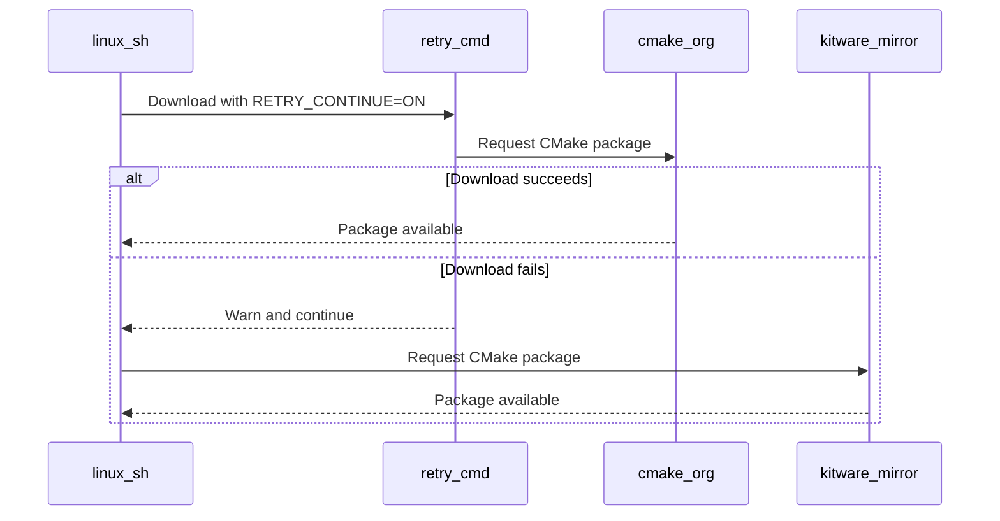
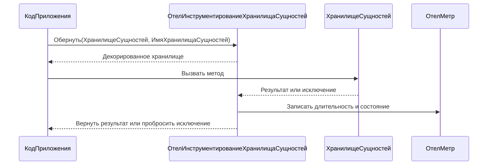
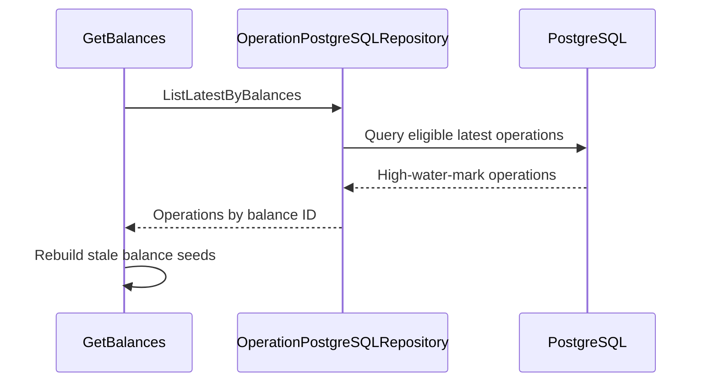
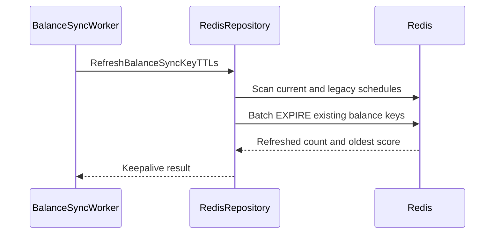

# Walkthroughs

## coderabbitai[bot] · walkthrough · 2026-09-15T18:09:29Z

- Source: https://github.com/helloextend/extend-for-woocommerce/pull/114#issuecomment-5685513494
- Location: —

```markdown
<!-- This is an auto-generated comment: summarize by coderabbit.ai -->
<!-- review_stack_entry_start -->

<a href="https://app.coderabbit.ai/change-stack/helloextend/extend-for-woocommerce/pull/114#gh-light-mode-only"></a><a href="https://app.coderabbit.ai/change-stack/helloextend/extend-for-woocommerce/pull/114#gh-dark-mode-only"></a>

<!-- review_stack_entry_end -->
<!-- walkthrough_start -->

## Walkthrough

The plugin now preserves configured PDP and shipping offer locations. Custom hooks apply when `other` is selected and a custom value exists. PDP otherwise falls back to `woocommerce_before_add_to_cart_button`. Shipping now falls back to `woocommerce_review_order_before_payment`. The plugin metadata, runtime constant, stable tag, and changelog were updated to version `1.2.11`.

<!-- walkthrough_end -->
<!-- change_assessment_start -->
**Priority:** ⬇️ Low

<!-- change_assessment_commit:"9c0434fa98aa16888e58eb9cbc726776f48eb4a1" -->

<!-- change_assessment_end -->
<!-- final_review_risk_start -->
**Merge Risk:** _🟡 Moderate_ · up to `9c043`
<!-- final_review_risk_coverage:{"sourceCommitId":"9c0434fa98aa16888e58eb9cbc726776f48eb4a1","coveredCommitId":"9c0434fa98aa16888e58eb9cbc726776f48eb4a1","kind":"reviewed"} -->

An empty shipping-settings option can prevent plugin initialization while registering the shipping protection hook, so the fallback should be fixed before merging.
<!-- final_review_risk_end -->
<!-- tips_start -->

---


<sub>Comment `@coderabbitai help` to get the list of available commands.</sub>

<!-- tips_end -->
```

---

## coderabbitai[bot] · walkthrough · 2026-09-15T13:08:59Z

- Source: https://github.com/alpaka-group/alpaka3/pull/687#issuecomment-5680700128
- Location: —

```markdown
<!-- This is an auto-generated comment: summarize by coderabbit.ai -->
<!-- review_stack_entry_start -->

<a href="https://app.coderabbit.ai/change-stack/alpaka-group/alpaka3/pull/687#gh-light-mode-only"></a><a href="https://app.coderabbit.ai/change-stack/alpaka-group/alpaka3/pull/687#gh-dark-mode-only"></a>

<!-- review_stack_entry_end -->
<!-- This is an auto-generated comment: rate limited by coderabbit.ai -->

> [!WARNING]
> ## Review limit reached
> 
> **Next included review available in 51 minutes.**
> 
> [Check out review usage here](https://app.coderabbit.ai/dashboard/review-capacity?orgId=b94dd457-ba6e-4892-9788-644f0a3a19fa).
> 
> <details>
> <summary>View limit details</summary>
> 
> **Limit details:** You’ve used the included review currently available.
> 
> You've used all free OSS reviews for now. Wait for the free limit to reset to keep reviewing this public repository.
> 
> [Learn how review limits work](https://docs.coderabbit.ai/management/plans#rate-limits).
> 
> **Review configuration:**
> 
> <details>
> <summary>⚙️ Run configuration</summary>
> 
> **Configuration used**: Path: .coderabbit.yaml
> 
> **Review profile**: CHILL
> 
> **Plan**: Advanced
> 
> **Run ID**: `b7537519-1b0d-4191-9235-45d8099f81ad`
> 
> </details>
> 
> <details>
> <summary>📥 Commits</summary>
> 
> Reviewing files that changed from the base of the PR and between db89f19e58277128c9e5813af76d4af85207559b and f40a9ac51556194330d894257ff8d7cbd7120fc5.
> 
> </details>
> 
> <details>
> <summary>📒 Files selected for processing (2)</summary>
> 
> * `script/ci/install/cmake/linux.sh`
> * `script/ci/utils/misc.sh`
> 
> </details>
> 
> </details>

<!-- end of auto-generated comment: rate limited by coderabbit.ai -->

<!-- walkthrough_start -->

<details>
<summary>📝 Walkthrough</summary>

## Walkthrough

The CI retry helper now supports continuing after failures. The Linux CMake installer uses this option to fall back from cmake.org to the Kitware GitHub mirror.

### Changes

**CMake download resilience**

|Layer / File(s)|Summary|
|---|---|
|**Optional retry continuation** <br> `script/ci/utils/misc.sh`|`retry_cmd()` documents and handles `RETRY_CONTINUE=ON`. Failed commands continue without calling `exit_error()`.|
|**CMake mirror fallback** <br> `script/ci/install/cmake/linux.sh`|The installer tries cmake.org first. On failure, it warns and downloads the package from the Kitware GitHub mirror.|

<!-- change_assessment_start -->
**Priority:** ⬇️ Low


**Estimated code review effort:** 2 (Simple) | ~10 minutes

<!-- change_assessment_commit:"db89f19e58277128c9e5813af76d4af85207559b" -->
**Change:** Feature
<!-- change_assessment_end -->

### Sequence Diagram(s)



</details>

<!-- walkthrough_end -->
<!-- final_review_risk_start -->
**Merge Risk:** _🟡 Moderate_ · up to `db89f`
<!-- final_review_risk_coverage:{"sourceCommitId":"db89f19e58277128c9e5813af76d4af85207559b","coveredCommitId":"db89f19e58277128c9e5813af76d4af85207559b","kind":"reviewed"} -->

The new fallback can unnecessarily redownload CMake after a successful primary request and will stop working after failure status propagation is corrected. Fix both issues before merging.
<!-- final_review_risk_end -->
<!-- pre_merge_checks_walkthrough_start -->

<details>
<summary>🚥 Pre-merge checks | ✅ 5</summary>

<details>
<summary>✅ Passed checks (5 passed)</summary>

|         Check name         | Status   | Explanation                                                                                                                                                                               |
| :------------------------: | :------- | :---------------------------------------------------------------------------------------------------------------------------------------------------------------------------------------- |
|      Description Check     | ✅ Passed | Check skipped - CodeRabbit’s high-level summary is enabled.                                                                                                                               |
|         Title check        | ✅ Passed | The title clearly and concisely describes the main change: adding an alternative CMake download mirror for CI.                                                                            |
|     Docstring Coverage     | ✅ Passed | Docstring coverage is 100.00% which is sufficient. The required threshold is 80.00%. Docstring coverage is scoped to functions touched by this diff. Analyzed 1 functions across 2 files. |
|     Linked Issues check    | ✅ Passed | Check skipped because no linked issues were found for this pull request.                                                                                                                  |
| Out of Scope Changes check | ✅ Passed | Check skipped because no linked issues were found for this pull request.                                                                                                                  |

</details>

</details>

<!-- pre_merge_checks_walkthrough_end -->
<!-- finishing_touch_checkbox_start -->

<details>
<summary>✨ Finishing Touches</summary>

<details>
<summary>🧪 Generate unit tests (beta)</summary>

- [ ] <!-- {"checkboxId": "f47ac10b-58cc-4372-a567-0e02b2c3d479", "radioGroupId": "utg-output-choice-group-unknown_comment_id"} -->   Create PR with unit tests

</details>

</details>

<!-- finishing_touch_checkbox_end -->
<!-- tips_start -->

---

Thanks for using [CodeRabbit](https://coderabbit.ai?utm_source=oss&utm_medium=github&utm_campaign=alpaka-group/alpaka3&utm_content=687)! It's free for OSS, and your support helps us grow. If you like it, consider giving us a shout-out.

<details>
<summary>❤️ Share</summary>

- [X](https://twitter.com/intent/tweet?text=I%20just%20used%20%40coderabbitai%20for%20my%20code%20review%2C%20and%20it%27s%20fantastic%21%20It%27s%20free%20for%20OSS%20and%20offers%20a%20free%20trial%20for%20the%20proprietary%20code.%20Check%20it%20out%3A&url=https%3A//coderabbit.ai)
- [Mastodon](https://mastodon.social/share?text=I%20just%20used%20%40coderabbitai%20for%20my%20code%20review%2C%20and%20it%27s%20fantastic%21%20It%27s%20free%20for%20OSS%20and%20offers%20a%20free%20trial%20for%20the%20proprietary%20code.%20Check%20it%20out%3A%20https%3A%2F%2Fcoderabbit.ai)
- [Reddit](https://www.reddit.com/submit?title=Great%20tool%20for%20code%20review%20-%20CodeRabbit&text=I%20just%20used%20CodeRabbit%20for%20my%20code%20review%2C%20and%20it%27s%20fantastic%21%20It%27s%20free%20for%20OSS%20and%20offers%20a%20free%20trial%20for%20proprietary%20code.%20Check%20it%20out%3A%20https%3A//coderabbit.ai)
- [LinkedIn](https://www.linkedin.com/sharing/share-offsite/?url=https%3A%2F%2Fcoderabbit.ai&mini=true&title=Great%20tool%20for%20code%20review%20-%20CodeRabbit&summary=I%20just%20used%20CodeRabbit%20for%20my%20code%20review%2C%20and%20it%27s%20fantastic%21%20It%27s%20free%20for%20OSS%20and%20offers%20a%20free%20trial%20for%20proprietary%20code)

</details>


<sub>Comment `@coderabbitai help` to get the list of available commands.</sub>

<!-- tips_end -->
```

---

## coderabbitai[bot] · walkthrough · 2026-09-15T14:58:55Z

- Source: https://github.com/tojemoc/sofie/pull/61#issuecomment-5682535282
- Location: —

```markdown
<!-- This is an auto-generated comment: summarize by coderabbit.ai -->
<!-- review_stack_entry_start -->

<a href="https://app.coderabbit.ai/change-stack/tojemoc/sofie/pull/61#gh-light-mode-only"></a><a href="https://app.coderabbit.ai/change-stack/tojemoc/sofie/pull/61#gh-dark-mode-only"></a>

<!-- review_stack_entry_end -->
<!-- This is an auto-generated comment: skip review by coderabbit.ai -->

> [!IMPORTANT]
> - [ ] <!-- {"checkboxId":"e9bb8d72-00e8-4f67-9cb2-caf3b22574fe"} --> 🔍 Trigger review
> 
> This repository does not receive automatic reviews because it has fewer than 10 stars.
> 
> <details>
> <summary>⚙️ Run configuration</summary>
> 
> **Configuration used**: Organization UI
> 
> **Review profile**: CHILL
> 
> **Plan**: Advanced
> 
> **Run ID**: `86eda66f-9e9a-4579-9846-0767d557ceb0`
> 
> </details>

<!-- end of auto-generated comment: skip review by coderabbit.ai -->

<!-- walkthrough_start -->

<details>
<summary>📝 Walkthrough</summary>

## Walkthrough

The changes update rundown editor definitions, smoke data, and integration documentation. They replace retired L3D and wipe references with current names and layer-205 alpha overlays. They also document updated show-flow sequencing, routing, and audio behavior.

### Changes

**Rundown and integration update**

|Layer / File(s)|Summary|
|---|---|
|**Rundown piece definitions** <br> `AGENTS.md`, `assets/sofie-rundown-editor-piece-types.json`, `assets/sofie-rundown-editor-part-types.json`|L3D pieces now use current names, payloads, toolbar groups, and visibility settings. Video defaults use volume `1`. Several technical pieces are hidden from the toolbar.|
|**Smoke fixture and asset support** <br> `assets/spravy-v3-smoke-rundown.json`, `assets/README.md`, `docs/integration/MEGAREPO-ASSETS-FETCH.md`|The smoke fixture uses `l3d-syn` with a `role` payload. The asset documentation adds the standalone `source` piece type. Related checksums are updated.|
|**PGM wipe contract** <br> `docs/integration/DOUBLEBOX-PGM.md`, `docs/integration/OUTPUT_TOPOLOGY.md`, `docs/integration/RE-READINESS-AND-PLAYOUT-UX.md`, `docs/integration/SPRAVY-V2-INTEGRATION.md`|PGM wipes now use a layer-205 alpha overlay with a delayed layer-110 `route://` cut. Layer 200 and the STING path are identified as retired or historical.|
|**Show-flow execution guidance** <br> `docs/integration/SPRAVY-SHOW-FLOW.md`|The show-flow notes update L3D replacement sequencing, LED routing, windowed `ilu-zaver` playback, look-channel audio muting, and Outro media behavior.|

<!-- change_assessment_start -->
**Priority:** ⬇️ Low


**Estimated code review effort:** 2 (Simple) | ~15 minutes

<!-- change_assessment_commit:"f17d34ca0521966ba5e52f8d82624597228c4ed9" -->
**Change:** Feature
<!-- change_assessment_end -->

</details>

<!-- walkthrough_end -->
<!-- final_review_risk_start -->
**Merge Risk:** _🟠 High_ · up to `f17d3`
<!-- final_review_risk_coverage:{"sourceCommitId":"f17d34ca0521966ba5e52f8d82624597228c4ed9","coveredCommitId":"f17d34ca0521966ba5e52f8d82624597228c4ed9","kind":"reviewed"} -->

Following the updated documentation can break wipe playout, asset verification, or source-template deployment. These inconsistencies should be corrected before merge.
<!-- final_review_risk_end -->
<!-- pre_merge_checks_walkthrough_start -->

<details>
<summary>🚥 Pre-merge checks | ✅ 5</summary>

<details>
<summary>✅ Passed checks (5 passed)</summary>

|         Check name         | Status   | Explanation                                                                                                                                                                                               |
| :------------------------: | :------- | :-------------------------------------------------------------------------------------------------------------------------------------------------------------------------------------------------------- |
|      Description Check     | ✅ Passed | Check skipped - CodeRabbit’s high-level summary is enabled.                                                                                                                                               |
|         Title check        | ✅ Passed | The title accurately summarizes the main SPRÁVY documentation and asset changes, including wipe handling, L3D updates, Závěr, outro, and RE UX changes. It is concise and specific enough for the change… |
|     Docstring Coverage     | ✅ Passed | No functions found in the changed files to evaluate docstring coverage. Skipping docstring coverage check. Docstring coverage is scoped to functions touched by this diff. Analyzed 0 functions across 0… |
|     Linked Issues check    | ✅ Passed | Check skipped because no linked issues were found for this pull request.                                                                                                                                  |
| Out of Scope Changes check | ✅ Passed | Check skipped because no linked issues were found for this pull request.                                                                                                                                  |

</details>

</details>

<!-- pre_merge_checks_walkthrough_end -->
<!-- finishing_touch_checkbox_start -->

<details>
<summary>✨ Finishing Touches</summary>

<details>
<summary>✨ Simplify code</summary>

- [ ] <!-- {"checkboxId": "f120d606-b0e2-4b7d-8316-181794555b43", "radioGroupId": "simplify-output-choice-group-5682535282"} -->   Create PR with simplified code
- [ ] <!-- {"checkboxId": "9a4e3077-58f6-4eba-b7ee-62e936ea00ea", "radioGroupId": "simplify-output-choice-group-5682535282"} -->   Commit simplified code in branch `cursor/spravy-wipe-l3d-zaver-af05`

</details>

</details>

<!-- finishing_touch_checkbox_end -->
<!-- tips_start -->

---

Thanks for using [CodeRabbit](https://coderabbit.ai?utm_source=oss&utm_medium=github&utm_campaign=tojemoc/sofie&utm_content=61)! It's free for OSS, and your support helps us grow. If you like it, consider giving us a shout-out.

<details>
<summary>❤️ Share</summary>

- [X](https://twitter.com/intent/tweet?text=I%20just%20used%20%40coderabbitai%20for%20my%20code%20review%2C%20and%20it%27s%20fantastic%21%20It%27s%20free%20for%20OSS%20and%20offers%20a%20free%20trial%20for%20the%20proprietary%20code.%20Check%20it%20out%3A&url=https%3A//coderabbit.ai)
- [Mastodon](https://mastodon.social/share?text=I%20just%20used%20%40coderabbitai%20for%20my%20code%20review%2C%20and%20it%27s%20fantastic%21%20It%27s%20free%20for%20OSS%20and%20offers%20a%20free%20trial%20for%20the%20proprietary%20code.%20Check%20it%20out%3A%20https%3A%2F%2Fcoderabbit.ai)
- [Reddit](https://www.reddit.com/submit?title=Great%20tool%20for%20code%20review%20-%20CodeRabbit&text=I%20just%20used%20CodeRabbit%20for%20my%20code%20review%2C%20and%20it%27s%20fantastic%21%20It%27s%20free%20for%20OSS%20and%20offers%20a%20free%20trial%20for%20proprietary%20code.%20Check%20it%20out%3A%20https%3A//coderabbit.ai)
- [LinkedIn](https://www.linkedin.com/sharing/share-offsite/?url=https%3A%2F%2Fcoderabbit.ai&mini=true&title=Great%20tool%20for%20code%20review%20-%20CodeRabbit&summary=I%20just%20used%20CodeRabbit%20for%20my%20code%20review%2C%20and%20it%27s%20fantastic%21%20It%27s%20free%20for%20OSS%20and%20offers%20a%20free%20trial%20for%20proprietary%20code)

</details>


<!-- poem_footer_start -->
<sub>L3D names now line up bright  <br>Layer 205 guides the wipe  <br>Old STING paths rest  <br>Show-flow notes explain the steps  <br>Audio fades, frames hold  <br>The rundown stays clear and bold</sub>
<!-- poem_footer_end -->

<sub>Comment `@coderabbitai help` to get the list of available commands.</sub>

<!-- tips_end -->
```

---

## coderabbitai[bot] · walkthrough · 2026-08-31T23:15:42Z

- Source: https://github.com/dsx-ai-factory/infra-controller/pull/5605#issuecomment-5486060610
- Location: —

```markdown
<!-- This is an auto-generated comment: summarize by coderabbit.ai -->
<!-- review_stack_entry_start -->

<a href="https://app.coderabbit.ai/change-stack/dsx-ai-factory/infra-controller/pull/5605#gh-light-mode-only"></a><a href="https://app.coderabbit.ai/change-stack/dsx-ai-factory/infra-controller/pull/5605#gh-dark-mode-only"></a>

<!-- review_stack_entry_end -->
<!-- This is an auto-generated comment: skip review by coderabbit.ai -->

> [!IMPORTANT]
> ## Draft PR not reviewed
> 
> Draft PRs are not automatically reviewed by default.
> 
> - [ ] <!-- {"checkboxId":"e9bb8d72-00e8-4f67-9cb2-caf3b22574fe"} --> Trigger a manual review
> 
> To automatically review draft PRs, update your CodeRabbit configuration:
> 
> ```yaml
> reviews:
>   auto_review:
>     drafts: true
> ```

<!-- end of auto-generated comment: skip review by coderabbit.ai -->

<!-- walkthrough_start -->

<!-- This is an auto-generated comment: release notes by coderabbit.ai -->

## Summary by CodeRabbit

* **New Features**
  * Added scheduled site health checks for machine and instance APIs over gRPC and REST.
  * Added TLS-secured gRPC monitoring, authenticated REST checks, configurable intervals, timeouts, and pagination.
  * Added Prometheus metrics for request outcomes, latency, availability, and probe completion.
  * Enabled the probe by default in Helm deployments, with configurable certificates, secrets, resources, and ServiceMonitor support.
  * Added read-only permissions for required machine API queries.
  * Added multi-architecture container builds for AMD64 and ARM64.

* **Documentation**
  * Added configuration and deployment guidance for authentication, TLS, metrics, and certificate management.

<!-- end of auto-generated comment: release notes by coderabbit.ai -->
## Walkthrough

The change adds a Rust site health probe with gRPC and REST checks, metrics, Kubernetes deployment resources, RBAC permissions, multi-architecture image builds, Helm tests, and CI integration.

### Changes

**Site health probe**

|Layer / File(s)|Summary|
|---|---|
|**Configuration, runtime, and metrics** <br> `crates/site-health-probe/Cargo.toml`, `crates/site-health-probe/build.rs`, `crates/site-health-probe/src/config.rs`, `crates/site-health-probe/src/framework.rs`, `crates/site-health-probe/src/logging.rs`, `crates/site-health-probe/src/metrics.rs`, `crates/site-health-probe/src/main.rs`|Adds strict configuration, filtered gRPC definitions, cancellable scheduling, watchdog handling, structured logging, Prometheus metrics, readiness handling, and ordered shutdown.|
|**gRPC and REST probes** <br> `crates/site-health-probe/src/probes/*`|Adds mTLS gRPC checks and authenticated HTTPS checks with pagination, token caching, TLS validation, response handling, and integration tests.|
|**Container and Helm deployment** <br> `crates/site-health-probe/Dockerfile`, `helm/charts/nico-machine-a-tron/charts/nico-site-health-probe/*`, `helm/charts/nico-machine-a-tron/Chart.yaml`, `helm/charts/nico-machine-a-tron/values.yaml`, `helm/charts/nico-machine-a-tron/README.md`|Adds multi-architecture image packaging and a configurable subchart with certificates, secret mounts, security settings, metrics resources, ServiceMonitor support, rendering tests, and documentation.|
|**API authorization** <br> `crates/api-core/src/auth/internal_rbac_rules.rs`|Adds the site health probe principal and read permissions for `FindMachineIds` and `FindMachinesByIds`.|
|**CI integration** <br> `.github/workflows/ci.yaml`|Adds image build and scan automation, Helm unit-test coverage, build summaries, notifications, and Core CI gate dependencies.|

<!-- change_assessment_start -->
**Priority:** ➖ Normal


**Estimated code review effort:** 4 (Complex) | ~60 minutes

<!-- change_assessment_commit:"56e3e836427535008aacc4c6e982ec06e3ffd41d" -->
**Change:** Feature
<!-- change_assessment_end -->

<!-- walkthrough_end -->
<!-- final_review_risk_start -->
**Merge Risk:** _🟡 Moderate_ · up to `56e3e`
<!-- final_review_risk_coverage:{"sourceCommitId":"56e3e836427535008aacc4c6e982ec06e3ffd41d","coveredCommitId":"56e3e836427535008aacc4c6e982ec06e3ffd41d","kind":"reviewed"} -->

Malformed configuration can make gRPC checks fail only after startup, while the REST probe can become permanently unavailable and the default chart deployment may not start the probe at all. Resolve these issues before relying on the new monitoring component.
<!-- final_review_risk_end -->
<!-- pre_merge_checks_walkthrough_start -->

<details>
<summary>🚥 Pre-merge checks | ✅ 3 | ❌ 2</summary>

### ❌ Failed checks (2 warnings)

|      Check name     | Status     | Explanation                                                                                                                                                                                               | Resolution                                                                                                                                                                                                                                        |
| :-----------------: | :--------- | :-------------------------------------------------------------------------------------------------------------------------------------------------------------------------------------------------------- | :------------------------------------------------------------------------------------------------------------------------------------------------------------------------------------------------------------------------------------------------ |
| Linked Issues check | ⚠️ Warning | Issue `#5360` requires an optional component with `enabled` defaulting to `false`. The reviewed head sets `nico-site-health-probe.enabled: true` in the parent chart and in the subchart. This enables the… | Set the effective parent-chart and subchart defaults for `nico-site-health-probe.enabled` to `false`. Keep explicit enablement and the existing configuration and tests. Deployment-at-two-sites and dashboard visibility are operational accept… |
|  Docstring Coverage | ⚠️ Warning | Docstring coverage is 53.70% which is insufficient. The required threshold is 80.00%. Docstring coverage is scoped to functions touched by this diff. Analyzed 108 functions across 10 files.             | Write docstrings for the functions missing them to satisfy the coverage threshold.                                                                                                                                                                |

<details>
<summary>✅ Passed checks (3 passed)</summary>

|         Check name         | Status   | Explanation                                                                                                                                                                                               |
| :------------------------: | :------- | :-------------------------------------------------------------------------------------------------------------------------------------------------------------------------------------------------------- |
|         Title check        | ✅ Passed | The title clearly identifies the new site health probe and its purpose as synthetic monitoring for NICo APIs.                                                                                             |
|      Description check     | ✅ Passed | The description is directly related to the changeset and covers the probe service, metrics, Helm deployment, RBAC, CI, security, and testing. It incorrectly describes the implementation as Go, while t… |
| Out of Scope Changes check | ✅ Passed | The changed files implement issue `#5360`. They add the probe service, read-only gRPC and REST probe implementations, shared metrics, Helm deployment and scraping resources, RBAC, image and CI integrati… |

</details>

<details>
<summary>Full details: Linked Issues check</summary>

**Explanation**

Issue `#5360` requires an optional component with `enabled` defaulting to `false`. The reviewed head sets `nico-site-health-probe.enabled: true` in the parent chart and in the subchart. This enables the probe in every parent-chart deployment by default. The implementation otherwise provides the configurable probe framework, gRPC and REST probes, duration and outcome metrics, single-replica deployment, standard `ServiceMonitor` support, automated tests, and continuous scheduling.

**Resolution**

Set the effective parent-chart and subchart defaults for `nico-site-health-probe.enabled` to `false`. Keep explicit enablement and the existing configuration and tests. Deployment-at-two-sites and dashboard visibility are operational acceptance items; the supplied repository evidence does not establish them.

</details>

</details>

<!-- pre_merge_checks_walkthrough_end -->
<!-- finishing_touch_checkbox_start -->

<details>
<summary>✨ Finishing Touches</summary>

<details>
<summary>🧪 Generate unit tests (beta)</summary>

- [ ] <!-- {"checkboxId": "f47ac10b-58cc-4372-a567-0e02b2c3d479", "radioGroupId": "utg-output-choice-group-unknown_comment_id"} -->   Create PR with unit tests

</details>

</details>

<!-- finishing_touch_checkbox_end -->
<!-- tips_start -->

---


<sub>Comment `@coderabbitai help` to get the list of available commands.</sub>

<!-- tips_end -->
```

---

## coderabbitai[bot] · walkthrough · 2026-09-15T13:39:21Z

- Source: https://github.com/nixel2007/opentelemetry-instrumentation-entity/pull/2#issuecomment-5681141665
- Location: —

```markdown
<!-- This is an auto-generated comment: summarize by coderabbit.ai -->
<!-- review_stack_entry_start -->

<a href="https://app.coderabbit.ai/change-stack/nixel2007/opentelemetry-instrumentation-entity/pull/2#gh-light-mode-only"></a><a href="https://app.coderabbit.ai/change-stack/nixel2007/opentelemetry-instrumentation-entity/pull/2#gh-dark-mode-only"></a>

<!-- review_stack_entry_end -->
<!-- recent_review_start -->

No actionable comments were generated in the recent review. 🎉

<details>
<summary>ℹ️ Recent review info</summary>

<details>
<summary>⚙️ Run configuration</summary>

**Configuration used**: Organization UI

**Review profile**: CHILL

**Plan**: Advanced

**Run ID**: `802253e2-fd94-4a38-b06a-ed01b317656b`

</details>

<details>
<summary>📥 Commits</summary>

Reviewing files that changed from the base of the PR and between fde12c7f44b72d3c6cd35d08d23b1da60de61f13 and b69cd29f139a2735e662ea45a4714074ed0d4cb0.

</details>

<details>
<summary>📒 Files selected for processing (5)</summary>

* `README.md`
* `docs/api/ОтелИнструментированиеХранилищаСущностей.md`
* `docs/product/010-index.md`
* `src/Классы/ОтелИнструментированиеХранилищаСущностей.os`
* `tests/ТестИнструментированиеХранилищаСущностей.os`

</details>

<details>
<summary>🚧 Files skipped from review as they are similar to previous changes (1)</summary>

* docs/product/010-index.md

</details>

**Included review availability:** Your plan provides up to 1 included review per hour; 0 remain after this review.

</details>

---


<!-- recent_review_end -->
<!-- walkthrough_start -->

## Walkthrough

Добавлен `ОтелИнструментированиеХранилищаСущностей`. Он измеряет длительность вызовов методов в гистограмме `entity.repository.invocation.duration`, обрабатывает успешные вызовы и ошибки, но не создаёт спаны. Обновлены регистрация, зависимости, документация и тесты.

### Changes

**Инструментирование хранилищ сущностей**

|Layer / File(s)|Summary|
|---|---|
|**Реализация и регистрация декоратора** <br> `packagedef`, `lib.config`, `src/Классы/ОтелИнструментированиеХранилищаСущностей.os`|Добавлен декоратор с рефлексией методов и перехватчиками вызовов. Гистограмма записывает длительность в секундах, состояние `success` или `error`, имя хранилища, имя функции и тип ошибки. Обновлены версия пакета, зависимость `decorator` и регистрация класса.|
|**Проверка поведения декоратора** <br> `tests/Классы/*`, `tests/ТестИнструментированиеХранилищаСущностей.os`|Тесты проверяют метрики, ошибки, отсутствие спанов, исключение служебных методов, экранирование кавычек и возврат исходного объекта.|
|**Документация API и сигналов** <br> `README.md`, `docs/api/*`, `docs/product/010-index.md`|Добавлены API-документы и обновлены примеры. Документация разделяет трассировку наблюдателя источника данных и метрики декоратора хранилища.|

<!-- change_assessment_start -->
**Priority:** ⬇️ Low


**Estimated code review effort:** 3 (Moderate) | ~25 minutes

<!-- change_assessment_commit:"b69cd29f139a2735e662ea45a4714074ed0d4cb0" -->
**Change:** Feature
<!-- change_assessment_end -->

### Sequence Diagram(s)



<!-- walkthrough_end -->
<!-- final_review_risk_start -->
**Merge Risk:** _⚪ Minimal_ · up to `b69cd`
<!-- final_review_risk_coverage:{"sourceCommitId":"b69cd29f139a2735e662ea45a4714074ed0d4cb0","coveredCommitId":"b69cd29f139a2735e662ea45a4714074ed0d4cb0","kind":"reviewed"} -->

Изменение добавляет измерение вызовов хранилищ без подтверждённых текущих рисков, препятствующих обычному использованию или сборке пакета.
<!-- final_review_risk_end -->
<!-- pre_merge_checks_walkthrough_start -->

<details>
<summary>🚥 Pre-merge checks | ✅ 5</summary>

<details>
<summary>✅ Passed checks (5 passed)</summary>

|         Check name         | Status   | Explanation                                                                                                                                                                                               |
| :------------------------: | :------- | :-------------------------------------------------------------------------------------------------------------------------------------------------------------------------------------------------------- |
|     Docstring Coverage     | ✅ Passed | No functions found in the changed files to evaluate docstring coverage. Skipping docstring coverage check. Docstring coverage is scoped to functions touched by this diff. Analyzed 0 functions across 0… |
|     Linked Issues check    | ✅ Passed | Check skipped because no linked issues were found for this pull request.                                                                                                                                  |
| Out of Scope Changes check | ✅ Passed | Check skipped because no linked issues were found for this pull request.                                                                                                                                  |
|         Title check        | ✅ Passed | Заголовок точно описывает основное изменение: добавление гистограммы для вызовов методов хранилищ сущностей.                                                                                              |
|      Description check     | ✅ Passed | Описание связано с изменениями. Оно описывает обертку, метрику, атрибуты, обработку ошибок, тесты, зависимости и документацию.                                                                            |

</details>

</details>

<!-- pre_merge_checks_walkthrough_end -->
<!-- tips_start -->

---

Thanks for using [CodeRabbit](https://coderabbit.ai?utm_source=oss&utm_medium=github&utm_campaign=nixel2007/opentelemetry-instrumentation-entity&utm_content=2)! It's free for OSS, and your support helps us grow. If you like it, consider giving us a shout-out.

<details>
<summary>❤️ Share</summary>

- [X](https://twitter.com/intent/tweet?text=I%20just%20used%20%40coderabbitai%20for%20my%20code%20review%2C%20and%20it%27s%20fantastic%21%20It%27s%20free%20for%20OSS%20and%20offers%20a%20free%20trial%20for%20the%20proprietary%20code.%20Check%20it%20out%3A&url=https%3A//coderabbit.ai)
- [Mastodon](https://mastodon.social/share?text=I%20just%20used%20%40coderabbitai%20for%20my%20code%20review%2C%20and%20it%27s%20fantastic%21%20It%27s%20free%20for%20OSS%20and%20offers%20a%20free%20trial%20for%20the%20proprietary%20code.%20Check%20it%20out%3A%20https%3A%2F%2Fcoderabbit.ai)
- [Reddit](https://www.reddit.com/submit?title=Great%20tool%20for%20code%20review%20-%20CodeRabbit&text=I%20just%20used%20CodeRabbit%20for%20my%20code%20review%2C%20and%20it%27s%20fantastic%21%20It%27s%20free%20for%20OSS%20and%20offers%20a%20free%20trial%20for%20proprietary%20code.%20Check%20it%20out%3A%20https%3A//coderabbit.ai)
- [LinkedIn](https://www.linkedin.com/sharing/share-offsite/?url=https%3A%2F%2Fcoderabbit.ai&mini=true&title=Great%20tool%20for%20code%20review%20-%20CodeRabbit&summary=I%20just%20used%20CodeRabbit%20for%20my%20code%20review%2C%20and%20it%27s%20fantastic%21%20It%27s%20free%20for%20OSS%20and%20offers%20a%20free%20trial%20for%20proprietary%20code)

</details>


<!-- poem_footer_start -->
<sub>Кролик метр в хранилище принёс,<br>Вызов измерил, спан не создал.<br>Успех и ошибку в журнал записал,<br>Секунды в гистограмме точно показал.<br>Декоратор работает, тесты стоят,<br>Документы путь разработчикам мнят.</sub>
<!-- poem_footer_end -->

<sub>Comment `@coderabbitai help` to get the list of available commands.</sub>

<!-- tips_end -->
```

---

## coderabbitai[bot] · walkthrough · 2026-09-15T18:41:28Z

- Source: https://github.com/webpack/webpack/pull/22122#issuecomment-5686036814
- Location: —

```markdown
<!-- This is an auto-generated comment: summarize by coderabbit.ai -->
<!-- review_stack_entry_start -->

<a href="https://app.coderabbit.ai/change-stack/webpack/webpack/pull/22122#gh-light-mode-only"></a><a href="https://app.coderabbit.ai/change-stack/webpack/webpack/pull/22122#gh-dark-mode-only"></a>

<!-- review_stack_entry_end -->
<!-- walkthrough_start -->

<details>
<summary>📝 Walkthrough</summary>

## Walkthrough

The PR adds shared error normalization and stack-frame formatting. Compilation and generator paths use these helpers, request shorteners propagate through generated error output, and tests cover non-Error throws and relative stack traces.

### Changes

**Error normalization and stack context**

|Layer / File(s)|Summary|
|---|---|
|**Normalize thrown values** <br> `lib/ErrorHelpers.js`, `lib/Compilation.js`, `lib/NormalModule.js`, `lib/errors/HookWebpackError.js`|Non-Error values are converted to `Error` instances before webpack error wrappers are created.|
|**Format contextual stack messages** <br> `lib/ErrorHelpers.js`, `lib/Generator.js`|Stack frames can be shortened with a `RequestShortener`. Non-reproducible positions are removed.|
|**Propagate request shorteners** <br> `lib/Generator.js`, `lib/NormalModule.js`, `lib/asset/*`, `lib/css/CssGenerator.js`, `lib/html/HtmlGenerator.js`, `lib/javascript/JavascriptGenerator.js`, `lib/json/JsonGenerator.js`, `lib/wasm-async/*`, `lib/wasm-sync/*`|Error-generation paths pass runtime request shorteners to build-error rendering.|
|**Validate error output** <br> `test/ErrorHelpers.unittest.js`, `test/Generator.unittest.js`, `test/Compiler.test.js`, `test/configCases/*`, `.changeset/035-build-error-message-stack.md`|Tests cover non-Error tap failures, stack formatting, asset-module errors, factorization errors, and parse-error output. The Changeset records a webpack patch release.|

**Suggested labels:** `area: css`, `area: html`, `area: wasm`, `area: parser`, `area: loaders`, `area: types`

**Suggested reviewers:** `avivkeller`

</details>

<!-- walkthrough_end -->
<!-- change_assessment_start -->
**Priority:** ⬇️ Low

<!-- change_assessment_commit:"83f387b7f58b73899928b0491fd5f367caf6beaf" -->
**Change:** Bug fix
<!-- change_assessment_end -->
<!-- final_review_risk_start -->
**Merge Risk:** _🟡 Moderate_ · up to `83f38`
<!-- final_review_risk_coverage:{"sourceCommitId":"83f387b7f58b73899928b0491fd5f367caf6beaf","coveredCommitId":"83f387b7f58b73899928b0491fd5f367caf6beaf","kind":"reviewed"} -->

A plugin throwing a non-Error from beforeSnapshot can turn an intended build failure into an internal code-generation error. CSS build diagnostics also retain unstable absolute stack details. Fix both paths before merging.
<!-- final_review_risk_end -->
<!-- pre_merge_checks_walkthrough_start -->

<details>
<summary>🚥 Pre-merge checks | ✅ 4</summary>

<details>
<summary>✅ Passed checks (4 passed)</summary>

|         Check name         | Status   | Explanation                                                                                                                                           |
| :------------------------: | :------- | :---------------------------------------------------------------------------------------------------------------------------------------------------- |
|      Description Check     | ✅ Passed | Check skipped - CodeRabbit’s high-level summary is enabled.                                                                                           |
|         Title check        | ✅ Passed | The title uses the required Conventional Commit form with the allowed type `fix` and accurately describes the build error and relative stack changes. |
|     Linked Issues check    | ✅ Passed | Check skipped because no linked issues were found for this pull request.                                                                              |
| Out of Scope Changes check | ✅ Passed | Check skipped because no linked issues were found for this pull request.                                                                              |

</details>

</details>

<!-- pre_merge_checks_walkthrough_end -->
<!-- finishing_touch_checkbox_start -->

<details>
<summary>✨ Finishing Touches 💡 1</summary>

<!-- finishing_touch_suggestion:fix_ci -->
<details open>
<summary>🛠️ Fix failing CI checks 💡</summary>

- [ ] <!-- {"checkboxId": "6d21cfe8-ec3f-40e2-9222-b8318b64d3b0", "radioGroupId": "fix-ci-output-choice-group-unknown_comment_id"} -->   Create stacked PR
- [ ] <!-- {"checkboxId": "9f0d24fb-b419-4f01-baf0-8b26b6424f34", "radioGroupId": "fix-ci-output-choice-group-unknown_comment_id"} -->   Commit on current branch

</details>

</details>

<!-- finishing_touch_checkbox_end -->
<!-- This is an auto-generated comment: all tool run failures by coderabbit.ai -->

> [!WARNING]
> Some tools did not complete. Review the errors below.
> 
> <details>
> <summary>🔧 ESLint</summary>
> 
> > If the error stems from missing dependencies, add them to the package.json file. For unrecoverable errors (e.g., due to private dependencies), disable the tool in the CodeRabbit configuration.
> 
> <details>
> <summary>lib/Compilation.js</summary>
> 
> ESLint failed to execute (timeout).
> 
> </details>
> 
> <details>
> <summary>lib/ErrorHelpers.js</summary>
> 
> ESLint skipped: the matched ESLint configuration already failed (timeout).
> 
> </details>
> 
> <details>
> <summary>lib/Generator.js</summary>
> 
> ESLint skipped: the matched ESLint configuration already failed (timeout).
> 
> </details>
> 
> + 21 others
> 
> </details>

<!-- end of auto-generated comment: all tool run failures by coderabbit.ai -->
<!-- tips_start -->

---

Thanks for using [CodeRabbit](https://coderabbit.ai?utm_source=oss&utm_medium=github&utm_campaign=webpack/webpack&utm_content=22122)! It's free for OSS, and your support helps us grow. If you like it, consider giving us a shout-out.

<details>
<summary>❤️ Share</summary>

- [X](https://twitter.com/intent/tweet?text=I%20just%20used%20%40coderabbitai%20for%20my%20code%20review%2C%20and%20it%27s%20fantastic%21%20It%27s%20free%20for%20OSS%20and%20offers%20a%20free%20trial%20for%20the%20proprietary%20code.%20Check%20it%20out%3A&url=https%3A//coderabbit.ai)
- [Mastodon](https://mastodon.social/share?text=I%20just%20used%20%40coderabbitai%20for%20my%20code%20review%2C%20and%20it%27s%20fantastic%21%20It%27s%20free%20for%20OSS%20and%20offers%20a%20free%20trial%20for%20the%20proprietary%20code.%20Check%20it%20out%3A%20https%3A%2F%2Fcoderabbit.ai)
- [Reddit](https://www.reddit.com/submit?title=Great%20tool%20for%20code%20review%20-%20CodeRabbit&text=I%20just%20used%20CodeRabbit%20for%20my%20code%20review%2C%20and%20it%27s%20fantastic%21%20It%27s%20free%20for%20OSS%20and%20offers%20a%20free%20trial%20for%20proprietary%20code.%20Check%20it%20out%3A%20https%3A//coderabbit.ai)
- [LinkedIn](https://www.linkedin.com/sharing/share-offsite/?url=https%3A%2F%2Fcoderabbit.ai&mini=true&title=Great%20tool%20for%20code%20review%20-%20CodeRabbit&summary=I%20just%20used%20CodeRabbit%20for%20my%20code%20review%2C%20and%20it%27s%20fantastic%21%20It%27s%20free%20for%20OSS%20and%20offers%20a%20free%20trial%20for%20proprietary%20code)

</details>


<sub>Comment `@coderabbitai help` to get the list of available commands.</sub>

<!-- tips_end -->
```

---

## coderabbitai[bot] · walkthrough · 2026-06-05T15:27:56Z

- Source: https://github.com/mattermost/mattermost-developer-documentation/pull/1507#issuecomment-4633083117
- Location: —

```markdown
<!-- This is an auto-generated comment: summarize by coderabbit.ai -->
<!-- review_stack_entry_start -->

[](https://app.coderabbit.ai/change-stack/mattermost/mattermost-developer-documentation/pull/1507?utm_source=github_walkthrough&utm_medium=github&utm_campaign=change_stack)

<!-- review_stack_entry_end -->
No actionable comments were generated in the recent review. 🎉

<details>
<summary>ℹ️ Recent review info</summary>

<details>
<summary>⚙️ Run configuration</summary>

**Configuration used**: Organization UI

**Review profile**: CHILL

**Plan**: Pro

**Run ID**: `772ea859-f77d-4d49-a39f-5806e8c72984`

</details>

<details>
<summary>📥 Commits</summary>

Reviewing files that changed from the base of the PR and between 1ce44f165285c76f27d8e2c1e256c604b207582f and 48da4685cbd1c50fbaf0323840f92f7e0c345084.

</details>

<details>
<summary>📒 Files selected for processing (1)</summary>

* `site/content/integrate/plugins/interactive-messages/_index.md`

</details>

</details>

---
<!-- walkthrough_start -->

<details>
<summary>📝 Walkthrough</summary>

## Walkthrough

This PR updates the interactive messages plugin documentation to clarify error handling behaviour. The "Error handling" section reference is revised to match updated FAQ phrasing, and the FAQ entry is expanded to explicitly document how Mattermost maps integration/connectivity errors and invalid responses to HTTP status codes returned to clients.

## Changes

**Interactive Message Error Handling Documentation**

| Layer / File(s) | Summary |
|---|---|
| **Error handling FAQ clarification** <br> `site/content/integrate/plugins/interactive-messages/_index.md` | The "Error handling" section reference is updated to direct readers to the revised FAQ question, and the FAQ entry is expanded to document three failure scenarios (forbidden internal connections, upstream status codes, invalid JSON) and the corresponding HTTP response mappings (400, 429/503 preservation, 502/400 for 5xx/4xx).|

## Estimated code review effort

🎯 2 (Simple) | ⏱️ ~15 minutes

</details>

<!-- walkthrough_end -->
<!-- pre_merge_checks_walkthrough_start -->

<details>
<summary>🚥 Pre-merge checks | ✅ 5</summary>

<details>
<summary>✅ Passed checks (5 passed)</summary>

|         Check name         | Status   | Explanation                                                                                                                                                                                             |
| :------------------------: | :------- | :------------------------------------------------------------------------------------------------------------------------------------------------------------------------------------------------------ |
|         Title check        | ✅ Passed | The title clearly and specifically describes the main change: documenting how Mattermost now returns different error status codes for interactive message integrations instead of always returning 400. |
|      Description check     | ✅ Passed | The description is directly related to the changeset, explaining the motivation for the documentation update and referencing the related implementation PR.                                             |
|     Docstring Coverage     | ✅ Passed | No functions found in the changed files to evaluate docstring coverage. Skipping docstring coverage check.                                                                                              |
|     Linked Issues check    | ✅ Passed | Check skipped because no linked issues were found for this pull request.                                                                                                                                |
| Out of Scope Changes check | ✅ Passed | Check skipped because no linked issues were found for this pull request.                                                                                                                                |

</details>

<sub>✏️ Tip: You can configure your own custom pre-merge checks in the settings.</sub>

</details>

<!-- pre_merge_checks_walkthrough_end -->
<!-- finishing_touch_checkbox_start -->

<details>
<summary>✨ Finishing Touches</summary>

<details>
<summary>🧪 Generate unit tests (beta)</summary>

- [ ] <!-- {"checkboxId": "f47ac10b-58cc-4372-a567-0e02b2c3d479", "radioGroupId": "utg-output-choice-group-unknown_comment_id"} -->   Create PR with unit tests
- [ ] <!-- {"checkboxId": "6ba7b810-9dad-11d1-80b4-00c04fd430c8", "radioGroupId": "utg-output-choice-group-unknown_comment_id"} -->   Commit unit tests in branch `preserve_plugin_retry_status`

</details>

</details>

<!-- finishing_touch_checkbox_end -->
<!-- tips_start -->

---

Thanks for using [CodeRabbit](https://coderabbit.ai?utm_source=oss&utm_medium=github&utm_campaign=mattermost/mattermost-developer-documentation&utm_content=1507)! It's free for OSS, and your support helps us grow. If you like it, consider giving us a shout-out.

<details>
<summary>❤️ Share</summary>

- [X](https://twitter.com/intent/tweet?text=I%20just%20used%20%40coderabbitai%20for%20my%20code%20review%2C%20and%20it%27s%20fantastic%21%20It%27s%20free%20for%20OSS%20and%20offers%20a%20free%20trial%20for%20the%20proprietary%20code.%20Check%20it%20out%3A&url=https%3A//coderabbit.ai)
- [Mastodon](https://mastodon.social/share?text=I%20just%20used%20%40coderabbitai%20for%20my%20code%20review%2C%20and%20it%27s%20fantastic%21%20It%27s%20free%20for%20OSS%20and%20offers%20a%20free%20trial%20for%20the%20proprietary%20code.%20Check%20it%20out%3A%20https%3A%2F%2Fcoderabbit.ai)
- [Reddit](https://www.reddit.com/submit?title=Great%20tool%20for%20code%20review%20-%20CodeRabbit&text=I%20just%20used%20CodeRabbit%20for%20my%20code%20review%2C%20and%20it%27s%20fantastic%21%20It%27s%20free%20for%20OSS%20and%20offers%20a%20free%20trial%20for%20proprietary%20code.%20Check%20it%20out%3A%20https%3A//coderabbit.ai)
- [LinkedIn](https://www.linkedin.com/sharing/share-offsite/?url=https%3A%2F%2Fcoderabbit.ai&mini=true&title=Great%20tool%20for%20code%20review%20-%20CodeRabbit&summary=I%20just%20used%20CodeRabbit%20for%20my%20code%20review%2C%20and%20it%27s%20fantastic%21%20It%27s%20free%20for%20OSS%20and%20offers%20a%20free%20trial%20for%20proprietary%20code)

</details>


<sub>Comment `@coderabbitai help` to get the list of available commands and usage tips.</sub>

<!-- tips_end -->
<!-- internal state start -->


<!-- DwQgtGAEAqAWCWBnSTIEMB26CuAXA9mAOYCmGJATmriQCaQDG+Ats2bgFyQAOFk+AIwBWJBrngA3EsgEBPRvlqU0AgfFwA6NPEgQAfACgjoCEYDEZyAAUASpETZWaCrKPR1AGxJcAIvgaO7JCUFPh8iLjU2MhMSsgUJLjYFOT0AGZhKBg0VGKSJJBsiIhopFk0RFTi+BjIkAYAco4ClFwAjACsAAwA7JD1AKo2ADJcsLi43IgcAPQzROqw2AIaTMwzzNQ5zPgRG1uUOxFgSlIe+NyUJ/6B2dTwNTPc2B4eM529/QYDiK32aohYCQPF8AMr4ZIMAoCKgYBiwLi8aSUKQAfW4HmwCwwqISuBcqIiUWQgCTCGDOUi4SAwzDwribCKUMGRJLTfiXLD1ADCCWodHQnEgACYukKAGxgLoSrodaCdDhCgAsHC6AE4AFpGHzSBgUeDcaoYDgGKADbi0PnIXBA8rKPJSQrSEqkZC0G5sO6GyAESAJNJeMTe2DUSAAWQOFCOVIw+AA7jwEr8KFIYpRIvAsNgpviSGhmJAABLQaBWews6IKOKQAAUGcZaHo+DS6A8sbQsniiWSGAzREgiq6XQAlJBY0CsJhbZV7jVqWgGABrXvoal4AhYTIe7CQNLaDyIDQmmA2+GYMpkFReZAAQSsAElGB54OwrfhILAapk8S57CRNtl4AYGQ0F+RssGtAokSTKR6CJVlK2kQ8DBsYE+XoWwxgmKZZnmRZllWFh9gmQ5dlwIjtlIp4XjeABmMUekHIx9GMcAoDIRtmzQPBCFIcgqn5NYPUFXh+GEURxBTal5FiZRVHULQdGYkwoDgVBUEnLiCGIMhlBoehBPYLgqHjBwnB/OQEKoOTNG0XQwEMFjTAMRB1BIGYmGydgZgzCp+KeTFsUQbzPNyCSSDAIpnWkGZUQzJQAA8NGYWhjQAInSgwLEga8720vi0PsRxNh/JtGGDDAXSMO8sAAAxcmh3JqGhsmC3y+X8rE61au0woip1Smi2KMASpLaBqgAaIMCnxCEBCvD98HECrIAAMWvABFBRPOyHdMh8nr8kdYoBvQPJZxCMJkDbZAswtPSNGPApcwoJ8mTWzb2B/QAcAgAdVgeQ3WkdAsH20LDoENdZ03MhtzxbtgeCChQgoAB+QBcAlHED0FoJRaBmEh4u4TBce9N8MwYTElHsS4GHgNJAPsKEMGcB5kGJqbC2LUs4IrFpgwkB5kjDCMo0KihdyhV9H2fbJEEm8nKeXIhsHgC04Wm4MqQuihkAyPg9bUHGyFtFI0BBDzyDO2p0ASMWJf5LGixLftB0mrMIl5fMeZiRQgc2bhScgGrFSFVUapmGruhomqE2RZMZwnYbCjQbhuGXUrFqBPgOni+LA8j0VIAAIQbSAAHE+TbWQY/ZzOmUVXP84HLpi9LlCAEdsGkXAJuB+gMwkM3VcgAApUEAHkGl9aQXlwZAM0553m6Q68cfUB5mdeWRJog1aNuntJKDIKFvQJ6Nno5r6AFEkcycraCfCqMd+K3MZu80Cp9bh8B8yBokoKWu93rBGyD+WMiwObkHjF9OGKQEbawxtwWAVAXLLWrAkDE85ly714A8PgMCuxwLQC7FuCDRxhFoL2IcSFzCWGvB4HICdAE2iUBTZwTD+DNgJt/Cgel+B8GeHNBm7B17SCMA0SeV8jDDAzEDU8FU6BcAANQdBmGADoRgr4RHgJsPhMlp4CxIPGEgaQ9aClDHQeAjgDDpVSkxeyjk2JJ1KppHiOl+L6RYEJIyaATJFWcPICyMkrJqBsopBxyljxqTZhObieVdICS8YZSASh0xeE8VTOa/gFyFTMvIWELopKWRUKEhSdkHIAG0ADeqUCkkDvLQVKHBalnhIKiWgHQOgkHogADg6G0BgipGnjVSkTa0TTUr1Tch5ZqZF9rTgahiTqtRupgykH1Y6LoYpxQJqNVKIyiS8JkeQJpioaJdBGexY5JBTnnIOf4lwEy4AFGvrfPg99H5EGfuJDegBMAitKEZY818CLWXH6I+6s35/w/nwn0lCEiBl5EoHWgcgH707t3De3pPD8l+v9FJ+AgaTlBvOMKq4JhQz4FuaeSQiFYG1ujGsSIBYQkQB4eQBDaUThIYjZG6NqH7NSjJIu5xFxchYBiAm6hZATPOLGVKABfcaNS6kNImXU1EJABA0UVG0WgQoBCqi6H0wVYzYATKmY1baczPILLckswKqzSX5A2VFIKQ0RrJUFYc3A1zTlilVJc4afqOCKh6B0e5eSnk2mAZ9eQetIB4oBoSmJJtnUOghhSjcVKYY0vhpOBlGNrrT1jHqYiGB8aE2JvyH0T4IhBgSAUXc8BMS215IgGoMT6DcKfLTXA7Kyx8nfHGYWxFIykWTlMKcVQN5WsthJaVMwx6Tx3HuZIQMfQOHFvOfkTtSyJm/rUaQ8s4SK2WucIgYAaDxSpAgWWfcObB1DuHAu0dY7QQTg+guQoX3Nxjv7NOy0KAvEQoK4VoqFziuYJK+K0qJlsEoY4RVABdRxICOI4C0rxBJnjWDJNSXuRJmSIO5OKvk1pMhpK+xCfJWySlWIKFYOoWKtBEC4hIIY2MdBCSRF4eUtDioekWkVGKPpDABC0AGd0NIAg0BpC6DRIUNEekDjSKqIUaQegkC6AwHV3QVP8YMJEwSzHVZsYSJx7j7F+ORKRKiNgFBSConhKIBcbGfWGaqQYfoqUkC2BFdkugUGhJWFInQJpq79wkHGt5yAvnEDjykEjVWSgMARd3FFmLPm3RAXxL2cVSWBrVRyJvUELIblcCqUq2LQrfY2BKeoH6oQaBWAoO4ftFXIu/Cy3FwEEIPC0AC4uWw6WzbdZq5Q2gNhsAYD8AwMreoKqIC5ECRcEX8Rdx66lSb02MDta8Ct1z63gPRYm6rXb2pEC6n1IaQ7a2uAbdOz5x+C46B3mKF3RAC2IvpS2x4ECuA7sLhQg4BhiAIsVNi/0Lz/RYdxZc4uBoeZOupX2wUBHC59lQ9h5M8s4OHsnZ63D1KPbMAJx+887FHXHzPQHezRANM6aATNgOuI12WhWhtJsBe8jSBcBy7cJafYPzxnDGO0WMZ4ywOtpQ0xEKtZvMHfBGSus9ohXTQUSKJ15kzs7VkesGGzZV07Fy5cy8sdw58zsJQP22wpF7Bby3tTRA1HpsrBIo3MvY582EeA2IzZA6R2wH74gOt2Lh9VuHMOncY6Dyjy712DRYox474n3tjube93F0nzNDQU5YTqPUSfZyoHheJAdCR/uwrfLvXnyJcCTVJxmbBXPQWDy9Am3eAuhKftukO9m4KEhwhbwUSvBUdGSp716WwGhU84+tyju3PYKpz58wi13fv12e/G5buLvv/ceED8jn7bOi95+x5H2H0fiex+P1wVKc2PbLgK8oUgq/et44z09p3Ofyf34aG+GkDNlbKrjNv3OBCeOVKQOkC2hum+BxmbNgEOjlk/stEwIVqQA9KCEuKnMuCgXlmgfgBgejqtguLPkTjjomPgJiHnvfk1q5ASrlotkQKrnwLvEAXCIaMgMwEgKgn2BBPmJuvcIgGkPILXkQa/hrImB+ANuQVnqlAvrbs4MvkQO/qlPvhmAHqQXHifv4KgSweHrDpftDvIbfsHvfscq9vQO9g4HIqQWoengTpnrviToTP9rnhvD9kDvYDgZcPQC0AwFxL8JADGJAC9vyLwZ9qOEfLtGAbtGwQgMgM8K8NPBihEHIS4Yoffkvg7hQT7nqAfkfuYXFuEbQDYZ9teMUE6EJIYf0MYZANfjjmYSjuPHgJwpAKCEwJcJACthRmVEdnkR/sSF/oMa4Zgh4TUF4aQT4fqH4dSKIEEQUKEaUSgB9kDFxrbBkHEZ3okTwNRKkZ9poGoVkXFjkSvqMRoZvEUSjhCLgOPGkJ0RcCQL0QoogJUb8MUDURfrFshn9gDrYAnmfp4ffnJspm0IqAwLuKqGgOpuKGkDRIpqqKIPJkKG0BpuJj0D0mKCoF0J0GgHRDpmkEKAalpoqN0upm0G0HQGKHQGcsMjVv9hELYGjj9hiTJkKCQCJmgFqqqD0j0GKGKAiUSYaqiQwLQH0mgDpkaoqN0KqLQPCTRG0DRLQGSR0CJoqNqtJhCUiSQG0EiXYgqmhnZg5k5hjmxtZvRhAJhvgOiIsTxnyPaXxsxAYDUoybgFYIsbQNeLgChJZrQMFuoOKjNrgE0l0IaUZgxq4raf/PaTQJqknJaVAKDJvLGW0hZkgBvI6VSM6TUqWq5Gqs0riUibyWKB0GANpjRGkGAOGhyWAGgFyWANiQwAKQwG0D0DRGKY0uGZEsmWbKmexgLC5DUPGfQPoEAA== -->

<!-- internal state end -->
```

---

## coderabbitai[bot] · walkthrough · 2026-09-15T15:45:48Z

- Source: https://github.com/LerianStudio/midaz/pull/2499#issuecomment-5683317497
- Location: —

```markdown
<!-- This is an auto-generated comment: summarize by coderabbit.ai -->
<!-- review_stack_entry_start -->

<a href="https://app.coderabbit.ai/change-stack/LerianStudio/midaz/pull/2499#gh-light-mode-only"></a><a href="https://app.coderabbit.ai/change-stack/LerianStudio/midaz/pull/2499#gh-dark-mode-only"></a>

<!-- review_stack_entry_end -->
<!-- recent_review_start -->

No actionable comments were generated in the recent review. 🎉

<details>
<summary>ℹ️ Recent review info</summary>

<details>
<summary>⚙️ Run configuration</summary>

**Configuration used**: Path: .coderabbit.yaml

**Review profile**: CHILL

**Plan**: Essentials

**Run ID**: `42064781-a530-4ea9-9a27-37a4021ff9c3`

</details>

<details>
<summary>📥 Commits</summary>

Reviewing files that changed from the base of the PR and between 2815122af2703cb1e3b3257ed99823f873485838 and e8e3825b01512f92bb695d9984ae41f9aaf36e5b.

</details>

<details>
<summary>📒 Files selected for processing (2)</summary>

* `components/ledger/internal/bootstrap/balance_sync.worker.go`
* `components/ledger/internal/bootstrap/balance_sync.worker_keepalive_test.go`

</details>

<details>
<summary>🚧 Files skipped from review as they are similar to previous changes (2)</summary>

* components/ledger/internal/bootstrap/balance_sync.worker.go
* components/ledger/internal/bootstrap/balance_sync.worker_keepalive_test.go

</details>

**Included review availability:** 2 reviews are currently available. Your included PR review attempts over the past 7 days set your current allowance at 5 reviews per hour.

</details>

---


<!-- recent_review_end -->
<!-- walkthrough_start -->

<details>
<summary>📝 Walkthrough</summary>

## Walkthrough

The change adds batch operation high-water-mark lookups, stale balance seed rebuilding, and Redis TTL keepalive processing for scheduled balance keys. It also adds configuration, metrics, error mapping, mocks, and integration and unit tests.

### Changes

**Balance consistency and keepalive**

|Layer / File(s)|Summary|
|---|---|
|**Operation high-water-mark lookup** <br> `components/ledger/internal/adapters/postgres/operation/...`|The operation repository now selects the latest eligible balance-affecting operation by balance version. It filters scope and deletion state, supports batch references, and includes transaction error handling, mocks, query-plan coverage, and integration tests.|
|**Balance seed rebuild** <br> `components/ledger/internal/services/query/...`, `pkg/constant/errors.go`, `pkg/errors.go`, `pkg/errors_test.go`, `pkg/net/http/errors_golden_test.go`, `pkg/utils/metrics.go`, `components/ledger/internal/services/command/create_transaction_primary_read_intent_test.go`|`GetBalances` rebuilds stale database-loaded balances from operation high-water marks. It preserves row metadata, validates operation state and overdraft snapshots, records rebuild metrics, and maps inconsistent state to a service-unavailable error.|
|**Balance TTL keepalive** <br> `components/ledger/internal/adapters/redis/transaction/...`, `components/ledger/internal/bootstrap/...`, `components/ledger/.env.example`|Redis refreshes scheduled balance-key TTLs across current and legacy schedules. Workers run immediate and periodic refreshes, normalize the configured interval, report pending age, and stop keepalive loops during shutdown.|

<!-- change_assessment_start -->
**Priority:** ➖ Normal


**Estimated code review effort:** 4 (Complex) | ~60 minutes

<!-- change_assessment_commit:"e8e3825b01512f92bb695d9984ae41f9aaf36e5b" -->
**Change:** Bug fix
<!-- change_assessment_end -->

### Sequence Diagram(s)





**Suggested reviewers:** `claratersi`

</details>

<!-- walkthrough_end -->
<!-- final_review_risk_start -->
**Merge Risk:** _🟡 Moderate_ · up to `e0403`
<!-- final_review_risk_coverage:{"sourceCommitId":"e8e3825b01512f92bb695d9984ae41f9aaf36e5b","coveredCommitId":"e04032e3184c97be86cf804b29093dd5814d5a7c","kind":"target_branch_merge_carry_forward"} -->

This change adds balance high-water-mark recovery and Redis TTL keepalive maintenance for balance-sync keys, but two previously raised data-integrity concerns around the keepalive schedule traversal remain unresolved: a mutable-schedule pagination pattern that could skip still-scheduled balance keys and allow an unsynced balance to expire, and a metric that can be skewed by orphaned schedule entries. These should be confirmed or fixed before merging to avoid silently losing unsynced balance deltas.
<!-- final_review_risk_end -->
<!-- pre_merge_checks_walkthrough_start -->

<details>
<summary>🚥 Pre-merge checks | ✅ 4 | ❌ 1</summary>

### ❌ Failed checks (1 warning)

|     Check name     | Status     | Explanation                                                                                                                                                                                  | Resolution                                                                         |
| :----------------: | :--------- | :------------------------------------------------------------------------------------------------------------------------------------------------------------------------------------------- | :--------------------------------------------------------------------------------- |
| Docstring Coverage | ⚠️ Warning | Docstring coverage is 55.36% which is insufficient. The required threshold is 80.00%. Docstring coverage is scoped to functions touched by this diff. Analyzed 56 functions across 21 files. | Write docstrings for the functions missing them to satisfy the coverage threshold. |

<details>
<summary>✅ Passed checks (4 passed)</summary>

|         Check name         | Status   | Explanation                                                                                                                                                                                               |
| :------------------------: | :------- | :-------------------------------------------------------------------------------------------------------------------------------------------------------------------------------------------------------- |
|     Linked Issues check    | ✅ Passed | Check skipped because no linked issues were found for this pull request.                                                                                                                                  |
| Out of Scope Changes check | ✅ Passed | Check skipped because no linked issues were found for this pull request.                                                                                                                                  |
|         Title check        | ✅ Passed | The title clearly identifies the primary change: rebuilding stale balance seeds from the operation high-water mark. It is concise and related to the pull request objectives.                             |
|      Description check     | ✅ Passed | The description is complete and explains the problem, solution, change type, testing, architectural checklist, and breaking-change status. The Related Issues entry remains as the template placeholder,… |

</details>

</details>

<!-- pre_merge_checks_walkthrough_end -->

- [ ] <!-- {"checkboxId":"585bb3f6-faf5-4dbf-96d2-74e382adf19a"} --> Fix all pre-merge checks with AI
<!-- finishing_touch_checkbox_start -->

<details>
<summary>✨ Finishing Touches 💡 1</summary>

<!-- finishing_touch_suggestion:docstrings -->
<details>
<summary>📝 Generate docstrings 💡</summary>

- [ ] <!-- {"checkboxId":"7962f53c-55bc-4827-bfbf-6a18da830691"} --> Create stacked PR
- [ ] <!-- {"checkboxId":"3e1879ae-f29b-4d0d-8e06-d12b7ba33d98"} --> Commit on current branch

</details>
<details>
<summary>🧪 Generate unit tests (beta)</summary>

- [ ] <!-- {"checkboxId": "f47ac10b-58cc-4372-a567-0e02b2c3d479", "radioGroupId": "utg-output-choice-group-unknown_comment_id"} -->   Create PR with unit tests
- [ ] <!-- {"checkboxId": "6ba7b810-9dad-11d1-80b4-00c04fd430c8", "radioGroupId": "utg-output-choice-group-unknown_comment_id"} -->   Commit unit tests in branch `fix/balance-stale-reseed-fork`

</details>

</details>

<!-- finishing_touch_checkbox_end -->
<!-- tips_start -->

---


<sub>Comment `@coderabbitai help` to get the list of available commands.</sub>

<!-- tips_end -->
```

---
