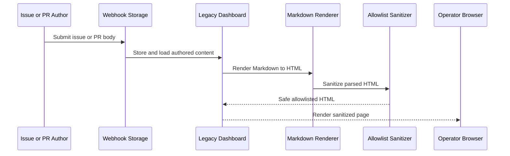
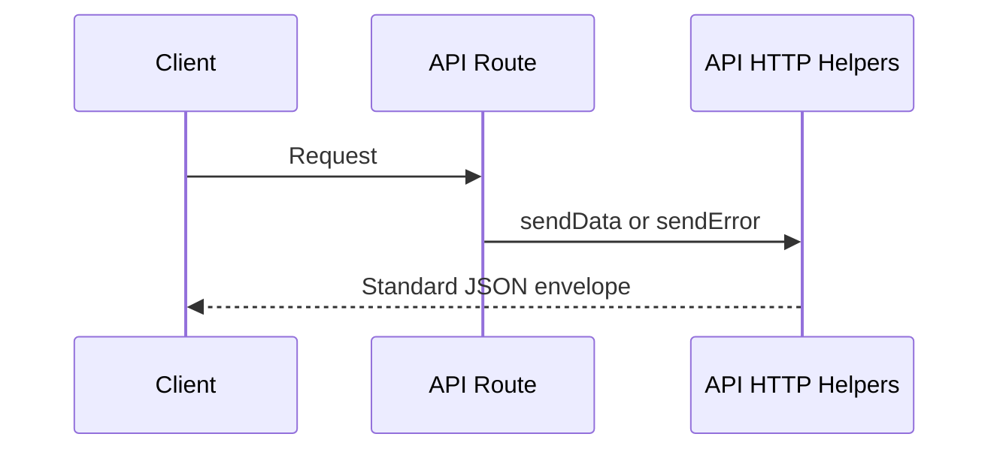
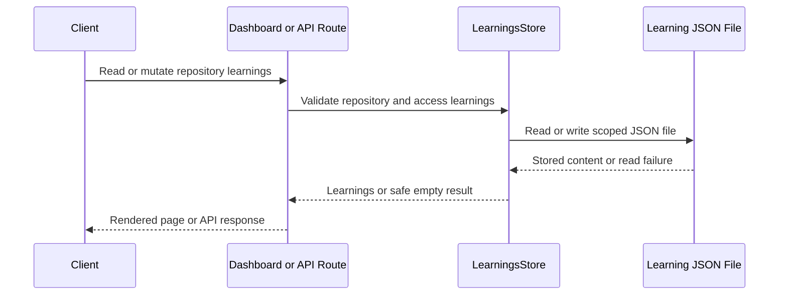
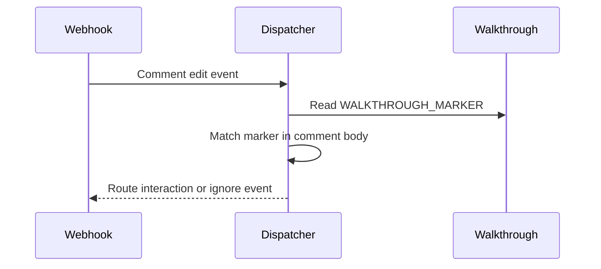

# Walkthroughs

## diffsentry[bot] · walkthrough · 2026-08-22T06:55:45Z

- Source: https://github.com/mk7luke/DiffSentry/pull/146#issuecomment-5378765564
- Location: —

```markdown
<!-- DiffSentry Walkthrough -->
<!-- walkthrough_start -->

<details>
<summary>📝 Walkthrough</summary>

## Walkthrough

Replaced the legacy dashboard’s regex-based Markdown filtering with an explicit sanitize-html allowlist to prevent stored XSS from webhook-authored content. Added dependency support, regression coverage, security documentation, and aligned the SPA sanitizer comments.

## Changes

|Cohort / File(s)|Summary|
|---|---|
|**Dashboard Sanitization Policy** <br> `src/dashboard/markdown.ts`|Reworked server-rendered Markdown sanitization around sanitize-html’s parse-and-rebuild allowlist. The policy retained supported GFM and dashboard-specific markup while dropping unsafe tags, attributes, URL schemes, protocol-relative links, and non-checkbox form controls.|
|**Security Regression Coverage** <br> `tests/unit/markdown.test.ts`|Added coverage for the blacklist bypass classes and other scriptable HTML surfaces, alongside preservation tests for bot-generated walkthrough formatting and failure-path escaping.|
|**Dependency And Documentation** <br> `package.json`, `CHANGELOG.md`, `web/src/lib/markdown.ts`|Added the sanitizer package and its typings, recorded the security remediation in the changelog, and aligned SPA comments with the new server-side allowlist approach.|

## Sequence Diagram(s)



## Estimated code review effort

🎯 3 (Moderate) | ⏱️ ~30 minutes

## Suggested Labels

`bug`, `security`, `dependencies`, `test`, `docs`

## Risk Assessment

**Score: 5/100** — 🟢 Low

| Factor | Weight | Detail |
|---|---|---|
| Moderate change | +5 | 262 lines changed across 5 files |

## Test Coverage Signal

🟢 63 prod / 159 test lines added.

| Source files changed | Test files changed | Source lines + | Test lines + |
|---|---|---|---|
| 2 | 1 | 63 | 159 |

## 🧭 Description Drift

- ℹ️ **The description says the new Markdown test file has 15 cases, but it contains 17 tests.**
  - `tests/unit/markdown.test.ts` defines 8 XSS-vector tests, 7 benign-preservation tests, and 2 edge-case tests (17 total). This is a documentation/count mismatch rather than a functional discrepancy.

<sub>Compares PR description claims to the actual diff. Update the description (or the code) so they tell the same story.</sub>

## 👤 Suggested Reviewers

Ranked by `git blame` weight on the touched lines + CODEOWNERS overlap.

- @mk7luke — `owner` — owns 1 file(s)

## 🔁 Changes since last reviewed

- @mk7luke: 1 file(s) changed since their last review
  - `CHANGELOG.md`

## Possibly related PRs

- [mk7luke/DiffSentry#147](https://github.com/mk7luke/DiffSentry/pull/147) — refactor: remove dead code and consolidate duplicated helpers

</details>

<!-- walkthrough_end -->

<!-- pre_merge_checks_walkthrough_start -->

<details>
<summary>🚥 Pre-merge checks | ✅ 5 | ❌ 0</summary>

<details>
<summary>✅ Passed checks (5 passed)</summary>

| Check name | Status | Explanation |
|---|---|---|
| PR Title | ✅ Passed | Title uses a valid Conventional Commits prefix, followed by the imperative verb "sanitize". It is under 72 characters and has no trailing period. |
| PR Description | ✅ Passed | The description clearly explains what changed (replacing the legacy dashboard Markdown regex blacklist with an explicit sanitize-html allowlist) and why (stored XSS is possible because webhook-authored issue/PR content is rendered in an authenticated operator origin, and the blacklist is bypassable). No related issue or PR link is provided, but none is indicated as applicable in the supplied context. |
| Schema bump | ✅ Passed | src/storage/db.ts is not among the changed files in this PR, so the schema-version check is not applicable. |
| Provider parity | ✅ Passed | src/ai/anthropic.ts is not among the changed files in this PR, so there is no Anthropic request/response contract change requiring corresponding updates to openai.ts or openai-compatible.ts. |
| Pattern test coverage | ✅ Passed | No changes to src/safety-scanner.ts or src/pattern-checks.ts are included in this PR, so no new rule requires an e2e scenario. |

</details>

<sub>✏️ Tip: You can configure your own custom pre-merge checks in your `.diffsentry.yaml`.</sub>

</details>

<!-- pre_merge_checks_walkthrough_end -->

<!-- finishing_touch_checkbox_start -->

<details>
<summary>✨ Finishing Touches</summary>

<details>
<summary>🧪 Generate unit tests (beta)</summary>

- [ ] <!-- {"checkboxId": "b15e025e-2cea-4d61-9362-094354ab9440"} -->   Create PR with unit tests

</details>

<details>
<summary>📝 Generate docstrings (beta)</summary>

- [ ] <!-- {"checkboxId": "5ae85a59-3980-4fb5-a123-a4c9b8858dac"} -->   Push docstring commit to this branch

</details>

<details>
<summary>🧹 Simplify (beta)</summary>

- [ ] <!-- {"checkboxId": "65c4a7fb-88c1-48ad-976b-34166e461027"} -->   Push simplification commit to this branch

</details>

<details>
<summary>🪄 Autofix unresolved comments (beta)</summary>

- [ ] <!-- {"checkboxId": "4229396f-6b8d-4d0f-8578-a5c571b23c52"} -->   Push autofix commit to this branch

</details>

</details>

<!-- finishing_touch_checkbox_end -->

<!-- tips_start -->

---

<sub>Comment `@diffsentry help` to get the list of available commands and usage tips.</sub>

<!-- tips_end -->

<!-- internal_state_start -->
<!-- diffsentry-state-ref:{"v":1,"db":true,"owner":"mk7luke","repo":"DiffSentry","number":146,"updatedAt":"2026-09-14T21:01:00.330Z"}-->
<!-- diffsentry-state:H4sIAAAAAAAAA72TUWvbMBDHv4q4ZzeRZTuODXsoY2thYStN9rIu0LN0jm+xLSMpybzS7z5MV1g7uu1hDAk9HD/974773x0coYwjaNGHazoyncisG4QSsFBY6HyZ1oU0VFEaV1jF9cLkdYpJjGmm46ygHCKouaV1gx7KO3h9ef7+4s3qw8WsM1CCXmRpXsusinNMdF1ABAPqPe5o9sXbHkpQOVZ5beJaJYVSSBDBiaq5d3recjXv0O2NPfWz4KEEqSRVKk21XCiDaCCCCTTom8qiM89wMhmpTCW5XCpcmCl7IB/8/NBz+IklH358SJJlJrOlRMrjPEvgPoLB+kDmLfc7coPjfgJvto/xK7eiI7XvaJzCL1fzOWwaErpF7siIW+6HQ7gJ40CvdEN6X9mv21vhyAfHOrDtBXvR2yCor63TZEQ1itCQ8Nhz4G/khLZ9zbuDwwmfQQT/IcVftteEMMynx8875DbYM9u3o/h4vRKDbVmPosNR+MBtKwZyHQdhMGApuMMdCW8PTpP/tad/pbt98Ky/claT92Sm0T1x7iOx3vMwkFlzxy263074D+Z6prhxfGRsJ8UnC/Gy+7cRHAaDgcx5mPZGqsWZLM7idKPiUsallLMkkZ8gAsd+f8k+WDdCeSOjLIrldLOHs73/DvPhVZr2AwAA-->
<!-- internal_state_end -->
```

---

## diffsentry[bot] · walkthrough · 2026-08-22T08:08:14Z

- Source: https://github.com/mk7luke/DiffSentry/pull/147#issuecomment-5379183772
- Location: —

```markdown
<!-- DiffSentry Walkthrough -->
<!-- walkthrough_start -->

<details>
<summary>📝 Walkthrough</summary>

## Walkthrough

Removed unused code, exports, and dependencies while consolidating shared API, AI-formatting, learnings, and walkthrough helpers. Added a migration to drop the unused saved_views table and exposed existing development utilities through npm scripts.

## Changes

|Cohort / File(s)|Summary|
|---|---|
|**Documentation And Tooling** <br> `CHANGELOG.md`, `README.md`, `docs/MIGRATIONS.md`, `package.json`, `web/package.json`|Documented the cleanup and migration history, removed the retired guidelines architecture entry, and made existing developer utilities discoverable through npm scripts. Dependency cleanup removed unused server packages and replaced the transitive CodeMirror meta-package with the explicit commands package.|
|**API Response Consolidation** <br> `src/api/actions.ts`, `src/api/config.ts`, `src/api/cost.ts`, `src/api/diagnostics.ts`, `src/api/http.ts`, `src/api/notifications.ts`, `src/api/pr-diff.ts`, `src/api/rules.ts`, `src/api/settings.ts`, `src/api/shares.ts`, `src/api/tokens.ts`, `src/api/webhooks.ts`|Introduced a canonical API response helper module with a shared error-code union and consistent success and error envelopes. Route modules now consume this single implementation rather than maintaining drifting local copies.|
|**Learnings Safety And Access** <br> `src/api/learnings.ts`, `src/api/router.ts`, `src/dashboard/routes.ts`, `src/learnings.ts`, `tests/unit/learnings-path-safety.test.ts`|Centralized learnings reads in LearningsStore and hardened repository-derived file paths with reusable segment validation. Reads now safely degrade for invalid paths or malformed non-array JSON, while writes reject traversal-like repository identifiers.|
|**Prompt And Review Cleanup** <br> `src/ai/anthropic.ts`, `src/ai/openai.ts`, `src/ai/parse.ts`, `src/drift.ts`, `src/guidelines.ts`, `src/issues.ts`, `src/review-body.ts`, `src/reviewer.ts`|Removed inactive repository-guidelines and linked-issue prompt wiring that never reached model prompts. Consolidated markdown fence removal and details renderers so review, drift, learning, and nitpick output share common formatting behavior.|
|**Database Migration Cleanup** <br> `scripts/migrate-smoke.ts`, `src/storage/dao.ts`, `src/storage/db.ts`|Added schema migration 8 to remove the unused saved_views table and index. Updated schema assertions and smoke expectations so current databases do not treat the intentionally removed table as missing.|
|**Dead Code Removal** <br> `src/ai/pricing.ts`, `src/codeowners.ts`, `src/config.ts`, `src/dashboard/auth.ts`, `src/dashboard/queries.ts`, `src/graph-context.ts`, `src/repo-config.ts`, `src/static-analysis.ts`, `src/types.ts`, `web/src/lib/format.ts`, `web/src/realtime/useEventStream.tsx`|Removed unused helpers, query functions, configuration fields, interfaces, imports, and SPA exports. The cleanup resolved remaining unused-variable lint warnings without changing active runtime paths.|
|**Walkthrough Marker Sharing** <br> `src/walkthrough.ts`, `src/webhook/dispatch.ts`|Moved the walkthrough HTML marker into an exported shared constant. The webhook dispatcher now uses the same marker as the reviewer, preventing silent behavior drift in checkbox interaction detection.|

## Sequence Diagram(s)







## Estimated code review effort

🎯 4 (Complex) | ⏱️ ~60 minutes

## Suggested Labels

`refactor`, `dependencies`, `security`, `docs`

## Risk Assessment

**Score: 29/100** — 🟡 Moderate

| Factor | Weight | Detail |
|---|---|---|
| High-risk paths touched | +20 | `docs/MIGRATIONS.md`, `src/api/tokens.ts`, `src/dashboard/auth.ts` |
| Large change | +4 | 834 lines changed across 46 files |
| High review effort | +5 | Effort estimate 4/5 |

## Test Coverage Signal

🟢 140 prod / 67 test lines added.

| Source files changed | Test files changed | Source lines + | Test lines + |
|---|---|---|---|
| 40 | 1 | 140 | 67 |

## 🧭 Description Drift

- ℹ️ **Unused AI provider `repoConfig` parameters were cleaned up but are not mentioned in the PR description.**
  - `AnthropicProvider.chat` and `OpenAIProvider.chat` rename `repoConfig` to `_repoConfig`, confirming that this interface parameter is currently ignored by both providers. The description discusses prompt inputs but does not call out this additional dead-parameter cleanup.
- ℹ️ **The PR removes an additional unused graph interface not listed among the dead-code removals.**
  - `RawEdge` is deleted from `src/graph-context.ts`. The description's dead-code inventory does not mention this interface, although it is a minor cleanup consistent with the PR's stated purpose.

<sub>Compares PR description claims to the actual diff. Update the description (or the code) so they tell the same story.</sub>

## ✍️ Commit Message Coach

2 of 15 commit messages could be stronger.

| Commit | Subject | Issues |
|---|---|---|
| `47724d6` | 🟡 refactor(walkthrough): export WALKTHROUGH_MARKER as single source of truth | Subject is 74 characters — keep under 72 to avoid truncation. |
| `ba47196` | 🟡 fix(learnings): keep the read path non-throwing after the traversal guard | Subject is 73 characters — keep under 72 to avoid truncation. |

<sub>Tip: imperative mood (`Add user lookup`), under 72 chars, no trailing period. Conventional Commits like `feat:` / `fix:` are also fine.</sub>

## 👤 Suggested Reviewers

Ranked by `git blame` weight on the touched lines + CODEOWNERS overlap.

- @mk7luke — `owner` — owns 1 file(s)

## 💡 Suggested PR Split

This change spans several distinct cohorts. Splitting it into smaller PRs would make review faster and lower the chance of regressions slipping through. A natural split:

1. **Documentation And Tooling** — `CHANGELOG.md`, `README.md`, `docs/MIGRATIONS.md`, `package.json`, `web/package.json`
2. **API Response Consolidation** — `src/api/actions.ts`, `src/api/config.ts`, `src/api/cost.ts`, `src/api/diagnostics.ts`, `src/api/http.ts`, `src/api/notifications.ts`, `src/api/pr-diff.ts`, `src/api/rules.ts`, `src/api/settings.ts`, `src/api/shares.ts`, `src/api/tokens.ts`, `src/api/webhooks.ts`
3. **Learnings Safety And Access** — `src/api/learnings.ts`, `src/api/router.ts`, `src/dashboard/routes.ts`, `src/learnings.ts`, `tests/unit/learnings-path-safety.test.ts`
4. **Prompt And Review Cleanup** — `src/ai/anthropic.ts`, `src/ai/openai.ts`, `src/ai/parse.ts`, `src/drift.ts`, `src/guidelines.ts`, `src/issues.ts`, `src/review-body.ts`, `src/reviewer.ts`
5. **Database Migration Cleanup** — `scripts/migrate-smoke.ts`, `src/storage/dao.ts`, `src/storage/db.ts`
6. **Dead Code Removal** — `src/ai/pricing.ts`, `src/codeowners.ts`, `src/config.ts`, `src/dashboard/auth.ts`, `src/dashboard/queries.ts`, `src/graph-context.ts`, `src/repo-config.ts`, `src/static-analysis.ts`, `src/types.ts`, `web/src/lib/format.ts`, `web/src/realtime/useEventStream.tsx`
7. **Walkthrough Marker Sharing** — `src/walkthrough.ts`, `src/webhook/dispatch.ts`

<sub>Heuristic suggestion — feel free to ignore if the cohorts truly belong together.</sub>

</details>

<!-- walkthrough_end -->

<!-- pre_merge_checks_walkthrough_start -->

<details>
<summary>🚥 Pre-merge checks | ✅ 5 | ❌ 0</summary>

<details>
<summary>✅ Passed checks (5 passed)</summary>

| Check name | Status | Explanation |
|---|---|---|
| PR Title | ✅ Passed | The title uses the allowed Conventional Commits prefix, has imperative verbs after it ("remove" and "consolidate"), is under 72 characters, and has no trailing period. |
| PR Description | ✅ Passed | The description clearly explains what changed and why, including dead-code removal, helper consolidation, guideline retirement, and the saved_views migration with rationale for each. No related issue or PR link is provided, but the requirement is conditional ('if applicable'), so the description meets the stated requirements. |
| Schema bump | ✅ Passed | src/storage/db.ts adds migration 8 (drop_saved_views) and the PR updates the schema target to version 8; this is a new-version migration rather than an in-place edit to V1. |
| Provider parity | ✅ Passed | `src/ai/anthropic.ts` only changes the unused repo-configuration chat parameter annotation/name; it does not alter request construction, API calls, response parsing, or exposed types. `src/ai/openai.ts` received the corresponding unused-parameter update. No request/response contract change requires an update to `openai-compatible.ts`. |
| Pattern test coverage | ✅ Passed | Neither src/safety-scanner.ts nor src/pattern-checks.ts is changed in the provided PR diff/changed-file list, so no new rule requires an e2e scenario. |

</details>

<sub>✏️ Tip: You can configure your own custom pre-merge checks in your `.diffsentry.yaml`.</sub>

</details>

<!-- pre_merge_checks_walkthrough_end -->

<!-- finishing_touch_checkbox_start -->

<details>
<summary>✨ Finishing Touches</summary>

<details>
<summary>🧪 Generate unit tests (beta)</summary>

- [ ] <!-- {"checkboxId": "057f1983-b567-4399-85b2-a17e716af25c"} -->   Create PR with unit tests

</details>

<details>
<summary>📝 Generate docstrings (beta)</summary>

- [ ] <!-- {"checkboxId": "796096c7-4aec-4605-82bf-c2a9129f2116"} -->   Push docstring commit to this branch

</details>

<details>
<summary>🧹 Simplify (beta)</summary>

- [ ] <!-- {"checkboxId": "04d53094-7e94-4137-8abb-10f1592b3a5a"} -->   Push simplification commit to this branch

</details>

<details>
<summary>🪄 Autofix unresolved comments (beta)</summary>

- [ ] <!-- {"checkboxId": "5e745240-7ec5-48b4-ae4e-d9b7c221ad96"} -->   Push autofix commit to this branch

</details>

</details>

<!-- finishing_touch_checkbox_end -->

<!-- tips_start -->

---

<sub>Comment `@diffsentry help` to get the list of available commands and usage tips.</sub>

<!-- tips_end -->

<!-- internal_state_start -->
<!-- diffsentry-state-ref:{"v":1,"db":true,"owner":"mk7luke","repo":"DiffSentry","number":147,"updatedAt":"2026-09-14T21:20:34.848Z"}-->
<!-- diffsentry-state:H4sIAAAAAAAAA62WTW/bRhCG/4rBs2Tt94duQZsmQdukiHNqmsPs7Ky0tUyy5MquEeS/F4xImbHpoAUK6EQ9mtXsDt9nP1e31ZavqgP05T3dZrqjeLWHaluxhKBSAKE4esMJvcOgNRCSIi6TkwKQkq1WVcoHutpDX20/Vz+8fvH21ctf3r26vInVtgIk6YQOQUQjBYpqVb1/+eLHX1+evibDggxSCC8UKBOrVRUb7De/vnn1/sWHN+/eXp04JnQEDYhJBkVmKNMCXsOOLv/sm7raViJor7hhJIAbHqhaVT12uS395ibvOii07m+aa7osfbWtlInMCUVguAEbh3X7DjeQN1CXfde0GU+gY4ZDkhKC9UFb9QA2LdWQT5T1OtmUtLAEAox8oFro+nFN4YAxxQVD7oOBWam2y5jr3QljIaBk3huVIujkJqzNG8CSm7o/cegjOakCS4EL59OMw6ZOeSwnMamAwiRBnpnovsH6MkLSkMIYGI8QgdQMihl2ddOXjOO6yYSgrPNKKZOc1DN2X0o7FlTcS0wouVcyAJtBB4KuzvVuLOcQWXCcO4zKa5i3UTclp4wwazo4SQk9dw6StSBndNutY07pxAGTkWsTUQqVmJ7/ya45FupOmDeOmE02ogYtRJhjxwONi3LhvSHmJCLZRH5G9VTKQy/gguVKO6OS9mTsHNxDN9VLgpKUTDCJTHKYH0lprmnqVeuYhLFCSR5NcHyG3VHYN831CCoLTpugrLeKuJhAbCI1dzV107I+OI8+WRMBk8Az9jAsggdmUZmYhOSkpmOL0O9DA13cwLHsT6gBQKUNgQsauMYn6F9H6vLUslWkIhorjbGG+fiE/noqI2wCxqAkKWmdZYYmuMupTK14rU0CzV1C46eN3nXQ7tfY1IX+HkmmyKCPQ1Y5HpOYyGOOdMj1+Yi9cDomppi1OnIYsdz3x3MLpD1qH5X03kY7NdxR26zne5iclNLKoIJRJAw/c0O4rkMT78d6LGiHgSLTLjGib7hpQBkqZaS2VlqtU5xGry9QMq6hhsN9n6fpE1oSk1w7F4ADndmmgx1tIjTjuLBog0Ak5p0LzjzmwjgL0nCFKUgXufXnfCn37bQjQRlGNkQm0UR+PoU7OFwPGXrcjaMihXZMWbLMqJTimTsN8SbmvoWCI8wBkgze8pC8EW54Je8obB6lPemgKOqYIBmUio/UUPaQwyY13Q2MExBE0sYZgOSMJ4YztCM4lHxDm2NPL2+pLlelI7i5LP3fXzeAMCblvDApJjUd5KP8IiOV99JKUjaCHF7mQn3pN8c6lwd43ULZr3tIVO4vB2DKKY2MQEFURg3++7Kq2qYvFH/K9Y66tsv1AH78ND3/rfuFbunwM90Pj5/8oz/Khz1d1HR3cX56MSx9cQuHHL9G6UXoCK77i7Kni9jg8YbqQvFid2gCHGY/67Fp6bJaVf9/zU+nO0P/W9cg9T3FoZVvbg4TcXWd25biVb7JB+gG7OH6sHhX+I72lx2/IPSn9l5S9aKXlyT81LjP6vWpS58R53csuajEJf8tyG7ZbEsaW3LWsqCWbPRYPd+Rx/OmeKSFZxywFPiP033hzV5M98Uof5rbz4b0YiIvxe+jrF0M1udT9D9E0HO5+e9C8tFb+qHLtxkOw1v6TV4/d4tYiPZPq+rYRigUX5Qhg5kwa+bXXH0QfCvYVqpLp9zv1arqcn/9Og/bdl9tP0q5Umol/UoMn09f/gFIN2lX2AwAAA==-->
<!-- internal_state_end -->
```

---
