# Walkthroughs

## diffsentry[bot] · walkthrough · 2026-08-22T06:55:45Z

- Source: https://github.com/mk7luke/DiffSentry/pull/146#issuecomment-5378765564
- Location: —

```markdown
<!-- DiffSentry Walkthrough -->
<!-- walkthrough_start -->

<details>
<summary>📝 Walkthrough</summary>

## Walkthrough

Replaced the legacy dashboard’s regex-based Markdown filtering with an explicit sanitize-html allowlist to prevent stored XSS from webhook-authored content. Added dependency support, regression coverage, security documentation, and aligned the SPA sanitizer comments.

## Changes

|Cohort / File(s)|Summary|
|---|---|
|**Dashboard Sanitization Policy** <br> `src/dashboard/markdown.ts`|Reworked server-rendered Markdown sanitization around sanitize-html’s parse-and-rebuild allowlist. The policy retained supported GFM and dashboard-specific markup while dropping unsafe tags, attributes, URL schemes, protocol-relative links, and non-checkbox form controls.|
|**Security Regression Coverage** <br> `tests/unit/markdown.test.ts`|Added coverage for the blacklist bypass classes and other scriptable HTML surfaces, alongside preservation tests for bot-generated walkthrough formatting and failure-path escaping.|
|**Dependency And Documentation** <br> `package.json`, `CHANGELOG.md`, `web/src/lib/markdown.ts`|Added the sanitizer package and its typings, recorded the security remediation in the changelog, and aligned SPA comments with the new server-side allowlist approach.|

## Sequence Diagram(s)

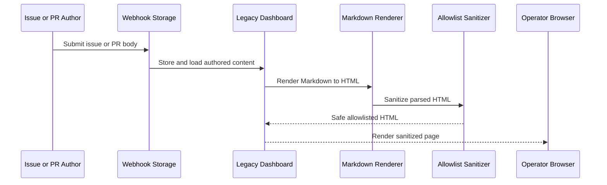

## Estimated code review effort

🎯 3 (Moderate) | ⏱️ ~30 minutes

## Suggested Labels

`bug`, `security`, `dependencies`, `test`, `docs`

## Risk Assessment

**Score: 5/100** — 🟢 Low

| Factor | Weight | Detail |
|---|---|---|
| Moderate change | +5 | 262 lines changed across 5 files |

## Test Coverage Signal

🟢 63 prod / 159 test lines added.

| Source files changed | Test files changed | Source lines + | Test lines + |
|---|---|---|---|
| 2 | 1 | 63 | 159 |

## 🧭 Description Drift

- ℹ️ **The description says the new Markdown test file has 15 cases, but it contains 17 tests.**
  - `tests/unit/markdown.test.ts` defines 8 XSS-vector tests, 7 benign-preservation tests, and 2 edge-case tests (17 total). This is a documentation/count mismatch rather than a functional discrepancy.

<sub>Compares PR description claims to the actual diff. Update the description (or the code) so they tell the same story.</sub>

## 👤 Suggested Reviewers

Ranked by `git blame` weight on the touched lines + CODEOWNERS overlap.

- @mk7luke — `owner` — owns 1 file(s)

## 🔁 Changes since last reviewed

- @mk7luke: 1 file(s) changed since their last review
  - `CHANGELOG.md`

## Possibly related PRs

- [mk7luke/DiffSentry#147](https://github.com/mk7luke/DiffSentry/pull/147) — refactor: remove dead code and consolidate duplicated helpers

</details>

<!-- walkthrough_end -->

<!-- pre_merge_checks_walkthrough_start -->

<details>
<summary>🚥 Pre-merge checks | ✅ 5 | ❌ 0</summary>

<details>
<summary>✅ Passed checks (5 passed)</summary>

| Check name | Status | Explanation |
|---|---|---|
| PR Title | ✅ Passed | Title uses a valid Conventional Commits prefix, followed by the imperative verb "sanitize". It is under 72 characters and has no trailing period. |
| PR Description | ✅ Passed | The description clearly explains what changed (replacing the legacy dashboard Markdown regex blacklist with an explicit sanitize-html allowlist) and why (stored XSS is possible because webhook-authored issue/PR content is rendered in an authenticated operator origin, and the blacklist is bypassable). No related issue or PR link is provided, but none is indicated as applicable in the supplied context. |
| Schema bump | ✅ Passed | src/storage/db.ts is not among the changed files in this PR, so the schema-version check is not applicable. |
| Provider parity | ✅ Passed | src/ai/anthropic.ts is not among the changed files in this PR, so there is no Anthropic request/response contract change requiring corresponding updates to openai.ts or openai-compatible.ts. |
| Pattern test coverage | ✅ Passed | No changes to src/safety-scanner.ts or src/pattern-checks.ts are included in this PR, so no new rule requires an e2e scenario. |

</details>

<sub>✏️ Tip: You can configure your own custom pre-merge checks in your `.diffsentry.yaml`.</sub>

</details>

<!-- pre_merge_checks_walkthrough_end -->

<!-- finishing_touch_checkbox_start -->

<details>
<summary>✨ Finishing Touches</summary>

<details>
<summary>🧪 Generate unit tests (beta)</summary>

- [ ] <!-- {"checkboxId": "b15e025e-2cea-4d61-9362-094354ab9440"} -->   Create PR with unit tests

</details>

<details>
<summary>📝 Generate docstrings (beta)</summary>

- [ ] <!-- {"checkboxId": "5ae85a59-3980-4fb5-a123-a4c9b8858dac"} -->   Push docstring commit to this branch

</details>

<details>
<summary>🧹 Simplify (beta)</summary>

- [ ] <!-- {"checkboxId": "65c4a7fb-88c1-48ad-976b-34166e461027"} -->   Push simplification commit to this branch

</details>

<details>
<summary>🪄 Autofix unresolved comments (beta)</summary>

- [ ] <!-- {"checkboxId": "4229396f-6b8d-4d0f-8578-a5c571b23c52"} -->   Push autofix commit to this branch

</details>

</details>

<!-- finishing_touch_checkbox_end -->

<!-- tips_start -->

---

<sub>Comment `@diffsentry help` to get the list of available commands and usage tips.</sub>

<!-- tips_end -->

<!-- internal_state_start -->
<!-- diffsentry-state-ref:{"v":1,"db":true,"owner":"mk7luke","repo":"DiffSentry","number":146,"updatedAt":"2026-09-14T21:01:00.330Z"}-->
<!-- diffsentry-state:H4sIAAAAAAAAA72TUWvbMBDHv4q4ZzeRZTuODXsoY2thYStN9rIu0LN0jm+xLSMpybzS7z5MV1g7uu1hDAk9HD/974773x0coYwjaNGHazoyncisG4QSsFBY6HyZ1oU0VFEaV1jF9cLkdYpJjGmm46ygHCKouaV1gx7KO3h9ef7+4s3qw8WsM1CCXmRpXsusinNMdF1ABAPqPe5o9sXbHkpQOVZ5beJaJYVSSBDBiaq5d3recjXv0O2NPfWz4KEEqSRVKk21XCiDaCCCCTTom8qiM89wMhmpTCW5XCpcmCl7IB/8/NBz+IklH358SJJlJrOlRMrjPEvgPoLB+kDmLfc7coPjfgJvto/xK7eiI7XvaJzCL1fzOWwaErpF7siIW+6HQ7gJ40CvdEN6X9mv21vhyAfHOrDtBXvR2yCor63TZEQ1itCQ8Nhz4G/khLZ9zbuDwwmfQQT/IcVftteEMMynx8875DbYM9u3o/h4vRKDbVmPosNR+MBtKwZyHQdhMGApuMMdCW8PTpP/tad/pbt98Ky/claT92Sm0T1x7iOx3vMwkFlzxy263074D+Z6prhxfGRsJ8UnC/Gy+7cRHAaDgcx5mPZGqsWZLM7idKPiUsallLMkkZ8gAsd+f8k+WDdCeSOjLIrldLOHs73/DvPhVZr2AwAA-->
<!-- internal_state_end -->
```

---

## diffsentry[bot] · walkthrough · 2026-08-22T08:08:14Z

- Source: https://github.com/mk7luke/DiffSentry/pull/147#issuecomment-5379183772
- Location: —

```markdown
<!-- DiffSentry Walkthrough -->
<!-- walkthrough_start -->

<details>
<summary>📝 Walkthrough</summary>

## Walkthrough

Removed unused code, exports, and dependencies while consolidating shared API, AI-formatting, learnings, and walkthrough helpers. Added a migration to drop the unused saved_views table and exposed existing development utilities through npm scripts.

## Changes

|Cohort / File(s)|Summary|
|---|---|
|**Documentation And Tooling** <br> `CHANGELOG.md`, `README.md`, `docs/MIGRATIONS.md`, `package.json`, `web/package.json`|Documented the cleanup and migration history, removed the retired guidelines architecture entry, and made existing developer utilities discoverable through npm scripts. Dependency cleanup removed unused server packages and replaced the transitive CodeMirror meta-package with the explicit commands package.|
|**API Response Consolidation** <br> `src/api/actions.ts`, `src/api/config.ts`, `src/api/cost.ts`, `src/api/diagnostics.ts`, `src/api/http.ts`, `src/api/notifications.ts`, `src/api/pr-diff.ts`, `src/api/rules.ts`, `src/api/settings.ts`, `src/api/shares.ts`, `src/api/tokens.ts`, `src/api/webhooks.ts`|Introduced a canonical API response helper module with a shared error-code union and consistent success and error envelopes. Route modules now consume this single implementation rather than maintaining drifting local copies.|
|**Learnings Safety And Access** <br> `src/api/learnings.ts`, `src/api/router.ts`, `src/dashboard/routes.ts`, `src/learnings.ts`, `tests/unit/learnings-path-safety.test.ts`|Centralized learnings reads in LearningsStore and hardened repository-derived file paths with reusable segment validation. Reads now safely degrade for invalid paths or malformed non-array JSON, while writes reject traversal-like repository identifiers.|
|**Prompt And Review Cleanup** <br> `src/ai/anthropic.ts`, `src/ai/openai.ts`, `src/ai/parse.ts`, `src/drift.ts`, `src/guidelines.ts`, `src/issues.ts`, `src/review-body.ts`, `src/reviewer.ts`|Removed inactive repository-guidelines and linked-issue prompt wiring that never reached model prompts. Consolidated markdown fence removal and details renderers so review, drift, learning, and nitpick output share common formatting behavior.|
|**Database Migration Cleanup** <br> `scripts/migrate-smoke.ts`, `src/storage/dao.ts`, `src/storage/db.ts`|Added schema migration 8 to remove the unused saved_views table and index. Updated schema assertions and smoke expectations so current databases do not treat the intentionally removed table as missing.|
|**Dead Code Removal** <br> `src/ai/pricing.ts`, `src/codeowners.ts`, `src/config.ts`, `src/dashboard/auth.ts`, `src/dashboard/queries.ts`, `src/graph-context.ts`, `src/repo-config.ts`, `src/static-analysis.ts`, `src/types.ts`, `web/src/lib/format.ts`, `web/src/realtime/useEventStream.tsx`|Removed unused helpers, query functions, configuration fields, interfaces, imports, and SPA exports. The cleanup resolved remaining unused-variable lint warnings without changing active runtime paths.|
|**Walkthrough Marker Sharing** <br> `src/walkthrough.ts`, `src/webhook/dispatch.ts`|Moved the walkthrough HTML marker into an exported shared constant. The webhook dispatcher now uses the same marker as the reviewer, preventing silent behavior drift in checkbox interaction detection.|

## Sequence Diagram(s)

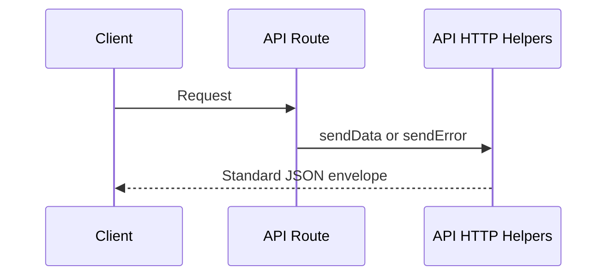

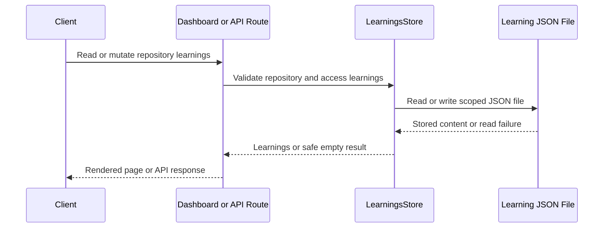

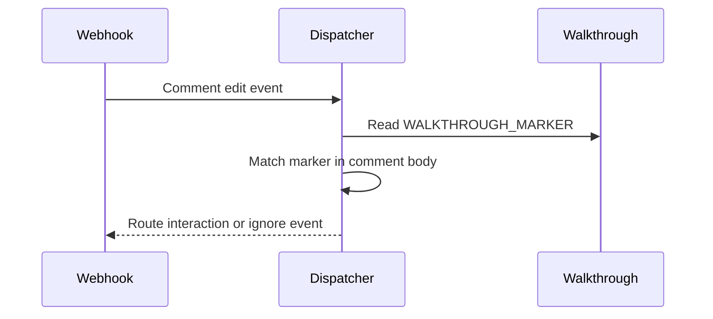

## Estimated code review effort

🎯 4 (Complex) | ⏱️ ~60 minutes

## Suggested Labels

`refactor`, `dependencies`, `security`, `docs`

## Risk Assessment

**Score: 29/100** — 🟡 Moderate

| Factor | Weight | Detail |
|---|---|---|
| High-risk paths touched | +20 | `docs/MIGRATIONS.md`, `src/api/tokens.ts`, `src/dashboard/auth.ts` |
| Large change | +4 | 834 lines changed across 46 files |
| High review effort | +5 | Effort estimate 4/5 |

## Test Coverage Signal

🟢 140 prod / 67 test lines added.

| Source files changed | Test files changed | Source lines + | Test lines + |
|---|---|---|---|
| 40 | 1 | 140 | 67 |

## 🧭 Description Drift

- ℹ️ **Unused AI provider `repoConfig` parameters were cleaned up but are not mentioned in the PR description.**
  - `AnthropicProvider.chat` and `OpenAIProvider.chat` rename `repoConfig` to `_repoConfig`, confirming that this interface parameter is currently ignored by both providers. The description discusses prompt inputs but does not call out this additional dead-parameter cleanup.
- ℹ️ **The PR removes an additional unused graph interface not listed among the dead-code removals.**
  - `RawEdge` is deleted from `src/graph-context.ts`. The description's dead-code inventory does not mention this interface, although it is a minor cleanup consistent with the PR's stated purpose.

<sub>Compares PR description claims to the actual diff. Update the description (or the code) so they tell the same story.</sub>

## ✍️ Commit Message Coach

2 of 15 commit messages could be stronger.

| Commit | Subject | Issues |
|---|---|---|
| `47724d6` | 🟡 refactor(walkthrough): export WALKTHROUGH_MARKER as single source of truth | Subject is 74 characters — keep under 72 to avoid truncation. |
| `ba47196` | 🟡 fix(learnings): keep the read path non-throwing after the traversal guard | Subject is 73 characters — keep under 72 to avoid truncation. |

<sub>Tip: imperative mood (`Add user lookup`), under 72 chars, no trailing period. Conventional Commits like `feat:` / `fix:` are also fine.</sub>

## 👤 Suggested Reviewers

Ranked by `git blame` weight on the touched lines + CODEOWNERS overlap.

- @mk7luke — `owner` — owns 1 file(s)

## 💡 Suggested PR Split

This change spans several distinct cohorts. Splitting it into smaller PRs would make review faster and lower the chance of regressions slipping through. A natural split:

1. **Documentation And Tooling** — `CHANGELOG.md`, `README.md`, `docs/MIGRATIONS.md`, `package.json`, `web/package.json`
2. **API Response Consolidation** — `src/api/actions.ts`, `src/api/config.ts`, `src/api/cost.ts`, `src/api/diagnostics.ts`, `src/api/http.ts`, `src/api/notifications.ts`, `src/api/pr-diff.ts`, `src/api/rules.ts`, `src/api/settings.ts`, `src/api/shares.ts`, `src/api/tokens.ts`, `src/api/webhooks.ts`
3. **Learnings Safety And Access** — `src/api/learnings.ts`, `src/api/router.ts`, `src/dashboard/routes.ts`, `src/learnings.ts`, `tests/unit/learnings-path-safety.test.ts`
4. **Prompt And Review Cleanup** — `src/ai/anthropic.ts`, `src/ai/openai.ts`, `src/ai/parse.ts`, `src/drift.ts`, `src/guidelines.ts`, `src/issues.ts`, `src/review-body.ts`, `src/reviewer.ts`
5. **Database Migration Cleanup** — `scripts/migrate-smoke.ts`, `src/storage/dao.ts`, `src/storage/db.ts`
6. **Dead Code Removal** — `src/ai/pricing.ts`, `src/codeowners.ts`, `src/config.ts`, `src/dashboard/auth.ts`, `src/dashboard/queries.ts`, `src/graph-context.ts`, `src/repo-config.ts`, `src/static-analysis.ts`, `src/types.ts`, `web/src/lib/format.ts`, `web/src/realtime/useEventStream.tsx`
7. **Walkthrough Marker Sharing** — `src/walkthrough.ts`, `src/webhook/dispatch.ts`

<sub>Heuristic suggestion — feel free to ignore if the cohorts truly belong together.</sub>

</details>

<!-- walkthrough_end -->

<!-- pre_merge_checks_walkthrough_start -->

<details>
<summary>🚥 Pre-merge checks | ✅ 5 | ❌ 0</summary>

<details>
<summary>✅ Passed checks (5 passed)</summary>

| Check name | Status | Explanation |
|---|---|---|
| PR Title | ✅ Passed | The title uses the allowed Conventional Commits prefix, has imperative verbs after it ("remove" and "consolidate"), is under 72 characters, and has no trailing period. |
| PR Description | ✅ Passed | The description clearly explains what changed and why, including dead-code removal, helper consolidation, guideline retirement, and the saved_views migration with rationale for each. No related issue or PR link is provided, but the requirement is conditional ('if applicable'), so the description meets the stated requirements. |
| Schema bump | ✅ Passed | src/storage/db.ts adds migration 8 (drop_saved_views) and the PR updates the schema target to version 8; this is a new-version migration rather than an in-place edit to V1. |
| Provider parity | ✅ Passed | `src/ai/anthropic.ts` only changes the unused repo-configuration chat parameter annotation/name; it does not alter request construction, API calls, response parsing, or exposed types. `src/ai/openai.ts` received the corresponding unused-parameter update. No request/response contract change requires an update to `openai-compatible.ts`. |
| Pattern test coverage | ✅ Passed | Neither src/safety-scanner.ts nor src/pattern-checks.ts is changed in the provided PR diff/changed-file list, so no new rule requires an e2e scenario. |

</details>

<sub>✏️ Tip: You can configure your own custom pre-merge checks in your `.diffsentry.yaml`.</sub>

</details>

<!-- pre_merge_checks_walkthrough_end -->

<!-- finishing_touch_checkbox_start -->

<details>
<summary>✨ Finishing Touches</summary>

<details>
<summary>🧪 Generate unit tests (beta)</summary>

- [ ] <!-- {"checkboxId": "057f1983-b567-4399-85b2-a17e716af25c"} -->   Create PR with unit tests

</details>

<details>
<summary>📝 Generate docstrings (beta)</summary>

- [ ] <!-- {"checkboxId": "796096c7-4aec-4605-82bf-c2a9129f2116"} -->   Push docstring commit to this branch

</details>

<details>
<summary>🧹 Simplify (beta)</summary>

- [ ] <!-- {"checkboxId": "04d53094-7e94-4137-8abb-10f1592b3a5a"} -->   Push simplification commit to this branch

</details>

<details>
<summary>🪄 Autofix unresolved comments (beta)</summary>

- [ ] <!-- {"checkboxId": "5e745240-7ec5-48b4-ae4e-d9b7c221ad96"} -->   Push autofix commit to this branch

</details>

</details>

<!-- finishing_touch_checkbox_end -->

<!-- tips_start -->

---

<sub>Comment `@diffsentry help` to get the list of available commands and usage tips.</sub>

<!-- tips_end -->

<!-- internal_state_start -->
<!-- diffsentry-state-ref:{"v":1,"db":true,"owner":"mk7luke","repo":"DiffSentry","number":147,"updatedAt":"2026-09-14T21:20:34.848Z"}-->
<!-- diffsentry-state:H4sIAAAAAAAAA62WTW/bRhCG/4rBs2Tt94duQZsmQdukiHNqmsPs7Ky0tUyy5MquEeS/F4xImbHpoAUK6EQ9mtXsDt9nP1e31ZavqgP05T3dZrqjeLWHaluxhKBSAKE4esMJvcOgNRCSIi6TkwKQkq1WVcoHutpDX20/Vz+8fvH21ctf3r26vInVtgIk6YQOQUQjBYpqVb1/+eLHX1+evibDggxSCC8UKBOrVRUb7De/vnn1/sWHN+/eXp04JnQEDYhJBkVmKNMCXsOOLv/sm7raViJor7hhJIAbHqhaVT12uS395ibvOii07m+aa7osfbWtlInMCUVguAEbh3X7DjeQN1CXfde0GU+gY4ZDkhKC9UFb9QA2LdWQT5T1OtmUtLAEAox8oFro+nFN4YAxxQVD7oOBWam2y5jr3QljIaBk3huVIujkJqzNG8CSm7o/cegjOakCS4EL59OMw6ZOeSwnMamAwiRBnpnovsH6MkLSkMIYGI8QgdQMihl2ddOXjOO6yYSgrPNKKZOc1DN2X0o7FlTcS0wouVcyAJtBB4KuzvVuLOcQWXCcO4zKa5i3UTclp4wwazo4SQk9dw6StSBndNutY07pxAGTkWsTUQqVmJ7/ya45FupOmDeOmE02ogYtRJhjxwONi3LhvSHmJCLZRH5G9VTKQy/gguVKO6OS9mTsHNxDN9VLgpKUTDCJTHKYH0lprmnqVeuYhLFCSR5NcHyG3VHYN831CCoLTpugrLeKuJhAbCI1dzV107I+OI8+WRMBk8Az9jAsggdmUZmYhOSkpmOL0O9DA13cwLHsT6gBQKUNgQsauMYn6F9H6vLUslWkIhorjbGG+fiE/noqI2wCxqAkKWmdZYYmuMupTK14rU0CzV1C46eN3nXQ7tfY1IX+HkmmyKCPQ1Y5HpOYyGOOdMj1+Yi9cDomppi1OnIYsdz3x3MLpD1qH5X03kY7NdxR26zne5iclNLKoIJRJAw/c0O4rkMT78d6LGiHgSLTLjGib7hpQBkqZaS2VlqtU5xGry9QMq6hhsN9n6fpE1oSk1w7F4ADndmmgx1tIjTjuLBog0Ak5p0LzjzmwjgL0nCFKUgXufXnfCn37bQjQRlGNkQm0UR+PoU7OFwPGXrcjaMihXZMWbLMqJTimTsN8SbmvoWCI8wBkgze8pC8EW54Je8obB6lPemgKOqYIBmUio/UUPaQwyY13Q2MExBE0sYZgOSMJ4YztCM4lHxDm2NPL2+pLlelI7i5LP3fXzeAMCblvDApJjUd5KP8IiOV99JKUjaCHF7mQn3pN8c6lwd43ULZr3tIVO4vB2DKKY2MQEFURg3++7Kq2qYvFH/K9Y66tsv1AH78ND3/rfuFbunwM90Pj5/8oz/Khz1d1HR3cX56MSx9cQuHHL9G6UXoCK77i7Kni9jg8YbqQvFid2gCHGY/67Fp6bJaVf9/zU+nO0P/W9cg9T3FoZVvbg4TcXWd25biVb7JB+gG7OH6sHhX+I72lx2/IPSn9l5S9aKXlyT81LjP6vWpS58R53csuajEJf8tyG7ZbEsaW3LWsqCWbPRYPd+Rx/OmeKSFZxywFPiP033hzV5M98Uof5rbz4b0YiIvxe+jrF0M1udT9D9E0HO5+e9C8tFb+qHLtxkOw1v6TV4/d4tYiPZPq+rYRigUX5Qhg5kwa+bXXH0QfCvYVqpLp9zv1arqcn/9Og/bdl9tP0q5Umol/UoMn09f/gFIN2lX2AwAAA==-->
<!-- internal_state_end -->
```

---

## diffsentry[bot] · walkthrough · 2026-09-14T21:39:08Z

- Source: https://github.com/mk7luke/DiffSentry/pull/165#issuecomment-5671170406
- Location: —

```markdown
<!-- DiffSentry Walkthrough -->
<!-- walkthrough_start -->

<details>
<summary>📝 Walkthrough</summary>

## Walkthrough

Updated the labeler workflow to queue concurrent runs instead of cancelling active ones. This prevented cancelled label checks from persisting in PR status rollups and blocking Dependabot auto-merge.

## Changes

|Cohort / File(s)|Summary|
|---|---|
|**Labeler Concurrency Control** <br> `.github/workflows/labeler.yml`|Adjusted labeler workflow concurrency so new synchronize events queue behind active labeling runs rather than cancelling them. The added comments document why preserving completed checks avoids stale CANCELLED rollup nodes that block strict auto-merge validation.|

## Sequence Diagram(s)

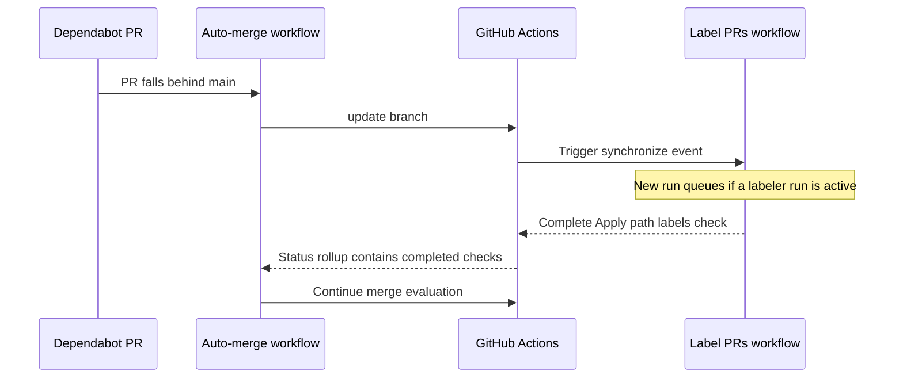

## Estimated code review effort

🎯 2 (Simple) | ⏱️ ~10 minutes

## Suggested Labels

`bug`, `dependencies`

## Risk Assessment

**Score: 0/100** — 🟢 Low

No elevated risk signals detected.

## Linked Issues

- [#160](https://github.com/mk7luke/DiffSentry/pull/160) — build(deps): bump the server-minor-patch group across 1 directory with 9 updates 🟢
- [#163](https://github.com/mk7luke/DiffSentry/pull/163) — fix(ci): accept Dependabot's GraphQL login in the auto-merge author guard 🔴
- [#164](https://github.com/mk7luke/DiffSentry/pull/164) — fix(ci): wake auto-merge on every workflow that can finish after CI 🔴

</details>

<!-- walkthrough_end -->

<!-- pre_merge_checks_walkthrough_start -->

<details>
<summary>🚥 Pre-merge checks | ✅ 5 | ❌ 0</summary>

<details>
<summary>✅ Passed checks (5 passed)</summary>

| Check name | Status | Explanation |
|---|---|---|
| PR Title | ✅ Passed | Uses Conventional Commits prefix `fix(ci):`; the text after it starts with imperative verb “stop”, is under 72 characters, and has no trailing period. |
| PR Description | ✅ Passed | The description meets the requirements. It clearly explains what changed (labeler runs now queue instead of cancelling in-progress runs) and why (cancelled labeler checks remain in the PR status rollup and block Dependabot auto-merge). It also links related PRs/issues via #163, #164, and #160. |
| Schema bump | ✅ Passed | src/storage/db.ts is not changed in this PR; it only updates .github/workflows/labeler.yml. |
| Provider parity | ✅ Passed | `src/ai/anthropic.ts` is not changed in this PR; the only shown change is `.github/workflows/labeler.yml`. No corresponding OpenAI provider updates are required. |
| Pattern test coverage | ✅ Passed | No changes to src/safety-scanner.ts or src/pattern-checks.ts are included in this PR; it only changes .github/workflows/labeler.yml, so no new e2e scenario is required. |

</details>

<sub>✏️ Tip: You can configure your own custom pre-merge checks in your `.diffsentry.yaml`.</sub>

</details>

<!-- pre_merge_checks_walkthrough_end -->

<!-- finishing_touch_checkbox_start -->

<details>
<summary>✨ Finishing Touches</summary>

<details>
<summary>🧪 Generate unit tests (beta)</summary>

- [ ] <!-- {"checkboxId": "ddce10db-13ec-49f6-9191-bf74dc5cca5d"} -->   Create PR with unit tests

</details>

<details>
<summary>📝 Generate docstrings (beta)</summary>

- [ ] <!-- {"checkboxId": "eaaef667-3f3a-462f-9f81-b647deae98a9"} -->   Push docstring commit to this branch

</details>

<details>
<summary>🧹 Simplify (beta)</summary>

- [ ] <!-- {"checkboxId": "c2b0db77-37dd-4387-bbf5-1125904a6dbc"} -->   Push simplification commit to this branch

</details>

<details>
<summary>🪄 Autofix unresolved comments (beta)</summary>

- [ ] <!-- {"checkboxId": "d7949b69-c088-49e5-bcdf-3dfa8e871943"} -->   Push autofix commit to this branch

</details>

</details>

<!-- finishing_touch_checkbox_end -->

<!-- tips_start -->

---

<sub>Comment `@diffsentry help` to get the list of available commands and usage tips.</sub>

<!-- tips_end -->

<!-- internal_state_start -->
<!-- diffsentry-state-ref:{"v":1,"db":true,"owner":"mk7luke","repo":"DiffSentry","number":165,"updatedAt":"2026-09-14T21:39:07.867Z"}-->
<!-- diffsentry-state:H4sIAAAAAAAAA4WNvW7CMBRG3+XOIdhxwD9bl6pSO6CGqYjBjq+JFUMi2ySKEO9eVQWpW9dz9H3nBhMoWkDQKX/i5HFG23QaFMgapdOuFZTWuiVOcMuYa03F6tYa4yilGy4EgwKcD9h0OoG6QXnyubua9TzE3oVhTuugDQaM5XIOoIBxQg3dVEYKjtpKuBcwDimjffWXE8Yx+ktOoA7HJ9/FD5wwvOPywD+5tItDiymhBXX4J/qcNL0fR7SNP/ug45+vh9hHP3kdfsV1tDqjfcmgoCLVdkXkitb7iiomFeGl2PIvKCD61L/5lIe4gDqQ4/0bgMPMp1EBAAA=-->
<!-- internal_state_end -->
```

---

## diffsentry[bot] · walkthrough · 2026-09-14T21:34:28Z

- Source: https://github.com/mk7luke/DiffSentry/pull/164#issuecomment-5671121598
- Location: —

```markdown
<!-- DiffSentry Walkthrough -->
<!-- walkthrough_start -->

<details>
<summary>📝 Walkthrough</summary>

## Walkthrough

Expanded Dependabot auto-merge wake-up triggers to cover every independent PR workflow that can complete after CI. It also allowed pull_request_target labeler runs and cancelled triggering runs to invoke the existing rollup-based merge decision.

## Changes

|Cohort / File(s)|Summary|
|---|---|
|**Auto-Merge Wake Triggers** <br> `.github/workflows/dependabot-auto-merge.yml`|Updated the auto-merge workflow to run after all independent workflows contributing to a Dependabot PR's check rollup. The merge job now relies on the existing rollup validation instead of the triggering workflow's conclusion, preventing missed retries when CI finishes before other checks or when Label PRs is cancelled.|

## Sequence Diagram(s)

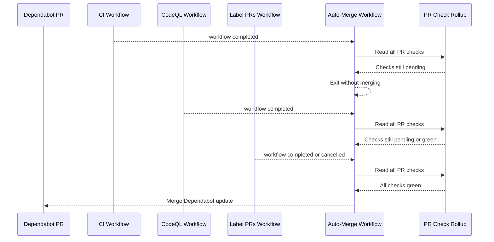

## Estimated code review effort

🎯 2 (Simple) | ⏱️ ~15 minutes

## Suggested Labels

`bug`, `ci`

## Risk Assessment

**Score: 0/100** — 🟢 Low

No elevated risk signals detected.

## Linked Issues

- [#143](https://github.com/mk7luke/DiffSentry/pull/143) — ci: merge Dependabot's minor/patch groups once CI is green 🔴
- [#160](https://github.com/mk7luke/DiffSentry/pull/160) — build(deps): bump the server-minor-patch group across 1 directory with 9 updates 🟢
- [#161](https://github.com/mk7luke/DiffSentry/pull/161) — build(deps): bump the spa-minor-patch group across 1 directory with 16 updates 🟢
- [#163](https://github.com/mk7luke/DiffSentry/pull/163) — fix(ci): accept Dependabot's GraphQL login in the auto-merge author guard 🔴

</details>

<!-- walkthrough_end -->

<!-- pre_merge_checks_walkthrough_start -->

<details>
<summary>🚥 Pre-merge checks | ✅ 5 | ❌ 0</summary>

<details>
<summary>✅ Passed checks (5 passed)</summary>

| Check name | Status | Explanation |
|---|---|---|
| PR Title | ✅ Passed | Uses the Conventional Commits prefix "fix(ci):" and the remaining title begins with the imperative verb "wake". It is under 72 characters and has no trailing period. |
| PR Description | ✅ Passed | The description meets the requirements. It clearly explains what changed (the auto-merge workflow now wakes on CI, CodeQL, Dependency audit, and Label PRs, and accepts both pull_request and pull_request_target workflow runs) and why (to avoid races where CI finishes before independent checks, leaving no later trigger to retry merging). It also links related PRs/issues via #163, #160, #161, and #143. |
| Schema bump | ✅ Passed | src/storage/db.ts is not changed in this PR; it only modifies .github/workflows/dependabot-auto-merge.yml. |
| Provider parity | ✅ Passed | This PR only modifies `.github/workflows/dependabot-auto-merge.yml`; it does not change `src/ai/anthropic.ts`, so no corresponding request/response contract updates are required in `openai.ts` or `openai-compatible.ts`. |
| Pattern test coverage | ✅ Passed | Neither src/safety-scanner.ts nor src/pattern-checks.ts is changed in this PR; it only modifies .github/workflows/dependabot-auto-merge.yml, so no new scanner/pattern rule requires an E2E scenario. |

</details>

<sub>✏️ Tip: You can configure your own custom pre-merge checks in your `.diffsentry.yaml`.</sub>

</details>

<!-- pre_merge_checks_walkthrough_end -->

<!-- finishing_touch_checkbox_start -->

<details>
<summary>✨ Finishing Touches</summary>

<details>
<summary>🧪 Generate unit tests (beta)</summary>

- [ ] <!-- {"checkboxId": "df63157f-a50e-4ee9-a1cc-ced4e149500c"} -->   Create PR with unit tests

</details>

<details>
<summary>📝 Generate docstrings (beta)</summary>

- [ ] <!-- {"checkboxId": "819d5b8f-3720-427c-9232-9e8f263c9ec3"} -->   Push docstring commit to this branch

</details>

<details>
<summary>🧹 Simplify (beta)</summary>

- [ ] <!-- {"checkboxId": "a8cb42e4-66e9-409b-a0be-20421bc8fc66"} -->   Push simplification commit to this branch

</details>

<details>
<summary>🪄 Autofix unresolved comments (beta)</summary>

- [ ] <!-- {"checkboxId": "02be67ab-70f8-4395-932e-777d78591a15"} -->   Push autofix commit to this branch

</details>

</details>

<!-- finishing_touch_checkbox_end -->

<!-- tips_start -->

---

<sub>Comment `@diffsentry help` to get the list of available commands and usage tips.</sub>

<!-- tips_end -->

<!-- internal_state_start -->
<!-- diffsentry-state-ref:{"v":1,"db":true,"owner":"mk7luke","repo":"DiffSentry","number":164,"updatedAt":"2026-09-14T21:34:28.105Z"}-->
<!-- diffsentry-state:H4sIAAAAAAAAA5WOvW6DMBRG3+XOQDD/8dalqtQOUcnUKIPNvYCFwcg2IBTl3auqidS16znS+b4brMBZAFo4/0mroo2w7gVwYLHESrKCyrRheZ5kKCqUmJVNRUUhWomsaFmeQQCt0lT3wgG/QdQp3y/ysBk7tNps7oA004RCGh+KxZtwJNtRtI8aOMgyPjJsEtGmrJCyhHsAs3Ge8FVNHdnZqsk74Jfrk5/sB62k32l/4J9xd7KmIecIgV/+deEZqAc1z4S1GpUW9k/5Ic5WrUroX7HMKDzhiwcOSZwUYXwMWXZOGE8znlQRi/MvCMAqN7wp543dgV/i6/0b14Zdk20BAAA=-->
<!-- internal_state_end -->
```

---

## diffsentry[bot] · walkthrough · 2026-09-14T21:03:11Z

- Source: https://github.com/mk7luke/DiffSentry/pull/163#issuecomment-5670772902
- Location: —

```markdown
<!-- DiffSentry Walkthrough -->
<!-- walkthrough_start -->

<details>
<summary>📝 Walkthrough</summary>

## Walkthrough

Fixed the Dependabot auto-merge author guard to recognize the login formats returned by both GraphQL and REST. This allowed eligible Dependabot pull requests to proceed instead of silently exiting successfully.

## Changes

|Cohort / File(s)|Summary|
|---|---|
|**Dependabot Author Guard** <br> `.github/workflows/dependabot-auto-merge.yml`|Updated the workflow's author validation to support the different bot-login renderings returned by GitHub APIs and the gh CLI. Added inline documentation explaining why the prior GraphQL-versus-REST comparison never matched.|

## Sequence Diagram(s)

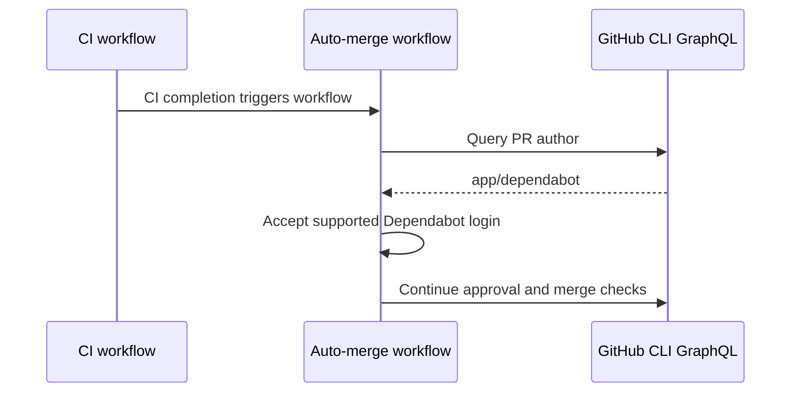

## Estimated code review effort

🎯 2 (Simple) | ⏱️ ~10 minutes

## Suggested Labels

`bug`, `dependencies`

## Risk Assessment

**Score: 0/100** — 🟢 Low

No elevated risk signals detected.

## ✍️ Commit Message Coach

1 of 1 commit message could be stronger.

| Commit | Subject | Issues |
|---|---|---|
| `74bc328` | 🟡 fix(ci): accept Dependabot's GraphQL login in the auto-merge author guard | Subject is 73 characters — keep under 72 to avoid truncation. |

<sub>Tip: imperative mood (`Add user lookup`), under 72 chars, no trailing period. Conventional Commits like `feat:` / `fix:` are also fine.</sub>

## Linked Issues

- [#143](https://github.com/mk7luke/DiffSentry/pull/143) — ci: merge Dependabot's minor/patch groups once CI is green 🔴
- [#160](https://github.com/mk7luke/DiffSentry/pull/160) — build(deps): bump the server-minor-patch group across 1 directory with 9 updates 🟢
- [#161](https://github.com/mk7luke/DiffSentry/pull/161) — build(deps): bump the spa-minor-patch group across 1 directory with 16 updates 🟢

</details>

<!-- walkthrough_end -->

<!-- pre_merge_checks_walkthrough_start -->

<details>
<summary>🚥 Pre-merge checks | ✅ 4 | ❌ 1</summary>

### ❌ Failed checks (1 warning)

| Check name | Status | Explanation | Resolution |
|---|---|---|---|
| PR Title | ⚠️ Warning | Title uses the imperative verb "accept" and has no trailing period, but it is 73 characters long, exceeding the under-72-character limit. | Address before merging or downgrade to non-blocking. |

<details>
<summary>✅ Passed checks (4 passed)</summary>

| Check name | Status | Explanation |
|---|---|---|
| PR Description | ✅ Passed | The description meets the requirements. It clearly explains what changed (the author guard now accepts `app/dependabot`, `dependabot[bot]`, and `dependabot`) and why (the GraphQL-derived author login did not match the REST-only bracketed spelling, causing auto-merge to exit without merging). It also links the related PRs/issues by referencing #143, #160, and #161. |
| Schema bump | ✅ Passed | src/storage/db.ts is not changed in this PR; it only updates the Dependabot auto-merge workflow guard. |
| Provider parity | ✅ Passed | This PR only changes `.github/workflows/dependabot-auto-merge.yml`; it does not modify `src/ai/anthropic.ts`, so no corresponding updates to `openai.ts` or `openai-compatible.ts` are required. |
| Pattern test coverage | ✅ Passed | No changes to src/safety-scanner.ts or src/pattern-checks.ts are included in this PR; it only modifies .github/workflows/dependabot-auto-merge.yml. No new scanner/pattern rule requires an E2E scenario. |

</details>

<sub>✏️ Tip: You can configure your own custom pre-merge checks in your `.diffsentry.yaml`.</sub>

</details>

<!-- pre_merge_checks_walkthrough_end -->

<!-- finishing_touch_checkbox_start -->

<details>
<summary>✨ Finishing Touches</summary>

<details>
<summary>🧪 Generate unit tests (beta)</summary>

- [ ] <!-- {"checkboxId": "fabad762-d00c-42bd-a004-7b18545e0000"} -->   Create PR with unit tests

</details>

<details>
<summary>📝 Generate docstrings (beta)</summary>

- [ ] <!-- {"checkboxId": "0c5f09a7-7b2b-4de5-94c4-f3abad485064"} -->   Push docstring commit to this branch

</details>

<details>
<summary>🧹 Simplify (beta)</summary>

- [ ] <!-- {"checkboxId": "01f198c7-e07b-4c62-b7bc-6753563da5e1"} -->   Push simplification commit to this branch

</details>

<details>
<summary>🪄 Autofix unresolved comments (beta)</summary>

- [ ] <!-- {"checkboxId": "fbaf1424-50d8-46aa-91f9-25c06ddeb2f1"} -->   Push autofix commit to this branch

</details>

</details>

<!-- finishing_touch_checkbox_end -->

<!-- tips_start -->

---

<sub>Comment `@diffsentry help` to get the list of available commands and usage tips.</sub>

<!-- tips_end -->

<!-- internal_state_start -->
<!-- diffsentry-state-ref:{"v":1,"db":true,"owner":"mk7luke","repo":"DiffSentry","number":163,"updatedAt":"2026-09-14T21:03:10.652Z"}-->
<!-- diffsentry-state:H4sIAAAAAAAAA5WOsW6DMBRF/+XNQIwhFLxlqSq1Q1QyNcrw4D0SC4OR7YBQlH+vqiZS167nSOfeG8yg0ggM+vDJs+aFqb4gKHjJmzaTpWzzasuiqphLbhkxa7o2Iywlym2HeQMRdNpwfUEP6gbJWYfLtdks1vWdsYvfEE88EjY2xHgNNh7YnTlZBwMKREFdS7JESSwLyuEewWR9YHrV45nd5PQYPKjj6cn37oNnNu+8PvDPuN8727L3TKCO/7rwDNS9niamWg/aoPtTfoiD07NG8yuuE2Fg2gVQIIUsYlHFaX6QqRKZSkVSbOUXROC079+0D9atoI7idP8GTEVTi20BAAA=-->
<!-- internal_state_end -->
```

---

## diffsentry[bot] · walkthrough · 2026-08-31T15:38:32Z

- Source: https://github.com/mk7luke/DiffSentry/pull/156#issuecomment-5480684750
- Location: —

```markdown
<!-- DiffSentry Walkthrough -->
<!-- walkthrough_start -->

<details>
<summary>📝 Walkthrough</summary>

## Walkthrough

Updated the pinned TruffleHog GitHub Action from v3.97.0 to v3.97.4. The secret-scanning workflow now uses the corresponding immutable commit SHA while preserving verified-results-only scanning.

## Changes

|Cohort / File(s)|Summary|
|---|---|
|**Secret Scan Dependency** <br> `.github/workflows/secret-scan.yml`|Bumped the TruffleHog action used by the repository secret-scanning workflow from v3.97.0 to v3.97.4. The action remained SHA-pinned for supply-chain integrity, and its existing verified-secret filtering configuration was unchanged.|

## Estimated code review effort

🎯 1 (Trivial) | ⏱️ ~5 minutes

## Suggested Labels

`dependencies`, `security`

## Risk Assessment

**Score: 7/100** — 🟢 Low

| Factor | Weight | Detail |
|---|---|---|
| High-risk paths touched | +7 | `.github/workflows/secret-scan.yml` |

## 🏷️ PR Title Coach

🟡 **build(deps): bump trufflesecurity/trufflehog from 3.97.0 to 3.97.4 in the actions group across 1 directory**

- Title is 106 characters — keep under 80 for readability in lists and notification subjects.

<sub>Tip: imperative verb + concrete object, under 80 chars, no trailing period. `feat:` / `fix:` prefixes are also fine.</sub>

## 👤 Suggested Reviewers

Ranked by `git blame` weight on the touched lines + CODEOWNERS overlap.

- @mk7luke — `owner` — owns 1 file(s)

</details>

<!-- walkthrough_end -->

<!-- pre_merge_checks_walkthrough_start -->

<details>
<summary>🚥 Pre-merge checks | ✅ 3 | ❌ 2</summary>

### ❌ Failed checks (2 warnings)

| Check name | Status | Explanation | Resolution |
|---|---|---|---|
| PR Title | ⚠️ Warning | The title uses the imperative verb "bump" after the Conventional Commits prefix and has no trailing period, but it exceeds the 72-character limit. | Address before merging or downgrade to non-blocking. |
| PR Description | ⚠️ Warning | The description clearly states what changed: `trufflesecurity/trufflehog` is bumped from 3.97.0 to 3.97.4, and it includes upstream release/commit links. However, it does not include a sentence explaining why this repository should take the update (for example, to obtain security fixes, detector improvements, or compatibility/reliability fixes). | Address before merging or downgrade to non-blocking. |

<details>
<summary>✅ Passed checks (3 passed)</summary>

| Check name | Status | Explanation |
|---|---|---|
| Schema bump | ✅ Passed | src/storage/db.ts is not changed in the provided PR diff. This PR only updates the pinned trufflesecurity/trufflehog GitHub Action in .github/workflows/secret-scan.yml. |
| Provider parity | ✅ Passed | src/ai/anthropic.ts was not changed in this PR. The only change updates the pinned TruffleHog GitHub Action in .github/workflows/secret-scan.yml, so no corresponding updates to openai.ts or openai-compatible.ts are required. |
| Pattern test coverage | ✅ Passed | No changes to src/safety-scanner.ts or src/pattern-checks.ts are included in this PR. It only updates the pinned TruffleHog GitHub Action in .github/workflows/secret-scan.yml, so no new e2e scenario is required. |

</details>

<sub>✏️ Tip: You can configure your own custom pre-merge checks in your `.diffsentry.yaml`.</sub>

</details>

<!-- pre_merge_checks_walkthrough_end -->

<!-- finishing_touch_checkbox_start -->

<details>
<summary>✨ Finishing Touches</summary>

<details>
<summary>🧪 Generate unit tests (beta)</summary>

- [ ] <!-- {"checkboxId": "fd99ebf2-8df1-4958-a969-c41a42aad718"} -->   Create PR with unit tests

</details>

<details>
<summary>📝 Generate docstrings (beta)</summary>

- [ ] <!-- {"checkboxId": "2a257634-3be8-411b-a25d-54154b83b203"} -->   Push docstring commit to this branch

</details>

<details>
<summary>🧹 Simplify (beta)</summary>

- [ ] <!-- {"checkboxId": "1d376455-f487-4312-b2a7-018b24790dd1"} -->   Push simplification commit to this branch

</details>

<details>
<summary>🪄 Autofix unresolved comments (beta)</summary>

- [ ] <!-- {"checkboxId": "434e8df5-7de5-42a5-93b9-aabca342b7f6"} -->   Push autofix commit to this branch

</details>

</details>

<!-- finishing_touch_checkbox_end -->

<!-- tips_start -->

---

<sub>Comment `@diffsentry help` to get the list of available commands and usage tips.</sub>

<!-- tips_end -->

<!-- internal_state_start -->
<!-- diffsentry-state-ref:{"v":1,"db":true,"owner":"mk7luke","repo":"DiffSentry","number":156,"updatedAt":"2026-09-07T15:38:15.371Z"}-->
<!-- diffsentry-state:H4sIAAAAAAAAA42NsW6DMBRF/+XNQGxTG/CWparUDlHJVJTB2I9g4QCyHRCK8u9V1UTq2PUc3XtusICkCTgV4icuFlc0da9AAmek01xUrCStqnjeCsK7iuZYEc6wpFwV+gU5hwQ667DuVQB5g+xsY39td+vkh85Na9gF1B5jGrQas+3iQEKndMlzJbATRrSshHsC8xQimlc7ntHP3o4xgGxOT37wH7ige8ftgX+S4eAnjSGgAdn8I/yc1YOdZzS1vVin/J+/hzh6u1jlfsV1Niqi2UeQwAgTKalSUhwpl3kpKc/ygn5BAt6G4c2GOPkNZFMkxen+DVKYFKZbAQAA-->
<!-- internal_state_end -->
```

---

## diffsentry[bot] · walkthrough · 2026-08-22T06:54:20Z

- Source: https://github.com/mk7luke/DiffSentry/pull/145#issuecomment-5378746936
- Location: —

```markdown
<!-- DiffSentry Walkthrough -->
<!-- walkthrough_start -->

<details>
<summary>📝 Walkthrough</summary>

## Walkthrough

Hardened edited walkthrough checkbox handling by requiring the edited comment to be bot-authored before dispatching Finishing Touches commands. Added regression coverage for forged user comments, legitimate bot comments, and non-changing checkbox edits.

## Changes

|Cohort / File(s)|Summary|
|---|---|
|**Webhook Authorization Guard** <br> `src/webhook/dispatch.ts`|Restricted actionable Finishing Touches checkbox edits to comments authored by bots. This prevents users from forging the plain-text walkthrough marker and dispatching autofix or other code-generation commands through an edited comment.|
|**Security Regression Tests** <br> `tests/unit/slash-dispatch.test.ts`|Added coverage for the vulnerable forged-comment flow and preserved expected behavior for bot walkthrough comments. The tests also verify that edits without newly checked boxes remain ignored.|
|**Security Changelog Entry** <br> `CHANGELOG.md`|Recorded the authorization issue and its impact, including the prior ability to trigger codegen commands against a pull request branch via a forged comment.|

## Sequence Diagram(s)

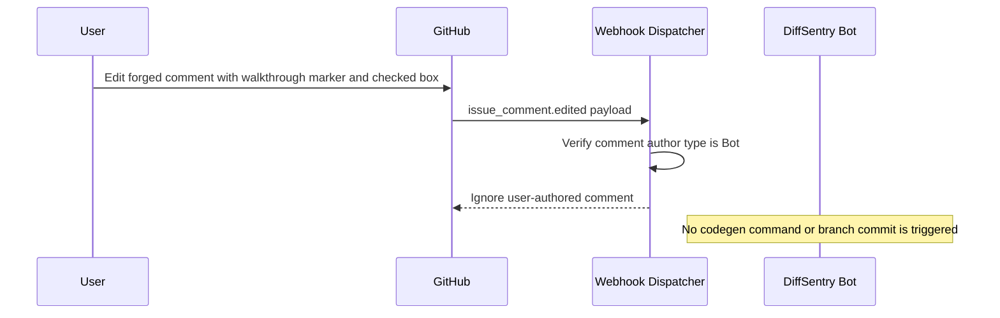

## Estimated code review effort

🎯 2 (Simple) | ⏱️ ~15 minutes

## Suggested Labels

`bug`, `security`, `test`

## Risk Assessment

**Score: 0/100** — 🟢 Low

No elevated risk signals detected.

## Test Coverage Signal

🟢 9 prod / 50 test lines added.

| Source files changed | Test files changed | Source lines + | Test lines + |
|---|---|---|---|
| 1 | 1 | 9 | 50 |

## ✍️ Commit Message Coach

1 of 2 commit messages could be stronger.

| Commit | Subject | Issues |
|---|---|---|
| `b3e81a5` | 🟡 fix(webhook): require bot authorship before honoring Finishing Touches checkbox edits | Subject is 85 characters — keep under 72 to avoid truncation. |

<sub>Tip: imperative mood (`Add user lookup`), under 72 chars, no trailing period. Conventional Commits like `feat:` / `fix:` are also fine.</sub>

## 🏷️ PR Title Coach

🟡 **fix(webhook): require bot authorship before honoring Finishing Touches checkbox edits**

- Title is 85 characters — keep under 80 for readability in lists and notification subjects.

<sub>Tip: imperative verb + concrete object, under 80 chars, no trailing period. `feat:` / `fix:` prefixes are also fine.</sub>

## 👤 Suggested Reviewers

Ranked by `git blame` weight on the touched lines + CODEOWNERS overlap.

- @mk7luke — `owner` — owns 1 file(s)

## Possibly related PRs

- [mk7luke/DiffSentry#147](https://github.com/mk7luke/DiffSentry/pull/147) — refactor: remove dead code and consolidate duplicated helpers
- [mk7luke/DiffSentry#146](https://github.com/mk7luke/DiffSentry/pull/146) — fix(dashboard): sanitize rendered markdown with an allowlist

</details>

<!-- walkthrough_end -->

<!-- pre_merge_checks_walkthrough_start -->

<details>
<summary>🚥 Pre-merge checks | ✅ 4 | ❌ 1</summary>

### ❌ Failed checks (1 warning)

| Check name | Status | Explanation | Resolution |
|---|---|---|---|
| PR Title | ⚠️ Warning | The title uses an imperative verb (“require”) and has no trailing period, but it is 76 characters long, exceeding the 72-character limit. | Address before merging or downgrade to non-blocking. |

<details>
<summary>✅ Passed checks (4 passed)</summary>

| Check name | Status | Explanation |
|---|---|---|
| PR Description | ✅ Passed | The description clearly explains what changed (the edited-comment checkbox dispatch now requires the comment author to be a bot) and why (to prevent users from forging the walkthrough marker and triggering codegen/autofix commits). No related issue or PR link is provided, but the requirement only calls for one if applicable. |
| Schema bump | ✅ Passed | src/storage/db.ts is not changed in this PR, so no schema-version migration check is required. |
| Provider parity | ✅ Passed | No changes to src/ai/anthropic.ts are shown in this PR; the visible change is limited to CHANGELOG.md, so there is no Anthropic request/response contract change requiring corresponding updates to openai.ts or openai-compatible.ts. |
| Pattern test coverage | ✅ Passed | No changes to src/safety-scanner.ts or src/pattern-checks.ts are shown in this PR, so no new safety/pattern rule requires an E2E scenario. |

</details>

<sub>✏️ Tip: You can configure your own custom pre-merge checks in your `.diffsentry.yaml`.</sub>

</details>

<!-- pre_merge_checks_walkthrough_end -->

<!-- finishing_touch_checkbox_start -->

<details>
<summary>✨ Finishing Touches</summary>

<details>
<summary>🧪 Generate unit tests (beta)</summary>

- [ ] <!-- {"checkboxId": "e76cdeaf-8baa-464b-b63d-34dffbeebba0"} -->   Create PR with unit tests

</details>

<details>
<summary>📝 Generate docstrings (beta)</summary>

- [ ] <!-- {"checkboxId": "8ae00bcb-79c5-4299-9ce6-3d49b5eaa0cd"} -->   Push docstring commit to this branch

</details>

<details>
<summary>🧹 Simplify (beta)</summary>

- [ ] <!-- {"checkboxId": "a26d1335-cfbe-4d29-9f58-067e0e0556cc"} -->   Push simplification commit to this branch

</details>

<details>
<summary>🪄 Autofix unresolved comments (beta)</summary>

- [ ] <!-- {"checkboxId": "237de86e-5a49-4222-a751-3c752796eebd"} -->   Push autofix commit to this branch

</details>

</details>

<!-- finishing_touch_checkbox_end -->

<!-- tips_start -->

---

<sub>Comment `@diffsentry help` to get the list of available commands and usage tips.</sub>

<!-- tips_end -->

<!-- internal_state_start -->
<!-- diffsentry-state-ref:{"v":1,"db":true,"owner":"mk7luke","repo":"DiffSentry","number":145,"updatedAt":"2026-09-05T04:30:17.520Z"}-->
<!-- diffsentry-state:H4sIAAAAAAAAA42PUWvCMBSF/8t9rvY2bdMmbzI2hckm06eJD2lzswarLUmsiPjfhzgZGwz2evjO4XxnGEAmEbTKhzcaLB1JLxsFEsqCV6zI0ShMM+SsEGVR5nlmsFKIRhlWp4YyAREY29KyUR7kGR5mk5fp4/x1Ot5pkKBFWRphBCEqqgWDCLyr4yNVTddtY219r0LdjIMHCTznJqlrLtKEaY4VRBDIBx8f9jbEvlW+GX03yIdbLWcmNbxME8WLqtQElwj6zgfST3b/Qa53dn8F15t7vnBzGqh9ptNXfDXwC9fV5D1pkOufHndiubV9T3ppd7ZV7or9JfOf579WV84OVrW3Q4deq0B6EkACQ8ZHKEaYrzCTKcqkGOcM3yECZ/12Zn3o3AnkGiPcXD4B6FSxPtIBAAA=-->
<!-- internal_state_end -->
```

---

## diffsentry[bot] · walkthrough · 2026-08-28T18:47:28Z

- Source: https://github.com/mk7luke/DiffSentry/pull/152#issuecomment-5456436689
- Location: —

```markdown
<!-- DiffSentry Walkthrough -->
<!-- walkthrough_start -->

<details>
<summary>📝 Walkthrough</summary>

## Walkthrough

Centralized GitHub App ID validation in a shared predicate and applied it across runtime config, diagnostics, and the interactive setup flow. Added setup validator coverage to reject Client IDs and app slugs while preserving valid numeric values.

## Changes

|Cohort / File(s)|Summary|
|---|---|
|**Shared App ID Validation** <br> `src/config.ts`, `src/api/diagnostics.ts`|Introduced a canonical trimmed numeric GitHub App ID predicate and routed runtime loading and diagnostics through it. This removed duplicated regex logic and aligned validation behavior across server-facing paths.|
|**Interactive Setup Validation** <br> `scripts/setup.ts`|Updated setup to reject blank and non-numeric App IDs at prompt time, with actionable guidance distinguishing App IDs from Client IDs and slugs. The final .env content validation now also catches invalid hand-edited values.|
|**Setup Validator Tests** <br> `tests/unit/setup-env-validation.test.ts`|Added focused tests confirming valid numeric formats are accepted and invalid or empty App ID values produce the expected validation results.|

## Sequence Diagram(s)

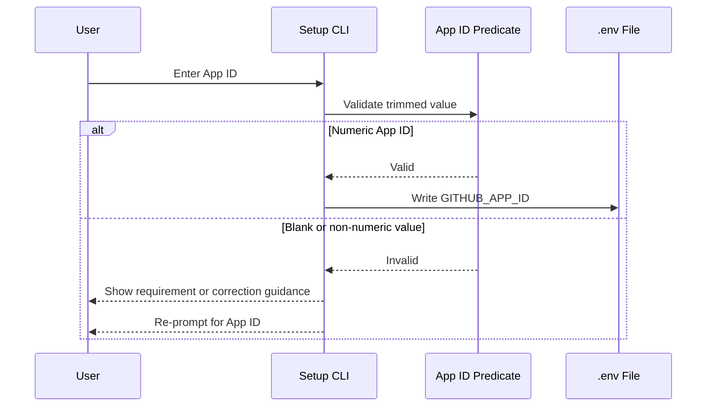

## Estimated code review effort

🎯 2 (Simple) | ⏱️ ~15 minutes

## Suggested Labels

`bug`, `test`, `refactor`

## Risk Assessment

**Score: 0/100** — 🟢 Low

No elevated risk signals detected.

## Test Coverage Signal

🟢 45 prod / 37 test lines added.

| Source files changed | Test files changed | Source lines + | Test lines + |
|---|---|---|---|
| 3 | 1 | 45 | 37 |

## 👤 Suggested Reviewers

Ranked by `git blame` weight on the touched lines + CODEOWNERS overlap.

- @kaleabgirma — `blame` — 6 touched line(s)

## Possibly related PRs

- [mk7luke/DiffSentry#147](https://github.com/mk7luke/DiffSentry/pull/147) — refactor: remove dead code and consolidate duplicated helpers

## Linked Issues

- [#150](https://github.com/mk7luke/DiffSentry/pull/150) — Reject non-numeric GITHUB_APP_ID at boot 🔴
- [#151](https://github.com/mk7luke/DiffSentry/issues/151) — [Bug] npm run setup still accepts a non-numeric GITHUB_APP_ID 🟢

</details>

<!-- walkthrough_end -->

<!-- pre_merge_checks_walkthrough_start -->

<details>
<summary>🚥 Pre-merge checks | ✅ 5 | ❌ 0</summary>

<details>
<summary>✅ Passed checks (5 passed)</summary>

| Check name | Status | Explanation |
|---|---|---|
| PR Title | ✅ Passed | Title uses the imperative verb "Validate", is under 72 characters, and has no trailing period. |
| PR Description | ✅ Passed | The description meets the requirements. It clearly explains what changed (a shared isValidGitHubAppId predicate is exported and used by config loading, diagnostics, and setup validation) and why (to prevent npm run setup from accepting non-numeric Client IDs or app slugs that later cause GitHub JWT issuer failures). It also links the related issue via “Fixes #151” and references the preceding PR, #150. |
| Schema bump | ✅ Passed | src/storage/db.ts is not among the changed files shown, so this schema-versioning check is not applicable to this PR. |
| Provider parity | ✅ Passed | src/ai/anthropic.ts is not among the changed files in this PR, so no request/response contract change requires corresponding updates to openai.ts or openai-compatible.ts. |
| Pattern test coverage | ✅ Passed | Neither src/safety-scanner.ts nor src/pattern-checks.ts was changed in this PR, so no new scanner/pattern rule requires an E2E scenario. |

</details>

<sub>✏️ Tip: You can configure your own custom pre-merge checks in your `.diffsentry.yaml`.</sub>

</details>

<!-- pre_merge_checks_walkthrough_end -->

<!-- finishing_touch_checkbox_start -->

<details>
<summary>✨ Finishing Touches</summary>

<details>
<summary>🧪 Generate unit tests (beta)</summary>

- [ ] <!-- {"checkboxId": "8978e068-b34a-4028-adb3-e060abd12077"} -->   Create PR with unit tests

</details>

<details>
<summary>📝 Generate docstrings (beta)</summary>

- [ ] <!-- {"checkboxId": "17f3ad8c-ffa3-4408-8081-6a97dca71f82"} -->   Push docstring commit to this branch

</details>

<details>
<summary>🧹 Simplify (beta)</summary>

- [ ] <!-- {"checkboxId": "8372b6ae-da17-4271-9993-9ca8b49b435f"} -->   Push simplification commit to this branch

</details>

<details>
<summary>🪄 Autofix unresolved comments (beta)</summary>

- [ ] <!-- {"checkboxId": "7a2a18a8-fe99-4639-972c-b93a9fc39dd1"} -->   Push autofix commit to this branch

</details>

</details>

<!-- finishing_touch_checkbox_end -->

<!-- tips_start -->

---

<sub>Comment `@diffsentry help` to get the list of available commands and usage tips.</sub>

<!-- tips_end -->

<!-- internal_state_start -->
<!-- diffsentry-state-ref:{"v":1,"db":true,"owner":"mk7luke","repo":"DiffSentry","number":152,"updatedAt":"2026-08-28T18:47:27.954Z"}-->
<!-- diffsentry-state:H4sIAAAAAAAAA42RzWrDMBCE32XPTmLJViT51ksptIfQ9NTQg37WyRLXNlrFJZS8ewlJoLQUep2ZZeZjP2GCRhTQOc7POBF+YFzvHDQghdZee1kq56yuWyuq6CtTWdGiFKKUUYeolgIKaKnD9c4xNJ/AIdGYecGYD+M8MzSgvAmVlbqStcYYPRTAKSzcSItIbtsPnCnwNYsmVLEyUqilV0pfs2HoW9peIkJbY1XrLaqAS2+ggIyceXHoKV96Z9hPs8l1FF2moZ+f/ctx6VodrZK+LkNdRQWnAsaBM8Z76reYxkT9Obh5u+mr9IQTdo94vMpnWl6lISAzRmg2v5n/BPxJ8//pt+L1nsYR45reqXPp26Kr8ZJoItddjMMYXcZ4l8//LOVyVpqZNC/CNLVupJ5bVb9CAYl4/0Cch3SEZlO+nb4AL4M5KhYCAAA=-->
<!-- internal_state_end -->
```

---

## diffsentry[bot] · walkthrough · 2026-08-28T20:33:32Z

- Source: https://github.com/mk7luke/DiffSentry/pull/153#issuecomment-5457475219
- Location: —

```markdown
<!-- DiffSentry Walkthrough -->
<!-- walkthrough_start -->

<details>
<summary>📝 Walkthrough</summary>

## Walkthrough

Centralized GitHub App ID validation and enforced numeric IDs across runtime configuration, diagnostics, and interactive setup. Added tests covering the shared validator and setup environment validation.

## Changes

|Cohort / File(s)|Summary|
|---|---|
|**Shared App ID Validation** <br> `src/config.ts`, `src/api/diagnostics.ts`|Introduced a canonical numeric GitHub App ID predicate and reused it in boot-time configuration and diagnostics checks to keep validation behavior consistent.|
|**Interactive Setup Validation** <br> `scripts/setup.ts`|Updated setup prompts to reject non-numeric App IDs immediately and extended .env validation with an actionable error explaining that the App ID, rather than Client ID, is required.|
|**Validation Test Coverage** <br> `tests/unit/config-github-app-id.test.ts`|Added unit tests for the exported predicate, whitespace handling, invalid Client ID-like values, and setup environment validation.|

## Sequence Diagram(s)

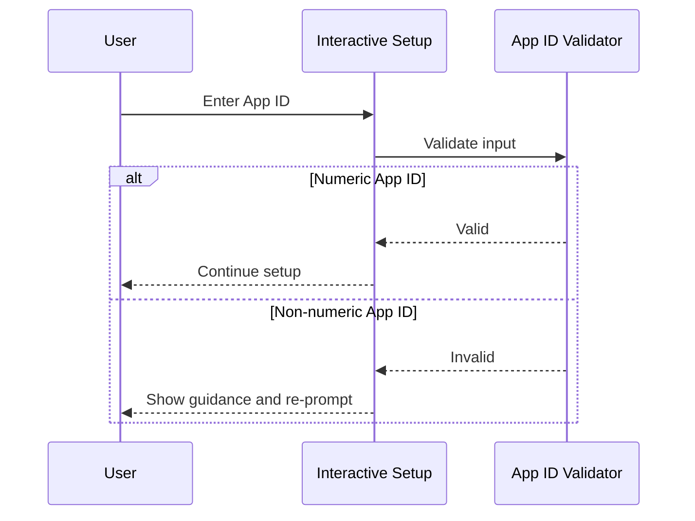

## Estimated code review effort

🎯 2 (Simple) | ⏱️ ~15 minutes

## Suggested Labels

`bug`, `enhancement`, `test`

## Risk Assessment

**Score: 0/100** — 🟢 Low

No elevated risk signals detected.

## Test Coverage Signal

🟢 25 prod / 32 test lines added.

| Source files changed | Test files changed | Source lines + | Test lines + |
|---|---|---|---|
| 3 | 1 | 25 | 32 |

## ✍️ Commit Message Coach

1 of 1 commit message could be stronger.

| Commit | Subject | Issues |
|---|---|---|
| `27cf08e` | 🟡 fix(setup): validate GITHUB_APP_ID as numeric in interactive setup and env validator | Subject is 84 characters — keep under 72 to avoid truncation. |

<sub>Tip: imperative mood (`Add user lookup`), under 72 chars, no trailing period. Conventional Commits like `feat:` / `fix:` are also fine.</sub>

## 🏷️ PR Title Coach

🟡 **fix(setup): validate GITHUB_APP_ID as numeric in interactive setup and env validator**

- Title is 84 characters — keep under 80 for readability in lists and notification subjects.

<sub>Tip: imperative verb + concrete object, under 80 chars, no trailing period. `feat:` / `fix:` prefixes are also fine.</sub>

## 👤 Suggested Reviewers

Ranked by `git blame` weight on the touched lines + CODEOWNERS overlap.

- @mk7luke — `blame` + `owner` — 3 touched line(s), owns 4 file(s)
- @kaleabgirma — `blame` — 3 touched line(s)

## Possibly related PRs

- [mk7luke/DiffSentry#152](https://github.com/mk7luke/DiffSentry/pull/152) — Validate GITHUB_APP_ID in npm run setup via a shared predicate
- [mk7luke/DiffSentry#147](https://github.com/mk7luke/DiffSentry/pull/147) — refactor: remove dead code and consolidate duplicated helpers

## Linked Issues

- [#151](https://github.com/mk7luke/DiffSentry/issues/151) — [Bug] npm run setup still accepts a non-numeric GITHUB_APP_ID 🟢

</details>

<!-- walkthrough_end -->

<!-- pre_merge_checks_walkthrough_start -->

<details>
<summary>🚥 Pre-merge checks | ✅ 4 | ❌ 1</summary>

### ❌ Failed checks (1 warning)

| Check name | Status | Explanation | Resolution |
|---|---|---|---|
| PR Title | ⚠️ Warning | The title uses an imperative verb (“validate”) and has no trailing period, but it exceeds the 72-character limit (84 characters). | Address before merging or downgrade to non-blocking. |

<details>
<summary>✅ Passed checks (4 passed)</summary>

| Check name | Status | Explanation |
|---|---|---|
| PR Description | ✅ Passed | The description meets the requirements: it explains what changed (centralized numeric GitHub App ID validation across config, diagnostics, setup, and tests) and why (to prevent non-numeric/Client IDs, fixing #151). It also links the related issue via “Fixes #151.” |
| Schema bump | ✅ Passed | src/storage/db.ts is not changed in this PR, so the schema-versioning check does not apply. |
| Provider parity | ✅ Passed | No changes to src/ai/anthropic.ts are shown in this PR, so no corresponding request/response contract updates are required in openai.ts or openai-compatible.ts. |
| Pattern test coverage | ✅ Passed | Neither src/safety-scanner.ts nor src/pattern-checks.ts is changed in this PR, so no new scanner/pattern rule requires an E2E scenario. |

</details>

<sub>✏️ Tip: You can configure your own custom pre-merge checks in your `.diffsentry.yaml`.</sub>

</details>

<!-- pre_merge_checks_walkthrough_end -->

<!-- finishing_touch_checkbox_start -->

<details>
<summary>✨ Finishing Touches</summary>

<details>
<summary>🧪 Generate unit tests (beta)</summary>

- [ ] <!-- {"checkboxId": "8d18dfb2-528e-4249-a880-b6309b6b3c10"} -->   Create PR with unit tests

</details>

<details>
<summary>📝 Generate docstrings (beta)</summary>

- [ ] <!-- {"checkboxId": "d4b1e0bb-4ea9-42eb-8219-09833f456044"} -->   Push docstring commit to this branch

</details>

<details>
<summary>🧹 Simplify (beta)</summary>

- [ ] <!-- {"checkboxId": "c9c8c361-6c17-41de-8309-c1b68c061c4f"} -->   Push simplification commit to this branch

</details>

<details>
<summary>🪄 Autofix unresolved comments (beta)</summary>

- [ ] <!-- {"checkboxId": "d0f7ee61-3fa4-419e-abe3-fd97ffbe8753"} -->   Push autofix commit to this branch

</details>

</details>

<!-- finishing_touch_checkbox_end -->

<!-- tips_start -->

---

<sub>Comment `@diffsentry help` to get the list of available commands and usage tips.</sub>

<!-- tips_end -->

<!-- internal_state_start -->
<!-- diffsentry-state-ref:{"v":1,"db":true,"owner":"mk7luke","repo":"DiffSentry","number":153,"updatedAt":"2026-08-28T20:33:31.526Z"}-->
<!-- diffsentry-state:H4sIAAAAAAAAA42RwU7DMAyG38Xndkuapsl644KQ4IDYTkwc0sTtrJU2irMhNPHuaNqQEAiJ6/9/lv3JJzhCKwsYHecnPBK+YVjvHLRQGd8Li1paaRtT91jbzjeV0d3KSAxKa+z9qjZQQE8jrneOoT0B+0Qx85IxH+IiM7QgOmV93wXd1N5Z3UMBnPzSRVoGcsM0cybPFzbU1shgjROVMKGurqyfp56GC9J0wkhlsPFe9Z2QUEBGzrw8TJSvZDlQ3h260sVYUlic+8uwVth5J+uVWXldKwUfBcSZM4ZbmgZMMdF0BrcvX/ljesAjjvf4fo3PtvyYZo/MGKDd/nb+U/Cnzf9P/1q83lOMGNb0SqNL3y66FptER3LjpTjE4DKGm3z+p6iaUtiysptKtEq1Si501TxDAYl4f0ec5/QO7Va8fHwCKmxskRYCAAA=-->
<!-- internal_state_end -->
```

---

## diffsentry[bot] · walkthrough · 2026-08-28T06:23:21Z

- Source: https://github.com/mk7luke/DiffSentry/pull/150#issuecomment-5449190960
- Location: —

```markdown
<!-- DiffSentry Walkthrough -->
<!-- walkthrough_start -->

<details>
<summary>📝 Walkthrough</summary>

## Walkthrough

Added boot-time validation for numeric GitHub App IDs and normalized surrounding whitespace before using the value in JWT claims. Updated diagnostics, documentation, changelog coverage, and unit tests so invalid IDs fail clearly instead of causing downstream GitHub authentication errors.

## Changes

|Cohort / File(s)|Summary|
|---|---|
|**Configuration Validation** <br> `src/config.ts`, `tests/unit/config-github-app-id.test.ts`|Added startup validation requiring GITHUB_APP_ID to contain only digits and stored its trimmed value for JWT issuance. Tests covered successful normalization and rejection of common invalid App ID formats.|
|**Diagnostics Feedback** <br> `src/api/diagnostics.ts`|Updated the diagnostics check to assess whether the configured App ID is numeric rather than merely present. Invalid values now receive an explanation of the JWT issuer requirement and a Client ID versus App ID hint.|
|**Documentation Updates** <br> `README.md`, `CHANGELOG.md`|Clarified the required numeric App ID in the environment-variable documentation and recorded the behavior change under the unreleased fixes.|

## Sequence Diagram(s)

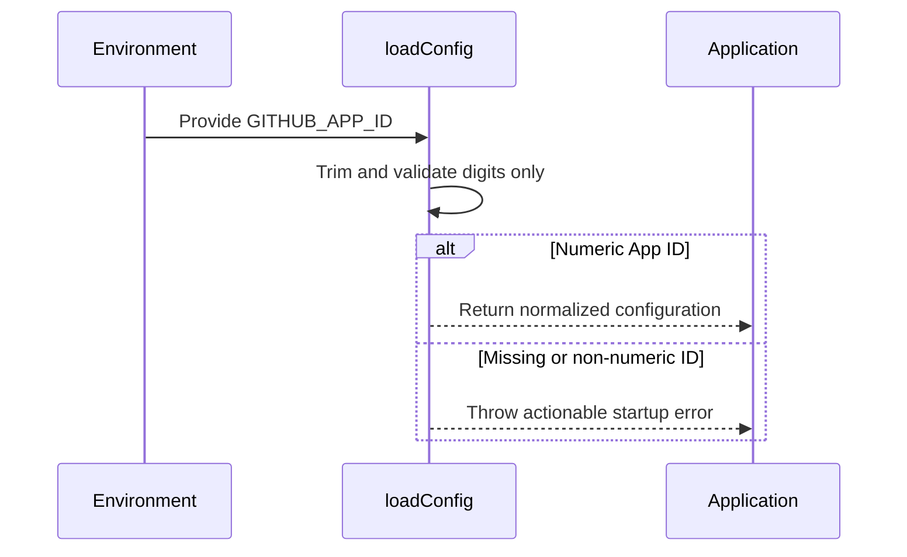

## Estimated code review effort

🎯 2 (Simple) | ⏱️ ~15 minutes

## Suggested Labels

`bug`, `docs`, `test`

## Risk Assessment

**Score: 0/100** — 🟢 Low

No elevated risk signals detected.

## Test Coverage Signal

🟢 23 prod / 47 test lines added.

| Source files changed | Test files changed | Source lines + | Test lines + |
|---|---|---|---|
| 2 | 1 | 23 | 47 |

## 🧭 Description Drift

- ℹ️ **The PR description claims `.env.example` was updated, but no `.env.example` change is present in the provided diff.**
  - Under “Changes,” the description says the README env table, `.env.example`, and `CHANGELOG.md` were updated. The provided changes include `README.md` and `CHANGELOG.md`, but do not include a `.env.example` diff.

<sub>Compares PR description claims to the actual diff. Update the description (or the code) so they tell the same story.</sub>

## 👤 Suggested Reviewers

Ranked by `git blame` weight on the touched lines + CODEOWNERS overlap.

- @mk7luke — `blame` + `owner` — 6 touched line(s), owns 5 file(s)

## Possibly related PRs

- [mk7luke/DiffSentry#147](https://github.com/mk7luke/DiffSentry/pull/147) — refactor: remove dead code and consolidate duplicated helpers
- [mk7luke/DiffSentry#146](https://github.com/mk7luke/DiffSentry/pull/146) — fix(dashboard): sanitize rendered markdown with an allowlist
- [mk7luke/DiffSentry#145](https://github.com/mk7luke/DiffSentry/pull/145) — fix(webhook): require bot authorship before honoring Finishing Touches checkbox edits

</details>

<!-- walkthrough_end -->

<!-- pre_merge_checks_walkthrough_start -->

<details>
<summary>🚥 Pre-merge checks | ✅ 5 | ❌ 0</summary>

<details>
<summary>✅ Passed checks (5 passed)</summary>

| Check name | Status | Explanation |
|---|---|---|
| PR Title | ✅ Passed | The title uses the imperative verb "Reject," is under 72 characters, and has no trailing period. |
| PR Description | ✅ Passed | The description meets the requirements. The Summary clearly explains what changed (startup validation and trimmed persistence of numeric GITHUB_APP_ID values, plus matching diagnostics behavior) and why (GitHub requires the JWT iss claim to be an integer; invalid values otherwise fail later with an opaque 401). The Related issues section explicitly states none, so no issue/PR link is applicable. |
| Schema bump | ✅ Passed | src/storage/db.ts is not changed in this PR, so the schema-versioning check does not apply. |
| Provider parity | ✅ Passed | No changes to src/ai/anthropic.ts are present in the provided PR diff, so there is no Anthropic request/response contract change requiring corresponding updates to openai.ts or openai-compatible.ts. |
| Pattern test coverage | ✅ Passed | Neither src/safety-scanner.ts nor src/pattern-checks.ts is changed in this PR, so no new rule requires an e2e scenario. |

</details>

<sub>✏️ Tip: You can configure your own custom pre-merge checks in your `.diffsentry.yaml`.</sub>

</details>

<!-- pre_merge_checks_walkthrough_end -->

<!-- finishing_touch_checkbox_start -->

<details>
<summary>✨ Finishing Touches</summary>

<details>
<summary>🧪 Generate unit tests (beta)</summary>

- [ ] <!-- {"checkboxId": "3a602b55-bf70-4c90-9c22-cf7470e57e7c"} -->   Create PR with unit tests

</details>

<details>
<summary>📝 Generate docstrings (beta)</summary>

- [ ] <!-- {"checkboxId": "58fc8d38-f5fc-4fe9-8151-86241d381069"} -->   Push docstring commit to this branch

</details>

<details>
<summary>🧹 Simplify (beta)</summary>

- [ ] <!-- {"checkboxId": "9b012555-26a2-46cc-9f18-61889bb6d897"} -->   Push simplification commit to this branch

</details>

<details>
<summary>🪄 Autofix unresolved comments (beta)</summary>

- [ ] <!-- {"checkboxId": "845a1001-a9c9-4226-a182-389eeec0f261"} -->   Push autofix commit to this branch

</details>

</details>

<!-- finishing_touch_checkbox_end -->

<!-- tips_start -->

---

<sub>Comment `@diffsentry help` to get the list of available commands and usage tips.</sub>

<!-- tips_end -->

<!-- internal_state_start -->
<!-- diffsentry-state-ref:{"v":1,"db":true,"owner":"mk7luke","repo":"DiffSentry","number":150,"updatedAt":"2026-08-28T06:23:20.807Z"}-->
<!-- diffsentry-state:H4sIAAAAAAAAA42QXWvjMBBF/8s824ksy5aqt7CbbaEfW5o+bejDWBolQ13bSEpKKf3vS0gC3YVCX+85A/fOO+zBVgX0mPID7Zleya+2CBawUUpjqxukoLxpTKW6oLSQwnVGmE44vBBYOyggcE+rLSaw7/DjanF3ubz5fTl78WDBYWiq4HyrjDSBCAp4WC5+3i6P+CK03pFQMjhXVUFDASm6OU4894ybYUyZXZrldHCxq6V23ss6uKo6u24cAm+OikE0oaHWKR3aphNQQKaU03w3cD6Z5YbzdteVOE0l+9mBH48JO9SdCtqZuqpNDR8FTGPK5H/xsKE4RR4O4vrpnN/HG9pTf01vp/jwiHQfR0cpkQe7/vcdn7d/OfT/Vd+fcC6weuZpIr/iF+4xfmp2Ao+R94z9Eewmj5n8IoMFKWRbClNK8yhaK2srxcwI/QcKiJyerzjlMb6BXYunj78c/FYVOQIAAA==-->
<!-- internal_state_end -->
```

---
